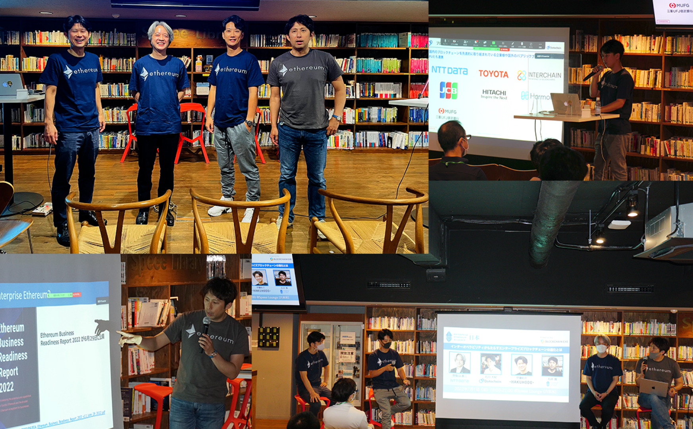

## イベント概要

 

2022 年 7 月 1 日、EEA Japan（エンタープライズ・イーサリアム・アライアンス・ジャパン）主催による「インターオペラビリティがもたらすエンタープライズブロックチェーンの進化とは」を開催しました。

 
２つのセッションを通じて、異なるブロックチェーンを繋ぐ技術である「インターオペラベリティ」について仕組みや種類、そして具体的なビジネスにおける活用の取り組みについて登壇者から発表があり、QAでは参加者から多くの質問が寄せられました。
 
 
オンラインではなく、リアル開催となり、セッション終了後に行われた交流会では、登壇者と参加者の間で活発な意見交換が行われ、大いに盛り上がりました。
 
 
各セッションの登壇資料は下記よりご覧いただけます。

 
 

## デジタル通貨・ステーブルコインが注目される今、インターオペラビリティが必要とされる理由

**石川 大紀（株式会社 Datachain 事業開発シニアマネージャー）**

<iframe
  src="//www.slideshare.net/slideshow/embed_code/key/hcio8dqO3HN3c"
  width="595"
  height="485"
  frameborder="0"
  marginwidth="0"
  marginheight="0"
  scrolling="no"
  style="border:1px solid #CCC; border-width:1px; margin-bottom:5px; max-width: 100%;"
  allowfullscreen
>
  {" "}
</iframe>

## DVP 決済実現に向けた挑戦

**世取山 進二（株式会社 NTT データ 金融事業推進部 デジタル戦略推進部 部長）**

<iframe
  src="//www.slideshare.net/slideshow/embed_code/key/doYpFQnhtEUc7B"
  width="595"
  height="485"
  frameborder="0"
  marginwidth="0"
  marginheight="0"
  scrolling="no"
  style="border:1px solid #CCC; border-width:1px; margin-bottom:5px; max-width: 100%;"
  allowfullscreen
>
  {" "}
</iframe>

インターネットの相互接続と同じ役割を担うインターオペラビリティは、今後さらに重要になっていくでしょう。EEA Japan では引き続きこの技術の最新動向および事例を追っていきます。
