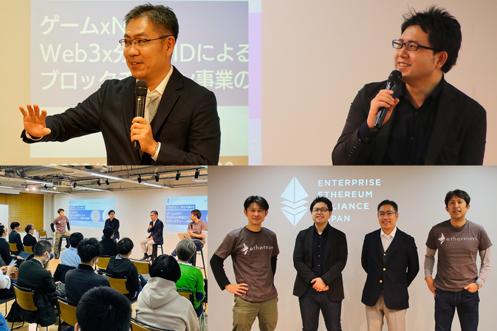

## イベント概要

 

2022 年 10 月 31 日、EEA Japan（エンタープライズ・イーサリアム・アライアンス・ジャパン）主催による「【スクエニ、日立が語る】ゲーム xNFT、Web3x 分散型 ID によるブロックチェーン事業の最前線」を開催しました。

 
日立製作所 高橋さんからは、PBI（公開型生体認証基盤）を活用した実店舗での指静脈認証決済の動画デモや、スクウェア・エニックス
畑さんからはNFTゲーム事業化における苦労や工夫が発表され、まさにブロックチェーンの実用の最前線を垣間見ることができるセッションとなりました。ファシリテーターを交えたディスカッションでは、会場参加者からも多くの質問が挙げられました。

 
 
各セッションの登壇資料は下記よりご覧いただけます。
 
 

## エンタープライズブロックチェーンの可能性

**石井敦 | Enterprise Ethereum Alliance 日本支部代表**

<iframe
  src="//www.slideshare.net/slideshow/embed_code/key/3xJqYQhZzKofvd"
  width="595"
  height="485"
  frameborder="0"
  marginwidth="0"
  marginheight="0"
  scrolling="no"
  style="border:1px solid #CCC; border-width:1px; margin-bottom:5px; max-width: 100%;"
  allowfullscreen
>
  {" "}
</iframe>

## Web3 時代のデジタルアイデンティティ

**高橋健太 |株式会社日立製作所 研究開発グループ**

<iframe
  src="//www.slideshare.net/slideshow/embed_code/key/tGl9AHR8GQF17u"
  width="595"
  height="485"
  frameborder="0"
  marginwidth="0"
  marginheight="0"
  scrolling="no"
  style="border:1px solid #CCC; border-width:1px; margin-bottom:5px; max-width: 100%;"
  allowfullscreen
>
  {" "}
</iframe>

## 資産性ミリオンアーサーを通して語る NFT 事業の取り組み事例

**畑圭輔 | 株式会社スクウェア・エニックス ブロックチェーン・エンタテインメント事業部**

<iframe
  src="//www.slideshare.net/slideshow/embed_code/key/IUHaRBxHrtsekb"
  width="595"
  height="485"
  frameborder="0"
  marginwidth="0"
  marginheight="0"
  scrolling="no"
  style="border:1px solid #CCC; border-width:1px; margin-bottom:5px; max-width: 100%;"
  allowfullscreen
>
  {" "}
</iframe>

 
 

最新のユースケースを通して、ブロックチェーンのエンタープライズ活用が着実に進んでいることを感じることができました。高橋さんからは、同社が研究開発を進める、本人がサイン（or mint）したことの証明を行える NFT の偽造対策技術に関する PoC（Proof of Concept：概念実証）パートナーを探しているとの案内もありました。業界を超えた企業の共創の場にもなれるよう、EEA Japan では引き続き、エンタープライズブロックチェーンの最新動向および事例を追っていきます。
