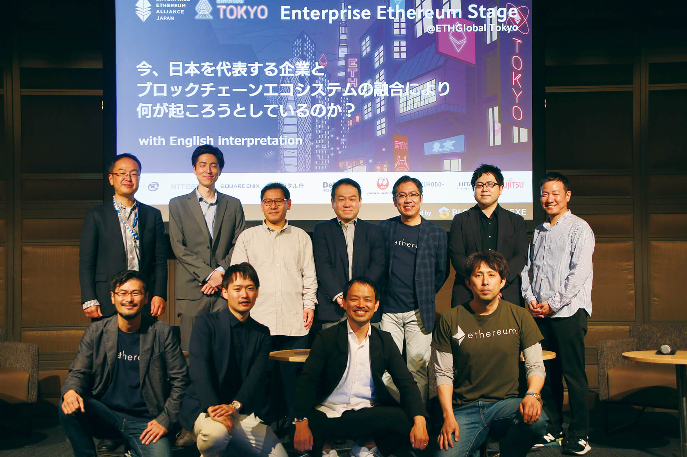
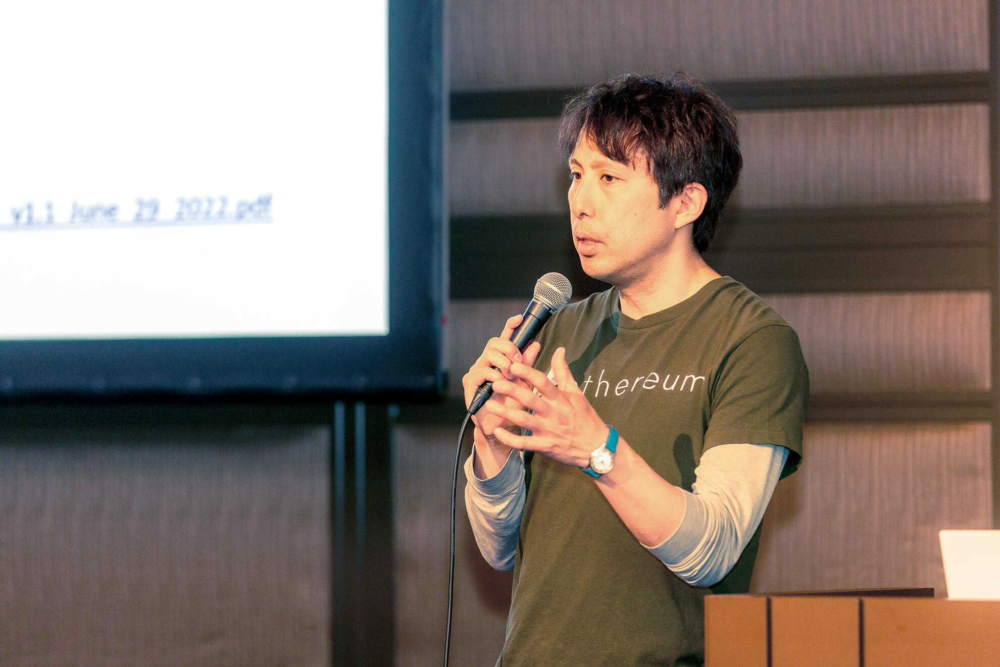
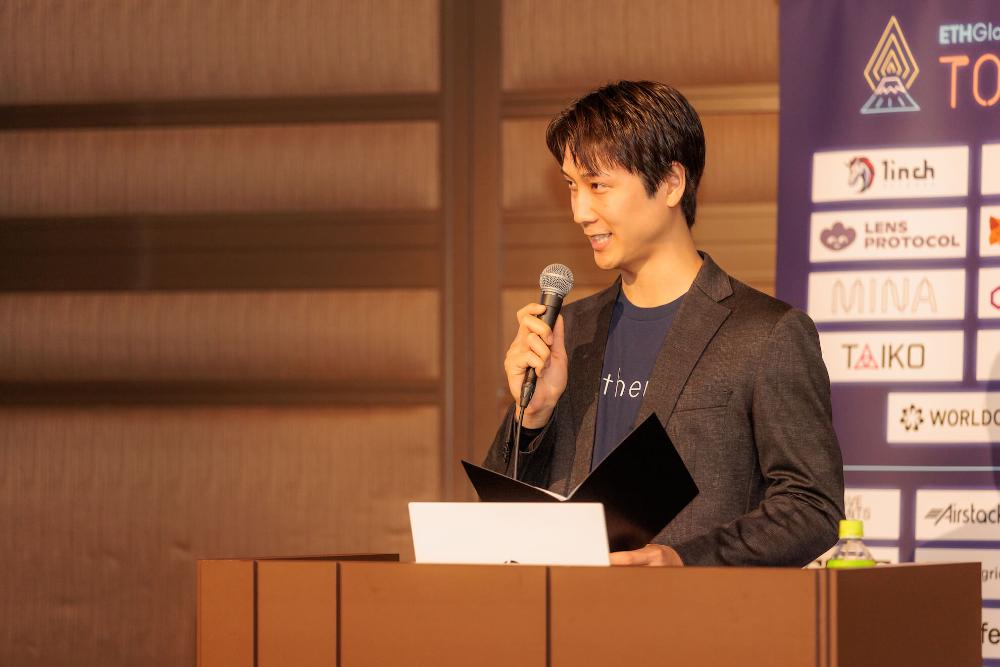
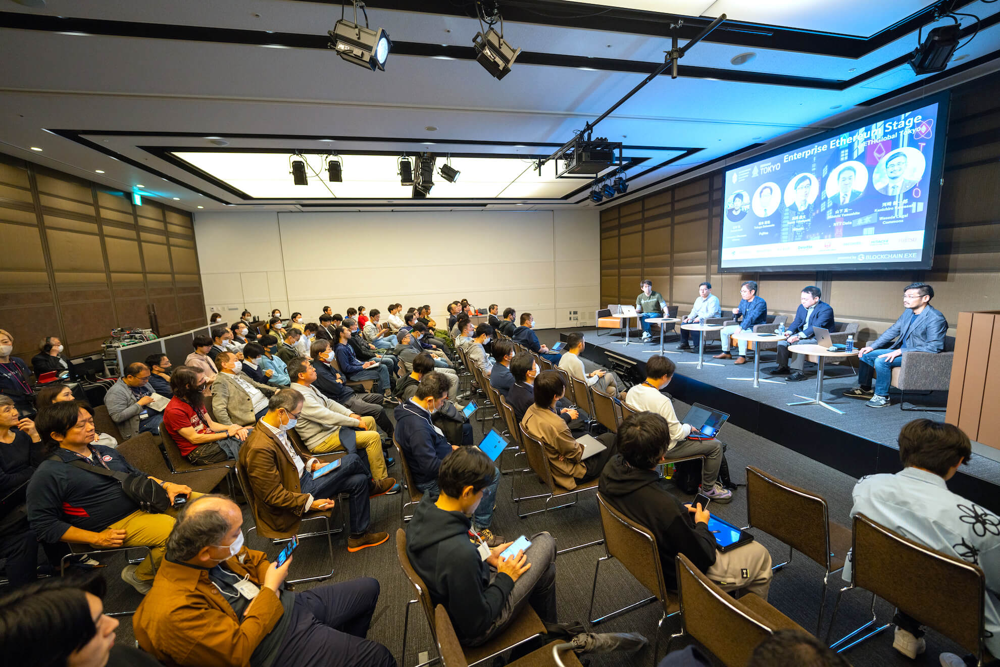
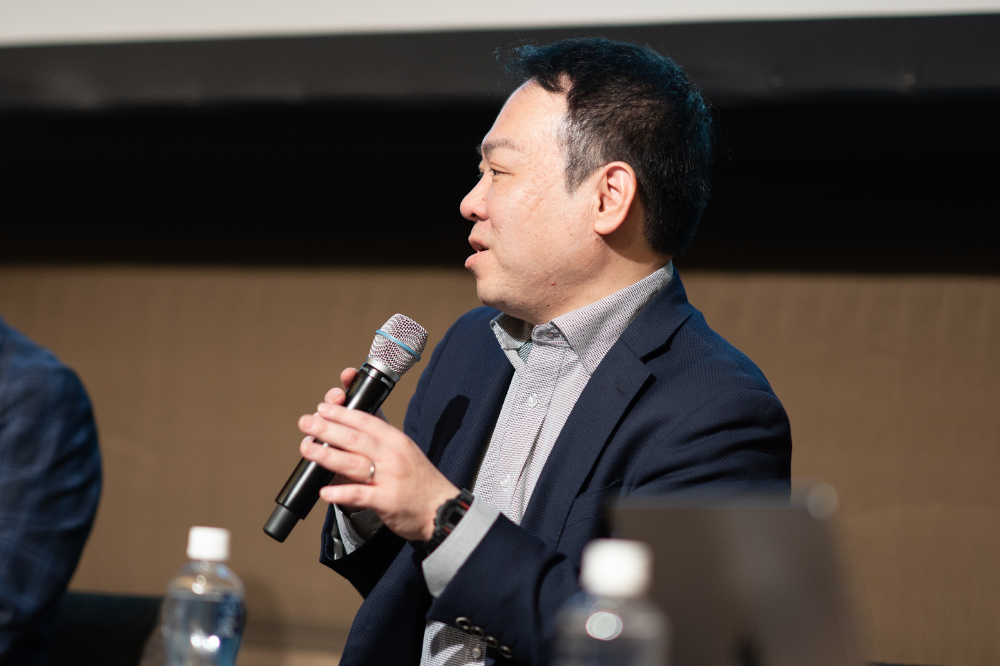
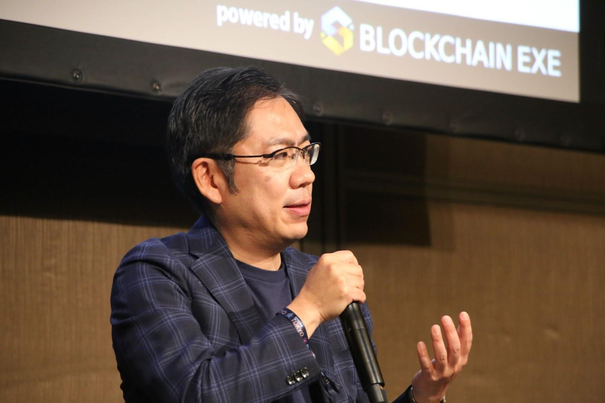
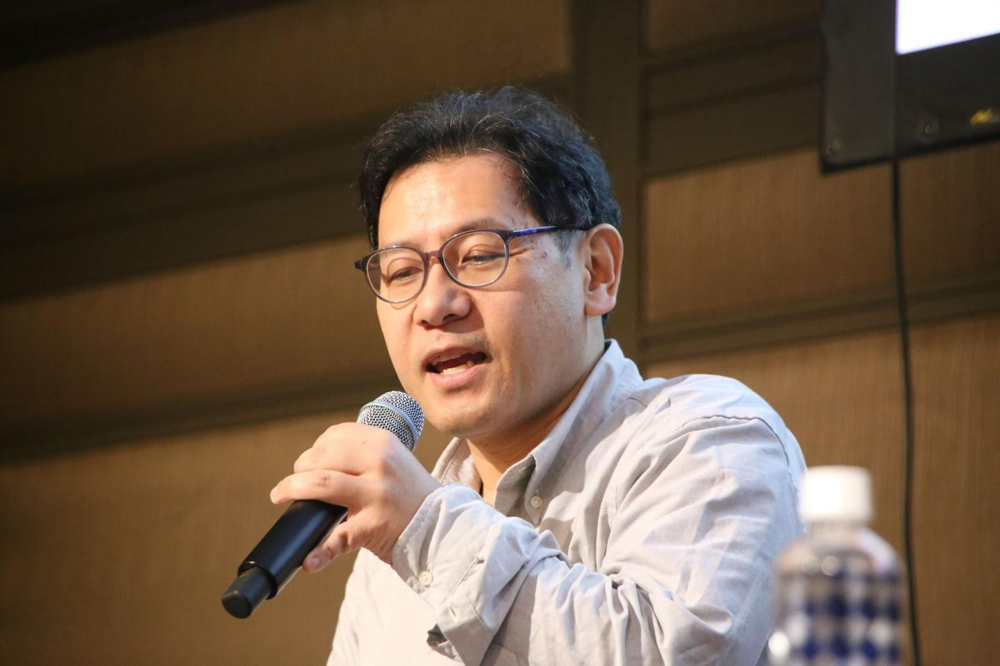
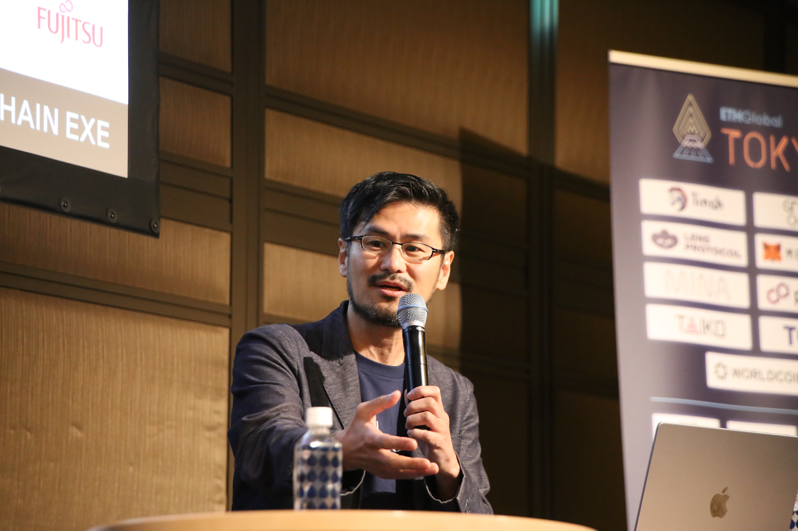

## イベント概要

 

2023 年 4 月 13 日から 4 日間に渡って開催された ETHGlobal Tokyo ハッカソン。このイベントの中で、エンタープライズイーサリアムアライアンスジャパンが主催する「エンタープライズイーサリアムステージ」が行われた。ブロックチェーンを活用したサービスやプロダクトを開発・提供している大企業、公的機関の開発者や研究者が一堂に会した歴史に残るブロックチェーンイベントとなった。

 
 

## エンタープライズイーサリアムの現状と可能性

**石井 敦｜ Atsushi Ishii**

Enterprise Ethereum Alliance 日本支部代表。日本 IBM を経て、楽天やライコスの大規模検索エンジン開発を担当。その後、日米韓を横断したオンラインゲーム開発の統括、Amazon Robotics Challenge 上位チームへの技術支援、ホンダへの AI 学習シミュレーター提供、NEDO クラウドロボティクス開発統括などを務める。ブロックチェーンコミュニティ Blockchain EXE 代表。現在、人型 AI プラットフォーム「LUDENS」の開発を進めている。スタンフォード大学 2018 年 AI 特別講義の講師。電気通信大学 元客員研究員。クーガー代表取締役 CEO。

 

**石井：** イーサリアムはパブリックブロックチェーンとして長年実用されている大きな実績があります。また、世界最大規模の開発者コミュニティを持ち、グローバルでは企業での活用事例も増えてきています。その企業での活用事例を共有し最大化するのがエンタープライズイーサリアムアライアンスですが、全世界の企業が参加し様々な連携が行われています。

 
例えば、金融、ヘルスケア、サプライチェーン、AIxブロックチェーンなど多数のカテゴリーのワーキンググループが存在し、それぞれ活動しています。

 
 
今回は日本のブロックチェーンの活用を具体的に行っている企業に焦点を当てて、現状どうなっているのか、ブロックチェーンエコシステムとエンタープライズは融合するのかという点をパネルディスカッションで深掘りしていきたいと思います。

 
 

**米倉：** ではここから、「製造・トレーサビリティ・分散型ID」、「ゲーム・アート・音楽」、「観光・地方創生・行政」という大変興味深い三つのパネルディスカッションを進めて行きたいと思います。モデレーターは石井さんと河崎さんに行なっていただきます。

 

**米倉 佑飛｜Yuhi Yonekura**

## 製造、トレーサビリティ、分散型IDとブロックチェーンの融合

**石井：** 最初のパネルディスカッションでは「製造・トレーサビリティ・分散型ID」をテーマに話していきたいと思います。それぞれ取り組まれていることを紹介してもらえますか？

**登壇者：**

- 株式会社NTTデータ 技術開発本部 イノベーションセンタ 課長 山下 真一
- 株式会社日立製作所 研究開発グループ サービスシステムイノベーションセンタ 主管研究員 高橋 健太
- 富士通株式会社 データ&セキュリティ研究所 トラステッドインターネットPJ シニアリサーチャー 坂本 拓也

 

**山下：** ブロックチェーン技術を活用した情報連携プラットフォームの実現に向けた貿易コンソーシアムを発足して活動を行っています。これまでに代表的なプロジェクトとして日本国内では貿易情報連携プラットフォーム「<a href="https://www.tradewaltz.com/" target="_blank">TradeWaltz</a>」や、海外を拠点としてイタリアの銀行間決済「<a href="https://www.tradewaltz.com/" target="_blank">Spunta</a>」などですね。

**高橋：** セキュリティとトラストをメインで研究を行ってまして、その一環としてブロックチェーンを活用した分散型アイデンティティの実現や、より効率的に信頼できる形での金融システムの再構築などに取り組んでいます。

**坂本：** 主にブロックチェーンに関わる分散型ネットワークセキュリティについての研究を進めています。最近では、慶應義塾大学と共に分散型アイデンティティを活用した学籍証明書発行に関するシステムの開発を行なっています。

**山下 真一｜Shinichi Yamashita**

株式会社NTTデータ（NTT DATA） 技術開発本部 イノベーションセンタ 課長。入社以来、先進技術のビジネス導入に向けた技術開発、評価に従事。2016年よりブロックチェーン関連の活動を開始。現在は、エンタープライズ領域での先進事例開発に取り組む。

**石井：** 皆さんそれぞれ現状のWeb3の需要や、期待値についてどう思われますか？

**山下：** これまでブロックチェーンというと、技術を中心とした話が多かったが、ここ1、2年でWeb3が注目され始め、これまでにない期待感がでてきています。それに伴ってビジネス事業への具体的な導入も増えては来ていますが、まだビジネスリーダーと呼ばれる一部の人たちへ浸透してしてきている段階で、最初の一歩にすぎないと認識しています。

**高橋 健太｜Kenta Takahashi**

日立 研究開発グループ サービスシステムイノベーションセンタ 主管研究員。博士。2000年に日立製作所へ入社。以来、生体認証、暗号技術、情報セキュリティの研究開発および事業化、社会実装に従事。近年はデジタルアイデンティティやブロックチェーンへ研究分野を拡大中。東京大学 非常勤講師、客員准教授(2015-2020)、ISO/IEC SC37エキスパート、市村産業賞（2020年度）、R&D 100 Awards（2020年）、ドコモ・モバイル・サイエンス賞（2016年）、情報処理学会 長尾真記念特別賞（2014年度）など受賞。

**石井：** 高橋さんは、パスワードに依存しない生体認証などの本人認証についての顧客の期待値や市場についてどう感じていますか？

**高橋：** Web3やブロックチェーンに関しては、大きく分けて３つの課題があると考えています。１つが鍵管理、２つ目が本人確認、３つ目がウォレットの利便性。

鍵管理に関しては、Web3の世界でユーザーのアカウントはそのまま公開鍵のようなものなので、その鍵を失った瞬間にアイデンティティや資産など、デジタルの世界におけるすべての活動の根拠を失ってしまう。DeFiの普及により、そこの課題を強く悩まれているお客さんが多い印象がある。２つ目の本人確認に関しては、金融庁の規制が強まっているところから、利便性とプライバシー保護のバランスが大きな問題です。３つめのウォレットに関しては、セットアップやアカウント開設のハードルの高さが課題です。スマホを相当高度に使いこなせる人でないとWeb3の世界に入ることができない。こういった問題の解決に向け、生体認証と暗号の融合技術「PBI」を使った生体情報をベースにした鍵の管理、どこにも保存しない鍵管理方法などに取り組んでいます。

**坂本拓也｜Takuya Sakamoto**

富士通株式会社(Fujitsu) データ&セキュリティ研究所 トラステッドインターネットPJ シニアリサーチャー。2000年に富士通研究所に異動以降、分散ネットワーク・セキュリティ関連の研究開発に従事。2018年からブロックチェーン向け、特にDecentralized Identityやブロックチェーン連携技術向けプライバシー/セキュリティの研究開発を推進。

**石井：** 本人認証を中心とした日立さんに対して、富士通さんは慶應義塾大学で分散型アイデンティティを活用した取り組みをされていますが、期待値や需要についていかがでしょうか？

**坂本：** 慶應義塾大学だけではなく、様々な大学でもTrusted Web実証事業を行っていることから、分散型アイデンティティは少しずつ世の中に入ってきているイメージがありまして、期待値として盛り上がっていると感じています。アイデンティティを自分たちで管理するかたちが受け入れられているというよりは、世の中にディセントラライズドの考え方が普及してきている印象ですね。

**河﨑 健一郎｜Kenichiro Kawasaki**

早稲田リーガルコモンズ法律事務所(Waseda Legal Commons) 代表パートナー。2016年にエストニアを訪問したことを契機にブロックチェーン技術の可能性に魅せられ、エンジニアと共に株式会社ケンタウロスワークスを設立。イーサリアムを用いて、誰でも手元のスマホで改ざんできない記録を作成することができる「BlockRecord」や、同じくイーサリアムベースで電子署名を実装した「電子実印」などのアプリ開発に取組んできた。「Japan Contents Blockchain Initiative」では、SSI・DID部会副部会長を務める。ブロックチェーン及びクリプトの社会実装に取組んできた経験を活かし、社会実装段階での技術特性を踏まえたリーガルアドバイスを行っている。

**河崎：** 関連して、企業が自分たちで個人情報を管理することのリスクが重くなってきていることに関して、どのように感じていますか？

**高橋：** SSIやDIDが期待されているところの一つはまさにそれだと思っています。ただ、一方で個人が自己主権のもとに自分のデータをコントロールするというところまで一足飛びにいかないというのが課題ですね。分散型、あるいは自己主権型に移行していくと考えられるが、そこに行くためのドライブの要因は２つ。１つは先ほど坂本さんがおっしゃったようにレギュレーション。もう１つが、新しいビジネスモデルを再構築するというところです。

**河崎：** 山下さんは、ビジネスモデルの再構築という点で、具体的なユースケースとして国内外で実装を進められているのですよね。

**山下：** 国によってケースは異なりますが、イタリアの場合は効率が図れず、ビジネス上のコストだけが積み上がっていくという課題がありました。日本ではビジネスモデルはまず仮説ベースで行っており、ピボットを繰り返している状態です。あくまでも最初の一歩であり柔軟に変えていくことが重要になってくると思います。

**石井：** 少しずつ進んでいるというのが現状なのですね。今後、発展の可能性があるテーマについて皆さんどう思われてますか？

**坂本：** 最近フェイクニュースなどが問題になっていますが、ニュース記事にアイデンティティを付けて公開することでデータの信用度も上がり、アイデンティティが活用される１つの方法だと考え、研究を進めています。

**高橋：** 例えば、大谷翔平選手のサインボールに対してテクノロジーで証明ができるように、大谷選手の生体情報をもとに作り出した電子証明書を付けることで、パブリックを自己検証できるかたちにするとか。そういった生体情報をベースにした鍵の管理「PDI」の技術を応用したファンコミュニティを活性化する取り組みを行っています。

**山下：** 企業が使えるウォレットですね。NFTなど個人が使えるウォレットはありますが、企業が使えるウォレットはまだなく、今年あたりで出てくるのではないかと考えています。

**石井：** ありがとうございます。ジェネレーティブAIの流れなどでデータの信頼性が大きく注目されていますので、企業のインフラとしても大きく前進する流れを感じました。

  後編へ続く
  <a href="/events/20230413" target="_blank">
    Link to part.2
  </a>

