## イベント概要

2023年4月13日から4日間に渡って開催されたETHGlobal Tokyoハッカソン。このイベントの中で、エンタープライズイーサリアムアライアンスジャパンが主催する「エンタープライズイーサリアムステージ」が行われた。ブロックチェーンを活用したサービスやプロダクトを開発・提供している大企業、公的機関の開発者や研究者が一堂に会した歴史に残るブロックチェーンイベントとなった。

前編：ETHGlobal Tokyoに日本を代表する企業が集結：今、企業とブロックチェーンエコシステムの融合により何が起ころうとしているのか？ 
前編<a href="/events/20230412" target="_blank"> Link to part.1</a>

## サービスとして動き出したゲームとそれに続く音楽やアート

**石井：** 続いて、「ゲーム・アート・音楽」をテーマにスクウェア・エニックスの畑さんとエイベックスの岩永さんとディスカッションできればと思います。それぞれの取り組みを紹介していただけますか？

**石井：**
- 株式会社スクウェア・エニックス ブロックチェーン・エンタテインメント事業部 事業部長 畑 圭輔
- エイベックス株式会社 テクノロジー顧問 岩永 朝陽

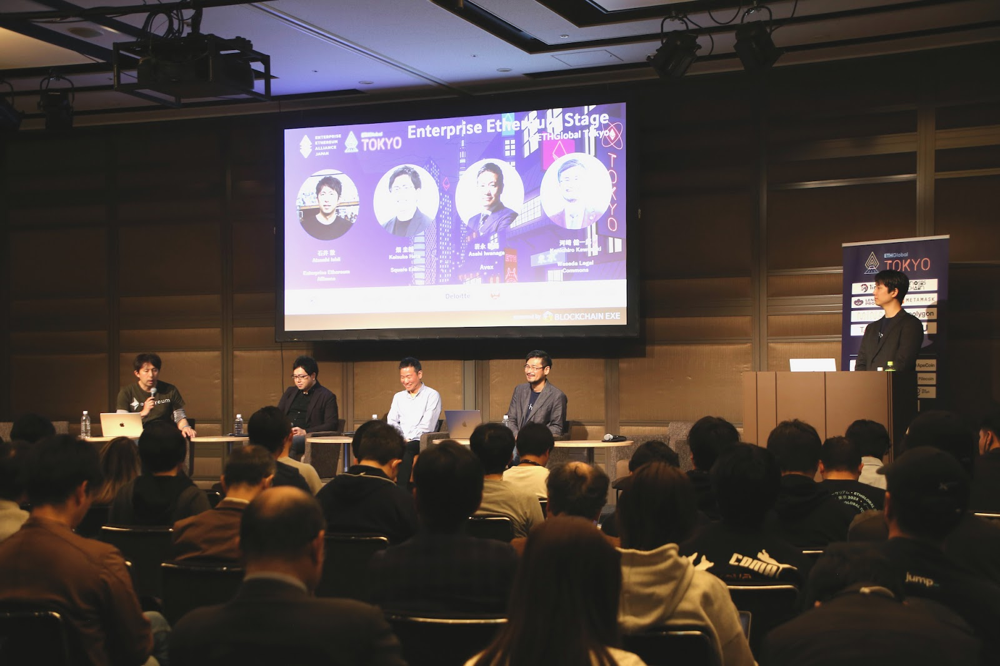

**畑：** 「資産性ミリオンアーサー」という知財を使ったコンテンツをNFTプロジェクトとして立ち上げていて、2021年10月に第一弾のNFTデジタルシールを発売しました。現在まで14万枚ものNFTを販売・発行しており、2023年4月にはデジタルシールを使ったゲームコンテンツをサービス内に統合する予定です。

また、新たにジェネレーティブアートという形で1万体ものキャラクターにスクウェア・エニックスが得意とするストーリーや世界観を組み合わせ制作、販売をするというプロジェクトを進めています。
 

**岩永：** 私はWeb3のアドバイザーとしてエイベックスに在籍しておりまして、2019年から主にデジタルコンテンツに対してその所有権を保証する証明書サービス「ATrust」を展開しています。実際に音楽専門のNFTマーケットプレイス「The NFT Records」でも使用されており、さまざまなアーティストのNFTを発行しています。

また、デジタルコンテンツを構成する楽曲や画像・テキスト・3Dモデル等のデジタルアセットの流通を促す契約システム「AssetBank」も展開していて、これまで版権管理が難しかったダンスモーションなどのNFT化に向けた取り組みを行なっています。

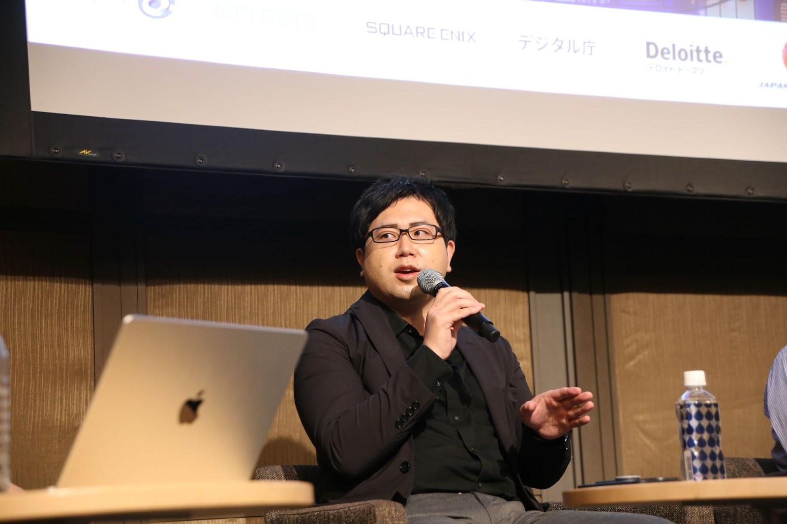

**畑 圭輔｜Keisuke Hata**

株式会社 スクウェア・エニックス(Square Enix) ブロックチェーン・エンタテインメント事業部 事業部長。2012年に株式会社 スクウェア・エニックス入社し、スマートフォン向けゲーム or コンテンツ開発におけるテクニカルディレクターとして従事。その後、各プラットフォーム関連の交渉、対外折衝などを担う業務部に異動、部門長を経験し、同時に同社初のNFTビジネスとなるNFTデジタルシール「資産性ミリオンアーサー」を2021年にプロデュースし、現在に至る。

**石井：** ブロックチェーン事業の中でも具体的に進んでいるのがゲームだと思っていまして、現在の市場の期待感、需要についてどう思われますか？

**畑：** すでにサービスを開始しているのが「資産性ミリオンアーサー」というデジタルステッカーですが、なかなかこれだけで事業化は難しいところがあります。実際コスト面でいうと釣り合わない現状があり、新たなマネタイズを検討しています。これまでのゲームは顧客に対し我々がゲームの利用権を貸し出すという形態だったものが、デジタル資産を購入する顧客がベースになる。そこに対する価値が、一番熱量の高いポイントだと思います。

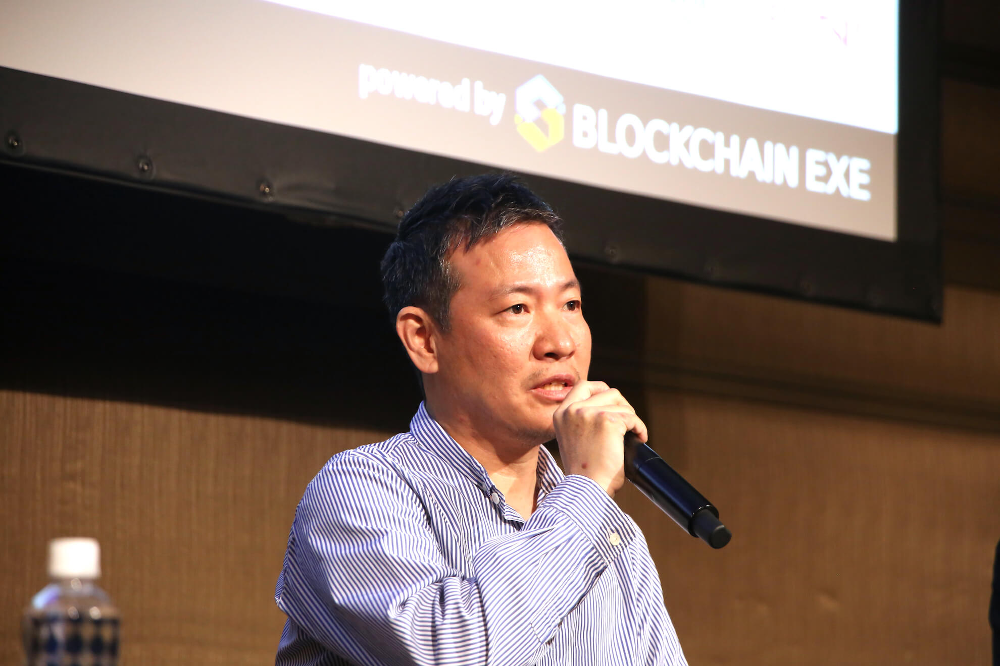

**岩永 朝陽｜Asahi Iwanaga**

エイベックス株式会社(Avex)　テクノロジー顧問。1999年よりシリコンバレーのベンチャー企業でECサービスの立ち上げに参画。帰国後、日立にてシステム開発、ナスダック上場企業にて放送・VOD 関連のエンターテインメント事業でプロダクトマネージャーとして9年、さらに海外ゲームパブリッシングなどを経て、2019年4月エイベックス株式会社 執行役員、2019年5月エイベックス・テクノロジーズ株式会社 代表取締役社長に就任。 2022年6月24日、 エイベックスを退任しシンガポールに居住を移し『 分散型エンターテイメント・エコシステム』の構築のため、 MetaSolare 「メタソレア」を設立。共同代表及びCOO/Co-Founderとして就任。

**石井：** 岩永さんは、現状のNFTに対する期待値や各アーティストの需要についてどう考えてますか？

**岩永：** インタラクティブでユーザー参加型のゲームに対して、音楽というコンテンツは受動的でNFTにおける期待値は大きく異なる。ユーザーをどう巻き込みインタラクティブなコミュニティを作っていくのかチャレンジしている状況です。今注目しているのが海外で、リアーナが自身の楽曲のNFTを販売しました。限定的に保有するというNFTの思想とは異なるが、ユーザーとしては非常にわかりやすく、収益を得るためにインフルエンサーとして楽曲を広めようとする。日本だと金融商品取引法に触れるが、今後こういった動きができるようになると面白くなっていくと思います。

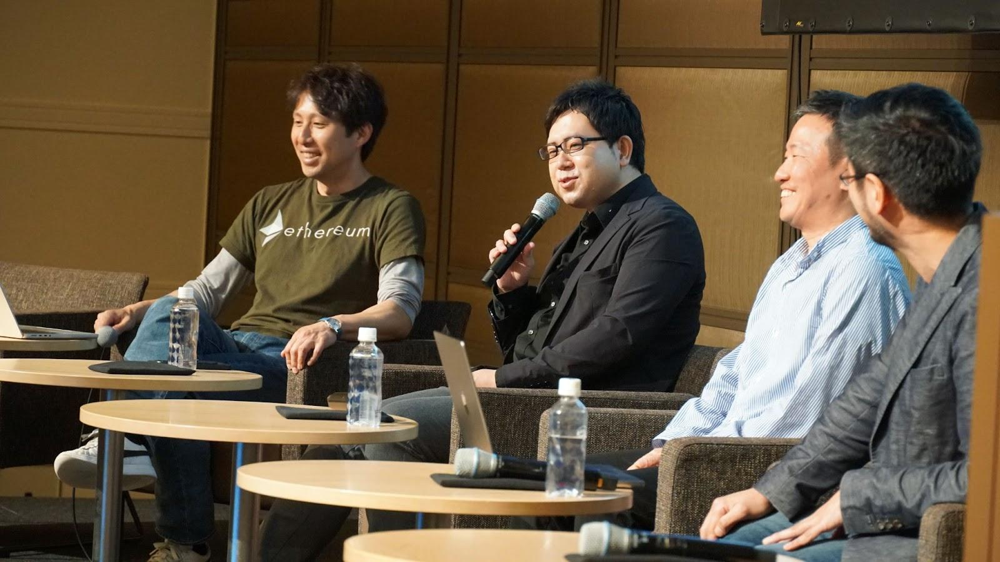

**河崎：** スクウェア・エニックスさんといえばドラゴンクエストやファイナルファンタジーといった有名タイトルがありますが、そのNFTの展開について予定はあるのでしょうか？

**畑：** まず、ブロックチェーンとの相性がいいのか考える必要がありますね。ユーザーがブロックチェーンやNFTに馴染みがあり、欲している状況であれば当然検討していきたいですが、一足飛びにはいかない状況です。既にファイナルファンタジーを使ったNFTの発表はしていますが、ネガティブな意見もあり、ゲームユーザーにはあまり馴染みがない部分があります。

**石井：** ブロックチェーンが使われることでゲームの面白さがお金に置き換わってしまうというネガティブな意見もありますよね。

**畑：** ブロックチェーンの行き過ぎたビジネスには我々も懸念があります。純粋にブロックチェーンを使って面白い体験ができることを世の中に提唱していきたいという一心ですね。「資産性ミリオンアーサー」はNFTを持っていなくても無料で遊ぶことができる。そしてデジタルシールを作り、マーケットに出すことでお金が入ってくる。主婦の方がやっているポイント活動のようなものをゲームで体験することができるので、ゲーマーはもちろん、今までゲームをしたことがない層の人にも遊んでみてほしいです。

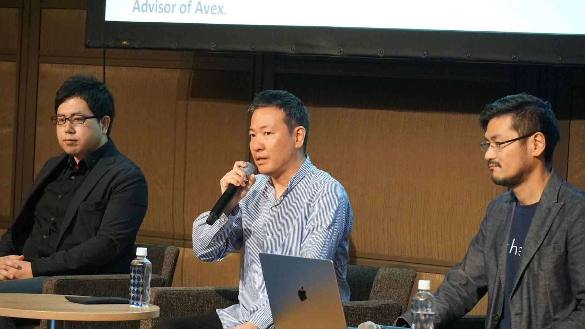

**河崎：** 今後のWeb3コミュニティの在り方について岩永さんはどう思われますか？

**岩永：** Web3のコミュニティというのは音楽業界でいうところのファンクラブ。ファンに向けて何か情報を発信するというところに対し、Web3のコミュニティは一人ひとりが運営目線を持っているというのがこれまでにないポイント。音楽業界の人たちからすると「常に楽しませなければならない」と思っていますが、そんなことはなく「みんなで一緒に盛り上がっていこう」ということです。しかし、そこがなかなかファンクションしにくい部分でもある。コミュニティの中の人たちをどれだけ運用目線にすることができるかというところが

一番重要だと思います。

**石井：** コミュニティの体験をある程度コントロールしつつ、自律的に動かすという仕組みをどう作り上げるかが重要になるのかもしれませんね。

## 観光と地方創生のつながりと行政の動向

**河崎：** 最後のパネルディスカッションでは「観光・地方創生・行政」をテーマにお話できればと思います。それぞれ取り組みをご紹介ください。

登壇者：

- 日本航空株式会社 事業創造戦略部 戦略・企画グループ アシスタントマネジャー 高橋 翔
- 株式会社博報堂 ビジネスプロデューサー 岸井 弘一
- デジタル庁　参事官 野崎 彰
- デロイト トーマツ合同会社 シニアマネジャー 川口 知宏

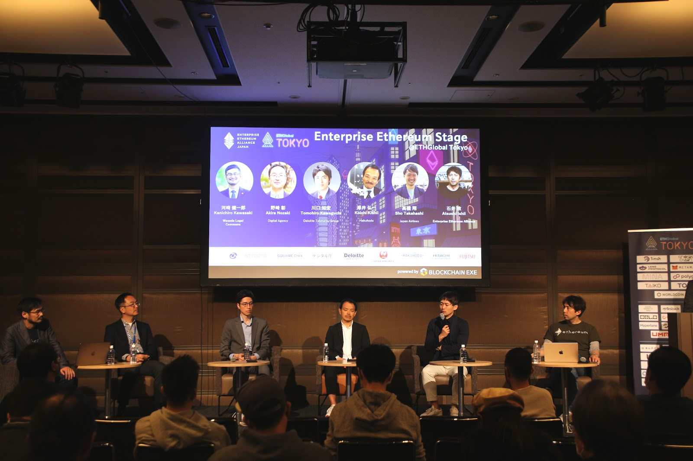

**高橋：** 我々は航空事業を軸にした会社であることから、直近のパンデミックを含め、影響が大きいビジネスとなります。新たなビジネスという部分をミッションにJALグループの新規事業に取り組んでいます。

**岸井：** JALの広告宣伝、マーケティングコミュニケーションをメインに務めています。今回の公共NFTのプロジェクトにおいては、JALのパートナーとして共に事業開発に取り組んでいます。

**野崎：** Web3とAIを担当していて、昨年末にデロイトの川口さんと連携して「Web3研究会報告書」を公開しました。

**川口：** Web3やブロックチェーンのサービスが「車」だとすると、自身の取り組みは「道」を作っていますね。また、自分自身もクリエイトするという部分も重要だと思っていて、ビジュアルボイスのグローバルシネマNFTの取り組みに開発から実用化の構想までの支援を行いました。

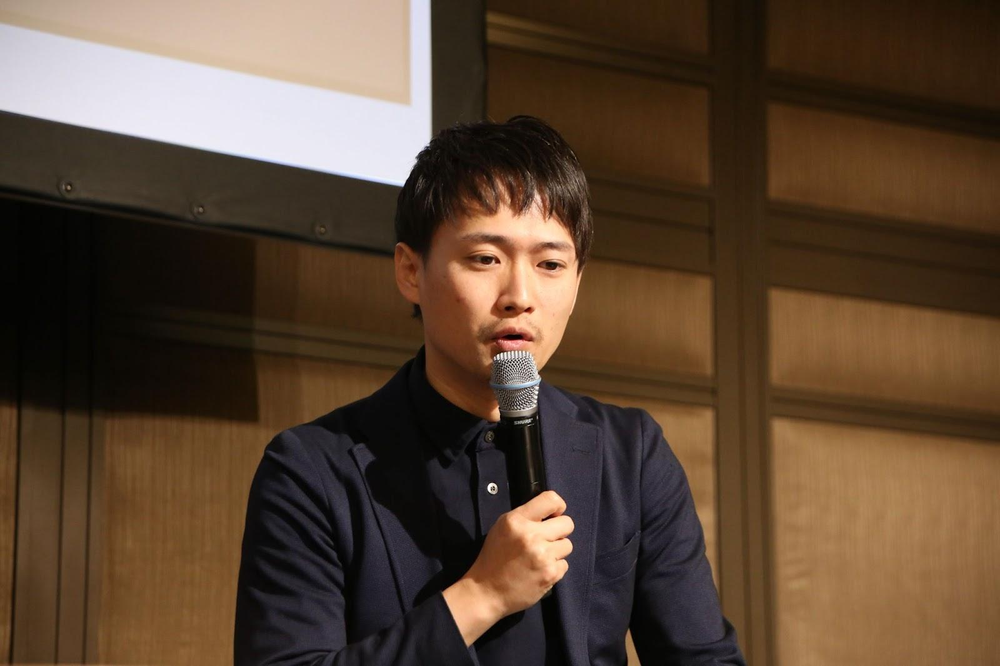

**高橋 翔｜Sho Takahashi**

日本航空株式会社(Japan Airlines Co.,Ltd) 事業創造戦略部 戦略・企画グループアシスタント マネジャー(Business Creation Strategy Department　Manager)。旅行会社向け予約・セールス、ロンドン支店総務を経て2021年3月より現職。

**河崎：** JALで進められている公共NFTのプロジェクトについて伺ってもいいでしょうか？

**高橋：** 公共NFTプロジェクトは、日本の地域にあるアセットを活用し、地域の関係人口を増やしていく試みです。現在、地域の人口減少は非常に厳しい状況です。それを我々のNFTを通じて地域のファーム、国内外の関係人口を増やしていき、最終的に地域の活性化につなげていくことを目指しています。我々が販売しているNFTの一つは鹿児島県の奄美市を舞台にしたNFTです。黒糖焼酎の蔵元と共同し、NFTホルダーと一緒に焼酎を熟成させていく、という取り組みを行っています。

**河崎：** 一度きりの旅行ではなく、継続する関係性を作っていくうえでブロックチェーンの有用性があるということですね。

**高橋：** やはりコミュニティとの相性が重要です。人が何度も訪れるには理由が必要で、魅力的なアセットはもちろんのこと、一番重要なのは人との繋がりだと考えています。それによってより地域に対する愛は深まっていくと思っていて、今回、NFTをその手段として活用しました。

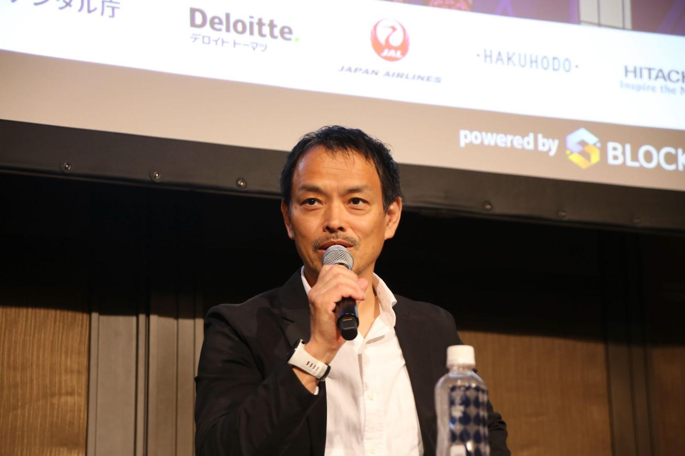

**岸井 弘一｜Koichi Kishii**

株式会社博報堂(Hakuhodo Inc.) ビジネスプロデューサー(Business Producer)。1995年博報堂入社。人事、経営企画など管理部門を経て2002年より営業職、現在に至る。

**河崎：** 岸井さんは、地方自治体を巻き込んだ取り組みについてどう考えていますか？

**岸井：** なかなか巻き込みにくい現状ではあります。今回の実証実験で大事なプレイヤー、パートナーは自治体と地場の企業の二つ。すべての地方自治体の話をしているわけではないですが、やはりブロックチェーン、デジタルに関するリテラシーというのは理解が難しいものがあります。

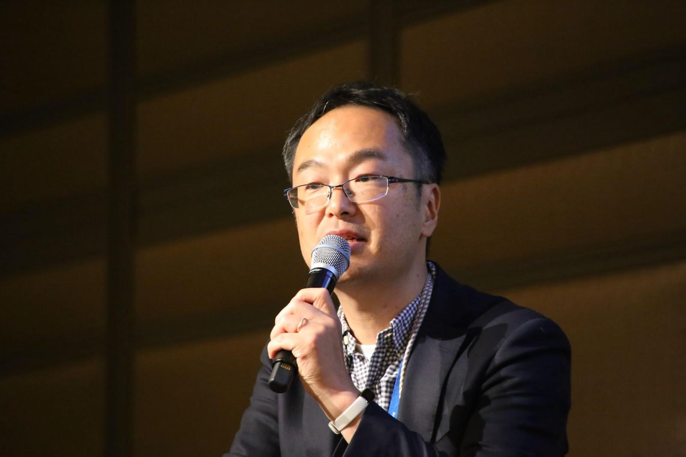

**野崎 彰｜Akira Nozaki**

デジタル庁(Digital Agency) 参事官(Counselor)。2000年金融庁入庁。経済協力開発機構（OECD）シニア・ポリシーアナリスト、金融庁政策課総括企画官、同企業開示課開示業務室長、組織戦略監理官 兼 フィンテック室長を経て、内閣官房参事官 兼 デジタル庁参事官。

**河崎：** 政府でのWeb3の盛り上がりや、昨年末に公開したWeb3研究会報告書について野崎さんの視点はいかがでしょうか？

**野崎：** 昨年4月に自民党がホワイトぺーパーを公開し「日本をWeb3立国にしていくぞ」という機運が高まりまして、それ以降政府においても健全なWeb3の発展や、環境整備について議論をしていくことになりました。特にWeb3のテクノロジーについては、トークンを使ってインセンティブを細かく設計できるという点で、今までにない人と人とのつながりが生まれるので、コミュニティの運営においても日本が抱えている社会問題を解決していけるのではないかと政府も期待しているところです。

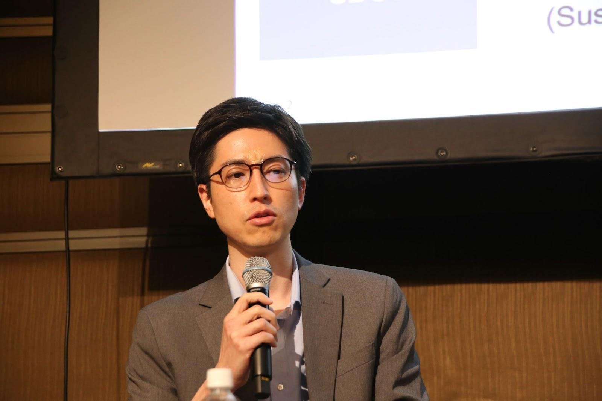

**川口 知宏｜Tomohiro Kawaguchi**

デロイト トーマツ グループ(Deloitte Tohmatsu Group) シニアマネージャー　Smart Finance / Web3・Blockchain。外資系コンサルティング会社の東京・マニラオフィス勤務を経て現職。ブロックチェーン/web3領域のコンサルティング、プロダクト開発、アライアンス推進に従事。金融、製造、エンタメ等、様々な業界での事業戦略策定や技術活用の支援実績多数。海外メンバーファームや有力テック企業等、グローバルリレーションを活かしたサービス提供をリードし、海外事情にも精通している。INSEAD MBA、米国アクチュアリー会正会員。

**河崎：** 川口さんはWeb3研究会の運営に事務局として深く関わったとのことですが、報告書の中で特に強調したいポイントはありますか？

**川口：** ポイントは二つあると思っています。一つはテーマのカバレッジの広さ。どのような分野を扱おうかと考えたときに、NFTを対象としたデジタル資産だけでなく、DAOやDID（分散型ID）など今後数年かけてどのように発展していくのかも含め議論しました。二つ目は規制を考える側の熱量。例えば規制、ルールメイキングの考え方を「道」として、車を走らせたい、促進していきたい一方でアクシデントが起こらないように、どのように規制を設けておく必要があるのか、そのバランスが非常に難しく喧々諤々の議論がされています。両輪を見ながらバランスを考え報告書にまとめることができ、参照いただく価値のあるものになったと思います。

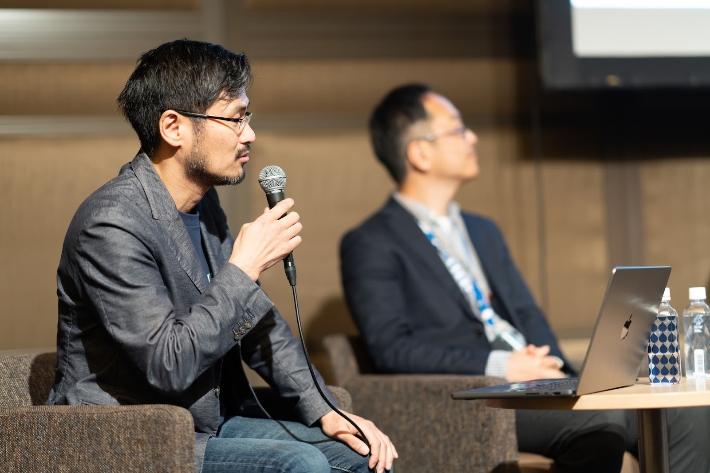

**河崎：** 特に匿名のウォレットというのは非常に魅力的ではありますが懸念点も多く、政府はどのように考えているのでしょうか？

**野崎：** さまざまなアイデンティティやウォレットについて、どうトラストを付加していくのかという点ですね。政府がナショナルトラストアンカーとしてどう役割を果たしうるのかという。マイナンバーカードなどの電子認証システムにどう対応していくのかというのも今後の検討課題だと考えています。

**河崎：** Web3のカルチャーは政府の取り組みと相反するという批判もあると思いますが、政府はどのように考えていますか？

**野崎：** 政府もコミュニティの一員として、ステークホルダーとそれぞれの役割を果たしていくことが大切だと考えています。

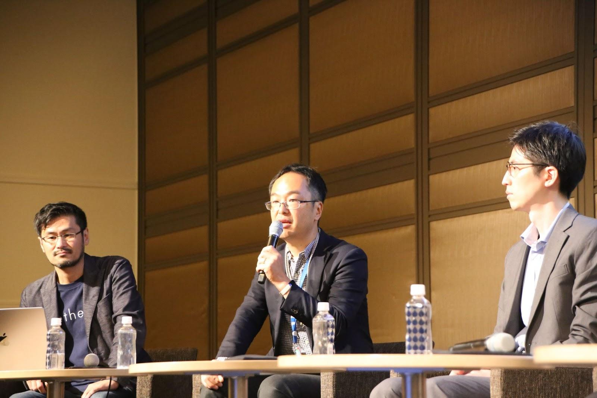

**河崎：** それぞれのステークホルダーが共同して進めていくことがWeb3の世界では重要だと思いますが、そこが難しいですよね。

**野崎：** まず、グローバルでは３年前から「BGIN（Blockchain Governance Initiative Network）」が立ち上がりました。そこではオンライン・リアルでブロックチェーンをめぐる諸課題についてアカデミアや政府、さまざまな人が集まって議論するという場があります。２つ目が、Web3.0 研究会でDAOを創生し、そのコミュニティを使ってさまざまなコミュニケーションを取るという取り組みを始めたところです。

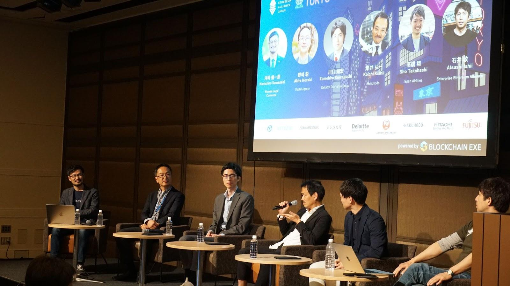

**河崎：** 最後に、今回のテーマについてみなさんから一言お願いします。

**川口：** Web3やブロックチェーンの世界観というのは、新たな技術に熱狂して人が集まってくるという理念が先導していったフェーズから、今は社会実装に近付いています。ここからどう普及していくのかマーケット・インの考え方が必要だと思います。日本は整備された規制体系が既にあり、行政が非常に前向きなので、他の国と比べても唯一無二。すごく可能性を感じています。

**岸井：** 公共NFTの取り組みで今回は観光文脈で話をしてきましたが、一番のゴールはデジタル住民票だと考えています。デジタル上のパスポートのようなものを国内外の方々に唯一無二の証明として持ってほしい。そこでNFTを活用していきたいですが、なかなか難しい現状というのが課題だと感じています。

**高橋：** NFTやWeb3というとデジタル空間にこもっているような印象を抱く方も多いですが、我々が取り組んだプロジェクトは、最終的にリアルな場所やフィジカルなコミュニケーションなどに新しいテクノロジーを価値として持ってくるようなチャレンジをしています。

**石井：** デジタルとフィジカルそれぞれのサービスやコミュニケーションをつなげられるのがブロックチェーンの役割かもしれませんね。

 
日本企業の特徴は徹底した品質管理だと思ってます。また人材の流動性も低く、スキルの継承やセキュリティ面での問題も発生しにくいので、ブロックチェーン導入に対する切実なニーズが薄いという側面があります。対して海外ではこれらの課題が深刻であるため、ブロックチェーン導入が進んでいるという現状があるかなと。

 
 
裏を返せば、日本企業が必要とするレベルでのデータの分散管理や共有がブロックチェーンで確立されれば、それは全世界で求められるソリューションになるかもれませんね。