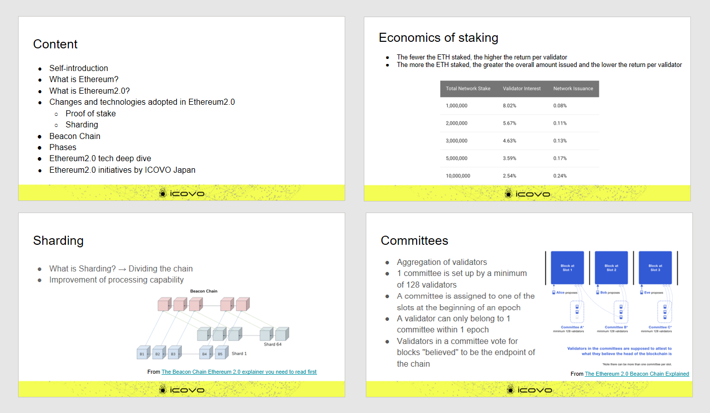

##  Working Group Report

The public workshop materials are disclosed as follows.

  <ul>
    <li>
      <a
        href="/pdf/eth2.0/ETHTerakoya × Blockchain EXE - Ethereum2.0_en.pdf"
        target="_blank"
      >
        Ethereum 2.0 Overview (November,2020)
      </a>
    </li>
  </ul>

## Public Workshop Clips

The public workshop clips are disclosed as follows.

  <ul>
    <li>
      <a href="https://youtu.be/q5LetCEd38s" target="_blank">
        Workshop Ethereum 2.0
      </a>
    </li>
  </ul>
  

    ⇒
    <a
      href="https://www.youtube.com/channel/UCnfgzeNn_90Iq6MHXO3wp5A"
      target="_blank"
    >
      ETHTerakoya Youtube Account
    </a>
  

## Structure

1. Overview
   1. Workshop Ethereum 2.0
2. Detail
   1. Overview of Ethereum 2.0 | Daniel Tehrani
   2. Panel Discussion | Daniel Tehrani、Yoshikazu Nishimura、Kazuaki Ishiguro、Atsushi Ishii

## Overview

### 1-1. Workshop Ethereum 2.0

With the impending migration to Ethereum 2.0, the Beacon Chain got its start in December 2020. This will likely lead to a ramping up and acceleration of plans towards its practical implementation. Seeking to get up to date with the latest trends, we sat down to exchange opinions with experts on this latest large-scale update.
We hope that providing developers and people considering taking part in the Ethereum ecosystem opportunities to learn more about Ethereum will lead to interesting future developments.

The migration to Ethereum 2.0 is slated to complete in 2022, but there still remain some unknowns. However, once the phases go underway as planned, it will likely lead to Ethereum being used in many more contexts than it is now. If there is more global demand and more users congregate to the platform, the cost will likely decline and make ETH more accessible to all. Certainly all eyes will be on new information coming out about the latest developments.

## Detail

### 2-1. Overview of Ethereum 2.0

  ICOVO Japan｜Daniel Tehrani

#### 2-1-1 Ethereum explained

- As a public blockchain, anyone can participate.

- The platform is geared at the creation of decentralized applications (DApps) and smart contracts.

#### 2-1-2 Ethereum 2.0 explained

- This is a large-scale update to Ethereum.

- This update incorporates new solutions to resolve issues Ethereum has tended to face (such as scalability, security, sustainability, and environmental impact).

#### 2-1-3 Proof of stake explained

- With Ethereum 2.0, the system has moved from proof of work (mining) to proof of stake.

- Staking refers to pledging coins to contribute to the network and receiving returns. The minimum amount is 32 ETH; validating the chain yields returns (approximately 1-25%). If a party does not act according to protocol, the stake is forfeited.

- With proof of work, a consensus is obtained based on mining, but with proof of stake, consensus is determined based on the amount of coins held.

- If a party engages in malicious behavior, the electricity consumed through proof of work goes to waste, so they have an incentive to act responsibly. With proof of stake, the incentive revolves around losing one's coins if acting maliciously.

- The fewer the ETH that are staked, the larger the return per Validator, and the more ETH staked, the larger the amount issued, with a smaller return per Validator.

- Once ETH is deposited, it cannot be withdrawn for about two years.

#### 2-1-4 Staking pool explained

- This allows those who are unable to obtain 32 ETH to still participate.

- The technologies for creation of nodes and other aspects are abstracted, allowing for creating a stake with fewer than 32 ETH.

- After multiple parties assemble 32 ETH together, they create a bulk and issue a stake.

- In many cases, participants are unable to manage private keys themselves, representing a security risk.

#### 2-1-5 Sharding

- Sharding, newly introduced in Ethereum 2.0, refers to splitting the chain, and dividing up work to improve processing speed.

- Chains are divided into 64 parts and controlled by the Beacon Chain.

- The Beacon Chain controls the proof of stake and sharding, and is a chain that is instrumental to the Ethereum 2.0 migration.

#### 2-1-6 Migration phases

Ethereum 2.0 will be launched in stages, with the final implementation being about two years from now.

- Phase 0: Beacon Chain launches (slated for December 1, 2020)

- Phase 1: Sharding implemented (slated for 2021)

- Phase1.5: Ethereum and Ethereum 2.0 docking (2021-2022)

- Phase 2: Specific details undecided at this time

#### 2-1-7 Ethereum 2.0 technology explained

◆Technical issues to sharding

- All nodes must process all transactions, which leads to the problem of a lack of scalability.

- In order to scale, vertical scaling is needed, such as by increasing the processing power of each node.

- The use of parallel processing and other horizontal scaling prevents centralization.

- Under the Beacon Chain, Validators are divided into subsets of 64, reducing the stake per 1 shard, leading to some concerns about security.

- The use of RANDAO to generate pseudorandom numbers and periodically shuffling Validators would allow for preventing malicious attacks.

◆Slots and Epochs

①Slots

- Slots are, as the name implies, slots dedicated to blocks, with new blocks being added every 12 seconds.

- The concept is applied to both the Beacon Chain and Shard Chains.

- Thus far, Ethereum had not employed slots, with the concept of block height instead being used.

②Epochs

- 1 Epoch = 32 Slots

- 1 Slot corresponds to 12 seconds, so 1 Epoch is 6.4 minutes.

◆ Validators

- Validators perform work as either a Proposer or Attester.

- Proposers are selected at random and generate blocks.

- Attesters vote on blocks generated by Proposers, and are also selected at random.

- Committees, which are congeries of Validators, are assigned to each Slot at the start of an Epoch.

- The minimum number of Validators to form a Committee is 128.

- Validators can only belong to a single Committee per Epoch.

- Validators within a Committee vote on the block they believe to be at the beginning of a chain.

◆ Voting (LMD GHOST)

- Attesters vote on blocks at the beginning.

- Given Slot 0, Slot 1, and Slot 2, the Attester for Slot 2 votes for Slot 0, treating Slot 1 as invalid. This voting method is referred to as LMD GHOST.

---

**Discussion**

**Ishii**：
This update seems to add new complexity. Are any changes being made to make it easier for engineers to develop with?

**Daniel**：
If Ethereum 2.0 becomes more widespread, it will likely lead to new tools tailored to it. At the protocol level, there have been no changes to ease of development as such.

**Ishii**：
Does ETH 2.0 bring improved processing speed?

**Daniel**：
At this time, we do not have a clear picture on changes to processing speed. I believe that speed will likely change based on to what extent sharding is further developed. However, given future rollups and how it is used in conjunction with other technologies, there are still several unknowns.

**Ishii**：
The large upfront investment makes it difficult for young people, students, and the like to get involved. Are there any ways of participating with a smaller outlay?

**Daniel**：
The use of a staking pool would enable participating with smaller amount. That would mean amounts even as small as 0.01 ETH, which would greatly reduce the barriers to entry.

**Ishii**：
Will this update bring positives to the use of Ethereum in a business context? Could you share any specific use cases?

**Daniel**：
First would be lowering transaction fees. Transactions themselves will be sped up, which should enable the system to become more widespread. This will likely lead to many more use cases, such as borrowing cryptocurrencies against one another, or use in games.

**Ishii**：
What are some threats and risks posed to Ethereum 2.0?

**Daniel**：
There are still many unknowns, with one major concern being the legal basis of Ethereum. As development progresses, the worry is that regulatory risks may loom.

### 2-2. Panel Discussion

#### 2-2-1. Contributing to ETH 2.0

**Ishiguro**：
One method of becoming a Validator is using Launch Pad. Are there are any other ways?

**Nishimura**：
Becoming a Validator is itself quite difficult. If one is unable to understand the technical dimensions of it, it is quite easy to reach an impasse. One recently notable example was ConsenSys launching a staking service, but this is not really geared at retail consumers, and more at large-scale investors.

**Ishiguro**：
When Ethereum and Bitcoin first emerged, some operators offered mining pool services. Perhaps we will see a similar trend?

**Nishimura**：
It used to be the case that people would install mining machines at home and submit the calculations to a pool. Today, it is more about holding coins and pledging those against a staking pool, so you no longer need a physical machine at home. In that sense, it has greatly lowered the barrier to entry.

**Ishiguro**：
When you say that "becoming a Validator is itself quite difficult," what do you mean, exactly?

**Nishimura**：
Well, the challenges of obtaining 32 ETH, configuring equipment to run a Validator node at home, and the technical knowledge required.
Improper management of the private keys used for staking can cause you to lose your ETH entirely. Moreover, it can be a challenge for an individual to maintain equipment with 24/365 uptime.

**Daniel**：
It's true, setting up a Validator on your own can be challenging. However, you can to some extent take part by becoming a member of a distributed staking pool or the like.

**Nishimura**：
There are different types of staking services, some of which involve depositing ETH, with others simply providing servers and technology. Some of the more complex ones involve tokenizing the staked ETH and then engaging in a form of pseudo-distribution of that token.

**Ishiguro**：
Are there any changes on the client-side with Beacon Chain?

**Nishimura**：
Well, it's less about specific improvements, but rather the key here is services operated on a multi-client basis. It all runs according to a single protocol, so a node can be used for anything. When choosing a service, therefore, it's preferable to look for one not dependent on a single client, but involving multiple clients.

**Ishiguro**：
Does Beacon Chain presume the use of custom RPC switching with MetaMask?

**Daniel**：
The underlying premise is that in Phase 0, Beacon Chain is simply launched, but not all functionality is made available. Therefore, it is not possible at this juncture to use Beacon Chain with a custom RPC. It should likely become possible in subsequent phases, but circumstances may change.

**Ishiguro**：
Are there any specific arrangements in place regarding when payment is received for one's stake?

**Nishimura**：
The exact timing of when you can withdraw ETH you deposited is not clear. As for the amount of remuneration, it varies based on the number of participants and the amount invested.

#### 2-2-2. Developing services as companies and organizations

**Ishiguro**：
Are you seeing any movements by exchanges to begin offering staking services?

**Nishimura**：
Binance and ConsenSys appear to be taking initial steps to start offering those services. Given that you cannot yield a return with ETH you deposit unless it is staked, I would assume that each player is exploring how best to go about it.

**Ishiguro**：
One issue with generating returns from staking is the legal dimensions. Has there been any activity in Japan regarding the legal issues?

**Nishimura**：
There has as yet been no active debate on how returns from ETH deposited at an exchange would be handled. The working group is leading the staking implementation as a whole, with discussions currently ongoing. One issue with staking is that the source of the returns is unclear, so a point of contention is how to regulate that.

**Ishiguro**：
One thing we often hear about is a shift from Ethereum to the Cosmos platform. What is actually going on?

**Nishimura**：
At one point, the price of Ethereum spiked, and transaction fees were so steep that people were unable to wire funds. People began trying to migrate to platforms with lower transactional costs.

**Ishiguro**：
Are there any things Dapps developers need to do in terms of the migration to Ethereum 2.0?

**Nishimura**：
Until its actual release, there is not much that can be physically tested as such. However, one key would be studying the field and paying attention to industry trends.

**Daniel**：
Many specifications of the new system have yet to be announced, so developers will have to prepare themselves to adapt to the information as it is announced.

**Ishiguro**：
In spite of the vast scope of the Ethereum 2.0 network, the lead time up to its completion is being listed as quite a short timeframe. Are there any concerns about safety, given the abbreviated development cycle?

**Daniel**：
There has been talk of client companies being subject to audits. The network itself cannot be audited, so the only way to ensure safety is auditing each client.

**Ishiguro**：
Are there any improvements to look forward to with Ethereum 2.0?

**Nishimura**：
From the point of view of people developing Dapps, the biggest change we'd like to see is the fee system. When the implementation of one service affects other services, it makes it very difficult to predict, from a business perspective, what the outcome will be. So I'd like to see some improvements made on that front. Moreover, I believe we need interfaces that are easier for mainstream users.

**Daniel**：
Ethereum is highly expansible, allowing for implementing a wide range of functionality. I hope people will continue promoting it such that it gains traction in a wider range of fields.

**Ishiguro**：
What strengths do you think Ethereum developers bring to the table?

**Nishimura**：
First is the sheer size of the community backing them. There has been a wide range of development tools from early on in the project's lifecycle, making it much easier to develop against.

**Daniel**：
The size of the community means there are many tools, and in turn the breadth of tools helps grow the community -- there is a synergy there.

#### 2-2-3. Phase 0 and beyond

**Ishiguro**：
What is the light client slated for implementation in Phase 0.5?

**Nishimura**：
Given people's frustration with being unable to become a client without blockchain data, the new light client is a piece of software that allows players to act as clients provided they have data relevant to them.

**Ishiguro**：
Will the use of light clients help with the move to sharding in Phase 1?

**Daniel**：
Sharding is necessary because rollups are a layer 1 technology, and sharding is a layer 2 technology, so sharding allows for greater ease of updating. Since layer 1 has a greater impact on other functionality, updates on layer 1 need to be avoided to the extent possible, with layer 2 being primarily updated -- that's what this change allows.

**Ishiguro**：
What exactly is planned for the ETH1 and ETH2 merge being talked about for Phase 1.5?

**Daniel**：
The exactly details have not been disclosed yet. All I have heard at this time is that during Phase 1.5, the data for ETH1 and ETH2 will be merged.

**Ishiguro**：
So it's unclear what will be done in Phase 2 and beyond?

**Daniel**：
Well, I do remember it being said before that the light client would be implemented in Phase 2 or later. Some information about Phase 2 and beyond has been released, but there is a good chance it will be updated or changed in the future.

**Ishiguro**：
What economic changes will we see from the migration to Ethereum 2.0?

**Nishimura**：
We can't assess the impact at this point in time, since the amount of returns has not been clarified yet.

**Daniel**：
One thing I am interested to see is what people who had been mining ETH will do with the migration to Ethereum 2.0, where mining is no longer necessary. Will they move to another platform or adapt to 2.0? And how will that affect the economy?

**Ishiguro**：
Ethereum is often said to be expensive. What is your take on that?

**Nishimura**：
Transaction fees are expensive and prone to fluctuation, so it can't be said to be user-friendly at this juncture. While we cannot say with certitude that the migration to Ethereum 2.0 will make things more inexpensive, provided demand is sufficiently met, prices will likely stabilize.

