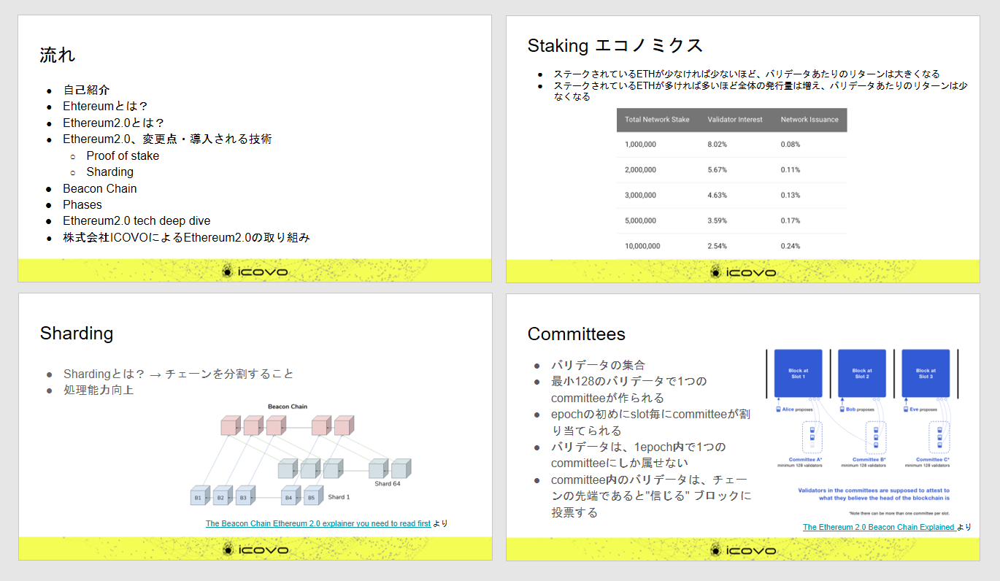
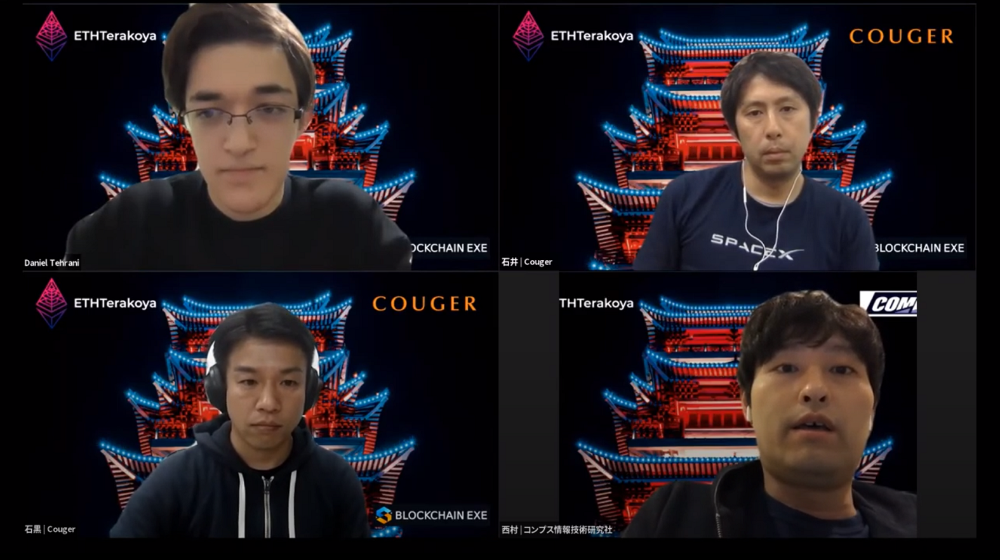

## ワーキンググループ報告書

公開ワークショップの資料は以下で公開しています。

  <ul>
    <li>
      <a
        href="/pdf/eth2.0/ETHTerakoya × Blockchain EXE - Ethereum2.0.pdf"
        target="_blank"
      >
        2020年11月版 Ethereum 2.0 概要
      </a>
    </li>
  </ul>

## 公開ワークショップ動画

公開ワークショップの動画は以下で公開しています。

  <ul>
    <li>
      <a href="https://youtu.be/q5LetCEd38s" target="_blank">
        ワークショップ「Ethereum 2.0」
      </a>
    </li>
  </ul>
  

    ⇒
    <a
      href="https://www.youtube.com/channel/UCnfgzeNn_90Iq6MHXO3wp5A"
      target="_blank"
    >
      ETHTerakoya Youtubeアカウント
    </a>
  

## 構成

1. Overview
   1. ワークショップ「Ethereum 2.0」
2. Detail
   1. Ethereum 2.0 の概要について | Daniel Tehrani
   2. ディスカッション・質疑応答 | Daniel Tehrani、西村 祥一、石黒 一明

## 登壇者

- Daniel Tehrani：
株式会社ICOVO Japan, フリーランスエンジニア

- 西村 祥一
株式会社コンプス情報技術研究社, CEO

- 石井 敦：
クーガー株式会社, CEO

- 石黒 一明：
クーガー株式会社, チーフブロックチェーンアーキテクト

## Overview

### 1-1. ワークショップ「Ethereum 2.0」

Ethereum2.0 への移行を目指し、2020 年 12 月より Beacon chain がスタートした。これを機に、今後は加速度的に実装を進める計画があると思われる。

今回は潮流をキャッチアップすべく、大型アップデートの内容について専門家と意見交換を行った。Ethereum への参入検討者・開発者に対し、Ethereum について知る機会を提供することで、今後の展開に関心を持って頂きたいと考えている。

2022 年に移行完了を予定している Ethereum2.0 ではあるが、未だ全ての情報が明確に提示されてはいない。しかしながら予定通りに Phase が進み運用が開始されれば、現在よりも多くの場面で Ethereum が活用される事になるであろう。

世界的に需要が高まり多くのユーザーが集まれば、現在よりも価格は安価となり、より身近な存在となる事が予想される。今後、続々と開示されるであろう新情報には、より一層の注目が集まる事は必然である。

## Detail

### 2-1. Ethereum2.0 の概要について

  株式会社ICOVO Japan, フリーランスエンジニア｜Daniel Tehrani

#### 2-1-1 Ethereum とは

- パブリックなブロックチェーンであり誰でも参加することが可能。

- 分散型アプリケーション(DApps)やスマート・コントラクタを構築するためのプラットフォームである。

#### 2-1-2 Ethereum2.0 とは

- Ethereum の大型アップグレード版。

- Ethereum が抱えている問題(スケーラビリティ、セキュリティ、サステナビリティ、環境負荷など)を解決するために新しい技術が導入されている。

#### 2-1-3 proof of stake とは

- Etereum2.0 では proof of work(マイニング)は proof of stake へ変更された。

- Staking とはコインを預けてネットワークに貢献しつつ報酬を得る事である。最小単位は 32ETH であり、チェーンのバリデートをする事で報酬が得られる(約 1%～ 25%)。プロトコル通りの行動をしなかった場合、ステークは没収される。

- proof of work ではマイニングの能力を基にコンセンサスを得ていたが、proof of stake ではコインの保有量を基にコンセンサスを得るようになった。

- 悪意のある行動をした場合、proof of work では消費した電力が無駄になるため正しい行動をするインセンティブになっていたが、proof of stake では悪意のある行動をしたらコインを失う事により正しい行動をするインセンティブになっている。

- ステークされている ETH が少なければ少ない程バリデータあたりのリターンは大きくなり、ETH が多ければ多い程全体の発行量が増えるためバリデータあたりのリターンは少なくなる。

- 1 度預けた ETH は約 2 年間引き出す事が出来ない。

#### 2-1-4 Staking pool とは

- 32ETH を用意することが難しい方でも参入が可能。

- ノードを用意するなどの技術面に関しては抽象化されており、32ETH 以下からステークが出来る。

- 複数人で 32ETH を集めた後、バルクを作りステークを行う。

- 自分で秘密鍵を管理できない場合が多く、安全面に関してはリスクがある。

#### 2-1-5 Sharding

- Ethereum2.0 に新しく導入された Sharding とはチェーンを分割する事であり、分割して作業を行う事で処理速度の向上を実現している。

- チェーンは 64 個に分割され、Beacon Chain によって統括されている。

- Beacon Chain は proof of stake と Sharding の統制を行っており、Ethereum2.0 移行の鍵と言えるチェーンである。

#### 2-1-6 移行フェーズについて

Ethereum2.0 は段階的にローンチされ、最終形となるのは約 2 年後とされている。

- Phase 0：Beacon Chain スタート(2020 年 12 月 1 日予定)

- Phase 1：Sharding の実装(2021 年予定)

- Phase1.5：Ethereum と Ethereum2.0 のドッキング(2021 ～ 2022 年)

- Phase2： 具体的な内容は未定

#### 2-1-7 Ethereum2.0 の技術的解説

◆Sharding の技術的課題

- 全てのノードが全てのトランザクションを実行しなければいけないため、スケールしていないという課題がある。

- スケールするにはノードの処理能力を上げるなどの垂直なスケーリングが必要。

- 並行処理などの水平なスケーリングでは中央集権化しない。

- Beacon chain にてバリデータが 64 のサブセットに分けられるが、その場合 1shard あたりのステークが低くなり、セキュリティ面で問題が起こる可能性が懸念されている。

- 疑似乱数を生成する RANDAO を使用し、定期的にバリデータをシャッフルする事で悪意のある攻撃を予防できる。

◆Slots and Epochs

①Slots

- Slots はブロックのためのスロットであり、12 秒ごとにブロックが追加される。

- Beacon chain と Shard chains、両方に適用される概念である。

- これまでの Ethereum には Slots は無く、ブロック高という概念が存在していた。

②Epochs

- 1Epochs = 32Slots

- 1Slots は 12 秒であるため、1Epochs は 6.4 分になる。

◆ バリデータ紹介

- バリデータは Proposer か Attester として仕事を行う。

- Proposer はランダムに選ばれるものであり、ブロックの生成を行う。

- Attester は Proposer が生成したブロックに投票を行うものであり、Proposer と同様にランダムに選ばれる。

- バリデータの集合体である Committees は epoch の初めに Slot 毎に割り当てられる。

- 最小 128 のバリデータで 1 つの Committees となる。

- バリデータは 1epoch 内で 1 つの Committees にしか属せない。

-  Committees 内のバリデータはチェーンの先頭であると信じられるブロックに投票する。

◆ 投票(LMD GHOST)

- Attester は先頭であるブロックに投票を行う。

- Slot0、1、2 とあった場合、Slot2 の担当の Attester は Slot1 のブロックを無効として Slot0 に投票を行う。この投票方式を LMD GHOST と呼ぶ。

---

**中間質疑**

**石井**：
アップデートによって複雑化していると思われるが、エンジニアにとって開発のしやすさなどの変化はあるか。

**Daniel**：
Ethereum2.0 が普及すれば、それに合わせたツールが出てくると思われる。プロトコルレベルでは特に開発しやすくなった点はない。

**石井**：
ETH2.0 になる事で処理速度は改善したか。

**Daniel**：
現状でははっきりとした速度の変化は分からない。今後 Sharding の開発がどの様に進められるかによって、速度は変わってくると思われる。また、ロールアップなど他の技術との兼ね合いもあり、まだ不明な点は数多く残っている。

**石井**：
最初に高額な資金が必要になるため、若者・学生などにはハードルが高い。もっと少額で参加する方法はないか。

**Daniel**：
Staking pool を利用すれば少額でも参加する事は可能。0.01ETH でも参加する事ができるためハードルは大幅に下がる。

**石井**：
アップデートによってビジネスでの活用にプラスとなる事はあるか。具体的な用途など。

**Daniel**：
第一に手数料の低下が挙げられる。またトランザクションも早くなるため、一般に広く普及しやすくなると考えられる。仮想通貨同士の貸借やゲームでの使用など、活用シーンも増えていくのではないか。

**石井**：
Ethereum2.0 にとっての脅威やリスクについてはどうか。

**Daniel**：
未だ不明な点は多いが、Ethereum の法的な立ち位置は懸念されている。今後開発が進んだ際に、規制リスクが立ちはだかるのではないかと危惧している。

### 2-2. ディスカッション

#### 2-2-1. ETH2.0 への貢献方法

**石黒**：
バリデータになるために Launch Pad を使う方法があるが、それ以外の方法はあるか。

**西村**：
自分でバリデータになる事自体ハードルが高く、テクニカル面で理解ができない場合、頓挫する事もある。直近の有名な事例では、コンセンシスが Staking サービスを開始するという話があったが、消費者向けというよりも大規模な投資を行う層に向けた内容となっている。

**石黒**：
例えば Ethereum やビットコインが出てきた頃は、マイニングプールの様なサービスを提供していたが、同様のトレンドを向かえているということか。

**西村**：
以前は自宅にマイニングマシンを置き、そこで計算したものをプールにサブミットするといったスタイルであったが、現在は Staking のプールとなるとコインを置くというスタイルに変更されているため、自宅に機械は不要となっている。そのため、ハードルはかなり下がっていると言える。

**石黒**：
「バリデータのハードルが高い」とは具体的にどのようなことか。

**西村**：
32ETH を手に入れるハードル、そして自宅でバリデータノードを動かすための機械のセットアップなど、テクニカルな知識のハードルがある。
Staking をする秘密鍵の管理が不十分な場合、ETH が失くなってしまう事もリスクである。また、24 時間 365 日オンライン状態を保つ必要がある点も個人にとってはハードルが高いといえる。

**Daniel**：
個人でバリデータをたてるハードルは確かに高いが、分散型の Staking プールなどを利用すればある程度は参入しやすくなる。

**西村**：
Staking サービスでも種類があり、ETH 自体を預けるものもあれば、サーバー・技術のみを提供するサービスもある。高度なものでは、Staking されている ETH をトークン化し、更に疑似流通させるといった話も出てきている。

**石黒**：
Beacon chain はクライアントによる違いなどはあるか。

**西村**：
どこが良いという物ではなく、マルチクライアントで動くという事が重要。1 つのプロトコルに従って動いているため、ノードは何を使用しても問題ない。サービスを選ぶ時は 1 つのクライアントに依存したものではなく、複数のクライアントが関わっているものを選ぶ方が良いのではないか。

**石黒**：
Beacon chain はメタマスクでのカスタム RPC 切り替えで使う想定か。

**Daniel**：
前提として Phase0 の段階では Beacon chain がたつのみであり、全機能が利用できるわけではない。そのため、今の段階では Beacon chain をカスタム RPC で使用する事はできない。今後 Phase が進めば可能になると思われるが、随時状況は変わるものと考えている。

**石黒**：
Staking に参加した場合の報酬の支払いタイミングについて、明確な取り決めはあるか。

**西村**：
預けた ETH を取り出せる時期はまだ明確になっていない。報酬の割合については参加人数・投資額により変動する。

#### 2-2-2. 企業や団体としてサービスを展開するために

**石黒**：
例えば取引所などで Staking サービスを始めようとする動きはあるか。

**西村**：
バイナンスやコンセンシスなどでは、サービスの準備に取り掛かっているような動きがみられる。預かっている ETH は Staking で回さなければ報酬が得られないため、各社で今後の運用について検討しているのではないか。

**石黒**：
Staking で報酬が得られるとした場合、法律面の問題が出てくると思われる。国内で法律面に対する動きは出てきているか。

**西村**：
取引所に預けている ETH へ報酬が出た場合の扱いについて、積極的な議論はまだ起きていない。Staking 全体に関してはワーキンググループなどが主体となり、議論は進んでいると感じる。Staking の問題点として、報酬の発生源が不明瞭という課題があり、どのように規制すべきか争点となっている。

**石黒**：
Ethereum からコスモスプラットフォームへの転向をよく耳にするが、実情はどうか。

**西村**：
一時期 Ethereum の料金が高騰しており、手数料が高すぎて送金などが出来ない状況になっていた。その当時、他の手数料が安いプラットフォームへ移る動きはあった。

**石黒**：
Ethereum2.0 に移行するにあたり、Dapps の開発者が対応すべき事はあるか。

**西村**：
現時点でテストできる事は少ないが、事前に勉強し業界の動向に注目しておくことは重要と思う。

**Daniel**：
未決仕様も多いが、情報が公開され次第対応できる態勢を整えておくべき。

**石黒**：
Ethereum2.0 は大規模なネットワークの実装にもかかわらず、完了予定までの期間が短く感じる。安全面などの不安はないか。

**Daniel**：
今後クライアントの会社が監査を受けるという話は聞いている。ネットワークの監査はできないため、安全性を確保するには各クライアントを監査して対応するしかない。

**石黒**：
今後 Ethereum2.0 に期待する改善点はあるか。

**西村**：
Dapps を作っている立場で考えた場合、1 番改善したいのは料金の仕組み。1 つのサービスが混み合うと他のサービスにも影響が出る仕組みでは、ビジネス的に先が読めなくなってしまうため改善が必要と感じている。また、一般ユーザーが使用しやすいようなインターフェースの開発は必要と考える。

**Daniel**：
Ethereum は拡張性が高く、あらゆる機能の実現が可能だと考えている。今後は更に幅広い分野で活用されるよう、推進活動をして欲しい。

**石黒**：
Ethereum 開発者の強さにはどのような理由があると考えているか。

**西村**：
まずはコミュニティの圧倒的な大きさ。開発ツール類が初期から充実していたため、開発に取り組みやすかったことも強みである。

**Daniel**：
コミュニティが大きいためにツールが充実し、ツールが充実しているからコミュニティが大きくなるという相乗効果が生まれている。

#### 2-2-3. Phase0 その後

**石黒**：
Phase0.5 で実装されるライトクライアントとは何か。

**西村**：
これまではブロックチェーンのデータを持っていなければクライアントになれなかったという不満点に対し、自分に関係のあるデータさえ持っていれば、クライアントになれるという機能を実現させるためのソフトウェアである。

**石黒**：
ライトクライアントが Phase1 の Sharding に移る際に役立つという事か。

**Daniel**：
Sharding が必要な背景には、ロールアップはレイヤー 1 の技術であり、Sharding はレイヤー 2 の技術であるため、更新しやすくなることがある。レイヤー 1 は他の機能への影響が大きいため更新はなるべく減らし、主にレイヤー 2 を更新して対処するといった使い方が可能である。

**石黒**：
Phase1.5 で行う ETH1 と ETH2 のマージは具体的に何を想定しているのか。

**Daniel**：
現段階では詳細な内容は公開されておらず、Phase1.5 の段階で ETH1 と ETH2 のデータを統合する予定であるという事だけは聞いている。

**石黒**：
Phase2 以降に関してもはっきり分からない状態か。

**Daniel**：
ライトクライアントに関しては、以前は Phase2 以降に実装される予定だったと記憶している。Phase2 以降の情報も一部は公開されているが、今後変更される可能性も十分にある。

**石黒**：
Ethereum2.0 に移行していく事で、経済面ではどのような変化があるか。

**西村**：
報酬に関しても明示されていないため、影響は評価できない。

**Daniel**：
今までマイニングをしていた人達が Ethereum2.0 でマイニング不可となったらどうするかは気になる。他に移るのか、2.0 に適応するのか、それにより経済への影響も違ってくるのではないか。

**石黒**：
Ethereum は料金が高いと言われているが、どう考えているか。

**西村**：
手数料の水準が高く変動も激しいため、ユーザーフレンドリーではないと感じている。Ethereum2.0 への移行により安くなるとは断言でないが、十分な需要が満たされるようになれば価格が落ち着く事も考えられる。
