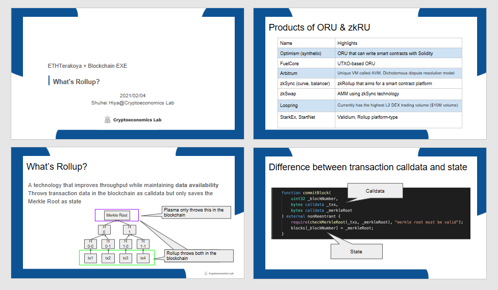

##  Working Group Report

The public workshop materials are disclosed as follows.

  <ul>
    <li>
      <a
        href="/pdf/eth2.0/Eth2_Data_Sharding_en.pdf"
        target="_blank"
      >
        Eth2 Data Sharding
      </a>
    </li>
    <li>
      <a
        href="/pdf/eth2.0/What's RU_en.pdf"
        target="_blank"
      >
        What is a Rollup？
      </a>
    </li>
  </ul>

## Public Workshop Clips

The public workshop clips are disclosed as follows.

  <ul>
    <li>
      <a href="https://www.youtube.com/watch?v=Kg9bl5uSKYg" target="_blank">
        Ethereum's future, which is shaped by scaling technology
      </a>
    </li>
  </ul>
  

    ⇒
    <a
      href="https://www.youtube.com/channel/UCnfgzeNn_90Iq6MHXO3wp5A"
      target="_blank"
    >
      ETHTerakoya Youtube Account
    </a>
  

## Structure

1. Overview
   1. Ethereum's future, which is shaped by scaling technology
2. Detail
   1. ETH2 Data Sharding | Ryuya Nakamura
   2. A Look at Rollup Technology | Shuhei Hiya
   3. Discussion | Ryuya Nakamura、Shuhei Hiya、Kazuaki Ishiguro

## Speakers

- Ryuya Nakamura：
LayerX Inc., Operating officer

- Shuhei Hiya
Cryptoeconomics Lab Inc., CTO

- Atsushi Ishii：
Couger Inc., CEO

- Kazuaki Ishiguro：
Couger Inc., Chief blockchain architect

## Overview

### 1-1. Ethereum's future, which is shaped by scaling technology

Ethereum continues its steady steps as Beacon Chain was implemented in 2020.

Here, experts shared their knowledge on the current and future developments of Ethereum, including upcoming features such as Rollups and Shards.

These discussions on the future of Ethereum were done from both the user's and developer's perspectives.

There are still many uncertainties in Ethereum 2.0, but scaling can be expected to accelerate the improvements on its features. The value of Ethereum is expected to rise higher as Decentralization is anticipated to continue flourishing worldwide.

If you are interested in Ethereum, checking out the official Specs would be a good learning source. The people's interest and participation will be the driving force for this future infrastructure to shine.

## Detail

### 2-1. ETH2 Data Sharding

  LayerX Inc., Operating officer｜Ryuya Nakamura

#### 2-1-1 Ethereum Scaling Overview

①Ethereum Trends

- Transaction fees soared in 2020 due to the boom in Decentralized Finance (DeFi). This gave rise to an urgent need for Ethereum to be scalable to the future.

- The scalability of Ethereum is measured by TPS (TX/sec). Future improvements on this are as follows:

15TX/sec (Present)

⇒2,000TX/sec (Post-Rollup)

⇒10,000TX/sec (Post-Ethereum 2.0 Data Sharding)

These numbers are for reference only. However, significant improvements are expected due to Rollups and Data Sharding.

②Rollup Overview

- Rollup is an approach where the transaction verification and state transition are done off-chain, with only the results written to the main chain. Performing the verifications off-chain streamlines the main chain operations, boosting the TPS value.

Verification methods are ZKRollup, where the correctness of verification is proved via zk-SNARKS, and Optimistic Rollup, where invalid state transitions are proved via fraud proof.

- The ETH2 Beacon Chain was launched in December 2020. However, it cannot be used as a standalone and is ultimately just the first step. The Beacon Chain plays a crucial role and manages the entire system. It will draw closer to practical use as more features are added in the future.

- Sharding is an architecture where many blockchains run in parallel, initially implemented for carrying Rollup data. Putting the Rollup data in the Shards makes it possible to suppress the Rollup capacity pressure, drawing out more potential.

- ETH1 and ETH2 will coexist for a while and continue moving in parallel. Future developments will make it possible to reference transaction data from ETH2 Shards, streamlining Rollup operations.

- There are proposals to put contracts in Shards but are still under consideration.

③Official Specs Confirmation

- The technical details are frequently changing, making it necessary to check with the official Specs to confirm the details. Basically, documents other than the official Specs are not maintained.

- The official Specs are managed on GitHub. The language used is Python.

- The Beacon Chain page describes the logic of on-chain state transitions, and the consensus can be found on the Honest Validator Page.

- Data Sharding is still under development and has not yet been merged into the main branch. The Beacon Chain pull request page also includes Sharding, so the details can be confirmed there.

- A hard fork is scheduled for the end of summer 2021. Details regarding light clients can be found in the Specs.

---

**Q&A**

**Q：**Who decides the Specs and how is it decided?

**A：**Major changes are listed in the Specs after research and verification by the Ethereum Foundation team. As for small fixes, ETH2 members have authority for these.

**Q：**Does the launch of Beacon Chain raise any technical issues?

**A：**Thrashing problems have frequently occurred since the implementation of the Beacon Chain. Most of these are caused by mistakes and will be a challenge tackled in future design.

**Q：**ETH2 seems to be very conscious of client diversification. However, many nodes only support select, stable clients. Is diversity actually feasible in such a situation?

**A：**Measures are being taken, such as giving plenty of incentives for using clients with few users. However, there are various factors involved in choosing a client. Meaning, this will be a major issue to be tackled in the future.

**Q：**Is ETH1 knowledge needed to understand ETH2?

**A：**It is important to have prior knowledge of ETH1 since ETH2 seeks to solve the problems of ETH1. However, you don't necessarily have to know everything.

**Q：**What preparations do DAPS engineers need for Sharding?

**A：**Efforts are being made to simplify the many changes from ETH1 to ETH2. However, there are still many things to be dealt with, so changing the method of creating smart contracts and similar tasks will be necessary.

### 2-2 A Look at Rollup Technology

  Cryptoeconomics Lab Inc., CTO｜Shuhei Hiya

#### 2-2-1 What is a Rollup？

- Rollup is a technology that improves throughput (number of transactions processable per second) while maintaining data availability.

- In Plasma, only the Merkle Root is put into the blockchain and saved. In Rollup, the entirety (calldata) is put into the blockchain, and only the Merkle Root is saved (state).

- Ethereum currently has a state size of 45GB and a chain size of 300GB. The state needs to be saved in the memory every time for checking, meaning the smaller the size, the better.

- In Plasma, it is necessary to analyze the original transactions to compress them. In Rollup, all transactions are thrown in via calldata, eliminating the problem of losing data availability.

- Rollups can be classified into Optimistic Rollup and ZK Rollup. Optimistic Rollups verify transactions on the blockchain only when a problem arises, while ZK Rollups verify transactions on the blockchain every time via (zk-)SNARK.

- Rollups save more gas costs the more complex the transaction.

- The maximum transaction value per block can be obtained by dividing the block gas limit by the gas per tx. However, in ZK Rollups, the circuit size and proof generation time are bottlenecks.

#### 2-2-2 Why Rollup？

Using Rollups removes the need to sacrifice data availability and grants more freedom.

①Optimistic Rollup

- The aggregator in Optimistic Rollups is permissionless. It is also easier to achieve EVM compatibility.

- It takes about a week to withdraw due to the challenge period.

- The data is public in Rollup, meaning anyone can verify fraud.

- Optimistic Rollups have a mechanism called the OVM (Optimistic Virtual Machine), which enables fraud proofs via EVM-compatible state transitions.

②ZK Rollup

- Like Optimistic Rollups, the aggregator is also permissionless.

- Withdrawal time is faster and can be done within minutes.

- Complex actions are not possible due to program size restrictions. This means smart contract development is also restricted.

- ZK Rollups have an advantage on security compared to Optimistic Rollups.

- If the withdrawal request is ignored by all full nodes, the transaction can be made directly on-chain (Exodus Mode).

- Since the ZK Rollup has verified that the block is correct, it is not necessary to assume the validators are sufficient, leading to high usability.

③Comparison between Optimistic Rollup and ZK Rollup

- In terms of latency (the time it takes for a transaction to be verifiable), ZK Rollups are faster than Optimistic Rollups.

- As for programmability, Optimistic Rollups are highly versatile due to their EVM-compatibility. ZK Rollups have their quirks but have been greatly improved with Cairo and Zinc.

- Optimistic Rollups require distribution over multiple validators but are cost-effective due to them being operable on cheap machines. ZK Rollups require high specifications, meaning higher costs and multiple machines to improve throughput.

- Optimistic Rollups require a certain level of censorship resistance for withdrawals to be secure, while in ZK Rollups, assets are kept safe even if the withdrawal is censored.
Even in such a case, it should still be noted that depending on the zk-SNARKS protocol, there may be situations that rely on the trustworthiness of the person who set it up.

---

**Q&A**

**Q：**How long do Optimistic Rollup verifications take (which only activate when a problem occurs)

**A：**Since the range of verification differs depending on the product, the time it takes will be longer if the range is wide. However, this is shortened if only one section needs to be verified.

**Q：**Is NFT swapping (i.e. OpenSea) possible with Rollups? Also, do existing contracts need to be discarded?

**A：**Contracts can be used as-is with Optimism.

**Q：**Are there any movements to create a standard for Rollups?

**A：**There have been many attempts since the time of Plasma. However, it could not be realized due to varying contents depending on objectives.

**Q：**How does OVM work?

**A：**The details are very complicated.

There is a mechanism for reproducing EVM state transitions and separate clients for generating the proof to reproduce them. The state transition is reproduced by transpiling the existing solidity code, changing it into bytecode for OVM, and deploying it.

### 2-3 Panel Discussion

#### ◆What’s next after Phase 0?

**Ishiguro：**
Support for light clients, also known as Phase 0.5, was scheduled for early 2021. How are things proceeding?

**Nakamura：**
A document named Hard Fork 1 has been submitted, with current goals for this summer being light client support/bug fixes.

**Ishiguro：**
Will Sharding also be implemented this summer?

**Nakamura：**
Since the P2P portion of Sharding will be changing significantly, drastic work will be needed. It's like building a Beacon Chain from scratch, which is very difficult and time-consuming.

**Ishiguro：**
Has the Team in-charge of implementing Sharding been decided?

**Nakamura：**
Not yet. The Specs are advancing, but the implementation is not keeping up with its pace.

**Ishiguro：**
Are there any Sharding tools coming out?

**Nakamura：**
Not at all. However, we would love to create such a tool that can easily be tested before ETH2 is completed.

**Ishiguro：**
You wrote a thesis on the vulnerability of CBC Casper. How did you discover its issues?

**Nakamura：**
I started my research on CBC Casper around two years ago. There, I discovered the issues after simulating every case possible.

**Ishiguro：**
Are there any risks when it comes to merging after Sharding is implemented?

**Nakamura：**
I believe the community's approval is more important than the risks. Merging would require stopping the current Ethereum and moving over to the new one, meaning the community's understanding is indispensable. Technically speaking, merging early would be ideal.

**Hiya：**
I believe this will affect the areas related to usability and developer experience, where big changes occur. This will be even more complicated if Rollups, Shards, and ETH1 are involved.

**Ishiguro：**
Will the liquidity pool data reset during the migration to ETH2?

**Nakamura：**
The Beacon Chain is almost the same as ETH1 since there is no EVM on the Shard side, meaning the data will be copied as-is.

**Ishiguro：**
Why do you think Plasma was not widely accepted?

**Hiya：**
A possible cause would be the problem of decentralization. Asset security changes depending on whether the aggregator is permissionless, which may have been a bottleneck.

**Nakamura：**
Another issue with Plasma is that its owner is not clearly determined. Plasma is a solution for protecting one's assets by oneself. As such, incorporating it would be difficult if it is not an open application.

**Ishiguro：**
Merkle Trees use hash functions, but are they all using the same thing?

**Hiya：**
While it is possible to use the same hash, there are many ways to use hashes, and not all of them are the same. Although not standardized, there have been papers published that resemble criteria.

**Ishiguro：**
What kind of tools are you using?

**Hiya：**
I'm using the OVM compiler. Another well-known tool is Zinc, a compiler for creating applications for zkSync.

**Ishiguro：**
There have been talks about docking with Phase 1.5. What is your opinion on this?

**Nakamura：**
The difference is that flexible programs are executed and that it has the capacity to deploy flexible programs. Therefore, I believe that an environment for flexible execution will also be required.

The strength of EVM is that such an environment (called EPM) itself performs the state transition, creating the possibility of making applications that were not expected at the time of deployment. Currently, Ethereum has seen many projects no one could have imagined during launch, thanks to EMP. I believe that creating an environment like this is the essential value of Ethereum.

**Ishiguro：**
How will Proof of Stake and Sharding change the future?

**Nakamura：**
Data Sharding will likely solve the problem of multiple Shards being meaningless due to everyone being on the same Shard. Putting only the data on the Shard is not that much of a big load, meaning it does not matter even if there's an imbalance. For this reason, I'd say that the term "Sharding" is no longer appropriate, as it can already be called a block.

As for Proof of Stake, I find it to be very important. Proof of Work is unhealthy for the environment, unlike Proof of Stake, though many are indifferent to this problem. Ethereum is an infrastructure for the next generation, which means we should be seriously considering its environmental issues.

**Ishiguro：**
Will there be any changes to user behavior in the future?

**Hiya：**
In the short term, it will depend on the flow of money. If money flows, both users and developers will gather. As for the long run, I believe that correct, general-purpose ones that can be left to the next generation will be preferred.