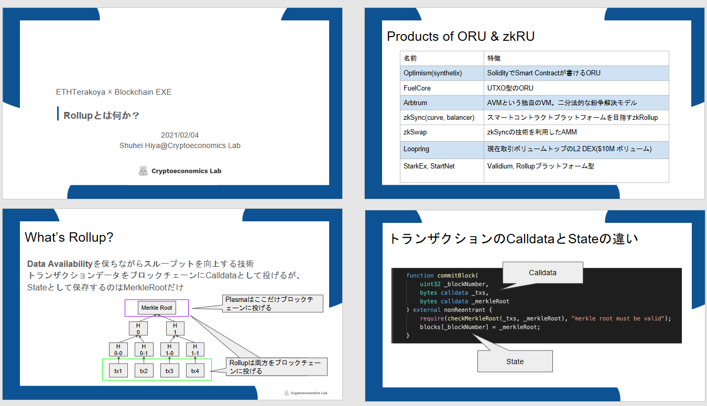

<!--

## ワーキンググループ報告書

公開ワークショップの資料は以下で公開しています。

  <ul>
    <li>
      <a
        href="/pdf/eth2.0/user-view-into-ethereum2.0.pdf"
        target="_blank"
      >
        ユーザー視点で見るEthereum 2.0
      </a>
    </li>
    <li>
      <a
        href="/pdf/eth2.0/rollup-overview.pdf"
        target="_blank"
      >
        Rollupとは何か
      </a>
    </li>
  </ul>

-->

## 公開ワークショップ動画

公開ワークショップの動画は以下で公開しています。

  <ul>
    <li>
      <a href="https://www.youtube.com/watch?v=Kg9bl5uSKYg" target="_blank">
        スケーリング技術によるこれからのEthereum
      </a>
    </li>
  </ul>
  

    ⇒
    <a
      href="https://www.youtube.com/channel/UCnfgzeNn_90Iq6MHXO3wp5A"
      target="_blank"
    >
      ETHTerakoya Youtubeアカウント
    </a>
  

## 構成

1. Overview
   1. スケーリング技術によるこれからのEthereum
2. Detail
   1. ETH2 Data Sharding | 中村 龍矢
   2. Rollup技術外観 | 部谷 修平
   3. ディスカッション・質疑応答 | 中村 龍矢、部谷 修平、石黒 一明

## 登壇者

- 中村 龍矢：
株式会社LayerX, 執行役員

- 部谷 修平
株式会社Cryptoeconomics Lab, CTO

- 石井 敦：
クーガー株式会社, CEO

- 石黒 一明：
クーガー株式会社, チーフブロックチェーンアーキテクト

## Overview

### 1-1. スケーリング技術によるこれからのEthereum

2020年にBeacon chainが実装され、Ethereumは着実に進化を続けている。

今回はEthereumの現状と併せて、実装予定であるRollup・Shardなどの機能も含めた今後の展開について、ユーザー視点と開発者視点双方から情報提供が行われた。

Ethereum2.0には未確定な要素も多いが、スケーリングによる加速度的な機能の向上が期待できる。今後も世界的なDefiの盛況が続く事が予想されるため、Ethereumの価値は更に高くなると思われる。

Ethereumに関心があれば、公式Specの閲覧はよい学習ソースとなる。多くのの人が関心を持ち、参加する事が未来のインフラを強く輝かせる原動力となる。

## Detail

### 2-1. ETH2 Data Sharding

  株式会社LayerX, 執行役員｜中村 龍矢

<!--

-->

#### 2-1-1 Ethereumのスケーリング概況

①Ethereumの動向について

- 2020年はDefi(分散型金融)の盛況もあり、トランザクション手数料が高騰した。そのため、今後はEthereumのスケーリングが急務となっている。

- EthereumのスケーラビリティはTPS(TX/秒)を基準としており、今後は以下のように改善されていくとされている。

15TX/秒(現在)

⇒2,000TX/秒(Rollup後)

⇒10,000TX/秒(Ethereum2.0 Data Sharding後)

数値は参考値ではあるが、RollupとData Shardingよる大幅な改善が期待されている。

②Rollup概要

- Rollupとはオフチェーンでトランザクションの検証や状態遷移を行い、結果のみをメインチェーンに書き込む方法である。検証をオフチェーンで行う事により、メインチェーンの動作が効率化されTPSの数値が向上する。
検証方法としては、ZK-SNARKsで検証の正しさを証明(ZKRollup)し、不正な状態遷移をFraud proofで証明 (Optimistic Rollup) することとなる。

- 2020年の12月にEth2のBeacon chainがローンチされたが、単体では使えない状態であり、あくまで最初の一歩という段階である。Beacon chainはシステム全体を管理する重要な役割を持っており、今後機能が追加されていく事で実用化に近づいていく。

- Shardingはブロックチェーンを何本も並列に走らせることであり、最初はRollupのデータを乗せる用途で実装する。各ShardにRollupのデータを乗せることにより、Rollupのキャパシティ圧迫を抑制し、ポテンシャルをより引き出せるようになる。

- ETH1とETH2はしばらくの間は共存し、平行して動き続ける事になる。今後はETH2のShardからトランザクションデータを参照する事が可能となり、Rollupの作業が効率化される。

- Shardにコントラクトを乗せるという案も出ているがまだ検討段階である。

③公式Specの確認

- 技術詳細は常に変化していくものであるため、情報を確認するには公式Specを見る事が必要である。基本的に公式Spec以外の資料はメンテナンスされていない。

- 公式SpecはGitHubで管理されており、言語にはPythonが使われている。

- Beacon chainのページにはオンチェーンでの状態遷移のロジックが記載されており、コンセンサスについてはHonest Validatorのページに記載がある。

- Data Shardingについてはまだ策定中であり、メインブランチにはマージされていない。Beacon chainのプルリクエストページにはShardingの記載があるため、そこで内容を確認できる。

- 2021年の夏にはハードフォークが行われる予定があり、ライトクライアントについての情報もSpecを見れば確認できる。

---

**中間質疑**

**Q：**Specは誰がどのようなプロセスで決定するのか。

**A：**大きな変更についてはSpecに記載する前にEthereum Foundationのチームメンバーが研究を行い、検証を終えてから記載される。小さなFixに関してはETH2のメンバーにマージの権限がある。

**Q：**Beacon chainのローンチで技術的な問題は出てくるか。

**A：**Beacon chain実装後からスラッシングの問題がたびたび起きている。多くはミスにより発生したものであるが、今後の設計をしていく上での課題となる。

**Q：**ETH2はクライアントの多様化を常に意識しているように見えるが、多くのノード運営者に支持されるのは、安定稼働する一部のクライアントのみである。そのような現状でありながら多様化は本当に実現可能なのか。

**A：**利用者の少ないクライアントの利用に対し、多くのインセンティブを与えるなどの対応を行っている。しかしクライアントを選ぶには様々な要因が絡むため、今後の大きな課題だと言える。

**Q：**ETH2を理解するにはETH1の知識は必要か。

**A：**ETH2はETH1の問題点を改善しているため、前提知識としてETH1を知っておく事は大事。ただし、必ずしも全てを知っておく必要はない。

**Q：**Shardingについて、DAPSのエンジニアが準備すべき事はあるか。

**A：**ETH1からETH2への変更点は非常に多く、簡略化できるようにする取り組みも行われている。しかし、なお対応すべき部分は多いため、スマートコントラクトの作り方を変える等の作業は必要である。

### 2-2 Rollup技術外観

  株式会社Cryptoeconomics Lab, CTO｜部谷 修平

<!--

-->

#### 2-2-1 Rollupとは何か

- RollupとはData Availabilityを保ちながらスループット(1秒間に処理できるトランザクションの数)を向上する技術である。

- PlasmaではMarkle Rootのみをブロックチェーンに投入し保存していたが、Rollupでは全体(Calldata)をブロックチェーンに投入しMarkle Rootのみを保存(State)するようになっている。

- 現在のEthereumのStateサイズは45GB、Chain Sizeは300GBとなっている。Stateはチェックのために毎回メモリに保存する必要があえい、サイズは小さい方が良い。

- Plasmaではトランザクションを圧縮するために、元のトランザクションを解析する必要があったが、RollupではCall Dataによって全てのトランザクションを投げてしまうため、Data Availabilityが無くなるような問題は解消されている。

- RollupにはOptimistic RollupとZK Rollupがある。Optimistic Rollupは問題が起こった場合のみブロックチェーンでトランザクションの検証を行うものであり、ZK Rollupは(zk-)SNARKにより毎回ブロックチェーンでトランザクションの検証を行う。

- RollupによるGasコスト削減は複雑なトランザクションほど効果がある。

- 『ブロックあたりの最大トランザクション値』はblock gas limitを『tx当たりのgas』で割れば求められる。ただしZK Rollupではcircuitサイズと証明生成時間がボトルネックとなる。

#### 2-2-2 なぜRollupなのか

Rollupを用いる事でData Availabilityを犠牲にすることが無くなり自由度が高まる。

①Optimistic Rollupについて

- Optimistic Rollupによりアグリゲータがパーミッションレスになった。また、EVMとの互換性を持たせやすくなっている。

- 紛争期間があるため、引き出しには1週間程度かかる。

- Rollupではデータが公開されているため誰でも不正の検証が可能である。

- EVM互換の状態遷移で不正証明を可能にする仕組みとしてOVM(Optimistic Virtual Machine)がある。

②ZK Rollupについて

- Optimistic Rollupと同様にアグリゲータはパーミッションレスである。

- 引き出しの時間が早く、数分程度で行える。

- プログラムのサイズに制約があるため複雑な動きができない。そのため、スマートコントラクトの開発にも制約がある。

-  Optimistic Rollupと比較してセキュリティ面でのアドバンテージがある。

- 全てのフルノードに引き出し要求を無視された場合、オンチェーンに直接引き出し要求ができる。(Exodus Mode)

- ZK Rollupではブロックが正しいことが検証できているため、安全性のための十分なバリデーターを想定する必要がなく、ユーザビリティが高い。

③Optimistic RollupとZR Rollupの比較

- レイテンシ(トランザクションが検証可能になるための時間)はOptimistic RollupよりもZK Rollupのほうが早い。

- プログラマビリティの面では、Optimistic RollupがEVM互換性を持たせられるため汎用性が高い。ZK RollupはクセはあるがCairoやzincで大幅に改善されてきている。

- Optimistic Rollupは複数のバリデーターに分散する必要はあるが、安いマシンで運用できるためコスト面に優れている。ZK Rollupの運用にはハイスペックが求められるためコストが高く、スループットを向上させるには更に複数台のマシンが必要となる。

- Optimistic Rollupは安全性を保つため、引き出しに一定の検閲耐性が必要となる一方、ZK Rollupは引き出しなどが検閲されても資産は安全に保たれる。その場合にも、zk-SNARKSプロトコルによってはセットアップした人を信頼しなければいけない場合があるため、注意が必要である。

---

**中間質疑**

**Q：**問題が起きた時にのみ発動するOptimistic Rollupの検証はどれくらいの時間を要するか。

**A：**プロダクトによって検証を行う範囲が異なるため、範囲が広ければ時間は長引き、1カ所のみで済むのであれば短時間で完了する。

**Q：**RollupでOpenSeaのようなNFTのSWAPは可能か。また、既存のコントラクトを捨てなければならないのか。

**A：**Optimismはそのまま、コントラクトを使用する事は可能である。

**Q：**Rollupには規格の標準をつくる様な動きはあるか。

**A：**Plasmaの頃から幾度も試みているが、目的によって中身が異なるため実現は出来ていない。

**Q：**OVMはどのような仕組みで動くのか。

**A：**内容は非常に複雑である。

EVMのステートトランジションを再現する仕組みと、それを再現するためのプルーフを生成させるためのクライアントは別々に存在する。既存のソリディティコードをトランスファイルし、OVM用のバイトコードに変えてデプロイするとステートトランジションが再現されるようになっている。

### 2-3 Panel Discussion

#### ◆Phase0その後

**石黒：**
Phase0.5と呼ばれていたライトクライアントのサポートは2021年の初旬を予定していたが、どのような状況か。

**中村：**
「ハードフォーク1」というファイル名のドキュメントが入ってきており、現在は夏季を目標にライトクライアントのサポート・バグ対応を行っている様子。

**石黒：**
Shardingも夏の導入になるか。

**中村：**
ShardingはPtoPの部分が大きく変わるため、抜本的な工事が必要となる。Beacon chainを0から作る様なものであり、非常に難しく時間が掛かると思われる。

**石黒：**
Shardingの実装を行うチームは決まっているか。

**中村：**
未定である。Specは進んでいるが、実装がその速度に追い付いていない状態である。

**石黒：**
Shardingのツールなどは出て来ているか。

**中村：**
全くと言っていい程出てきていない。ETH2が完成する前に、簡易的に試せるようなツールは作成しておきたいと考えている。

**石黒：**
CBC Casperの脆弱性についての論文を書かれていますが、どのような経緯で問題を検知したのか。

**中村：**
2年程前にCBC　Casperの研究をした事がきっかけ。その中であらゆるケースのシミュレーションを行った事で問題を検知した。

**石黒：**
Sharding後のマージなどにリスクは無いか。

**中村：**
リスクよりもコミュニティが賛成するかどうかが重要と考える。マージするには現行のEthereumを止めて引っ越しを行う必要があり、それにはコミュニティの理解が必要不可欠です。技術的には早期にマージを行うほうが良いです。

**部谷：**
ユーザビリティやデベロッパーのエクスペリエンスに関わる、大きな変化が起きるところには影響が出ると思う。RollupやShard・ETH1などが絡むと更に複雑になるのではないか。

**石黒：**
ETH2移行時にプールされている流動性のデータなどはリセットされるのか。

**中村：**
Shard側にEVMが無いためにBeacon chainをETH1とほぼ同様にするので、データはそのままコピーされると思われる。

**石黒：**
Plasmaが広く受け入れられなかった理由についてどのようにとらえるか。

**部谷：**
原因として考えられるのは分散性の問題。アグリゲータがパーミッションレスかどうかで資産の安全性が変わってくるため、そこがネックとなったのではないか。

**中村：**
Plasmaの場合は明確にオーナーが決まるアプリケーションではないという点もある。Plasmaは自分の持ち物は自分で守るという仕組みであり、オープンなアプリケーションではないので組み込みにくいという問題がある。

**石黒：**
Markle Treeではハッシュ 関数を使うが、全て同じものを使用するのか。

**部谷：**
同じものを使う可能性もあるが、ハッシュには様々な使い方があり一概に全て同じとは言えない。標準化はされていないが、基準の様な物は公表されている。

**石黒：**
ツールなどはどの様な物があるか。

**部谷：**
自分はOVMコンパイラーを使用している。ほかに有名な物であればZincというzkSync用のアプリケーションを作るコンパイラーがある。

**石黒：**
Phase1.5とのドッキングの話もあるが、どのような見解を持っているか。

**中村：**
柔軟なプログラムが実行されるという事、柔軟なプログラムをデプロイ出来るキャパシティがあるという点で違いがある。そのため柔軟な実行環境も必要となってくると考えている。
EVMの強みは、EPMという柔軟な実行環境自体が状態遷移を行うという事であり、それによりデプロイ時点では想定していなかった様なアプリケーションができる可能性が生まれること。現在、EMPの貢献によりEthereum上でローンチ時点では誰も想定できなかったようなプロジェクトが多数動いている。そのような環境を作った事がEthereumの本質的な価値ではないかと思う。

**石黒：**
今後proof of stakeやShardingはどのように変わっていくか。

**中村：**
複数のShardを用意しても、全員が同じShardにれば意味が無いという問題はData Shardingによって解決されるはず。Shardに乗るのがDataだけであれば大きな負荷にはならないため、偏っても問題にはならない。これらの理由から「Sharding」という表現は不適切であり、もはや1つのブロックと表現したほうが適切ではないかと思う。
proof of stakeに関しては個人的に非常に重要だと感じている。proof of workは環境に悪く、proof of stakeは環境に良いと言われているが、その問題に無関心な人は多い。しかし、Ethereumは次世代に残すためのインフラであり、環境問題について、深く考えるべきである。

**石黒：**
今後ユーザー側の行動に変化は出るか。

**部谷：**
短期的にはお金の流れ次第ではないか。お金が流れればユーザー・開発者ともに集まる。長期的には、次世代に残せるような汎用的で正しいものが好まれると考える。