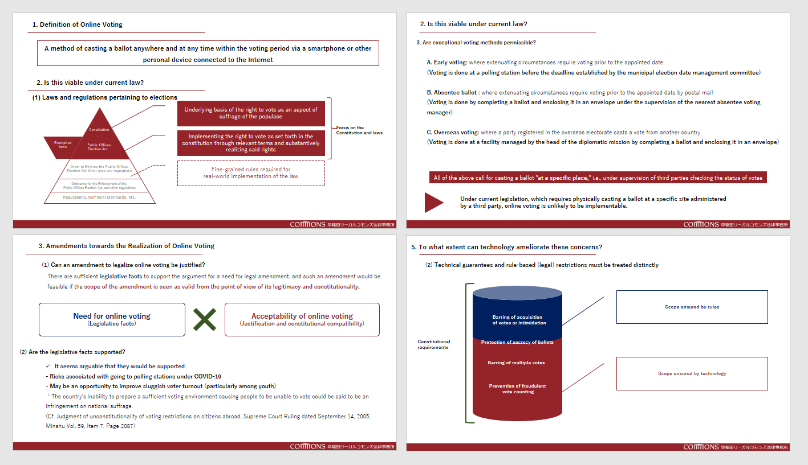

## Working Group Report

The public workshop materials are disclosed as follows.

<ul style="list-style-type: square; margin: 1rem 0.5rem;">
<li><a href="/pdf/2_for-the-realization-of-online-voting_en.pdf" target="_blank">Toward the Implementation of Online Voting</a></li>
<li><a href="/pdf/3_important-point-of-online-voting_en.pdf" target="_blank">Points to Consider regarding Online Voting</a></li>
<li><a href="/pdf/4_regal-consideration-of-online-voting_en.pdf" target="_blank">Legal Challenges surrounding Online Voting</a></li>
<li><a href="/pdf/5_online-voting-and-personal-authentication_en.pdf" target="_blank">Online Electronic Voting and Voter Authentication</a></li>
<li><a href="/pdf/5_ID-and-information-authentication-in-online-voting_en.pdf" target="_blank">Reliability of ID Authentication and ID Information in Online Voting</a></li>
<li><a href="/pdf/6_voting-system-and-blockchain_en.pdf" target="_blank">Voting Systems and Blockchain</a></li>
<li><a href="/pdf/6_utilization-of-blockchain-voting-application-cream_en.pdf" target="_blank">Is the Confidentiality Protocol Cream Adaptable to Internet Voting?</a></li>
<li><a href="/pdf/7_inspection-possibility-of-voting_en.pdf" target="_blank">Voting Verifiability</a></li>
</ul>

## Public Workshop Clips

The public workshop clips are disclosed as follows.

<ul style="list-style-type: square;margin: 1rem 0.5rem;">
<li><a href="https://youtu.be/C4dIvzsz2EA" target="_blank">First part</a></li>

Introduction～Legal Challenges surrounding Online Voting

<li><a href="https://youtu.be/AE-8kQA3l08" target="_blank">Latter part</a></li>

Online Electronic Voting and Voter Authentication～Closing

</ul>

<a href="https://www.youtube.com/channel/UCnfgzeNn_90Iq6MHXO3wp5A" target="_blank">ETHTerakoya Youtube Account</a>

## Structure

1. Overview
   1. Workshop [ID x Voting x Blockchain]
2. Detail
   1. Toward the Implementation of Online Voting
   2. Points to Consider regarding Online Voting
   3. Legal Challenges surrounding Online Voting
   4. Reliability of ID Authentication and ID Information in Online Voting
   5. Voting Anonymity
   6. Voting Transparency and Verifiability

## Overview

### 1-1. Workshop [ID x Voting x Blockchain]

Atsushi Ishii, Couger Inc.

![Workshop [ID x Voting x Blockchain]](./images/section1_en.png)

<a href="/pdf/1_terakoya-workshop-introduction_en.pdf" target="_blank">View PDF</a>

At ETH Terakoya, we held discussions surrounding the exploration of issues and the utilization of blockchain in regard to the implementation of online voting. Our aim is to formulate standardized specifications from a multitude of perspectives, such as business, technology, and law.

The latest topic is [ID x Voting x Blockchain].
In the midst of suspicions of voting fraud in the US, we publish the results of investigations by authorities into our blockchain voting systems.

We will also move forward with plans for the following schemes.
1. Enterprise Workshops
2. Workshops for Student
3. ETH 2.0 Workshops

In conjunction with continued attempts to further explore specific themes and pursue the possibility of social implementation (1), we aim to contribute toward the development of society (2) by educating students on a wide range of knowledge (3).

We are actively searching for working group participants for the above schemes.
In order to proceed further, we would like to welcome a wide range of members, such as blockchain engineers, businessperson with knowledge of specific industries, and attorneys who understand the related laws and regulations.

## Detail

### 2-1. Toward the Implementation of Online Voting

Kohei Kurihara, CollaboGate Japan

<a href="/pdf/2_for-the-realization-of-online-voting_en.pdf" target="_blank">View PDF</a>

While administrative operations have remained unchanged for a long period of time in Japan, the introduction of the My Number Card system is the starting point toward the digitization of Japanese administration. We believe that voting should be of utmost importance as the pillar of democracy.

While there is a system of electronic voting which is similar to internet voting already in place, voters must go to polling stations in order to cast their votes via voting machines — a system that leaves much to be desired in terms of convenience.

We considered the possibility of introducing online voting to Japan while comparing situations of introduction and usage in other countries.

### 2-2. Points to Consider regarding Online Voting

Nobuyuki Asai, ACT

<a href="/pdf/3_important-point-of-online-voting_en.pdf" target="_blank">View PDF</a>

It is necessary to view and examine the operation of online voting from the same viewpoints as the contemporary paper voting system. In addition, there are a wide variety of subjects to consider, such as the creation of electoral rolls to the counting and tallying of ballots.

The scope of areas to take into account is not limited to routine work. It is also necessary to prepare contingency plans in advance.

Furthermore, in the introduction of the new concept of online voting, it will be necessary to promote its advantages over the contemporary paper voting system.

### 2-3. Legal Challenges surrounding Online Voting

Hiroto Inamura, Centaurus Works inc./Waseda Legal Commons Law Offices

<a href="/pdf/4_regal-consideration-of-online-voting_en.pdf" target="_blank">View PDF</a>

As the implementation of online voting would involve the existing Public Office Election Law, its exemption laws, and the constitution itself, it will be necessary to consider measures after confirming the legal requirements.

Existing law states that voting must take place at a specific situation (in the presence of a third party to confirm the vote). If this requirement remains for online voting, this will prove to be a considerable obstacle for its implementation.

Due to the difficulty in implementing online voting under current law, efforts must be made toward revision of law. We have already considered the laws and regulations that should be targeted for revision.

### 2-4. Reliability of ID Authentication and ID Information in Online Voting

Ken Naganuma, Hitachi, Ltd.

<a href="/pdf/5_online-voting-and-personal-authentication_en.pdf" target="_blank">View PDF</a>

Identity verification is one important subject to consider in remote electronic voting on the Internet.
We believe that classifying and evaluating existing identity verification technologies can provide suggestions for social implementation.

We formulated and evaluated seven matrices which were identified from the requirements and issues of voting operations.

---

Motoshi Horii, Fujitsu Laboratories Ltd.

<a href="/pdf/5_ID-and-information-authentication-in-online-voting_en.pdf" target="_blank">View PDF</a>

In order to prevent voting fraud and multiple voting and manage voting in compliance with the one-man-one-vote principle, it will be necessary to ensure the reliability of each voter's ID information.

We tried to increase the reliability of verification by implementing multi-factor authentication, utilizing the My Number system with additional information. We evaluate the candidate information groups with financial cost and information reliability, etc.

### 2-5. Voting Anonymity

Yoshikazu Nishimura, Comps Co., Ltd./al+ Inc.

<a href="/pdf/6_voting-system-and-blockchain_en.pdf" target="_blank">View PDF</a>

The concept of secret ballot voting is a primary requirement for voting. Issues such as voter anonymity and the confidentiality of voting progress are vital points in question. While using blockchain for voting would surely be effective in terms of confidentiality and anonymity, it is also important to consider the cost factor.

We adopted and compared the commit-reveal scheme, open vote network, and CREAM, developed by Couger Inc..

---

Kazuaki Ishiguro, Couger Inc.

<a href="/pdf/6_utilization-of-blockchain-voting-application-cream_en.pdf" target="_blank">View PDF</a>

We would like to examine the possibility of using the confidentiality protocol CREAM, developed using blockchain, for sharing specifications and voting.
CREAM (Confidential Reliable Ethereum Anonymous Mixer) allows for anonymous voting using ERC coins.

In addition to the current version, we are continuing efforts toward the development of version 2, which will include batch implementation, etc. for the purpose of concealing voting results until the end of voting.

### 2-6. Voting Transparency and Verifiability

Shigeo Mitsunari, Cybozu Labs, Inc.

<a href="/pdf/7_inspection-possibility-of-voting_en.pdf" target="_blank">View PDF</a>

Based on the discussions so far, we would like to examine the verifiability of voting for the purpose of aggregating information provided by information providers while maintaining the providers' anonymity.

Specifically, we will explore practical technology implementation methods by touching on topics such as blind signatures, homomorphic encryption, and Mix-Net.
