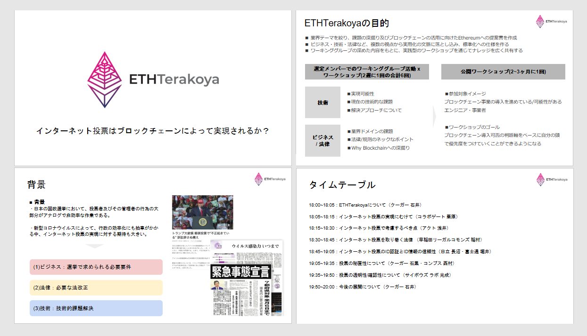
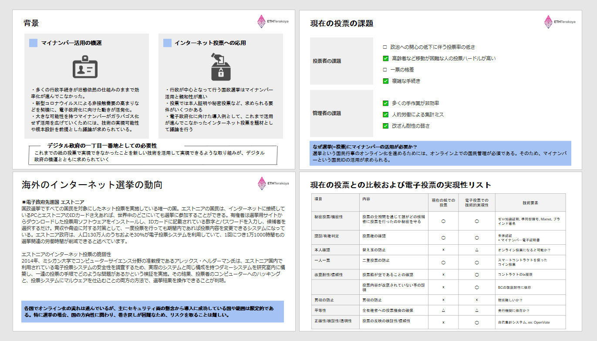
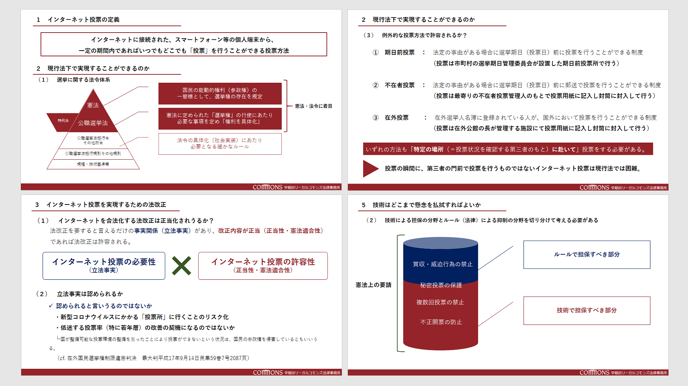
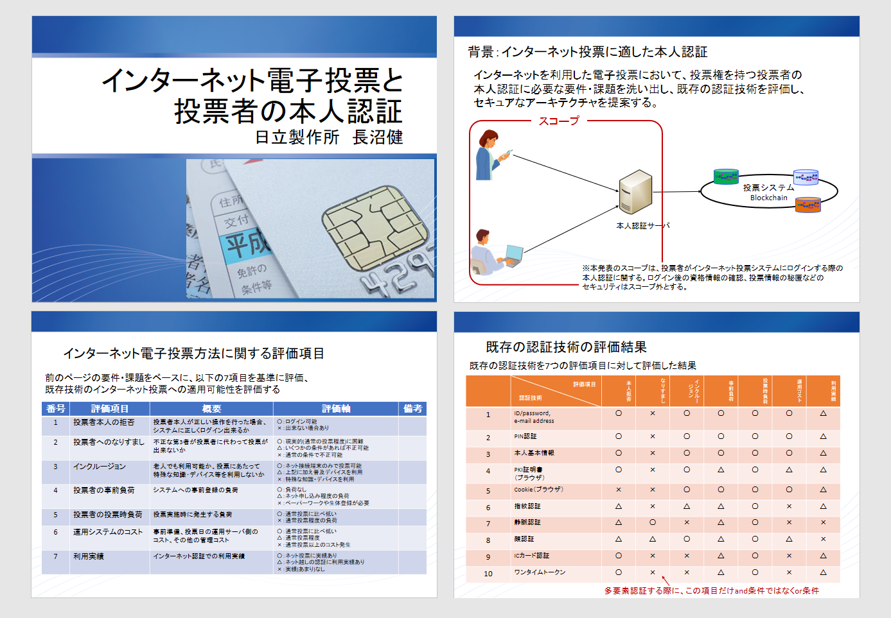
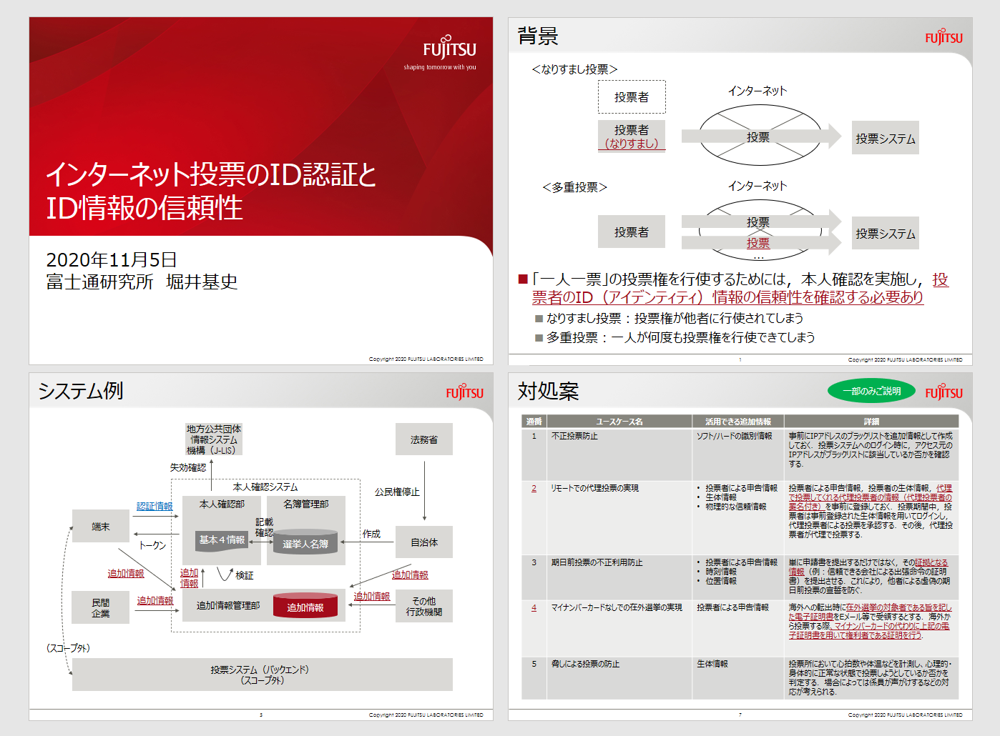
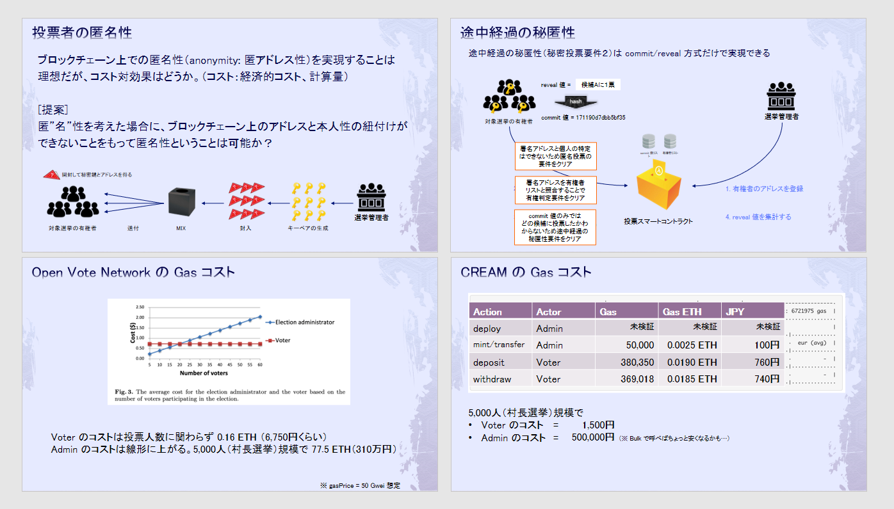
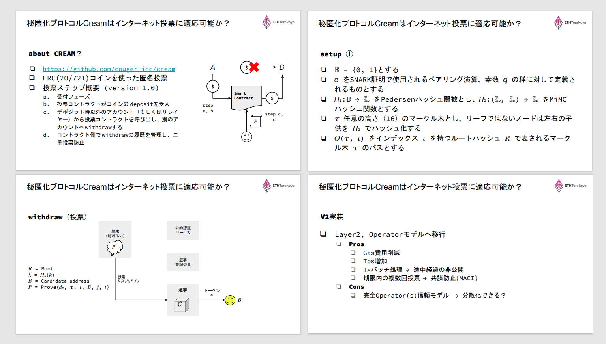
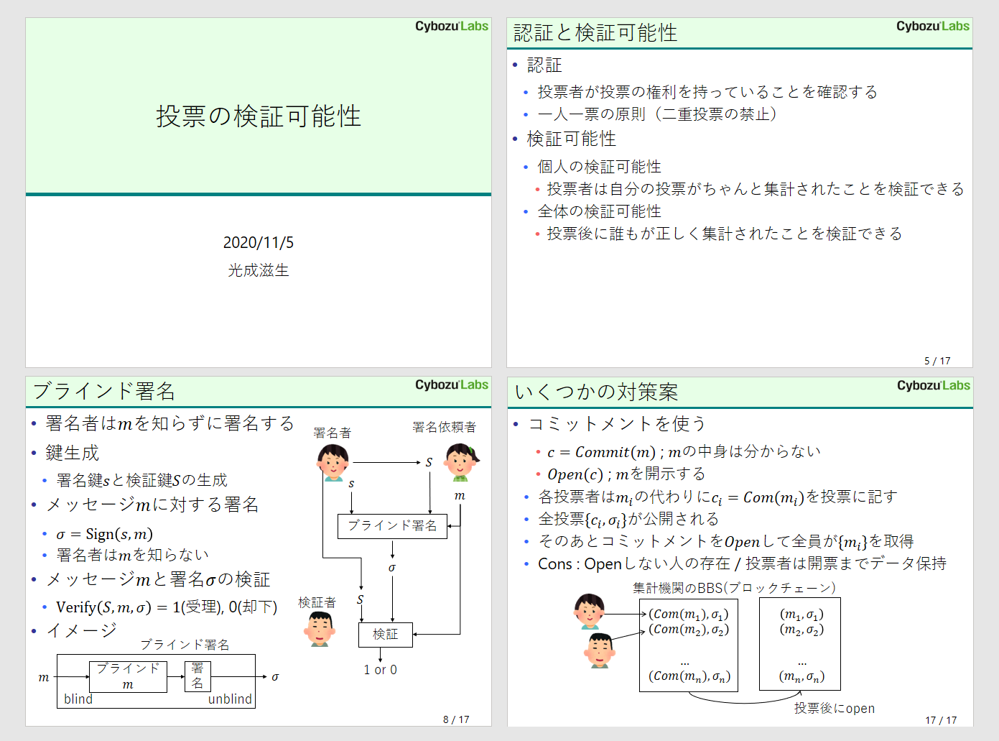
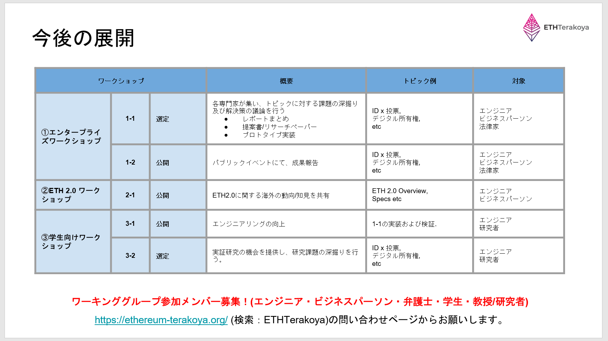

## 目次

1. ETHTerakoyaについて
2. インターネット投票の実現にむけて
3. インターネット投票で考慮するべき点
4. インターネット投票を取り巻く法律
5. インターネット投票のID認証とID情報の信頼性
6. 投票の秘匿性について
7. 投票の透明性/確認性について
8. 今後の展開について

## 登壇者一覧

- 株式会社富士通研究所

  - 堀井 基史

- 株式会社日立製作所

  - 長沼 健

- 株式会社アクト

  - 浅井 延幸

- 株式会社ケンタウロスワークス / 早稲田リーガルコモンズ法律事務所

  - 稲村 宥人

- サイボウズ・ラボ株式会社

  - 光成 滋生

- CollaboGate Japan 株式会社

  - 栗原 宏平

- 株式会社コンプス情報技術研究社 / 株式会社オルツ

  - 西村 祥一

* クーガー株式会社（主催）

  - 石井 敦
  - 石黒 一明

## ワークショップ内容

### 1. ETHTerakoyaについて

クーガー株式会社｜石井 敦

<!--

ファイルダウンロードは<a href="./images/1_terakoya-workshop-introduction.pdf">こちら</a>

-->
ETHTerakoyaでは、テーマを特定し、課題の深掘り及びブロックチェーンの活用に向けたディスカッションを行ってきた。ビジネス・技術・法律など、複数の視点から検討し、標準化仕様の策定を目指す活動である。

今回は「IDx投票xブロックチェーン」をテーマとした。
アメリカでの選挙集計の不正疑惑も取り沙汰される中、ブロックチェーンを用いた投票について、有識者間で検討した内容を公開する。

### 2. インターネット投票の実現にむけて

CollaboGate Japan 株式会社｜栗原 宏平

日本では、これまで旧態依然とした行政オペレーションが続いていたが、マイナンバーカードの発行を起点に、デジタル政府を目指そうとする動きが始まっている。
投票は民衆主義の一丁目一番地として、取り組みを進めるべきと考えている。

インターネット投票と類似した概念に「電子投票」があるが、投票者が投票所まで行き、システム機器で投票を行わなければいけないなど、利便性の面で制度が追い付いていない状況である。

諸外国での導入・検討状況とも比較しながら、日本での導入実現への可能性を検討した。

### 3. インターネット投票で考慮するべき点

株式会社アクト｜浅井 延幸

インターネット投票の運営に際しては、現行の紙の選挙運営でも注意すべき観点に則り、検討を行う必要がある。また、業務としても選挙人名簿の作成に始まり、開票・集計まで、検討すべき対象は多岐に渡る。

考慮すべき範囲は定常業務に留まらない。緊急時対応計画（コンティンジェンシープラン）も予め用意していく必要がある。

インターネット投票は新規に導入することとなるため、現行である紙の投票と比較して優位であることを訴求できなければならず、検討が必要となる。

### 4. インターネット投票を取り巻く法律

株式会社ケンタウロスワークス / 早稲田リーガルコモンズ法律事務所｜稲村 宥人

インターネット投票の検討においては、現行法下では憲法・公職選挙法、および公職選挙法の特例法に関係するため、要件を確認したうえで対策を検討する必要がある。
現行法下で要求される要件のうち「特定の場所（＝投票状況を確認する第三者のもと）に赴いて」投票をするという要求が重く、インターネット投票でも第 3 者の確認が必要とすれば、導入の障壁は高い。

現行法ではインターネット投票の導入は難しいため、法改正への取り組みを進める必要がある。
対象とすべき法規、改正の方針について考察を行った。

### 5. インターネット投票のID認証とID情報の信頼性

株式会社日立製作所　｜長沼 健

インターネットを通じた遠隔での電子投票において、本人認証は重要なテーマである。
現存する本人認証技術を分類し、評価することで社会実装への示唆を提供できると考えている。
評価項目は、投票業務における要件・課題から洗い出し、7項目のマトリクスを作成し評価を行った。

---

株式会社富士通研究所｜堀井 基史

なりすまし投票や多重投票を防止し、一人一票の原則を維持しながら投票を運営するためには、投票者のID情報の信頼性を担保する必要がある。
マイナンバーカードを主体として、＋αの情報を用いることで多要素認証を行い、信頼性を高める可能性を検証する。
候補となる情報群に対し、金銭的コストや情報の信頼性などの評価軸を設けることで評価を行った。

### 6. 投票の秘匿性について

株式会社コンプス情報技術研究社 / 株式会社オルツ｜西村 祥一

投票の主要な要件として、「秘密投票」というコンセプトがある。投票者の匿名性・投票の途中経過の秘匿性などが論点となる。
ブロックチェーンを投票に用いる場合、秘匿技術においては高い成果を期待ができるが、コスト面も考慮する必要がある。

単純Commit/Reveal方式、Open Vote Network、クーガー社で開発を進めているCREAMについて取り上げ比較を試みた。

---

クーガー株式会社｜石黒 一明

ブロックチェーンを用いて開発した秘匿化プロトコル「CREAM」について、仕様の共有および投票への活用可能性を検討したい。CREAMはERCコインを使用した匿名での投票を可能としており、「Confidential Reliable Ethereum Anonymous Mixer」の略称である。
当WS以降も、投票終了までは投票結果を秘匿することを目的としたバッチ実装など、version2の開発を進めていく。

### 7. 投票の透明性/確認性について

サイボウズ・ラボ株式会社｜光成 滋生

これまでの議論を踏まえ、情報提供者を特定することなく情報提供者の情報を集約することを目的として、投票の検証可能性を検討したい。

具体的には、ブラインド署名や準同型暗号、Mix-Net等に触れ、現実的な技術実装方法を探る。

### 8. 今後の展開について

クーガー株式会社｜石井 敦

今後は以下の枠組みで検討を進める。
1. エンタープライズワークショップ
2. ETH 2.0 ワークショップ
3. 学生向けワークショップ

特定テーマを深堀し、社会実装の可能性を追求する試みは継続しながらも（1）、広く海外の知見も取り入れ（2）、学生の育成を通じ社会の発展に貢献すること（3）を目指す。

上記の試みに関し、ワーキンググループの参加者を募集している。
ブロックチェーンの実装を行うエンジニアや、特定業界の知識を持つビジネスパーソン、関連法規を把握した弁護士など、幅広いメンバーを迎え、更なる検討を進めたい。

