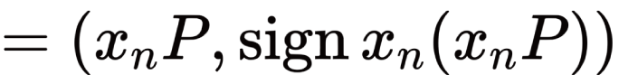
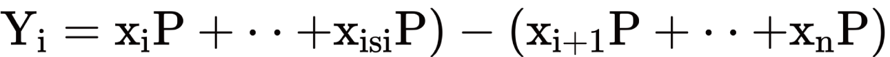
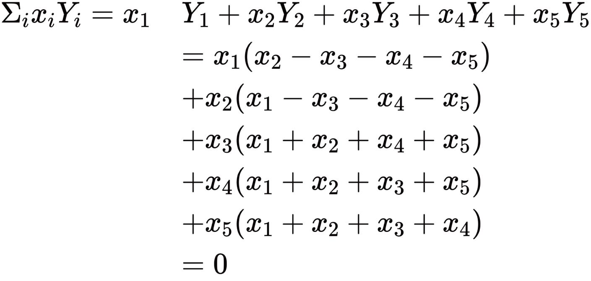
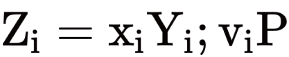

## 目次

- 1.Executive Summary
- 2.Introduction
- 3.Details
  - 3.1 選挙の仕組み| 小林 智彦/ 株式会社アクト
  - 3.2 インターネット投票の問題点 | 光成　滋生/ サイボウズ・ラボ株式会社
  - 3.3 秘匿化投票を可能にする CREAM について| 石黒　一明/ クーガー株式会社
  - 3.4 投票システムの要件とブロックチェーン技術| 西村　祥一/ 株式会社コンプス
  - 3.5 インターネット投票を実現する際の法律上のポイント| 稲村　宥人/ 早稲田リーガルコモンズ法律事務所
- 4.Conclusions

## 参加者一覧

- 富士通研究所

  - 今井 悟史
  - 堀井 基史

- 日立製作所

  - 江丸 裕教
  - 長沼 健
  - 齊藤 紳一郎

- アクト

  - 小林 智彦
  - 浅井 延幸

- ケンタウロスワークス / 早稲田リーガルコモンズ法律事務所

  - 河﨑 健一郎
  - 稲村 宥人

* サイボウズ・ラボ

  - 光成 滋生

* コラボゲート

  - 栗原 宏平

* コンプス / オルツ

  - 西村 祥一

* クーガー（主催）
  - 石井 敦
  - 石黒 一明
  - 佐々木 俊平
  - 辰巳 ゆかり
  - 石田 謙太郎
  - 田中 滋之

## 1. Executive Summary

- マイナンバーもインターネット投票への適応を前提としている。一方で、技術的に求められる要件レベルは高く、実運用の現実的なマイルストーンを精査する必要がある。
- インターネット投票の実現ツールとして、ハードウェアにおいてもセキュアな仕組みを求める必要がある。
- 現在の投票で実現できている「信頼性」を前提に、インターネット投票で必要な要件を定めることが重要。
- インターネット投票の実現のための法改正には、立法事実が認められるだけの理由が必要になる。

## 2. Introduction

選挙は長い歴史を持ち、憲法で求められる要件も多い。インターネット投票という新しい仕組みを取り入れた場合に、求められる技術的要件を整理していく必要がある。

今回のワーキンググループでは、技術・法律の両観点から、投票の前提要件、及びインターネット投票を実現する上での課題の整理を行った。

## 3. Details

### **3.1 選挙の仕組み| 小林 智彦/ 株式会社アクト**

**1.1 選挙の流れ**

1. **選挙人名簿の作成**

準備段階として、選挙を行う人の名簿を作成する。作成のタイミングは様々。選挙直前に行う場合も、余裕をもって作成する場合もある。作成のタイミングに厳密な取り決めはなく、自治体の方針によって異なっている。

- **選挙人名簿の作成方法**
  各自治体の住基システムから、選挙権を持つ住民を取り込んで名簿を作成する。名簿は作り切りではなく、選挙期間中は少なくとも 1 日に 1 回は更新されなければならない。なぜなら、選挙期間中に引っ越しなどで居住区が変わる可能性もあるため、選挙期間中の名簿情報は常に最新のものである必要があるからだ。また名簿の作成自体は選挙の有無に関わらず、約 3 ヶ月のサイクルで作成を続けている。

**② 当日投票以外の対応**

- **不在者投票**
  入院などの理由で本人が投票に来られない場合、一時的に遠方にいる場合などは、不在者投票が可能である。入院患者の場合は病院が代理で郵送を行っており、その作業には 1 件毎に 1,000 円程度の費用が発生している。

- **期日前投票**
  スケジュールの問題などで当日の投票が出来ない場合に利用されるのが、期日前投票である。期日前投票は投票者本人が期日前投票所まで直接行き、投票するものである。

- **在外投票**
  仕事や留学などを理由に国外にいる選挙人のための投票方法であり、現地の大使館で投票が行われる。在外投票の場合、大使館での投票後に日本への郵送手続きが行われるためにタイムロスがあり、選挙期間中に日本に届かないという問題もある。選挙期間を過ぎて投票されたものは当然無効となってしまう事から、インターネット投票の実現が最も望まれている分野であると考えられる。

③ 当日投票

選挙人は事前に郵送された投票所入場券を持参し、指定された投票所で投票を行う。選挙管理委員は事前に選挙人名簿を細分化し、必要な分だけを各投票所に設置して受付を行っている。

**④ 開票**

現在の開票は投票箱を体育館などに集め、手作業で行っている。開票は非常にアナログな作業が続いている。

**1.2 現行作業の問題点**

現行の投票システムについての問題点として以下の物が挙げられる。

- 低い投票率。
  - 高齢者や障がい者といった体の不自由な人でも投票所に行く必要がある。
  - 地方の場合は家から投票所まで距離が遠く、時間がかかる。
  - 投票所が開いている時間に行かなくてはならない。
  - 不在者投票は性善説に基づいた運用で行われている。
- 開票作業が手作業のため、ミスが起きやすい。
- 手作業はコスト、工数が大きい。
- 毎回オンプレミスの環境構築による大きな費用がかかる。
- 無線通信の運用が困難である。

**1.3 総務省の方針**

総務省としても現状の投票システムは問題があると認識しており、今後投票システムを改善していく方針を打ち出している。しかし、総務省から提出された現状の仕様は、かなり多くの要件が盛り込まれており、本当に必要な要件は何かを考えていくことが重要である。

**1.4 インターネット投票への期待**

選挙システムの前提条件は以下であり、これらの条件は選挙において必ず守られなくてはならない。

- 秘密投票(誰に投票したか知られない)
- 平等投票(投票権を持つ選挙人は等しく投票ができる)
- 直接選挙(議員および自治体の長を選挙人の投票で決める)

前提条件を満たした上でインターネット投票が実現すると以下のメリットがあげられる。

- 開票作業のミス撲滅
- 不明評の消滅
- 受付作業のミス低減
- 事務作業の時間短縮、費用削減

インターネット投票により、人為的なミスは無くなり、時間効率が大幅に改善されることが期待できる。しかし、インターネット投票を行うにはシステム障害が起こった場合の対策を十分に備えておく必要があり、仮に障害が起きても選挙を続けられることが求められる。

### **3.2 インターネット投票の問題点 | 光成　滋生/ サイボウズ・ラボ株式会社**

電子投票では自分の投票の中身を他人に知られることなく、投票を行い、集計される必要がある。そのために、考慮するべき点は下記である。

① 機密性(投票内容を誰にも知られない)

② 真正性(投票内容が改竄されない)

③ 認証(投票者が正しい投票権を持っているか、二重投票ではないか証明できる)

④ 検証可能性(投票者が自分の投票が集計されている事を確認できる)

上記の条件は以下のアプローチやそれを組み合わせることで実現できる。

① ブラインド署名(投票内容を伏せたまま管理者に署名してもらう)

②Mix-net(全員の投票を伏せたままかき混ぜる)

③ 準備型暗号(投票内容を伏せたまま集計する)

**ブロックチェーンを活用した電子投票**

すでに Ethereum を用いた電子投票は行われている。レポートによると、投票は 40 人程度の小さい規模で行われ、公開掲示板としてブロックチェーンを利用した。投票者には事前に ID が割り振られており、投票権はブロックチェーンとは別のところで確認する仕組みとなっている。

このような自己集計投票システムの利点と欠点は以下である。

**利点**

- 全員投票が終わったら誰でも集計結果を確認できるオープンな手続きが可能
- 信頼できる集計者を仮定しなくても良い
- 誰もが投票結果の正しさを検証できる

**欠点**

- 最後の投票者は他の人よりも早く集計結果を知る事ができ、もしも集計結果が良くなかった場合に集計を中止する事ができてしまう

この投票システムのメインアルゴリズムには OpenVote が使われた。OpenVote の仕組みを以下で説明する。

**記号説明**

N : 投票者数

P : 楕円曲線のある点

ui : 投票者

xin: 投票者 Unの秘密鍵

xiP : 投票者の公開鍵

Sign xi(m) : xiによるメッセージ m の署名

BBS : 公開掲示板

**計算式**

各投票者 Ui は XiP に署名して BBS に書き込む。

BBS に書き込む場合に各々が公開鍵を記入するが、その時に使用する公開鍵は自身の秘密鍵を P の値に掛けた物(XnP)が公開鍵となる。そして全員が書き込みの正しさを検証するために以下の式で Yiという数値を取る。

**xiと Yiの関係**

xiと Yiの関係で重要なのは自分の作った秘密鍵と Yiの値を掛けた数字を足していくと最終的に 0 になるという点である。

**各 uiによる ZKP の検証**

xiと Yiの数値が取れたら ZKP の検証を行う。ZKP は vi = 0(no)or1(yes)を示すためのもので、xiが秘密である事から viは原則本人にしかわからない状態である。本人のみが知る viの値を用いて Ziの数値を取る。

**集計**

ZKP の検証終了後、初めて集計に入る事ができる。全ての人が Zi を書き込めば誰でもその和を集計する事ができる。また、集計は Zi の値を全て足していくだけであり、計算は非常に簡単なものとなっている。さらに結果は 232程度ならば数ミリ秒で出す事が可能である。これらのアルゴリズムは 10 年前から提案されており、3 年前から実装が始まっている。

**2.3 今後の改善点**

自己集計投票システムの欠点は、最後の投票者による集計の妨害が可能である点であることは先述した通りである。最後の投票者が Zi の値を故意にアップロードしなかった場合、検証が不十分となり、集計が行われなくなってしまう。

不正な集計妨害に対して現在提案されている改善案として、預り金の導入が検討されている。検証が終わってから全ての投票者は Ziと ZKP を書き込むが、もしも書き込まれなかった場合には預り金が没収されるシステムである。しかし、現段階では預り金額の決定ロジックが確定されていない。

---

**長沼**
紹介された投票システムは 1 か 0 の二択だが、3 つ以上の候補から選択できる投票システムの研究は行っているか。

**光成**
おそらく行われている。今回紹介した内容は初期値での実装がメインであり、パラメータを動かせば不可能な作業ではない。

**石黒**
BBS 書き込みの際はどのような想定となっているのか。

**光成**
イーサリアム自体で何かを計算させる訳ではなく、あくまで BBS はデータを保存するだけの場所となっている。

---

### **3.3 秘匿化投票を可能にする CREAM について| 石黒　一明/ クーガー株式会社**

投票で求められる前提を以下に定義し、各投票方式の利点・欠点を挙げていく。

**投票の前提**

① 投票と集計は改竄耐性が必須である

② 投票の内容は秘密に保持されなければならない

③ 投票の全プロセスは透明性が必要不可欠であり、公に検証可能であるべき

**紙投票の利点・欠点**

紙での投票はほとんどの作業が手作業となっており、それが一番の欠点と言える。

利点

① 大失敗しにくい
② 大規模攻撃を受けにくい

欠点

① 一元管理
② メールでの投票に抵抗のある改竄禁止
③ 不完全な文字、可読不可能、マークアップ不備など無効になる票がある

**電子投票の利点・欠点**

現状、電子投票は利点よりも欠点の面が大きい事から、今後もしばらくは紙による投票が続く可能性は高い。

利点

① 無効票を減らす

欠点

① デバイスの乗っ取り

② ネットワーク攻撃

③ ソフトウェア透明性の確保

**ミックスネットによる投票**

利点

① 秘匿性の確保
② 検証が可能

欠点

① ミキサートラストモデル
② 暗号化時のエラー
③ 攻撃検出難易度が高い

ミキサートラストモデルとは

① それぞれのミキサーは正直でなければならない
② キャスティング時の脆弱性があってはならない
③ ネットワークが崩壊してはならない
④ スイスでの実証実験でネットワークアタック

このような取り決めは、ミックスネット実装の障害となっている。

**3.2 電子投票を可能にする CREAM**

**電子投票は難しい**

電子投票を行うにあたって、公での監査が難しい点やユニバーサルデザインの不在など問題点は数多く残されている。そのような電子投票の問題を解決するために、秘匿化プロトコルである CREAM を実装した。CREAM は現在 Ethereum で使われているアプリケーションからヒントを得て作られており、秘匿化投票を可能にする事を目的としている。

**CREAM について**

CREAM とは

① 公開検証可能な

②zk-SHARK を利用した

③ 秘匿トランザクションミキサー

④ 投票に特化したプロトコル

プロトコルは非常にシンプルとなっており、以下の機能を備えている。

① ミキサーにお金を挿入/預ける

(一定の金額の単一トランザクションで行う事ができる)

② ミキサーからお金を引き出す

**CREAM オーバービュー**

まずクライアント側からサインアップを行うとデポジットが行われ、トークンがスマートコントラクトにロックされる。ロックが完了すると QR コードが発行されるので、その QR コードを用いて投票を行う。もしも QR コードが他人に漏れてしまった場合、なりすましでの投票が出来てしまうという問題がある。そのため、現状では端末で QR コードを持ち出すのではなく、紙に印刷して投票を行うことを想定している。

**3.3 今後考慮すべき課題**

今後考慮すべき課題しては以下の点が挙げられる。

① 正直なオペレーター

② 大規模な投票に対応できる適切なマークルツリーのサイズ

③ 選挙毎のトラステッドセットアップ

④ 信頼できるハードウェア

⑤ 適切なスケーラビリティ

⑥Gas ステーション

⑦ ユーザーへの使い方指導

技術的な課題以外にも、共謀や投票買収などの不正対応など、投票の仕組み全体のデザインが求められる。

---

**堀井**

信頼できるハードウェアの使用が必要との事だが、攻撃される事を想定しているのか。

**石黒**
攻撃への対策ではなく、ハードウェア自体の信頼度を高めるためである。トラステッドセットアップを作る際に PC で計算を行うが、分散して作業を行う場合に使用する PC の信頼度を検証できる方法が今後必要となってくる。

**長沼**
仮に候補者が投票所にいた場合、リアルタイムで自分への投票を確認される可能性はないか。

**石黒**
投票が終わる時間に、一斉にトランザクションを作る方法を用いれば回避できる。また、キャンディデイト自体がコントラクトを作る時にそのままデプロイするようになっている。

**西村**
例えば 11 番目に投票する場合、10 番目までの投票結果が見えてしまうという事なのか？

**石黒**
現状では見える仕様になっている。しかし、ブロックタイムの指定などで対応できると考えている。

---

### **3.4 投票システムの要件とブロックチェーン技術| 西村　祥一/ 株式会社コンプス**

投票の基本原理およびブロックチェーンの活用の例を挙げていく。

**機密性**

投票では、誰が誰に投票したのかが公表されるような事があってはならない。また、個人情報保護の観点から、人種や性別、年齢、個人の特定できないように個人情報を保護する必要がある。現行の公職選挙では無記名投票と投票箱の管理方法によって、投票内容と投票者の匿名性を実現している。この機密性に関しては、ブロックチェーンのスマートコントラクトを用いる事で実現が可能である。

**有権判定(一人一票)**

全ての有権者は一回の選挙において一人一票のみの投票が可能であり、権利を与えられた有権者のみが投票に参加出来る。現行の公職選挙では管理者の名前や住所、生年月日を口頭で伝えるだけで本人とみなされ、投票ができてしまうといった問題がある。ブロックチェーンでは Ethereum の署名真正性の検証と有権者リスト・投票履歴を使用する事で、有権者の判定や二重投票に対応する事が可能となっている。

**透明性と正確性**

透明性とは、全ての投票用紙は目に見える監視の下で数えられる必要があり、全ての手順、機器、プログラム、保管設備などは選挙前後に検査することなどで担保される。

正確性は全ての投票が正確に記録およびカウントされ、全てのカウント方法と結果が公にレビューされることを意味する。

現行の公職選挙では投票立会人や開票立会人を立てる事によって、透明性や正確性を実現できるようにしている。しかし、立会人を立てたとしても、人的ミスは発生する恐れがあるため、本当に透明性と正確性が担保されているのかという点には疑問が残る。

それに対して、ブロックチェーン技術は、情報の透明性や正確性の担保は得意分野といえるだろう。投票システムにブロックチェーンを用いた場合、全ての投票トランザクションはブロックチェーン上で公開される事になる。また、投票システムのロジックもブロックチェーン上で公開され、改竄や再設定を行う事は不可能になる。しかし、ブロックチェーンの透明性の高さは秘匿性と相反することから、透明性と秘匿性を両立の実現が求められる。

**信頼性**

投票における信頼性とは、投票機器とプロセスが明確であり、かつ正確であることを意味する。選挙期間中の機器の故障や、人為的なトラブルが起きない様にしなければならない。ブロックチェーンでは、十分なノードが稼働していれば、機器が故障してもスマートコントラクトが止まる事はないため、信頼性の高い運用が可能だと言えるだろう。

**今後の課題**

今後の実装を考えていく際、これらの要件は本当に必要あるのか、といった点から考えるべきである。また、他にも必要な要件がないか考えなくてはならない。

その先には、個別の要件に対する詳細な要件項目が多くある。例えば、機密性では何を秘密にするべきか、公開すべきものは何かといったことや、有権判定では有権者の本人性の確認はどこまで求めれば良いかなど、検討するべき課題は数多く残っている。

---

栗原

信頼性はシステムそのもの、またはシステムの運営者どちらを対象としているのか。

**西村**
信頼性が求められるのは投票機器とプロセスであり、プロセスの中には運営者も含まれている。ブロックチェーン上に乗せた場合には実際に動くコードを指す事になる。

栗原

運営者に対しての信頼性の場合、信頼性の設計が非常に難しいと思われるがどの様に設計していこうと考えているのか。

**西村**
まずは現行の選挙での信頼性において、どのような改善点が求められているかを確認する必要があると考えている。

---

### **3.5 インターネット投票を実現する際の法律上のポイント| 稲村　宥人/ 早稲田リーガルコモンズ法律事務所**

インターネット投票を実現するにあたって、現行法の改正が求められる。その中で、法律の改正には何が必要かを整理する。

① 立法の根拠となる立法事実

法律を成したり、変更したりするにはそれなりの理由(立法事実)が必要である。

Ⅰ 既存の法令による規制が現在の技術水準からみて著しく不合理である

Ⅱ 新しい技術が誕生した事で、当該技術に対応したルールが必要となった

Ⅲ 従来想定していなかった問題が顕在化し、問題解決が必要となった

投票に関する法律において考慮するべき点を考える。選挙権の源泉である「参政権」は国民主権の本質そのものであり、憲法上の要請が既にいくつか存在している。そのため、憲法を改正するとしても当該憲法上の要請に適う法律である必要がある。参政権にまつわる憲法上の要請は以下である。

① 普通選挙

憲法第 15 条第 3 項に「公務員の選挙については成年者による普通選挙を保証する」といった内容がある。

② 選挙人資格の差別の禁止

憲法第 44 条に「両議院の議員およびその選挙人の資格は、法律でこれを決める。ただし人種、信条、性別、社会的身分、門地、教育、財産又は収入によって差別してはならない」という要請がある。

③ 投票の秘密

憲法第 15 条第 4 項に「すべての選挙における投票の秘密は、これを侵してはならない。」といった要請がある。秘密とは個人情報は当然だが、投票の実施有無情報も含まれている。自治体は投票者を把握しているが、漏洩を抑止する法律によって秘密が守られている。

④ 選挙の効力

憲法第 43 条第 1 項は「両議院は全国民を代表する選挙された議員でこれを組織する」としており、憲法第 93 条第 2 項にて「地方公共団体の長、その議会の議員及び法律の定めるその他の議員は、その地方公共団体の住民が直接これを選挙する」とされている。

このように、選挙に関しての要件が憲法で定められてはいるが、憲法の定めというものは非常に抽象的かつ曖昧であり、解釈の余地が多く残されている。したがって、実際にはこの定めの中でどこまで保証すべきなのか、どこまで守る必要があるのかという事に関しては解釈が必要である。

例：成年者=20 歳を意味するとは限らず、「ある一定の年齢を超えた人間」の解釈を変えれば、10 歳や 50 歳を成年者のラインにする事も可能。

**5.2 投票関連法制における憲法上の要請**

選挙関連の法改正を行う際、前述したような憲法上の要請に対して対応する必要がある。対応する場合、おおまかに以下の 3 点を盛り込む必要があるだろう。

① 可能な限り多くの人が使用可能なシステム設計であること

② 投票の秘密が守られるものであること

③ 適法な選挙が実施できるように安定性、冗長性が確保されること

過去に可児市議会議員選挙で電子投票が行われた際に、システムエラーが発生していたにも関わらず選挙を続行したところ、冗長性・安定性の欠如という理由で選挙が無効となった事例がある。

次に公職選挙法に定めのある投票方法をあげる。

- **期日前投票**

法定の事由がある場合に選挙期日前に投票を行う事が出来る制度。

投票は市町村の選挙期日管理委員会が設置した期日前投票所で行う。

- **不在者投票**

法定の事由がある場合に選挙期日前に郵送で投票を行う事が出来る制度。

投票は最寄りの不在者投票管理人のもとで投票用紙に記入し封筒に封入。

- **在外投票**

在外選挙人名簿に登録されている人が国外において投票を行う事が出来る制度。

投票は在外公館の長が管理する施設にて投票用紙に記入し封筒に封入。

投票の秘密保持のために、いずれの方法でも必ず中立的立場の第三者が所在しなくてはならない。

**5.4 電子投票法上の基準**

現状で電子投票を行う上で必要とされている要件は電子投票法第 4 条にて要請されている。

① 選挙人が一の選挙において二以上の提案を行う事を防止できるものであること

② 投票の秘密が侵されないものであること

③ 電磁的記録式投票機の操作により公職の候補者のいずれを選択したかを電磁的に記録する前に、当該選択に係る公職の候補者の氏名を電磁的記録式投票機の表示により選挙人が確認することができるものであること

④ 電磁的記録式投票機の操作により公職の候補者のいずれを選択したかを電磁的記録媒体に確実に記録することができるものであること

⑤ 予想される事故に対して、電磁的記録式投票機の操作により公職の候補者のいずれかを選択したかを記録した電磁的記録媒体の記録を保護するために必要な措置が講じられているものであること

⑥ 投票の電磁的記録媒体を電磁的記録式投票機から取り出せるものであること

⑦ 権限を有さない者が電磁的記録式投票機の管理に係る操作をする事が防止できるものであること

⑧ 前番号に掲げるもののほか、選挙の公正かつ適正な執行を害しないものであること

これらの要件はオンラインでの投票にも当てはまる項目である。憲法上では技術的な制約についての記載がないことから、今後はこれらの要件を全て満たすためにどの様な技術を使うべきかという議論が必要である。

**5.5 どの法律を改正すればよいのか**

法律上オンライン投票を新しい投票システムとして組み込むには以下のような選択肢が考えられる。

① 公職選挙法第 6 章に新たな投票として規定する

② 公職選挙法第 49 条第 1 項(不在者投票)の条項中、「不在者投票管理者の管理する投票を記載する場所において」との条項を削除の上、公職選挙法施行令にてオンライン投票を不在者投票の一方法として定める

③ 電子投票法の第 4 条第 2 項を削除するとともに、選挙の対象を国政選挙及び期日前投票に拡大する

④ オンライン選挙にかかる新法を制定する

電子投票を実現するには技術的な問題の他にも法律的な問題が絡んでくる。現在行われている選挙システムにも欠点はあるが、その欠点を補い、より正確なシステムであることが電子投票システムには求められる。現状ではまだクリアできていない課題は多く残っており、どのようにこれらの課題を解決していくべきなのか、議論を進めていく必要がある。

---

**西村**
投票の秘密とは具体的に何を意味しているのか。

稲村

一般的には投票への参加、不参加の情報が秘密にあたる。選挙への参加も不参加も国民の権利として認められているため、この情報が漏れてはならない。自治体は投票者の参加、不参加を把握してはいるが、情報を漏らした場合は犯罪行為として捕まるようになっている。

佐々木

選挙人名簿は自治体で作るという事なのか？また、選挙権の有無を電子的に認証しようとした場合はマイナンバーが必須となるのか。

稲村

選挙人名簿の管理は自治体が行っているが、名簿への登録は住民票で管理されているため、選挙権を有したら自動的に登録されるようになっている。電子認証にはマイナンバーを利用すると便利かと思うが、必須ではないと考える。

佐々木

選挙人名簿は現在自治体で管理されているが、企業などが管理を請け負う事も可能か。

稲村

企業が選挙人名簿を管理するには新たな法整備が必要となる。また、企業に業務を委託する場合に、扱う情報がセンシティブなため国民が納得するかという問題もある。

小林

現在、在外者向けのインターネット投票の実装実験を実施しているが、政府も導入を検討していると考えられるか。また、インターネット投票が可能となるのは在外のみになりそうか。

稲村

まずは在外のみのスタートになると考えられる。しかし、その後の法改正によっては、他の投票もインターネットで行える様になる可能性はある。また、実際にインターネット投票が行われる場合には中央集権的システムになると考えられるため、ブロックチェーンを活用するのであれば、どの様に実現するかを考えておく必要がある。

---

## 4. Conclusions

電子投票を実現するには技術的な問題の他にも法律的な問題が絡んでくる。現在行われている選挙システムにも欠点はあるが、その欠点を補いつつもより正確なシステムの構築が電子投票システムには求められている。現状ではまだクリアしきれていない課題は多くあり、今後どのように解決していくべきなのかを議論していく事が重要となってくる。
