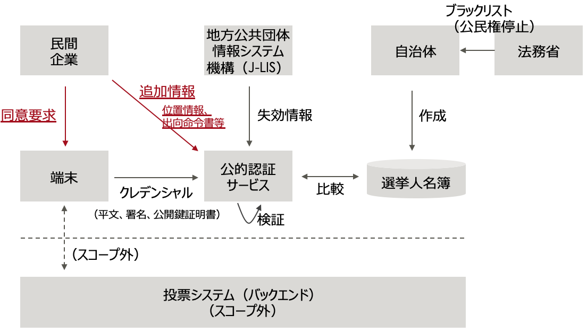
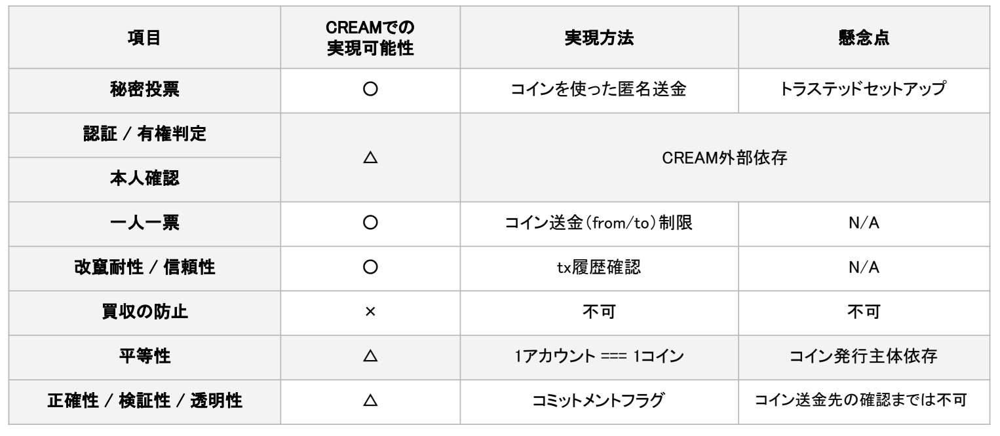
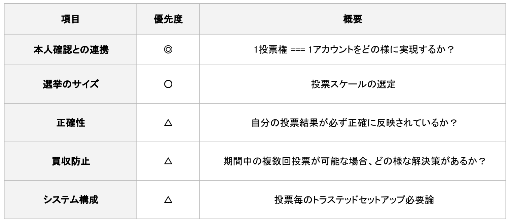
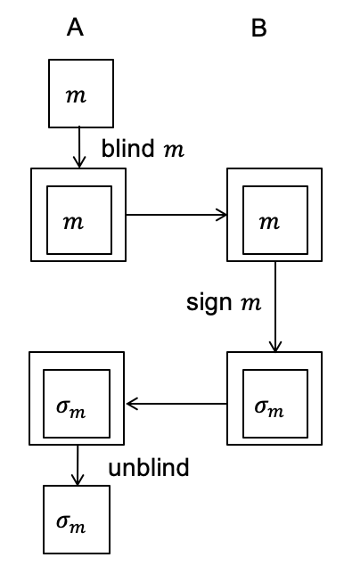
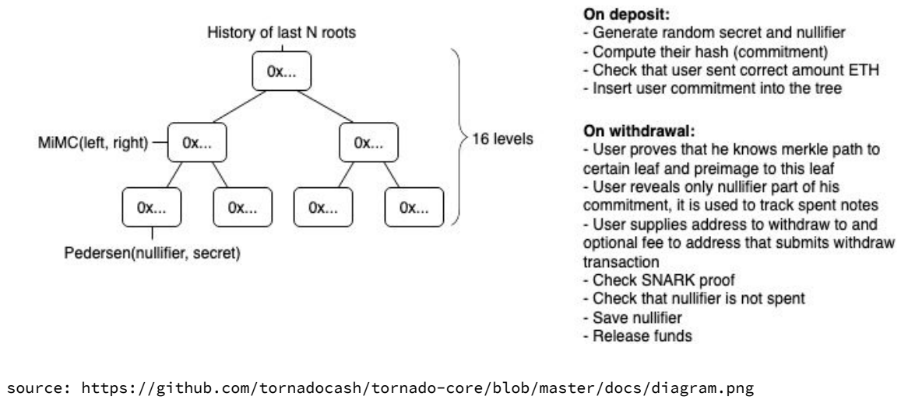

## Agenda

- 1.Executive Summary
- 2.Introduction
- 3.Details
- 4.Conclusions

## List of participants

- **Fujitsu Laboratories Ltd.**

  - Satoshi Imai
  - Horii Motoshi

- **Hitachi Ltd.**

  - Emaru Hironori
  - Ken Naganuma
  - Shinichiro Saito

- **Act Co., Ltd.**

  - Tomohiko Kobayashi
  - Nobuyuki Asai

- **Centaurus Works Inc. / Waseda Legal Commons Law Office**

  - Kenichiro Kawasaki
  - Hiroto Inamura

- **Cybozu Labs, Inc.**

  - Shigeo Mitsunari

- **CollaboGate Japan Inc.**

  - Kohei Kurihara

- **Comps Co., Ltd. / alt Inc.**

  - Yoshikazu Nishimura

* **VOTE FOR**

  - Mitsuru Ichinosawa

* **Couger Inc.**

  - Atsushi Ishii
  - Kazuaki Ishiguro
  - Shunpei Sasaki
  - Yukari Tatsumi
  - Kentaro Ishida
  - Shigeyuki Tanaka

## 1. Executive Summary

- In internet voting through voters’ own devices, ensuring the security of free will during voting is a significant challenge, and thus it needs consideration.
- There is a need to consider changes in the specifications of the existing polling stations and prepare contingency plans in case of malfunctions.
- To improve personal authentication accuracy, additional information from private companies is effective, but there are challenges, such as ensuring private companies’ reliability.
- There are technologies such as TEE to secure personal devices and apps used for internet voting, but there is a possibility that it might lead to a digital divide.
- Blind signature technology is considered to be effective in ensuring the secrecy of voting.
- With CREAM (blockchain-based voting application using Ethereum), secret voting can be achieved without any problems. Still, it is necessary to consider its linkage with identity verification and its potential for large-scale elections.

## 2. Introduction

The working group divided into three groups, and each group presented about the following after in-depth investigation and analysis:

**Group A: Requirements**

1. Implementable features of internet voting
2. Identifying the problems of internet voting

**Group B: Authentication technology**

1. Identity verification
2. Technology to prevent double voting

**Group C: Voting technology**

1. The potential of using blind signature technology in voting
2. Feasibility of Ethereum-based blockchain voting apps

## 3. Details

### 3.1 Topics in voting operations

**3.1.1 Implementable features of internet voting, by Mitsuru Ichinosawa, VOTE FOR**

1. Validity of polls. Proving that a vote is cast by the person himself/herself.
2. Secrecy of vote. Voting without others, especially management, knowing about the contents of the vote.
3. Security of free will. Being able to avoid vote buying and coercive voting. (Re-voting and repeatedly overwriting votes are not allowed as per the existing Public Offices Election Act.)
4. Equal opportunity to vote. Everyone can vote regardless of time and place.
5. Management safety. Being able to prevent leakage and tampering with voting content.
6. Accuracy of aggregation. The number of votes and the aggregate results must match.
7. Election fairness. Prove that the elections themselves are being held fairly.

Among these, the security of free will is a particularly tricky task in internet voting because the vote is cast in private. In addition to the above, it is also possible to analyze vital information, for instance, to make sure that you are not voting in an abnormal mental state. But, at the same time, it is necessary to think about various aspects of practicality.

**3.1.2 Identifying the problems of internet voting, by Nobuyuki Asai, Act Co., Ltd.**

Once internet voting is realized, existing polling stations would need to be scaled back, and their specifications changed. Nevertheless, polling stations would need to be continuously set up for people who have difficulty securing an internet voting environment or have trouble using electronic devices. Also, for the consistency of the voting system as a whole, it would be more suitable to vote via the internet than using paper even at the polling stations. Based on these assumptions, the following problems can be assumed:

1. Legal aspects
1. ting in the absence of voting observers: a point that was discussed in the previous WG. The law needs to be amended, or some kind of legal adjustment is required.
1. Under the current law, it is impossible to vote using the internet, so revision is required.
1. Systematic aspects
1. In the event of internet malfunction, voters would not be able to vote through their smartphones and computers, which may either cause long queues at the polling station or reduce the overall voter turnout. This might require internet voting to be allowed during a period such as one week before the election day, as is also the case in current early voting practices.
1. If a failure occurs immediately after a person votes on the internet, how do we know if the vote was completed successfully? For instance, this would require a ballot to be accepted at first and later confirm that it is not a double vote.
1. There might be other such problems that would require contingency plans.

**Discussion**
**Ichinosawa**: In the event of a system error, the voter may think that they have completed the vote, but in fact, it remains unfinished. During the demonstration experiment in Tsukuba city, the management had obtained email addresses, and the vote completion was conveyed to voters through email.
**Asai**: I think such a method is suitable for internet voting. However, there may be challenges such as how to inform through email those people who vote at polling stations but through internet voting. There might also be cases where, for instance, people with disabilities cannot process/receive emails.
**Inamura**: I think it is necessary to have a system that can separate data for each status such as "verified," "voted," "poll result sent," and "poll result was aggregated" if it is easily classified.
**Ishii**: While aiming for the ideal type of internet voting, I think that it is better in terms of risk reduction to also have a backup plan such as paper-based voting.

### 3.2 Discussion about the authentication technology

**3.2.1 Personal Authentication, by Ken Naganuma / Hitachi, Ltd.**

We would like to proceed with our investigation in the following way in the future:

1. The vertical axis contains a comprehensive list of the methods of personal authentication.
2. On the horizontal axis, evaluation items, e.g., ease of operation, forgery resistance, etc. are set, and each personal authentication method will be examined and judged as being good or bad.

**3.2.2 Technology for preventing double voting, by Motoshi Horii / Fujitsu Laboratories Ltd.**

To perform authentication/authorization/identity verification "correctly,” we investigated the following technologies that can be utilized:

1. Use additional information to increase the strength of personal identification.
2. Make apps that work on the devices more secure.

Requirements:

Diagram of the basic system

- The local government and J-LIS should be reliable.
- My Number card is used for personal authentication.
- A terminal is a computer that can read cards or a smartphone.

**Using additional information to increase the strength of personal identification**

1. In addition to personal authentication through the Individual Number Card, with the consent of the person, location information provided by a private company and temporary transfer information provided by the company where he/she works are also used for authentication.
2. Other related technologies include risk-based authentication, multi-factor authentication, and FIDO.
3. Information exchange methods include OAuth, attribute exchange (AX) by OpenID, Hyperledger Indy, and IDYX.

Challenges:

- The fact that the voting system relies on information from unrelated private companies.
- How to ensure the reliability of the private sector?

**Making apps on devices more secure**

Overseas case studies:

Voatz: An app for US troops deployed abroad to vote through their smartphones.

1. Was also used in West Virginia during November 2018.
2. Blockchain is being utilized in this mobile voting system.
3. Security experts have raised concerns such as:
4. The presence of vulnerability inside the app.
   2.Voting information may be tampered with.

=>Therefore, the device used for authentication and apps that work on them should be made more secure.

Certain technologies for creating a secure environment on the device may include:

1. TPM
2. Trusted Execution Environment（TEE）
3. Intel SGX, ARM, TrustZone etc.
   Others

Challenges:

- The issue of the digital divide: Should TEE (Trusted Execution Environment) be a requisite infrastructure for use in a variety of environments.
- TEE is also exposed to a variety of attacks, so how much risk can be tolerated? (e.g., side-channel attack)

**Opinion:**

**Ichinosawa**: There is a movement focused on connecting the My Number Card to one personal device (most likely a smartphone). If it is implemented, it is possible to use a personal device as additional information. But how about the level of security required for the device? In that respect, I think that our discussion here can be utilized.

### 3.3 Discussions on Voting Technology

**3.3.1 About the existing electronic voting, by Shigeo Mitsunari, Cybozu Labs, Inc.**

As discussed in the previous article, electronic voting techniques may contain one of the following techniques:

1. Blind signature (have the administrator to sign the ballot with the content of the vote hidden）
2. Mix-net (mix the votes with everyone's vote hidden)
3. Preparatory cryptography (aggregate with voting content hidden)
4. A combination of the above

Given that elections consist of centrally controlled operations, it seems that the blind signature technique may be a good match.

How blind signing works

1. Key generation: B generates a pair of signing and verification keys (𝑠,𝑆).
2. Blinding: A hides a message 𝑚 and sends a blind(m) to B.
3. Signature: B creates a sign (blind (m)) and sends it to A.
4. Unblinding: A receives unblind(sign(blind(m)) = sign(m).

Image of voting by blind signature

- Characters
  - Registration authority (has a signature key (private) and verification key (public)）
  - Voter
  - Aggregation authority
- Flow of voting

1. The registration authority will first verify the voter's identity. (Methods of identity verification are discussed in Group B)
2. The voter asks the registration authority to blindly sign the voting ballot while hiding the vote’s content. (𝑚,𝜎=𝑆𝑖𝑔𝑛(𝑚,𝑠))
3. The voter sends the voting ticket to the counting system.
4. The counting system verifies the signature of the voting ticket and counts it.

Challenges:

- This time, we are considering that the registration body will not cheat, but if fraud prevention measures are required, a method of blind signature by multiple registration authorities can be considered.
- To cut the link between voters and (𝑚,𝜎), a secret communication that hides the identity is required.
- It may also be possible to use a public bulletin board (BBS) that does not take an IP address or require a login instead of an aggregation agency.
- In the case of blind voting, one principle of voting, which is quite challenging to implement in the current system of elections, is the possibility of verification (voters can verify if their vote has been counted or not) can be implemented in electronic voting.
  - Let 𝑚 = high-order bit appropriate random number 𝑟_𝑖 (vote).
  - Personal verifiability: Verify that BBS has my own 𝑟_𝑖.
  - Overall verifiability: Making sure all BBS 𝑟_𝑖 are different.

\*:3.3.2 Potentialities and limitations of the blockchain-based voting application CREAM, by Kazuaki Ishiguro, Couger Inc.\*\*

**(Reiteration Of previous discussions)**

What we want to achieve with CREAM:

1. Secret ballot/confidentiality: Confidentiality of who voted for which candidate
2. One person, one vote: Prevention of double voting
3. Tamper resistance/reliability: Confirmation that the ballot box is empty / Proof that the voting content has not been tampered with.
4. Prevention of vote-buying
5. Equality: Ensuring voting opportunity for all voters

About CREAM

CREAM is an application of the method of zero-knowledge proof of cryptography used in "Zcash," etc. that is run on a public blockchain while keeping information such as the sender’s and receiver’s address and the sent amount secret.

Voting steps

1. Reception phase
2. Voting contract receives a deposit of coins
3. Call the voting contract from an account (or relayer) other than when depositing, and withdraw to another account.
4. Manage withdrawal history on the contract side to prevent double voting.

**Feasibility**

※ Supplement
Regarding accuracy, verifiability, and transparency, it is possible to check double voting and verify whether my hash has been reliably used but not verifying whether my vote has been correctly counted and given the sign △.

**Challenges**

※ Supplement

- Election Size: It needs to be investigated how long it would take to process millions of votes if we were to run a batch transaction, and assuming that the progress of the vote should not be revealed?
- Preventing vote buying: Multiple voting = Being able to change vote content
- System configuration: With PLONK, etc., it is possible to prove zk-SNARKs multiple times in a single setup = Universal Trusted Set-up

**Architecture proposal for realization of concealment**

## 4. Conclusion

Each group clarified the issues assigned. Likewise, we will continue to investigate and discuss the proposal and proceed with the proposal’s materialization.
