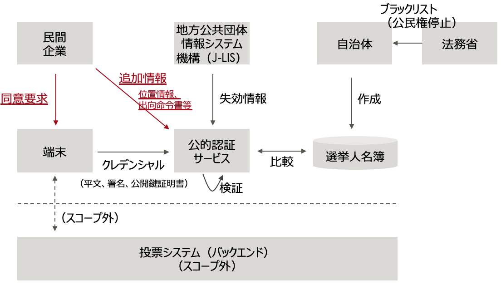
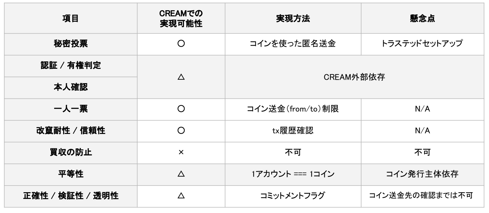
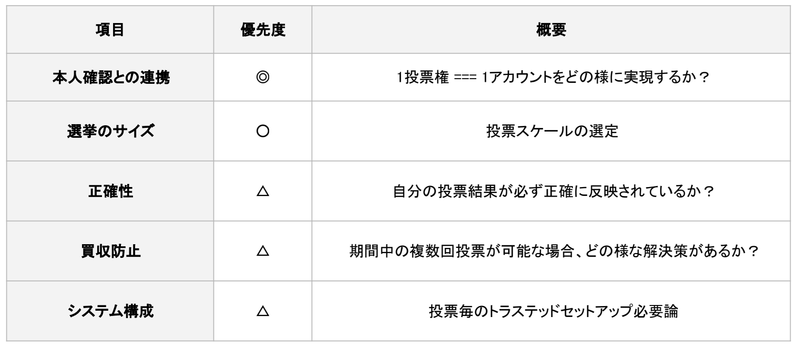
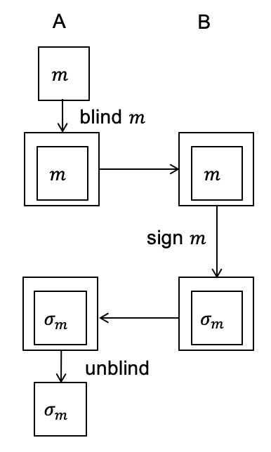
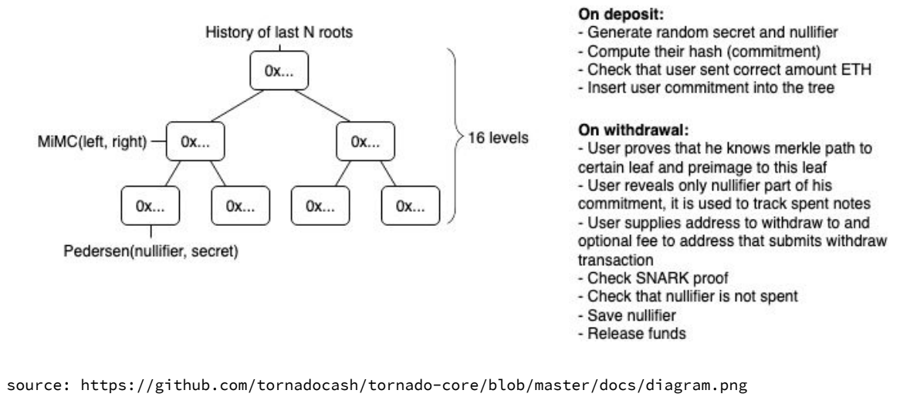

## 目次

- 1.Executive Summary
- 2.Introduction
- 3.Details
  - 3.1 投票業務における議論
  - 3.2 認証技術における議論
  - 3.3 投票技術における議論
- 4.Conclusions

## 参加者一覧

- 富士通研究所

  - 今井 悟史
  - 堀井 基史

- 日立製作所

  - 江丸 裕教
  - 長沼 健
  - 齊藤 紳一郎

- アクト

  - 小林 智彦
  - 浅井 延幸

- ケンタウロスワークス / 早稲田リーガルコモンズ法律事務所

  - 河﨑 健一郎
  - 稲村 宥人

* サイボウズ・ラボ

  - 光成 滋生

* コラボゲート

  - 栗原 宏平

* コンプス / オルツ

  - 西村 祥一

* VOTE FOR

  - 市ノ澤　充

* クーガー（主催）

  - 石井 敦
  - 石黒 一明
  - 佐々木 俊平
  - 辰巳 ゆかり
  - 石田 謙太郎
  - 田中 滋之

## 1. Executive Summary

- 個人端末によるインターネット投票において、「自由意思の担保」は大きな課題であり付属情報を用いることも考えられるが、実用性を含め検討する必要がある。
- 投票業務においては、既存の投票所の仕様変更・障害時のコンチプランなどの検討が必要である。
- 本人認証の精度をより高くするために、民間企業からの「追加情報」が有効だが、民間企業の信頼性をどう担保するかといった課題がある。
- インターネット投票を行う個人端末およびアプリケーションをセキュアにするために TEE などの技術があるが、それによってデジタルデバイドが生じてしまう可能性もある。
- 秘密投票を実現する技術としては、ブラインド署名が有効だと考えられる。
- CREAM（イーサリアムを使ったブロックチェーン投票アプリケーション）を使った場合、秘密投票は問題なく実現できるが、本人確認との連携や、どの程度の規模の選挙に対応できるかといった点で検討が必要である。

## 2. Introduction

WG メンバーが、グループ A（業務）・グループ B（認証技術）・グループ C（投票技術）の 3 グループに分かれ、それぞれが以下の方向性で、詳しい調査結果・検討内容を発表した。

**グループ A（業務）**

1. インターネット投票を実現する上での仕様のあるべき姿
2. インターネット投票の問題点の洗い出し

**グループ B（認証技術）**

1. 本人認証
2. 替え玉を防止するための技術

**グループ C（投票技術）**

1. 既存の電子投票
2. イーサリアムを使ったブロックチェーン投票アプリケーション（CREAM）で実現出来ること出来ないこと

## 3. Details

### 3.1 投票業務における議論

**3.1.1 インターネット投票を実現する上での仕様のあるべき姿 | 市ノ澤 充/株式会社 VOTE FOR**

インターネット投票を実現するには、以下の項目が担保される必要がある。

1. 投票の正当性 投票権者本人による投票であることを証明できる。
2. 投票の秘密の保全性 投票内容を周囲に知られずに投票できる。また、管理者は投票の有無は管理できるが個別の投票内容を知ることはできない。
3. 自由意思の担保 買収・強要等による不本意な投票を回避することができる。（再投票・上書き投票＝公職選挙法上は不可）
4. 投票機会の平等 誰もが、時間と場所にとらわれずに投票することができる。
5. 管理の安全性 投票内容の漏えいと改ざんを防ぐことができる。
6. 集計の正確性 投票数と集計結果が一致する。
7. 選挙の公正性 選挙自体が公正に行われていることを証明することができる。

「3.自由意志の担保」はリモートで行われるインターネット投票において特に難しい課題である。バイタル情報を分析し、異常な精神状態で投票していないかを確認するということも考えられるが、実用性という側面から見ると検討すべきテーマが多い。

**3.1.2 インターネット投票の問題点の洗い出し | 浅井 延幸/ 株式会社アクト**

インターネット投票が実現すると、既存の投票所は規模の縮小および仕様の変更が必要になると考えられる。前提として、投票所はインターネット投票のための環境確保が難しい人や、電子機器の利用に難がある人向けに継続して設置する必要があると考えられる。また、投票システム全体の整合性を踏まえると、投票所でも紙ではなくインターネットで投票を行うのが適切と考えられる。

その前提で、以下の問題点が想定される。

1. 法律に関わるもの
   1. 投票立会人不在での投票：前回までの WG でも議論になっていた点。法律の改正もしくは、技術による手当が必要。
   2. そもそも現行法では、インターネットを用いた投票は行えないため改正は必須。
2. システムに関わるもの
   3. ネットワーク障害により選挙人自身のスマートフォンなどで投票ができず、投票所に人が殺到する状態になる、あるいは投票率が著しく下がる。
      =>現行の期日前投票と当日投票のように、1 週間などの期間を設けて、その期間であればいつでもインターネット投票可能とする。
   4. インターネット投票を行った直後に障害が発生した場合、投票が確実に実行されたかどうか確認ができない。
      =>一旦、投票を受け付けておき、後で突合して二重投票になっていないか確認するなどの対応が必要。
   5. 想定される問題は他にも多くあると考えられ、念入りなコンチプラン（コンティンジェンシープラン=緊急時対応計画）の策定が必要。

**議論**

**市ノ瀬**：障害が発生した際に、選挙人自身は投票できたと思っているが実際には完了できないないというケースも考えられる。つくば市での実証実験の際は、メールアドレスを取得していたので、メールで投票完了を通知した。

**浅井**：インターネット投票においてはそういった方法は良いと思う。投票所でインターネット投票をした人にどうやって通知するか、障害でメールを受信できない場合どうするか、といった問題もあると考えている。

現状のコンチプランとしては、端末の調子が悪い場合は予備端末への切り替えの実施や、紙の選挙人名簿台帳を投票所に置いておき、紙ベースでも受付できるようにしておくなど、障害発生の際にも対応できるようにしている。インターネット投票でどこまでの対策が必要かはよく考える必要がある。

**稲村**：簡単に区分すると「本人確認した」「投票した」「投票結果が送信された」「投票結果が集計された」といったステータスごとにデータを分離しておけるようなシステムが必要になるのだと思う。

**石井**：インターネット投票の理想型を目指しつつも、非常に現実的なバックアッププラン（ここから先は紙で対応するといった）があるとリスク回避という点で良いと思う。

### 3.2 認証技術における議論

**3.2.1 本人認証 | 長沼 健/株式会社日立製作所**

以下の方針で調査を進めて行きたい。

1. 縦軸として、本人認証の手法を網羅的にリストアップする。
2. 横軸として、選挙に使うにあたっての評価項目（例：運用のしやすさ、なりすましのしづらさ等）を設定し、それぞれの本人認証手法の良し悪しを検討する。

**3.2.2 替え玉を防止するための技術 | 堀井 基史/株式会社富士通研究所**

認証/有権判定/本人確認を「正しく」行うために、以下の点で活用できる技術を調査した。

1. 追加情報を用いて本人認証の強度を上げる。
2. 端末で動くアプリをよりセキュアにする。

（前提）

・基本システム図

・自治体と J-LIS は信頼できるものとする。

・本人認証はマイナンバーカードを使用する。

・端末は、カードを読み取れる計算機、あるいはスマートフォンを使用する。

**追加情報を用いることで本人認証の強度を上げる**

1. マイナンバーカードによる本人認証に加えて、本人同意のもと、民間企業から提供された位置情報や勤務先企業から提供された出向命令書なども併せて、認証を行う。
2. 関連技術として、リスクベース認証、多要素認証、FIDO などがある。
3. 情報交換方式として、OAuth、OpenID による属性交換（AX）、Hyperledger Indy、IDYX などがある。

（課題）

- 投票システムが無関係な民間企業からの情報に依存することの是非。
- その民間企業の信頼性をどう担保できるのか。

**端末で動くアプリをよりセキュアにする**

（海外事例）

Voatz：国外に派遣されている米軍などがスマートフォンから投票することができる

1. 2018 年 11 月にウェストバージニアで使われた。
2. モバイル投票システムにブロックチェーンを採用している。
3. セキュリティの専門家から懸念が指摘されている。
   1. 投票人のスマートフォンにインストールするアプリに脆弱性あり。
   2. 投票に関する情報が改ざんされる可能性あり。

=>認証で使う端末およびその上で動くアプリを、よりセキュアにすべき。

端末上にアプリが走行するセキュアな環境を作る技術としては

1. TPM
2. Trusted Execution Environment（TEE）
   1. Intel SGX、ARM、TrustZone など

などがある。

（課題）

- デジタルデバイド問題：さまざまな環境で使われるであろうインフラに対して、TEE を前提とすることの是非。
- TEE もさまざまな攻撃に晒されており、どこまでのリスクを許容してよいのか。（例：サイドチャネル攻撃）

**意見**

**市ノ瀬**：マイナンバーカードを個人の 1 台の端末（具体的にはスマートフォンを想定）に紐付けるような動きが出てきている。それが実現すれば、追加情報として個人の端末を用いることができる。その端末に求められるセキュリティレベルは何か？という点で、ここでの議論が活かせると思う。

### 3.3 投票技術における議論

**3.3.1 　既存の電子投票 | 光成　滋生/ サイボウズ・ラボ株式会社**

前回までのおさらいになるが、投票技術として以下手法が考えられる。

1. ブラインド署名（投票内容を伏せたまま管理者に署名してもらう）
2. Mix-net（全員の投票を伏せたままかき混ぜる）
3. 準備型暗号（投票内容を伏せたまま集計する）
4. 上記を組み合わせる

十分に議論したわけではないが、選挙は中央集権的な要素があることを踏まえると、「1.ブラインド署名」が相性がいいのではないかと考えている。

（ブラインド署名の仕組み）

1. 鍵生成：B は署名鍵と検証鍵のペア(𝑠,𝑆)を生成する。
2. ブラインド：A はメッセージ 𝑚 を隠して blind(m)を B に送る。
3. 署名：B は sign(blind(m))を作って A に送る。
4. アンブラインド：A は unblind(sign(blind(m))=sign(m)を得る。

（ブラインド署名による投票のイメージ）

- 登場人物
  - 登録機関（署名鍵（秘密鍵）𝑠 と検証鍵（公開鍵）𝑆 を持っている）
  - 投票者
  - 集計機関
- 投票の流れ

1. 登録機関が投票者の本人確認をする。（本人確認の手法は、グループ B での議論参照）
2. 投票者は投票内容を隠したまま、登録機関に投票券に対するブラインド署名をしてもらう。(𝑚,𝜎=𝑆𝑖𝑔𝑛(𝑚,𝑠))
3. 投票者は投票券を集計機関に送る。
4. 集計機関は投票券の署名を検証して集計する。

（課題）

- 今回は登録機関は不正をしないという前提で検討しているが、もし不正防止策を必要とするならば、複数の登録機関によるブラインド署名という方法を考える必要がある。
- 投票者と(𝑚,𝜎)の関連を切るために、身元を隠した秘密通信が必要。
- 集計機関ではなく IP アドレスを取らない/ログインが不要な公開掲示板（BBS）を使う方法も考えられる。ただしその場合、途中経過が分かってしまう。

ブラインド署名の場合、投票の原則であり、現状の投票システムでは実現が難しい「検証可能性」（投票者が自分の投票が集計されている事を確認できる）を実現することができる。

- 「𝑚=上位 bit 適当な乱数 𝑟_𝑖|投票」とする。
- 個人の検証可能性 ; BBS に自分の 𝑟_𝑖 があることを確認。
- 全体の検証可能性 ; BBS の 𝑟_𝑖 が全て異なっていることを確認。

**3.3.2 　イーサリアムを使ったブロックチェーン投票アプリケーション（CREAM）で実現出来ること出来ないこと | 石黒　一明/ クーガー株式会社**

**（前回までのおさらい）**

- 今回は登録機関は不正をしないという前提で検討しているが、もし不正防止策を必要とするならば、複数の登録機関によるブラインド署名という方法が考えられる。
- 投票者と(𝑚,𝜎)の関連を切るため身元を隠した秘密通信が必要。
- 集計機関ではなく IP アドレスを取らない/ログインが不要な公開掲示板（BBS）を使う方法も考えられる。ただしその場合、途中経過が分かってしまう。
- ブラインド署名の場合、投票の原則であり、現状の投票システムでは実現が難しい「検証可能性」（投票者が自分の投票が集計されている事を確認できる）を実現することができる。

CREAM で実現したいこと

1. 秘密投票・機密性：誰がどの候補者に投票したかの秘匿化
2. 一人一票：二重投票の防止
3. 改ざん耐性・信頼性：投票箱が空であることの確認・投票内容が改ざんされていないことの証明
4. 買収の防止
5. 平等性：全有権者への投票機会の確保

CREAM とは？

送受信アドレスや送金額といった情報を秘密にしたままパブリックブロックチェーン上で取引できる「Zcash」などに使われている、暗号理論のゼロ知識証明という手法を投票に応用したもの。

投票ステップ

1. 受付フェーズ （=>認証技術のグループ B で議論。）
2. 投票コントラクトがコインの Deposit を受入。
3. Deposit 時以外のアカウント（もしくはリレイヤー）から投票コントラクトを呼び出し、別のアカウントへ Withdraw する。
4. コントラクト側で Withdraw の履歴を管理し、二重投票防止。

**（CREAM での実現可能性）**

※補足

「正確性/検証性/透明性」について、二重投票でないか、また自分が持っていたハッシュが確実に使われたか否かを検証することはできるが、現状では自分が投票した候補者で確実にカウントされたかは検証することができないため、 △ としている。

**（課題）**

※補足

- 選挙のサイズ：投票の途中経過が明らかになってはいけないという前提で、バッチのトランザクションを走らせる場合には、数百万件の投票数の処理にかかる時間などの調査が必要。
- 買収防止：「複数回投票」=投票内容の更新を可能とする
- システム構成：PLONK（プロンク）などを使えば、1 回のセットアップで何度も zk-SNARKs の証明が可能になる。=ユニバーサル・トラステッド・セットアップ

**（秘匿化の実現のアーキテクチャ案）**

## 4. Conclusions

グループごとに、考えるべき課題が明確化された。引き続き、調査・議論し、提案内容の具体化を進める。
