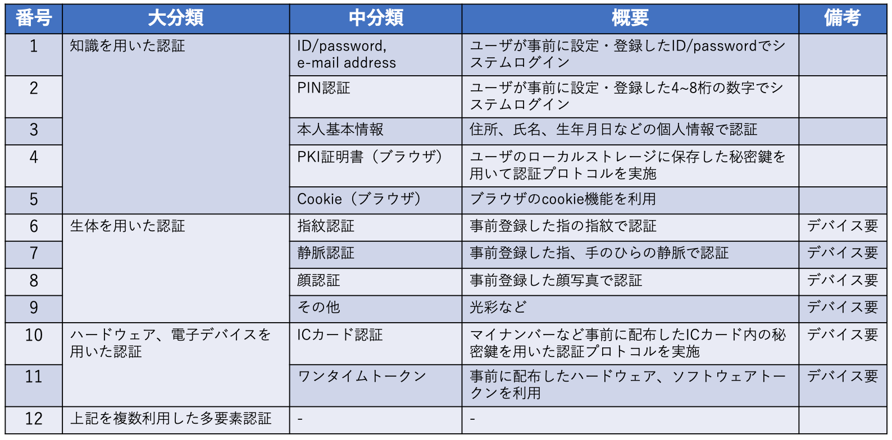
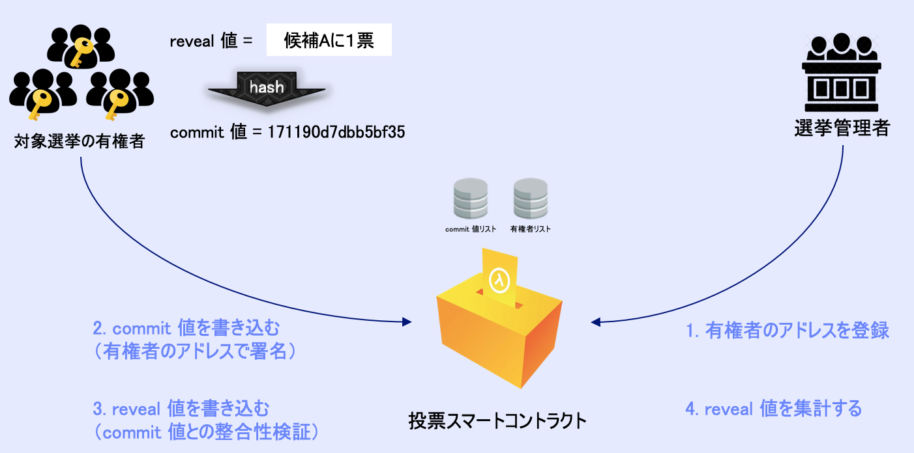
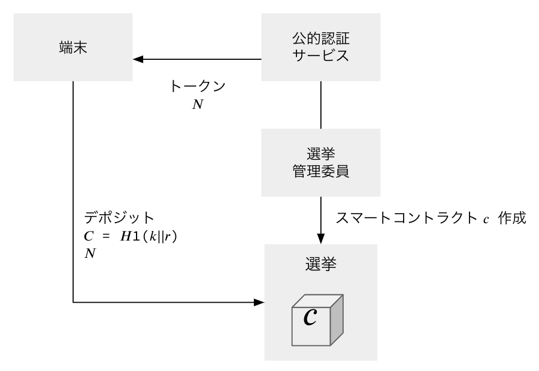

## Agenda

- 1.Executive Summary
- 2.Introduction
- 3.Details

## List of participants

- **Fujitsu Laboratories Ltd.**

  - Horii Motoshi

- **Hitachi Ltd.**

  - Emaru Hironori

* Ken Naganuma

* **Act Co., Ltd.**

  - Nobuyuki Asai

* **Centaurus Works Inc. / Waseda Legal Commons Law Office**

  - Hiroto Inamura

* **Cybozu Labs, Inc.**

  - Shigeo Mitsunari

* **CollaboGate Japan Inc.**

  - Kohei Kurihara

* **Comps Co., Ltd. / alt Inc.**

  - Yoshikazu Nishimura

* **Couger Inc.**

  - Atsushi Ishii
  - Kazuaki Ishiguro
  - Shunpei Sasaki
  - Yukari Tatsumi
  - Kentaro Ishida
  - Shigeyuki Tanaka

## 1. Executive Summary

- Based on the management and operations of the present voting system, we investigated the functionalities required of an internet voting system. It is thought that digitization can simplify and streamline many tasks, from the creation of electoral registers to the counting of votes. In addition, there is also a need for thorough introspection into developing contingency plans in case of any type of systematic malfunction.
- After categorizing the personal authentication technologies into 11 groups and evaluating them for the important requirements of online voting, it was opinionated that one technology might not be able to satisfy all the requirements. Therefore, “multi-factor authentication,” which combines multiple individual identification technologies, may be the most suitable solution. In addition, as one of the multi-factor authentication, it is considered that "Face Identification" may be effective and realistic. However, at present, it is only a general category evaluation, and thus these results may change if each product is evaluated separately. In the end, we believe that it is necessary to assess a large number of individual products.
- While examining the methods of identity verification appropriate for internet voting in the light of the guidelines about the methods of online identity verification required in governmental procedures, it appears that only "My Number + PIN" would be a suitable combination. However, some extra measures, such as authentication through additional information, would be necessary to avoid situations where double voting is easier than in the current voting system.
- There is also room for discussion about economic costs since conducting all the concealment on Ethereum’s main net might cost at least a few thousand yen per voter. However, we believe that it is possible to reduce costs by subdividing the subject of concealment. One option would be hiding the link between individuals and their addresses and not hiding the link between addresses and voting content and utilizing off-chain.
- Concerning "CREAM,” a blockchain voting application using Ethereum, we believe that by adopting a method called Layer2 on the Ethereum main net, we can reduce costs and improve speed. However, since this method assumes that the operator can be trusted, there is a challenge regarding how to guarantee that trust.

## 2. Introduction

Moving towards the public release of the contents of the workshop, we held discussions about progress in each area of research assigned to the members.

**Operation requirements:**

1. Points to consider regarding the internet voting

**Authentication technologies:**

1. Evaluation and problems of personal authentication techniques in internet voting
2. Techniques for preventing double voting

**Technologies for voting:**

1. Issues that can be resolved by using blockchain technology for electronic voting
2. Is the blockchain voting application "CREAM” that uses Ethereum adaptable to Internet voting?

## 3. Details

### 3.1 Voting operations

**3.1.1 Points to consider regarding the internet voting, Nobuyuki Asai, Act Co., Ltd.**

Operational plan of elections based on internet voting

- Electoral register based on basic resident register

  => Linking web system and the basic resident register

- Eligible voters list managed by a local municipality

      	=> It is possible to simplify the sharing and adjustment of data between municipalities

- Shipping of entrance tickets to a polling station

  => In addition to the shipping method being used so far, notification by e-mail and app, etc. is also possible

- Setting up of polling stations for overseas voting and early voting

      	=> It is easy to establish an online voting platform of the most suitable scale at any time. Besides, we assume that the online voting environment would also be set at each polling station

- Vote counting

      	=> Need for automatic vote counting and allowance for inclusion of the out of system votes

- Cleaning up of polling stations

      	=> Possible with much less effort

**Contingency plans in case of emergency**

Considering the high availability and redundancy of the system, we have examined an operational plan for the continuation of voting in case of unexpected malfunction in the local network or cloud service.

- Current voting (at a polling station)
  - Printing of electoral register on paper and placing at each polling station.
  - Preparation of spare (and extra backup) in case of a malfunction of the election system/equipment.
  - In case of system failure, the reception of voters through printed electoral register only.
- Internet voting
  - System duplication on the intranet. (Or else, a system with bare minimum features to be established on the intranet.)
  - Back up the electoral register information and expand it to the intranet.
  - Set up several polling stations in addition to enabling voting through personal devices.
  - Put together, early voting and election-day voting enables longer voting periods.
  - During the period of time, voters can conduct internet voting on personal devices or internet voting (or intranet voting) at the polling stations.

To not double count a person’s vote received through the intranet during the time of a malfunction, the most recent vote of a person may be taken into account during the process of aggregation.

Issues to be examined next:

- How will operating costs change from current polls? (e.g., Cost reduction due to the decrease in the number of polling stations, cost increase because of enabling voters who haven’t been able to vote in the current voting system, etc.)
- Since internet voting will be criticized if it does not improve the system, let alone maintain it at the same level, we need to further ascertain and refine the possible trade-offs and contingency plan for emergencies.

### 3.2 Authentication Technology

**3.2.1 Assessment of the personal identification technology used in internet voting, by Ken Naganuma, Hitachi Ltd.**

Items for evaluating personal authentication technology:

- Here, the confidentiality of vote and protection of personal information is outside the scope of the group working on authentication technology.

Classification of personal authentication technologies

Evaluation of personal authentication technology

- With the type of authentication technique on the vertical axis and the evaluation items on the horizontal, the above evaluation has been done as objectively as possible.
- Since no single technology gets a full score on all the evaluation items, a multi-factor authentication technique that amalgamates several of these techniques may be required.
- For instance, if we exclude the “usage record,” then combining facial recognition technology with another technology seems to be the most appropriate approach.

**Discussion:**

**Asai:** Face recognition has already been implemented in digital ID apps provided by private companies for online authentication, so I think it may be evaluated as "△. “

**Sasaki:** Is the accuracy of biometric authentication tested? Is it not that facial recognition is easy to make mistakes?

**Naganuma:** Evaluation of personal identification techniques consists of two components; the refusal of identity to the correct person and stopping identify fraud. For biometric authentication, it is difficult to completely prevent the refusal of the identity of the correct person. Regarding identity fraud, it can be fraudulent under certain conditions, and that is why it may be evaluated as "△. “ "Spoofing" is considered to be the most difficult to do in vein authentication, but because that would require a special device for authentication, in the category of "inclusion," it gets "×.”

**Ishiguro:** I remember that there was already a product that can perform vein authentication on a smartphone.

**Naganuma:** Yes, there is such a product. However, this evaluation is conducted on a category-by-category basis, not on an individual product basis. In the end, we should go that far, but as the number of products becomes huge, we presently separate them into categories.

**3.2.2 Technology to prevent double-voting (continued from last time), by Horii Motoshi, Fujitsu Laboratories Ltd. **

Based on the official guidelines for online identity verification in administrative procedures, we examined whether additional information for the reliability of a person’s ID (e.g., Horii is indeed an employee of Fujitsu) can be used. We found that it is difficult to use other information than the three elements (knowledge information, ownership information, and biometric information).

See also: The guidelines for online identity verification in administrative procedures (in Japanese).

[https://www.kantei.go.jp/jp/singi/it2/cio/kettei/20190225kettei1-1.pdf](https://www.kantei.go.jp/jp/singi/it2/cio/kettei/20190225kettei1-1.pdf)

- There is a possibility that only My Number Card + PIN would be sufficient in the system.
- However, suppose verification cannot be done by using the My Number or absentee voting or proxy voting. In such cases, additional information of the following nature may be useful.

  - Absentee voting

    (During the voting period, a person cannot vote because he/she is staying at a place XXX that does not have an internet connection.)

    - Example 1: Certificate of temporary transfer order by a company.
    - Example 2: Certificates by airlines (Alternatively, overseas travel history).

  - Proxy voting

    (XXX is disabled and can't go to the polling station but wants to vote by proxy)

    - Example 1: Information about the proxy voter (relative or postman).
    - Example 2: A certificate issued by a doctor, etc. indicating that XXX is disabled.

Challenges:

- How to establish the criteria.
  - Which company's certificate, which doctor's certificate, and who's proxy vote will be accepted.
  - Is it possible to use the public individual identification service (JPKI)?

**Discussion:**

**Horii:** There are also other means of enhancing the strength of individual identification such as one pulse rate (biometric information) or keyboard use tendency (behavioral information), but they may also be costly and may enhance the issue of the digital divide.

**Naganuma:** Regarding the architecture of internet voting, I think it is compulsory to prevent issues that have been prevented by the current, paper-based voting system. For instance, "My Number card + PIN" alone may encourage crimes such as forcibly obtaining My Number card and PIN from people with dementia or those under severe debts and using it to make money through fraudulent voting. To prevent this, I think that face recognition as additional information may be effective.

**Horii:** I think that one of the means to counter that is to update the vote during the voting period.

**Asai: **Is it legitimate to adopt the abovementioned guidelines in internet voting?

**Inamura:** Yes, because I think it would probably not be a stricter standard for internet voting than the ones mentioned above.

### 3.3 Voting technology

**3.3.1 Issues that can be solved by using blockchain technology for electronic voting, by Yoshikazu Nishimura, Comps Co., Ltd. **

Assumptions: Here, we consider that there are two critical requirements for secret voting:

1. The anonymity of the voter
2. Confidentiality of the vote contents

The anonymity of voter:

- Anonymity on the blockchain means the security of both of the following:
  - Who has which address? (Individual anonymity)
  - Which address voted for which candidate? (Address anonymity)
- This is ideal, but is the economic cost proportionate?
- Regarding the anonymity, is it possible to ensure anonymity by breaking the association between the voter and his/her address?
- If it is possible, then it might look as in the picture below. Excluding the shuffling process of the key pair (secret key and address), it is similar to sending admission tickets to polling stations in the current voting system.

Confidentiality of the vote content:

- Confidentiality of the vote content can also be realized through the commit/reveal method. (See the picture below)
- However, this method can be realized without blockchain.

**Economic Costs: **

1. **Estimate of gas cost of the OpenVote Network**

   If 5000 voters per blockchain and Ethereum is used as blockchain

1. Per voter: 0.33 ETH (approx. 13,000 yen)
1. Per administrator: 155 ETH (approx. 6,200,000 yen)

   => It is considered to be quite costly. The price per voter does not change even if the number of voters increases, but the cost per manager increases in proportion to the number of voters.

1. **Estimate of gas cost of CREAM**

   If 5000 voters per blockchain and Ethereum is used

1. Per voter: 0.075 ETH (approx. 3,000 yen)
1. Per administrator: 25.21 ETH (approx. 1,008,000 yen)

   => As with the OpenVote Network, the larger the scale, the larger the administrators’ costs.

1. **Estimate for the simple commit/reveal method**

   If the voter anonymity is established simply by breaking the association between the voter and his/her address and not hiding which address voted for which candidate, then the simple commit/reveal method can be used on the blockchain, and the costs would be as follows.

    If 5000 voters per blockchain, and two candidates, and Ethereum is used

1. Per voter: 0.0093 ETH (approx. 371 yen)
2. Per administrator: 21.54 ETH (approx. 855,828 yen)

=> The voter cost can be significantly reduced.

4. **Estimate for the commit/reveal light method**

   In addition, to reduce the amount of computation, if the vote is accepted first without determining whether it is a registered voter at the time of voting and later match the registered address ledger with the votes at the time of counting, it is possible to eliminate the cost of registering the address of the voter on the blockchain.

    If 5000 voters per blockchain, and two candidates, and Ethereum is used

1. Per voter: 0.0093 ETH (approx. 777 yen)
2. Per administrator: 21.54 ETH (approx. 269 yen)

Future tasks

It has been demonstrated that by determining the subset of information critical for ensuring the secrecy of the vote, the costs can be reduced substantially. In the future, we would like to further ascertain the necessary information that relates to voting confidentially.

**Discussion:**

**Naganuma: **Is it necessary to use the Ethereum main net? Maybe a private one would also be fine.

**Nishimura:** While it is true that cost can be reduced by using other blockchains, the final decision should be made by considering other elements such as transparency, accuracy, and decentralized operations, besides economic costs.

**Inamura: **From a legal perspective, the anonymity of voting means that a third party cannot impact the vote, i.e., freedom of vote is guaranteed. There is no legal problem if you can keep track of who voted for which candidate but cannot buy or sell votes or force the voters. For instance, if only a person with special authority at the government agency can view “who has which address” type of information, then I think it will not be a problem in a legal sense.

**3.3.2 Is CREAM, a blockchain voting application using Ethereum, adaptable to internet voting?, by Kazuaki Ishiguro, Couger Inc.**

The basic flow of the process of concealment:

- Proof the commitment at the time of deposit
- If the proof is valid, can withdraw (transfer) the deposited coin.
- Anyone who knows the commitment can issue tx.
- Proof can be done through an account separate from that of the deposit.
- Since the coin’s history comes from the contract, it is possible to keep secret who votes for whom.

Technical specifications for each phase

1. Setup 1
   - Let 𝔹 = {0, 1}.
   - Let 𝘦 be the pairing operation used in the SNARK proof, defined for the group of prime numbers 𝘲.
   - Let 𝘏1:𝔹 → ℤp is the Pedersen hash function, and 𝘏2:( ℤp, ℤp) → ℤp is the MiMC hash function.
   - 𝜏 is a height 16 Merkle tree, and non-leaf nodes give hash values to the left and right children with 𝘏2.
   - Let 𝑂 (𝜏, 𝜄) be the path of the Merkle tree 𝜏 represented by the root hash 𝑅 with the index 𝜄.
2. Setup 2

   - Let the value of 𝑘 in 𝑘 ∈ 𝔹 be the nullifier, and let the value of 𝑟 in 𝑟 ∈ 𝔹 be secret.
   - Let 𝐵 be the candidate's Ethereum address.
   - Let 𝑆 [𝑅, ℎ, 𝐵, 𝑓, 𝑡] be the knowledge account with public values ​​𝑅, ℎ, 𝐵, 𝑓, 𝑡.

     ： 𝑆[𝑅,ℎ,𝐵,𝑓,𝑡] = {ℎ = 𝐻1(𝑘) and 𝑂 knows 𝑘,𝑟 ∈ 𝔹 , 𝜄 ∈ 𝔹 , 𝑂 ∈ ℤp that lead 𝐻2(𝑘∣∣𝑟) to 𝑅 at position 𝜄 }

     - 𝑓 = fee for going through relayer
     - 𝑡 = relayer address
     - ℎ = nullifier hash

3. Setup 3
   - Let 𝐷 = zk-SNARK proof-verification key pair (𝑑𝑝, 𝑑𝑣) of 𝑆 created using a trusted setup.
   - Proof: Prove (𝑑𝑝, 𝜏, 𝜄, 𝐵, 𝑓, 𝑡) → 𝑃
   - Verification: Verify (𝑑𝑣, 𝑃, 𝑅, ℎ, 𝐵, 𝑓, 𝑡)
4. Deposit
   - Randomly generate 𝑘, 𝑟 ∈ 𝔹, and calculate 𝐶 = 𝐻1 (𝑘∣∣𝑟).
   - Send the amount of coins 𝑁 to the smart contract 𝑐 along with 𝐶.
     - At this time, 𝐶 is an unsigned 256-bit integer.
   - If there is space in the Merkle tree, 𝑐 accepts the transaction and adds 𝐶 to the Merkle tree as a non-zero value.

5. Withdraw
   - Select Candidate 𝐵.
     - Select relayer fee 𝑓 ≤ 𝑁 (optional)
   - Select the root 𝑅 from the ones stored in the smart contract and calculate the path 𝑂 (𝜄) ending in 𝑅.
   - Calculate the nullifier hash value ℎ = 𝐻1 (𝑘).
   - Create the proof 𝑃 by calling 𝑑𝑝 in the Prove function.
   - Execute withdraw in one of the following ways:
     - Send a transaction to 𝑐 along with 𝑅, ℎ, 𝐵, 𝑓, 𝑡, 𝑃.
     - Send a relayer transaction request to 𝑐 along with 𝑅, ℎ, 𝐵, 𝑓, 𝑡, 𝑃.
   - After execution, map ℎ to the mapping variable 𝐿 (𝐿 [ℎ] = true) in 𝑐.

6. Prevention of double voting

   - The contract 𝑐 stores the past 𝑛 = 100 𝑅 in the array.
   - The most recent Markle tree t stores the value of the node on the path from the last added leaf to the root and stores the value of the node required to calculate the next route and root.
   - Set the mapping variable 𝐿 and maps successfully withdrawn ℎ. Then verify 𝐿 [ℎ] ≠ true when the withdraw function is called.

     - Prevention of double voting is considered to be one of the advantages of using blockchain.

Challenges:

- When using Ethereum’s main net
  - Who will pay for gas?
  - Is it reliable when using relayers? (Possibility of becoming a SPOF)
- In case of not displaying the voting result until the end of the voting (batch processing)
  - What kind of structure?
  - Who will do it?
- Can we guarantee the outcome of the vote?

Moving towards Version 2:

- We are about to start developing Version 2 to address the above problems.
- We are planning to adopt methods like Layer2 etc. on the Ethereum main net.
  - Calculations are performed off-chain, and by hashing the calculation results and sending them to the main net, it is expected that Gas costs will be reduced and TPS (Transactions Per Second) will increase.
  - By batch processing, it is possible to vote multiple times. By doing so, fraudulent activities can be prevented.
  - However, since it is assumed that the operator can be trusted, how to ensure this point is a challenge.
