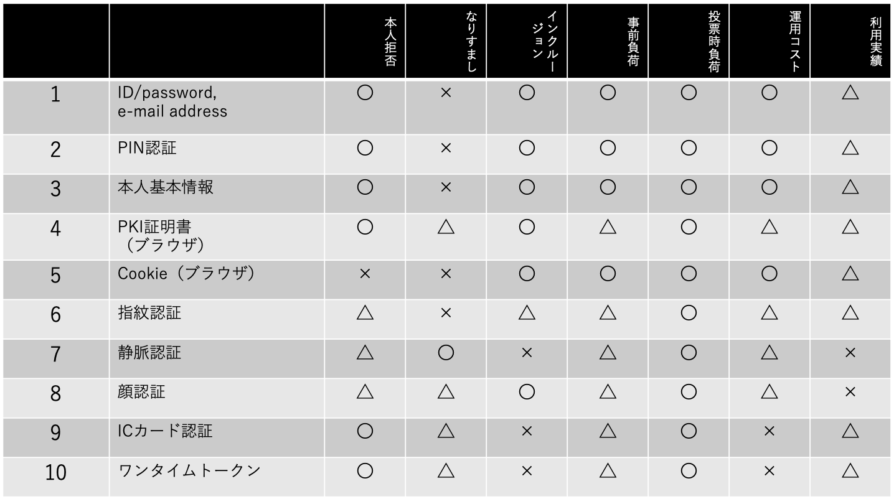

## 目次

- 1.Executive Summary
- 2.Introduction
- 3.Details

## 参加者一覧

- 富士通研究所

  - 今井 悟史
  - 堀井 基史

- 日立製作所

  - 江丸 裕教
  - 長沼 健
  - 齊藤 紳一郎

- アクト

  - 小林 智彦
  - 浅井 延幸

- ケンタウロスワークス / 早稲田リーガルコモンズ法律事務所

  - 河﨑 健一郎
  - 稲村 宥人

* サイボウズ・ラボ

  - 光成 滋生

* コラボゲート

  - 栗原 宏平

* コンプス / オルツ

  - 西村 祥一

* VOTE FOR

  - 市ノ澤　充

* クーガー

  - 石井 敦
  - 石黒 一明
  - 佐々木 俊平
  - 辰巳 ゆかり
  - 石田 謙太郎
  - 田中 滋之

## 1. Executive Summary

- 既存投票の業務および運用内容をベースに、インターネット投票においてどのような運用が必要となるかを具体的に検討した。デジタル化によって、選挙人名簿の作成から開票にいたるまで、多くの作業を簡素化・効率化できると考えられる。一方で、長年の既存選挙で培われてきた、どんな障害があっても投票を継続できるコンチプランの策定にはより綿密な議論が必要である。
- 本人認証技術を11のカテゴリに分類し、インターネット投票の本人認証で必要と考えられる要件ごとに評価を行った結果、一つの技術で全ての要件を満たすことは難しく、複数の本人認証技術を組み合わせて認証する「多要素認証」が良いのではないかとの見解に至った。また、多要素認証の一つとして、「顔認証」が有効かつ現実的なのではないかと考えられる。一方で、現時点ではカテゴリごとの一般的な評価にとどまっており、個別製品ごとに評価すると結果は変わる可能性はある。最終的には膨大な数の個別製品ごとの評価が必要だと考える。
- 「行政手続きにおけるオンラインによる本人確認の手法に関するガイドライン」を前提として、インターネット投票で必要な本人認証手法を検討すると、「マイナンバー+PIN」だけでも問題ない可能性がある。しかし、既存投票よりもなりすまし投票がしやすくなる状態は避けるべきで、追加情報による認証などなんらかの対策は必要なのではないかと考えられる。
- 投票の秘匿化をすべてイーサリアムのメインネット上で行うには投票者1人につき数千〜数万円のコストがかかると試算され、経済的コストという点で検討の余地がある。個人とアドレスの紐付けを秘匿化し、アドレスと投票内容の紐付けは秘匿化しないなど、秘匿化の対象を細分化したり、オフチェーンも活用することで、コストを削減できると考える。ただし、選挙の特性上、最終的には透明性・正確性といった観点も含めて選定していくべきである。
- イーサリアムを使ったブロックチェーン投票アプリケーション「CREAM」に関して、イーサリアム メインネットでLayer2などと呼ばれる方式を採用することで、コストの削減やスピードの改善ができないかと考えている。一方で、この方式ではオペレーターが信頼できることが前提となるため、どのようにその信頼を担保するかといった課題がある。

## 2. Introduction

ワークショップでの一般公開発表へ向けて、各担当領域ごとに進捗報告と議論を行った。

**（業務）**

1. インターネット投票で考慮すべき点

**（認証技術）**

1. インターネット投票における本人認証技術の評価と課題
2. 替え玉を防止するための技術（前回の続き）

**（投票技術）**

1. 電子投票にブロックチェーン技術を使うことで解決できる課題
2. イーサリアムを使ったブロックチェーン投票アプリケーション「CREAM」はインターネット投票に適応可能か？

## 3. Details

### 3.1 投票業務

**3.1.1 インターネット投票で考慮すべき点 | 浅井 延幸/ 株式会社アクト**

（インターネット投票に即した選挙の運用設計）

- 住基から選挙人名簿の作成

         =>Webシステムと住基システムが連動。

- 自治体別の選管による選挙人調整

        =>自治体間でデータ連携され、調整作業の簡素化が可能。

- 投票所入場券の発送

        =>これまで通りの発送に加えて、メールやアプリ等でも通知。

- 在外投票／期日前投票所・当日投票所の設営・運用

        =>期間内であればいつでもインターネット投票が可能となることから、最適化した規模での設営と運用が可能。

        投票所でも、インターネット投票できる環境の設営を想定。

- 開票

        =>自動集計、一部のシステム外投票分のケアが必要。

- 各種後片付け（投票所の撤去など）

        =>以前より少ない労力で可能。

（緊急時対応計画／コンティンジェンシープラン、コンチプラン）

システムは高可用性・冗長性の考慮を前提とし、局所的なネットワーク障害やクラウドサービスの予期せぬ障害発生時の選挙自体の継続を主とした計画・運用設計を検討した。
- 既存投票
    - 事前に名簿を紙で印刷、各投票所へ配置。
    - 投票所の機器障害に対応すべく予備機及び、予備の予備を投票所へ即時輸送。
    - システム障害時は印刷済みの名簿で受付。
- インターネット投票
    - イントラへシステムを複製。（もしくは、必要最低限の機能のみ実装したシステムをイントラに設置）
    - 名簿情報をバックアップ、イントラへ展開。
    - 個人端末での投票以外に、数か所の投票所を設営。
    - 期日前投票と当日投票をまとめて長期間の投票期間を設ける。
    - 期間内にインターネット投票もしくは投票所でのインターネット投票（またはイントラでの投票）を行う。

障害時にイントラで受け付けた投票などの二重投票防止については、集計時にマージする際に最新の投票内容に上書きをするといった運用でカバーすることを想定している。

（今後の検討課題）

- 既存投票と比べて、運用コストがどのように変わるか。（例：投票所の設営数が減ることによるコスト減、既存運用で投票に支障があった選挙人が投票できるようになることで増えるコスト等）
- 改善が大前提で改悪はもとより現状維持であっても批判につながりやすいインターネット投票への期待があるという認識のもと、トレードオフになってはいけないポイントをしっかりと見極め、緊急時対応計画を精緻化していきたい。

### 3.2 認証技術

**3.2.1 インターネット投票における本人認証技術の評価と課題 | 長沼 健/株式会社日立製作所**

（本人認証技術の評価項目）

※投票の機密性・個人情報保護などは認証技術グループとしてはスコープ外とする。

（本人認証技術の分類）

（本人認証技術の評価）

- 評価項目を横軸、本人認証技術の中分類を縦軸として、できるだけ客観的に評価を行った。
- すべての評価項目で「◯」の技術は無さそうなので、複数技術を組み合わせた多要素認証が必要となると考える。
- 組み合わせる場合、「なりすまし」以外の評価項目は悪い方の評価が全体に影響するので、すべての評価項目を「◯」にする組み合わせは無さそうである。
- そこで「×」を無くす・「利用実績」は一旦除外する、という方向で検討したところ、「顔認証」と何かを組み合わせるのが良さそうである。

 

**議論**

**浅井**：顔認証は、ネット越しの認証という点では、民間企業が提供するデジタル身分証アプリなどで既に実装されているので、評価としては「△」になると思う。

**佐々木**：生体認証の正確性は評価されているか？顔認証は間違いやすいといったことはないか。

**長沼**：本人認証の正確性評価は「本人拒否」と「なりすまし」の2項目となる。生体認証の場合「本人拒否」を完全に防ぐことは難しいとされている。「なりすまし」については、顔認証は一定条件では不正ができてしまうので△としている。「なりすまし」は、静脈認証が最も難しいと考えるが、認証に特殊なデバイスを必要とするので「インクルージョン」の評価を「×」としている。

**石黒**：静脈認証をスマートフォンで行える製品が既にあったように記憶している。

**長沼**：そういった製品はある。ただ、今回の評価はあくまでカテゴリー単位で実施しており、個別製品ごとの評価はしていない。最終的にはそこまでやるべきだが、数が膨大になるので時間の関係でカテゴリー別にしている。

**3.2.2 替え玉を防止するための技術（前回の続き） | 堀井 基史/株式会社富士通研究所**

「行政手続きにおけるオンラインによる本人確認の手法に関するガイドライン」に基づき、IDの信頼性に関する追加情報（例：堀井は確かに富士通の社員である）を使えるかどうか検討したところ、同ガイドラインとしては、3要素（知識情報、所有情報、生体情報）以外の情報を使うことがあまり想定されていないことがわかった。

参照：行政手続きにおけるオンラインによる本人確認の手法に関するガイドライン

[https://www.kantei.go.jp/jp/singi/it2/cio/kettei/20190225kettei1-1.pdf](https://www.kantei.go.jp/jp/singi/it2/cio/kettei/20190225kettei1-1.pdf)

- 基本的にはマイナンバーカード+PINでも制度上は十分という可能性もある。
- 但し、マイナンバーカードを使ってどうしても認証できない場合の代替手段、あるいは不在者投票や代理投票で、以下のような追加情報が有効ではと考えている。
    - 不在者投票

        「投票期間中は、ネット回線のないXXXに居るから、投票できない」

    - 例１：会社による出向命令の証明書
    - 例２：航空会社による証明書等（あるいは、海外への渡航履歴）
- 代理投票

    「XXXが不自由だが、投票所に行けないため、代理投票したい」

        - 例１：代理投票者に関する情報（親族 or 郵便配達人）
        - 例２：医師等が発行したXXXが不自由であることを示す証明書

（課題）

- 基準をどこに置くか。
    - どの会社の証明書、どの医師の証明書、誰による代理投票なら認めるのか。
- 公的個人認証サービス（JPKI）で対応可能か。

**議論**

**堀井**：追加情報として、心拍数などの生体認証や、キーボードの入力傾向などのふるまい認証のような手法も本人認証の強度を高めるには効果的だが、導入コストやデジタルデバイドの問題が大きいと感じている。

**長沼**：インターネット投票のアーキテクチャを考えるにあたり、既存運用（投票所での紙の投票）で防げていたことが防げなくなってはいけないと思う。「マイナンバーカード+PIN」だけでは、例えば、認知症や多重債務者の人などから強制的にマイナンバーカードとPINを入手し、なりすまし投票してお金を儲けるといった犯罪を助長することにつながるのではないか。それを防ぐために、追加情報としての顔認証は有効ではないかと考える。

**堀井**：投票期間中であれば投票を更新できるようにするのも、手段の一つだと思う。

**浅井**：上記ガイドラインをインターネット投票に適応することは法的な観点から妥当なのでしょうか。

**稲村**：インターネット投票においてこれ以上に厳しい基準になるということはおそらく無いだろうと思われる。

### 3.1 投票技術

 

**3.3.1　電子投票にブロックチェーン技術を使うことで解決できる課題 | 西村  祥一/ 株式会社コンプス情報技術研究社**

前提：秘密投票には2つの要件が存在すると考える。

1. 投票者の匿名性
2. 途中経過の秘匿性

（投票者の匿名性）

- ブロックチェーン上での匿名性とは、下記をいずれも担保している。
    - 誰がどのアドレスか？（個人の匿名性）
    - どのアドレスがどの候補者に投票したか？（アドレスの匿名性）
- これは理想ではあるが、経済的コスト（≒計算量）が見合っているか。
- 本質的な匿名性を考えた場合、誰がどのアドレスか？ということの紐付ができないことをもって匿名性があるということは可能か。
- 仮に可能だとすると、下図フローで実現できる。これは、途中でキーペア（秘密鍵とアドレスのペア）に封をしてシャッフルする工程を除けば、既存の投票所入場券の送付フローと基本的には同じである。

（途中経過の秘匿性）

- commit/reveal方式によって、途中経過の秘匿性を実現できる。（下図参照）
- 但し、この方式はブロックチェーンがなくても実現できる。

（経済的コスト）

1. **Open Vote NetworkのGasコスト試算**

    ※投票者数 5,000人／ブロックチェーンはイーサリアムを使用。

    1. 投票者： 0.33 ETH （約13,000円）
    2. 管理者： 155 ETH （約6,200,000円）

    =>かなりコストがかかると考えられる。また投票者の単価は投票者数が増えても変わらないが、管理者の単価は投票者数に比例して増えていく。

2. **CREAMのGasコスト試算**

    ※投票者5,000人／ブロックチェーンはイーサリアムを使用。

    3. 投票者： 0.075 ETH （約3,000円）
    4. 管理者： 25.21 ETH （約1,008,000円）

    =>OpenVote Networkと同様、規模が大きくなるほど管理者のコストが増える。

3. **単純 Commit/Reveal 方式での試算**

    もし、投票者の匿名性が前述した「誰がどのアドレスか」を秘匿化することで担保されるとするならば、「どのアドレスがどの候補者に投票したか」は秘匿化せずに、単純なCommit/Reveal 方式だけをブロックチェーン上で行えばよいので、その場合のコストを試算した。

    ※投票者5,000人／候補者は2人まで／ブロックチェーンはイーサリアムを使用

    5. 投票者： 0.0093 ETH （約371円）
    6. 管理者： 21.54 ETH （約855,828円）

	=>投票者のコストは、大幅に削減できると考えられる。

4. **Commit/Reveal Light 方式での試算**

    さらに計算量を軽くするために、投票時に選挙人であるかどうかの判定をせずに一旦は投票を受け付けてしまい、集計時にオフチェーンで選挙人のアドレス台帳と突合し、無効投票を除外するという運用方法にすれば、選挙人のアドレスをブロックチェーン上に登録するコストを無くすことができる。

    ※投票者5,000人／候補者は2人まで／ブロックチェーンはイーサリアムを使用

    7. 投票者： 0.0093 ETH （約777円）
    8. 管理者： 21.54 ETH （約269円）

（今後の課題）

コンピューティングリソースだけが課題ではないが、秘密投票を実現する上で、本当に秘匿化すべき情報はどの部分なのかを見極めることで、コストを減らせる可能性があることを示せたと思う。今後さらに、何をもって「投票者の匿名性」を担保できるのか検討する。

**議論**

**長沼**：イーサリアムのメインネットを使う必要はあるのか。プライベートでもよいのでは。

**西村**：他のブロックチェーンを使えば、コストを抑えられる可能性はあるが、最終的にはコスト以外の要素、例えば透明性・正確性・非中央集権といったことも考慮して選定していくことになると考えている。

**3.3.2　イーサリアムを使ったブロックチェーン投票アプリケーション「CREAM」はインターネット投票に適応可能か？ | 石黒　一明/ クーガー株式会社**

（秘匿化の基本フロー）

- deposit時のcommitmentを証明する。
- 証明がtrueならdepositされたコインをwithdraw(transfer)できる。
- tx発行はcommitmentを知っている人なら誰でも可能。（depositとは別のアカウントから証明をする事ができる）
- コインの履歴はコントラクトからなので誰が誰へ投票したのかは秘匿化する事ができる。

（各フェーズの技術仕様）

1. **Setup①**
    - 𝔹 = {0, 1}とする。
    - 𝘦 をSNARK証明で使用されるペアリング演算、素数 𝘲 の群に対して定義されるものとする。
    - 𝘏1:𝔹 → ℤp をPedersenハッシュ関数とし、𝘏2:(ℤp, ℤp) → ℤp をMiMCハッシュ関数とする。
    - 𝜏 高さ16のマークル木とし、リーフではないノードは左右の子供を 𝘏2 でハッシュ化する。
    - 𝑂(𝜏, 𝜄) をインデックス 𝜄 を持つルートハッシュ 𝑅 で表されるマークル木 𝜏 のパスとする。
2. **Setup②**
    - 𝑘 ∈ 𝔹  の値 𝑘 をnullifierとし、𝑟 ∈ 𝔹  の値 𝑟 をsecretとする。
    - 𝐵 を候補者のEthereum addressとする。
    - 𝑆[𝑅,ℎ,𝐵,𝑓,𝑡]　を公開値 𝑅, ℎ, 𝐵, 𝑓, 𝑡 をもつ次の知識の記述とする。

        ： 𝑆[𝑅,ℎ,𝐵,𝑓,𝑡] = {ℎ = 𝐻1(𝑘) かつ 𝑂 の値がポジション 𝜄 での𝐻2(𝑘∣∣𝑟)の 𝑅 へのパスとなる 𝑘,𝑟 ∈ 𝔹  , 𝜄 ∈ 𝔹 , 𝑂 ∈ ℤp  を知っている}

        - 𝑓 = リレイヤーを経由した際の手数料
        - 𝑡 = リレイヤーのアドレス	
        - ℎ = nullifier hash
3. **Setup③**
    - 𝐷 = (𝑑𝑝, 𝑑𝑣) を信頼された設定手順（trusted setup）を使って作成された 𝑆 のzk-SNARK証明検証鍵ペアとする。
    - 証明：Prove(𝑑𝑝, 𝜏, 𝜄, 𝐵, 𝑓, 𝑡) → 𝑃
    - 検証：Verify(𝑑𝑣, 𝑃, 𝑅, ℎ, 𝐵, 𝑓, 𝑡)
4. **deposit（受付）**
    - 𝑘,𝑟 ∈ 𝔹  をランダムに生成し、𝐶 = 𝐻1(𝑘∣∣𝑟)を計算する。
    - コイン 𝑁 量をスマートコントラクト 𝑐 へ 𝐶 と共に送金する。
        - この時 𝐶 は符号なし256ビット整数。
    - マークル木に空きが有れば 𝑐 はトランザクションを受入れ、𝐶　をマークル木にゼロではない値として追加する。

    

5. **withdraw（投票）**
    - 候補者 𝐵 を選択。
        - リレイヤーへの手数料 𝑓 ≤ 𝑁 を選択（オプション）
    - スマートコントラクトに格納されているものの中からルート 𝑅 を選択し、 𝑅 で終わるパス𝑂(𝜄)を計算する。
    - nullifier hash 値である ℎ = 𝐻1(𝑘) を計算する。
    - 証明 𝑃 を Prove関数に 𝑑𝑝  を呼び作成する。
    - 以下の方法のどちらかでwithdrawを実行する。
        - トランザクションを 𝑅, ℎ, 𝐵, 𝑓, 𝑡, 𝑃 と共に 𝑐 へ送る。
        - リレイヤーへトランザクションリクエストを 𝑅, ℎ, 𝐵, 𝑓, 𝑡, 𝑃 と共に 𝑐 へ送る。
    - 実行後、ℎ を 𝑐 上のマッピング変数 𝐿 へ 𝐿[ℎ] = trueをマップする。

        

6. **　二重投票の防止**
    - コントラクト 𝑐 は配列に過去 𝑛 = 100 個の 𝑅 を保管する。
    - 最新のマークル木 𝑡 は、最後に追加されたリーフからルートまでのパス上のノードの値を格納し、次のルートを計算するのに必要なノードの値を格納する。
    - マッピング変数 𝐿 とし、withdrawが成功した ℎ をマップし、withdraw関数が呼ばれる際に 𝐿[ℎ] ≠ true を検証する。

        ※二重投票の防止は、ブロックチェーンを使う利点の一つだと考えられる。

（課題）

- イーサリアム メインネットを使う場合
    - Gasを誰が負担するのか。
    - リレイヤーを使う場合、信頼できるのか。（SPOFになる可能性）
- 投票終了まで投票結果を表示しない（バッチ処理を行う）場合
    - どのような構成にするか。
    - 誰が行うか。
- 投票結果の保証はできるのか。

（Version2に向けて）

- 上記課題を解決すべく、Version2の開発を始めようとしている。
- イーサリアム メインネットで、Layer2などと呼ばれる方式を採用予定である。
    - 計算はオフチェーンで行い、計算結果をハッシュ化してメインネットに送ることで、Gas費用の削減や、TPS（Transactions Per Second）増加が期待できる。
    - バッチ処理によって、複数回投票が可能になる。それによって、共謀を防止できる。
    - 但し、オペレーターが信頼できることが前提となるため、その点をどう担保するかが課題である。