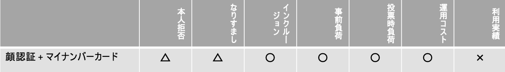
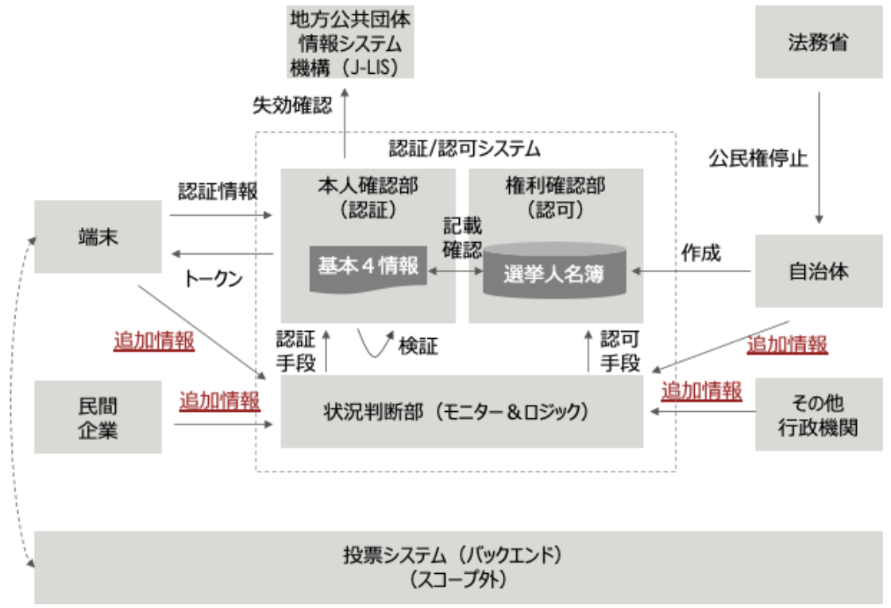
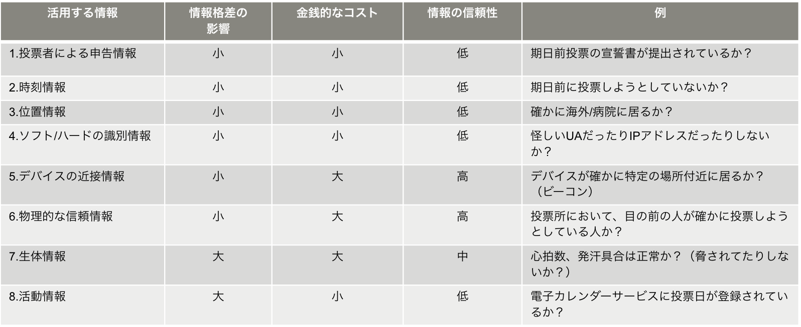

## Agenda

- 1.Executive Summary
- 2.Introduction
- 3.Details
    - 3.1 Voting Operation
    - 3.2 Verification Technology
    - 3.3 Voting Technology

## List of participants
- **Fujitsu Laboratories Ltd.**

  - Motoshi Horii

- **Hitachi, Ltd.**

  - Hirokazu Emaru
  - Ken Naganuma

- **Act Co., Ltd.Act**

  - Masashi Asahi

- **Centaur Works Co., Ltd. / Waseda Legal Commons, LPC**

  - Hiroto Inamura

- **Comps Co., Ltd. / al+ Inc.**

  - Yoshikazu Nishimura

- **Couger (Sponsor)**

  - Atsushi Ishii
  - Kazuaki Ishiguro
  - Shunpei Sasaki
  - Yukari Dasu
  - Kentaro Ishida
  - Shigeyuki Tanaka

## 1. Executive Summary

- Before we examine the operation of online voting, compared the expected degree of cost and effort with that of the current voting system.
- Vein verification is desirable if countermeasures against impersonation is the highest priority in identity confirmation, but the cost is still an issue. From the perspective of reducing the ✖️ evaluation items as much as possible, a combination of facial recognition and  “My Number Card” would likely be effective.
- We examined what kind of additional information could be utilized in cases where it is difficult to verify the person's identity via facial recognition and an “My Number Card”. Such cases involve voting on behalf of a person currently in a far-off areas and voting by someone who transferred overseas and has returned their “My Number Card”. It will be necessary to further examine what kind of logic will be used for verification.
- We discussed whether it was necessary for the system to retain the link between personal information and the ID used when voting. In light of the current voting operations, it is also necessary to retain information on whether the ID was issued to each individual. However, it was concluded that it was unnecessary to retain which ID was involved.
- In the process of development of blockchain voting application CREAM (which uses Ethereum), the process in which the Election Management Committee creates certificate parameters locally is considered risky. As such, we are currently examining safer methods .

## 2. Introduction

We held discussions and progress reports of each responsible area, aiming toward a public workshop.

**Voting Operation**

1. Points to Consider Online Voting

**Voting Technology**

1. Issues that can be solved by using blockchain technology for e-voting
2. Can the blockchain voting application CREAM (which uses Ethereum) be applied to online voting?

## 3. Details

### 3.1 Voting Work

**3.1.1 Points to Consider Online Voting | Masashi Asai / Act Co., Ltd.**

Expected Degree of Cost and Effort

- The points covered by the current voting systems should be  covered with at least the same degree of effort and cost.
    - e.g. Operate in parallel with current polling stations instead of completely abolishing them.
- The cost of the areas that is already covered in current voting systems can be reduced. (cost, time, manpower)
    - e.g. Reduces work, by such as manually counting votes and reduce the number of polling stations to set up.
- Online voting enables us to operate things that we could not do in the current voting systems.
    - e.g. Be able to vote anywhere.
    - e.g. Reduce human error and lawsuits.

*Based on the premise that local governments and election management committees can operate without violating the law.

### 3.2 Verification Technology

**3.2.1 Evaluation and Challenges of Identity Verification Technology in Online Voting | Ken Naganuma / Hitachi, Ltd.**

We re-evaluated current identity verification technologies based on the discussions held up to the last time.

Evaluation of Identity Verification Technology

Consideration

Evaluation items are not yet weighted at this stage. However, considering the purpose of the elections, it will be crucial whether impersonation can be prevented or not. Vein verification is preferable for prevention. It should be noted that since this requires a designated device, inclusion will be marked ✖️, and there will be other issues, such as high operating costs.

From the perspective of reducing the ✖️ evaluation items as much as possible without weighing the evaluation items, a combination of facial recognition and an “My Number Card” would likely be effective based on the following assumptions:

- “My Number Card” is widespread; and
- The “My Number Card”'s face photo can be used for facial recognition.

    Compared to selecting vein verification, evaluation of inclusion become ✖️→◯, pre-registration load become △→◯, operating costs become ✖️→◯. Though usage record ✖️, the other parameters can be at certain level.

Challenges

It is necessary to examine a specific system architecture when performing identity verifications using facial recognition and an “My Number Card”.

**3.2.2 Examination of additional information and use cases that can be utilized for identity verification and prevention of impersonation| Motoshi Horii / Fujitsu Laboratories Ltd.**

Examined additional information and use cases that can be utilized for identity verification based on the following preconditions:

- Method
    - The basic method is identity verification via “My Number Card”.
    - The verification/authorization system compares the four basic information (name, sex, address, date of birth) with the contents of the voter list to verify identity and confirm rights.
    - Voting is fundamentally done remotely via smartphone or PC. However, polling stations will still be set up for those without access to such devices.
- Items to Study/Examine
    - Impact of the Digital Divide: Can those unfamiliar with IT technology vote?
    - Economic Cost: Are the costs realistic?
    - Information Reliability: Is the utilized information reliable enough?

Overall Image

The part inside the dotted box signifies the verification/authorization system. It is assumed that the Situation Assessment Component will assess the situation of the externally acquired additional information based on a certain logic. However, it will be necessary to examine the specific logic required in the future.

Useable Additional Information

- For remote online voting, it would be realistic to strengthen identity verification by combining 1 to 4 from a cost perspective.
- When using the equipment installed in the polling station, while it may incur some costs, there is a possibility that 6 and 7 can be combined and used in addition to 1 to 4 above.
- In addition, the Biological Information here does not refer to information obtained via facial recognition nor vein verification. Instead, it assumes information that can measure abnormal conditions, such as heart rate and perspiration.

Use Case

**Discussion**

**Sasaki**: Are the four basic information (name, sex, address, date of birth) sufficient for the identity verification segment?

**Asai**: Yes, they are. In the current election, identity verification is done face-to-face and verbally (deposit), so it may be difficult to confirm gender and address from a privacy standpoint. It is up to each location to decide whether or not to strictly check all four basic information.

**Naganuma**: There are various types of votes and elections, such as national elections and national/residential referendums. Will the confirmation of voting rights when accepting votes be done via comparison of the voter list and the four basic information?

**Asai**: No doubt. However, the conditions for being on the voter list differ depending on the election type.

**Nishimura**: The documents concerning the overall image show that a token is issued from the verification/authorization system to the device when the verification information is passed from the device to the verification/authorization system. Is there a mechanism for the verification/authorization system to record the verification information and token issuance history? Isn't this a necessary function to secure the principle of one vote per person?

**Horii**: We would like to add this as one of the items to be considered in the future.

### 3.3 Voting Technology

**3.3.1 Issues that can be solved by using blockchain technology for e-voting | Shoichi Nishimura / Comps Co., Ltd.**

In the examinations until now, if the voter's identity has been verified, and they can receive the ID they need when voting, that ID will be used as the basis for invalidating duplicate votes, as well as updating vote contents. As such, it was deemed unnecessary to store the link between personal information and its ID.

Afterward, from the perspective of verifiability of voting within the WG, it was pointed out that there were cases in which it was necessary to link personal information and its ID.

- If the voter wants to verify that their vote was counted correctly ⇒ This can be confirmed by following the voting system's history since the voter knows their ID.
- If the voter claims that their vote was not counted correctly \
    ⇒Since the Election Management Committee and the third parties do not know which ID the voter is associated with, they cannot verify whether the claim is true or false.

However, these cases have some contradictions concerning secret ballots. Even in the current voting, it is possible to verify whether or not a voting ticket has been issued. However, no mechanism has been implemented for verifying whether or not votes were counted correctly. Accordingly, there is room for consideration as to how much this will be incorporated.

**Discussion**

**Nishimura**: Is there anything CREAM can do about what was mentioned above?

**Ishiguro**: If the link between personal information and ID (QR code for CREAM) is saved, it will be possible for a third party to verify only whether or not the vote was cast or not while keeping the vote's content hidden.

**Asai**: Considering the concept of elections, I believe it is better not to be able to verify who voted for whom. Being able to would raise issues, such as vote-buying/selling.

In the current election, a record/history is kept concerning whether or not the verified voter was given a ballot. Because of this, I believe it is enough to keep a history of whether or not an ID was issued, even in online voting.

**3.3.2 Can the blockchain voting application CREAM (which uses Ethereum) be applied to online voting? | Kazuaki Ishiguro / Couger Inc.**

Investigations are ongoing with regard to the technical specifications. Amid this, there is a big risk in the part where the Election Management Committee creates the certificate parameters locally at the time of deposit. We are examining multiple methods for safely issuing certificates and continue the investigation.

Deposit

**Discussion**

**Sasaki**: Does this take multiple votes into consideration?

**Ishiguro**: Not in the current specifications. If batch processing is fully functional, it will be possible to make specifications like overwriting previous votes.

**Sasaki**: There was a debate on whether it would be possible to guarantee free will even in online voting by making it possible to vote multiple times. As such, it would be desirable to reflect this in the technical specifications. 
