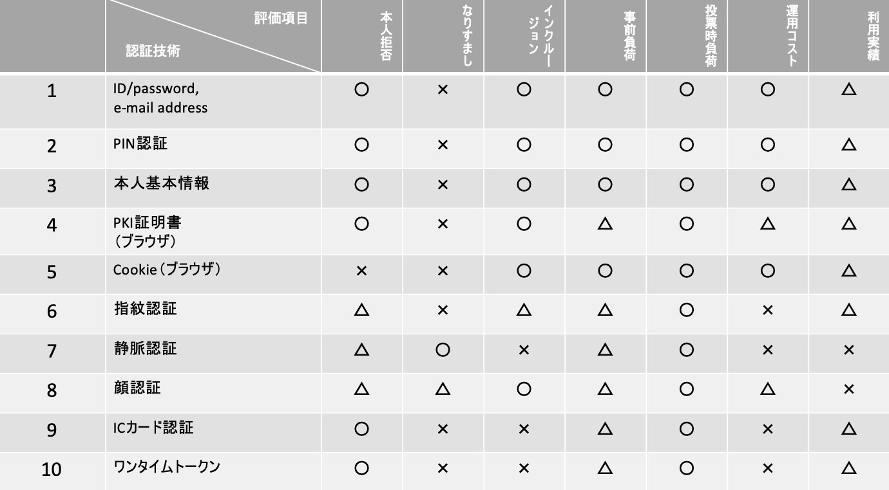
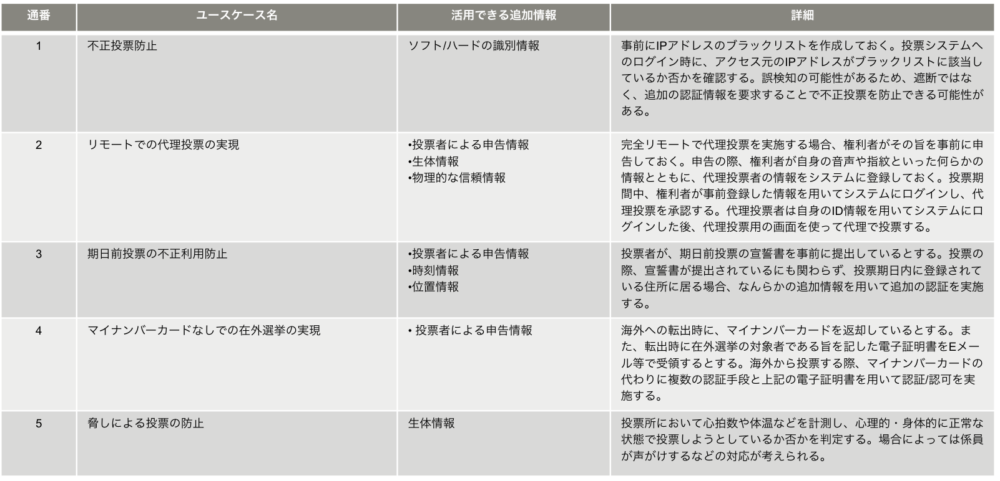

## 目次

- 1.Executive Summary
- 2.Introduction
- 3.Details
  - 3.1 投票業務
  - 3.2 認証技術
  - 3.3 投票技術

## 参加者一覧

- 富士通研究所

  - 堀井 基史

- 日立製作所

  - 江丸 裕教
  - 長沼 健

- アクト

  - 浅井 延幸

- ケンタウロスワークス / 早稲田リーガルコモンズ法律事務所

  - 稲村 宥人

* コンプス / オルツ

  - 西村 祥一

* クーガー

  - 石井 敦
  - 石黒 一明
  - 佐々木 俊平
  - 辰巳 ゆかり
  - 石田 謙太郎
  - 田中 滋之

## 1. Executive Summary

- インターネット投票における業務を考えるにあたり、既存の投票と比較した場合に、コストや手間に関してどの程度のレベルが期待されるかを検討した。
- 本人認証において、なりすましの防止を最優先に考えるのであれば、静脈認証が望ましいが、コスト面での課題が残る。✖️ の評価項目をできるだけ減らすという方向で考えるならば、「顔認証＋マイナンバーカード」の組み合わせが良いだろうと考える。
- 遠隔から代理投票する、マイナンバーカードを返納した国外転出者が投票するなど、「顔認証＋マイナンバーカード」での本人認証が難しいケースにおいて、どのような追加情報が活用できそうか検討を行った。具体的にどのようなロジックで認証を行うかは、さらに検討が必要である。
- 個人情報と投票時に使用する ID も紐付けをシステム側で保持しておく必要があるかどうかについて議論がなされ、その個人に ID を払い出したか否かの情報は保持しておく必要があるが、どの ID かまでは保持する必要はないだろうとの見解となった。
- イーサリアムを使ったブロックチェーン投票アプリケーション「CREAM」において、選挙管理委員会が証明書のパラメーターをローカルで作成する工程にリスクがあると考えられるため、安全に行うための手法を検討中である。

## 2. Introduction

ワークショップでの一般公開発表へ向けて、各担当領域ごとに進捗報告と議論を行った。

**（業務）**

1. インターネット投票で考慮すべき点

**（認証技術）**

1. インターネット投票における本人認証技術の評価と課題
2. 本人確認＆替え玉防止のために活用できる追加情報とユースケースの検討

**（投票技術）**

1. 電子投票にブロックチェーン技術を使うことで解決できる課題
2. イーサリアムを使ったブロックチェーン投票アプリケーション「CREAM」はインターネット投票に適応可能か？

## 3. Details

### 3.1 投票業務

**3.1.1 インターネット投票で考慮すべき点 | 浅井 延幸/ 株式会社アクト**

（期待されるレベル）

- 既存の運用でカバーできている点は、最低でも同等レベルでカバーできる。
  - 例：既存の投票所での投票を完全撤廃せずに規模を変更して並行運用を行う。
- 既存の運用に該当する部分のコストが削減できる。（費用、時間、人力）
  - 例：投票所の設営や、手作業での開票作業が削減する。
- 既存の運用では出来ないことが出来るようになる。
  - 例：場所を選ばずに投票が出来る。
  - 例：人的ミスおよび、人的ミスによる訴訟が減る。

※大前提として法律に抵触せず地方自治体、選挙管理委員会が滞りなく運用できること。

### 3.2 認証技術

**3.2.1 インターネット投票における本人認証技術の評価と課題 | 長沼 健/株式会社日立製作所**

前回までの議論を踏まえ、改めて既存の本人認証技術を評価した。

（本人認証技術の評価）

（考察）

現段階では評価項目に重み付けをしていないが、選挙が担う役割を慮れば「なりすまし」を防げるかどうかが重要となるだろう。その場合は、静脈認証を採用することが好ましいと考える。但し、専用デバイスを必要とする（インクルージョンが ✖️）、運用コストが高いといった課題がある。

評価項目の重み付けはせずに、なるべく ✖️ を減らすという方向で考えるならば、以下前提のもと、「顔認証＋マイナンバーカード」の組み合わせが良いだろうと考える。

- マイナンバーカードは普及しているとする。
- マイナンバーカードの顔写真を顔認証に使用する。

評価はインクルージョン ✖️→◯、事前登録の負荷 △→◯、運用コスト ✖️→◯ となり、利用実績こそ ✖️ であるものの、それ以外は一定の条件を満たすことができる。

（課題）

顔認証＋マイナンバーカードで本人認証を行う場合の具体的なシステムアーキテクチャを検討したいと考えている。

**3.2.2 本人確認＆替え玉防止のために活用できる追加情報とユースケースの検討 | 堀井 基史/株式会社富士通研究所**

一旦、以下を前提条件として、本人認証に活用できると考えられる追加情報、およびそのユースケースを検討した。

- 確認手段
  - マイナンバーカードを用いた本人確認を基本手段とする。
  - 認証/認可システムが、基本 4 情報（氏名、性別、住所、生年月日）と選挙人名簿の内容を比較して本人確認＆権利確認を実施する。
  - 基本はスマートフォン/PC を用いて遠隔で投票するが、これら機器を使えない人のために投票所も設置する。
- 要件
  - デジタルデバイド（情報格差）の影響：IT 技術に疎い人でも投票できるか。
  - 経済コスト：費用は現実的か。
  - 情報の信頼性：活用する情報は十分信頼できるか。

（全体像）

点線で囲んだ部分が、認証/認可システムである。その中の「状況判断部」で、外部から取得した追加情報についてロジックに基づいて状況を判断することを想定している。但し、具体的なロジックについては今後検討が必要である。

（活用できる追加情報）

- 遠隔でのインターネット投票の場合、主にコストの観点から 1〜4 を複合的に用いて本人確認の強度を向上させるのが現実的だと考える。
- 投票所に設置されている機器を用いる場合、多少コストはかかるかもしれないが、1〜4 上記に加えて 6 と 7 も複合的に活用できる可能性がある。
- 補足として、ここでの「生体情報」は顔認証や静脈認証などではなく、心拍数や発汗量など異常な状態を測ることができる情報を想定している。

（ユースケース）

**議論**

**佐々木**：本人確認部分は、基本 4 情報（氏名、性別、住所、生年月日）で足りるのか。

**浅井**：結論としては、足りると考える。現行の選挙は、対面かつ口頭で本人確認（受付）を行うのでプライバシーの観点から性別や住所の確認が難しいこともあり、基本 4 情報すべてを厳密に確認するかどうかはそれぞれの現場での判断になっているのが実情である。

**長沼**：国政選挙・国民投票・住民投票など色々な種類があるが、どのケースでも、投票受付の際にその人に投票権があるかどうかの確認は、選挙人名簿と基本 4 情報の比較ということで問題ないか。

**浅井**：問題ない。但し、選挙人として名簿にのる条件自体は選挙の種別によって異なる。

**西村**：全体像で、端末から認証/認可システムに認証情報を渡すと、認証/認可システムから端末にトークンが払い出されるとなっているが、認証/認可システム側で認証情報やトークンの払い出しの履歴を残す仕組みは想定されているか。1 人 1 票の原則を担保するために、そういった機能が必要なのではないか。

**堀井**：現時点ではそこまで詰め切れていないが、今後検討が必要な事項の一つとして加えたい。

### 3.3 投票技術

**3.3.1 　電子投票にブロックチェーン技術を使うことで解決できる課題 | 西村 祥一/ 株式会社コンプス情報技術研究社**

これまでの検討においては、本人認証がされた上で、投票時に必要な ID を選挙人に払い出せれば、その ID をもとに二重投票を無効としたり、投票内容を更新したりできるので、「個人情報とその ID」との紐付けをどこかに保存しておく必要はないと考えてきた。

その後、WG 内で投票の検証可能性の観点から、「個人情報とその ID」の紐付けが必要になるケースが指摘された。

- 選挙人が、自分の投票内容が正しくカウントされているかどうかを検証したい場合は、選挙人自身は自分の ID を知っているので、投票システムの履歴を追うことで確認が可能。=>この点は問題なし。
- その選挙人が、自分の投票内容が正しくカウントされていないと主張してきた場合、選挙管理委員会や第三者はその選挙人がどの ID と紐づいているか分からないので、本当か嘘か検証することができない。

但し、このケースは、秘密投票という点では矛盾する部分もある。また、現行の投票においても、投票券を発行したかどうかは検証できるけれど、その票が正しくカウントされたかどうかの検証は実現できていない点であり、どこまで織り込むのかは検討の余地がある。

**議論**

**西村**：CREAM で、上記について何か対応できることはあるか。

**石黒**：個人情報と ID（CREAM の場合は QR コード）の紐付けを保存しておけば、投票内容が見えないようにした状態で、投票したか・していないかのみを第三者が検証することは可能である。

**浅井**：選挙という概念からいうと、誰が誰に投票したかどうかは検証できない方が良いと考える。検証できると、たとえば票の売買といった別の問題が発生する可能性がある。

現状の選挙では、本人確認をした選挙人に対し、投票用紙を渡したかどうかまでは履歴を残しているので、インターネット投票においても、ID を払い出したかどうかまでを履歴として残せれば十分なのではと考える。

**3.3.2 　イーサリアムを使ったブロックチェーン投票アプリケーション「CREAM」はインターネット投票に適応可能か？ | 石黒　一明/ クーガー株式会社**

技術仕様について、引き続き調査を行っている。その中で、選挙管理委員会が受付時（Deposit）に証明書のパラメーターをローカルで作成する部分にリスクが大きいのではないかと考えている。いくつか、安全に証明書を発行する手法がありそうなので、調査を継続していく。

（受付（Deposit））

**議論**

**佐々木**：複数回投票は考慮されているか。

**石黒**：現在の仕様では考慮していない。バッチ処理が完全にできるようになれば、前の投票を上書きするといった仕様にすることが可能になると考えている。

**佐々木**：複数回投票が可能になることで、遠隔でのインターネット投票でも自由意志を担保できるのではないかという議論があったかと思うので、それを技術仕様にも反映できると望ましいと思う。
