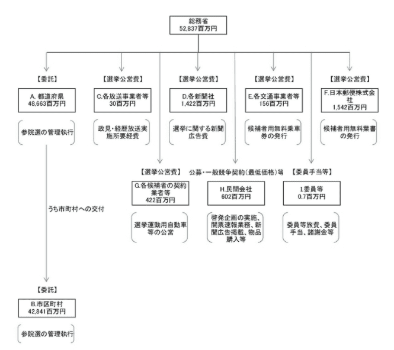

## Purpose of WG

- To study the possibility of realizing online voting in Japan using blockchain.
- To create a specification for the ideal online voting scheme by input from the experts in various domains. The participants of WG include:
  - Cryptography and blockchain experts
  - Lawyers with expertise in online voting
  - Operators of current voting system
  - Experts in management of ID and privacy etc

## Agenda

- About ETHTerakoya
- Purpose and use of “My Number”
- Issues with “My Number” and ID use cases
- Voting
- Elections
- The potential of internet voting
- Future plans

## List of participants

- Fujitsu Laboratories Ltd.

  - Horii Motoshi

- Hitachi Ltd.

  - Emaru Hironori
  - Ken Naganuma
  - Shinichiro Saito

- Act Co., Ltd.

  - Tomohiko Kobayashi
  - Nobuyuki Asai
  - Hayato Maruyama

- Centaurus Works Inc. / Waseda Legal Commons Law Office

  - Kenichiro Kawasaki

- GVA Law Firm

  - Fumiaki Makino

- Cybozu Labs, Inc.

  - Shigeo Mitsunari

- CollaboGate Japan Inc.

  - Kohei Kurihara

- Comps Co., Ltd. / alt Inc.

  - Yoshikazu Nishimura

- Couger Inc.
  - Atsushi Ishii
  - Kazuaki Ishiguro
  - Shunpei Sasaki
  - Yukari Tatsumi
  - Kentaro Ishida
  - Shigeyuki Tanaka

## 1. Executive Summary

- As the adoption of e-governance in Japan and the adoption of “My Number” (which is the national ID in Japan) is relatively slow, there is much room for future improvements.
- Online voting does not necessarily increase the voter turnout but brings other merits (e,g, reduction in operation cost, human errors etc)
- Even if it is technically possible, we need a kind of change that can be understood by the overall society.
- Online voting remains as a challenge from the security perspective, and there are barriers which have to be resolved before its introduction.
- As there are many types of voting(e.g. from national to local elections), we will set a specific target for our implementation.

## 2. Introduction

As a number that can identify an individual, My Number has a great influence on the people. Activities to promote My Number are underway to improve the efficiency of administrative procedures and realize a fair and equitable society. Due to the spread of Covid-19, the number of applications for a My Number card has been increasing. On the other hand, various problems, such as the increased manufacturing cost of the My Number card, the complexity of the system due to the involvement of multiple managers, and the ‘Galapagosization’ (isolation from other markets), are becoming apparent. The ID x Voting x Blockchain Working Group was launched to deepen our understanding of these issues from various angles such as technology, business, and law and propose open guidelines and specifications for social implementation of a blockchain and ID-based voting system.

## 3. Details

### 3.1 Purpose and use of My Number

According to the Japan Ministry of Internal Affairs and Communications' website (\*1), the purpose of the introduction of My Number is to (1) improve the ease-of-use, (2) improve administration ease and efficiency, and (3) realize a fair and equal society.

At present, however, many administrative procedures have not been digitized, and mechanisms for increasing productivity, such as improving the convenience for citizens and streamlining the work of civil servants, have not been realized.

When logging in to many of the IT services we often use, IDs tend to be indispensable and directly linked with the ability to offer personalized services. My Number plays the role of such a unique ID in administrative services. To promote the My Number card the government is increasing incentives for people to use the card, such as online applications for benefits, use as health insurance cards, and award points in payment apps. While the new coronavirus has helped spread the My Number card, the penetration rate at the end of May 2020 was as low as 16.7%.

[From the Ministry of Internal Affairs and Communications](https://www.soumu.go.jp/kojinbango_card/01.html)

### 3.2 Issues with “My Number” and ID use cases

The My Number system and cards face various issues and challenges, including:

#### 1) Increased costs

Difficulty creating a single system for separate laws, systems, and administrators, including the likes of national, local, and other institutions
Means of access to the system has been limited to IC cards distributed inside the country, which leads to the increased cost of manufacturing IC cards
Due to the lack of strategy that enables horizontal cooperation, the system stands isolated, and the development cost increases accordingly

#### 2) Privacy issues

Login is limited to the IC cards issued by the country, but it is dangerous to say that it is safe because it is managed by the country
The risk of privacy invasion based on the assumption that the numbers assigned to individuals at the information-holding institutions may be matched with My Number

#### 3) Limited means of access

It is not accessible by ID issued by a private company.
Use of login ID according to the required level of the business system (it's like you always need a registered seal).

As of 2020, solutions to the above problems, such as cooperation with payment apps provided by private companies and consideration of smartphone use, are gradually underway.

[Testing the functions of the My Number card on smartphone](https://k-tai.watch.impress.co.jp/docs/news/1262480.html)

On the other hand, from a global perspective, the digitalization of Japan's administration is still halfway. The government of Singapore has been actively promoting the adoption of public and private digital IDs since around 2016. In Singapore, the government is actively opening the system to the private sector, while keeping the government infrastructure as the base. Companies can use government-provided common APIs and tools to introduce authentication infrastructure into their services. As a result, it has led to a reduction in development and operational costs. On the other hand, there are still questions regarding the risk of malfunctions due to a centralized system and whether the introduction of related solutions by private companies will proceed as expected.

[From the 2010 e-government promotion response working group report](https://www.soumu.go.jp/main_content/000087340.pdf)

There is also an ID service that utilizes blockchain. uPort, a distributed digital ID service using Ethereum, allows users to retain permanent identifiers on the uPort even if they lose their mobile device or lose access to their key.

In 2016, Microsoft announced a collaboration with uPort (Ethereum-based) and Onename (Bitcoin-based) to develop an open-source cross-chain ID system, advocated by the UN, to provide legal identities to all.

As an example of ID x blockchain in Japan, there is an identity distribution technology "IDYX (IDentitY eXchange)" that is being developed by Fujitsu to determine the creditworthiness of trading partners. IDYX analyzes the creditworthiness and fraud risk in the personal information of the trading partner by using the evaluations that the users make to each other when they make a transaction and the relationships between users in the light of past transactions, etc.

##### **Discussion**

**Kurihara** South Korea has become the most electronic government in the world, and it is common in South Korea to enjoy services using the National number system. In South Korea, the introduction began around 1968, and there have been many ups and downs. Compared to that, Japan's My Number has a short history, so there is still a long way to go for Japan. Besides, Japan has a lawsuit related to My Number, and it is necessary to actively disclose the mechanisms in place and how the country will deal with My Number.

**Fujitsu (Horii)** The tricky part in developing IDYX was the part that creates individual credit score by graphing transaction data etc. using the page rank algorithm, which is also used in google's search engine.

**Naganuma** What kind of blockchain does IDYX use?

**Horii** We are using Indy, but are also considering other options because of the slow speed.

**Naganuma** At Hitachi, we are also using Indy, but we are feeling the difficulty in moving even a small number of documents.

In the working group, which consists of several specialized areas such as technology, law, and business, we will focus on My Number. For example, is it really necessary to write the date of birth and gender on a person’s My Number card? The physical credit card provided by Apple Inc. only has a person’s name on it. The security code and credit card number that are commonplace with credit cards are not printed. Apple claims it to be safer than any other physical credit card. In a situation where proof of identity is required in dealing with My Number Card, the information of when the person was born is not that important. However, the evidence that the person is actually the person in question is more important.

[From Apple Card HP](https://www.apple.com/apple-card/)

### 3.3 Voting

The use of blockchain is also becoming popular in relation to voting. In June 2020, Bitflyer held a virtual shareholder meeting using blockchain voting based on My Number authentication. Bitflyer is providing a mechanism to prevent "identity fraud" that the Ministry of Economy, Trade, and Industry (METI) listed as an issue in its February's "Guide for Implementation of Hybrid Virtual Shareholders' Meetings" by utilizing blockchain and My Number.

The use of voting x blockchain is also progressing in the entertainment area. One such area is gaming. In the case of CryptoGames, the character is an asset to the user, and the parameter is defined as something with the value of an asset. Therefore, the users decide the parameters of the character through a user vote, without interference from the game operators.

### 3.4 Elections

There has been a lot of progress in online elections in many countries, but no significant achievements have been unlocked so far. One of the reasons is that security concerns cannot be eliminated. Because elections directly impact the policies of a country or city, and the fact that they cannot be easily repeated, it is difficult to take risks. The following are a few examples of online voting across countries and cities:

#### America

In the US, four states - Arizona, Colorado, Minnesota, and North Dakota - allow online voting from overseas by using dedicated websites. West Virginia also offers a mobile app that uses blockchain technology. In 19 other states, voters can vote by e-mail or fax. In Washington state, where smartphone polls have been conducted, voter turnout did not improve.

#### Switzerland

Since 2003, regions have conducted online voting in more than 300 elections, and referendums and initially planned to use online voting in the federal government-led 2019 congressional elections of October 2019 in at least 2/3 of all 26 states. However, due to soaring system development costs and security issues, online voting in 2019 congressional elections was abandoned in all states, including states that have previously used voting via the Internet.

#### Estonia, an advanced e-governance country

Estonia holds online voting for all citizens in national elections. Estonian citizens can participate in elections from anywhere in the world if they have a personal computer and an Estonian ID card. Voters vote for the candidate of their choice by simply downloading a piece of voting software and inputting their ID card number and password. The Estonian government says that about 30 percent of its 1.3 million people use the electronic voting system, cutting 11,000 hours of election-related work - equivalent to one person working continuously 24/7 for 1.25 years. However, the vulnerability of the electronic voting system in Estonia is being questioned. In 2014, Alex Helderman, an associate professor in computer science at the University of Michigan, built a dummy system in the laboratory with the same configuration as the actual system in Estonia to investigate the safety of electronic voting systems used in Estonia, and examined the problems with the series of voting procedures. As a result, it has been found that election results can be manipulated both by hacking into voters ' computers and by injecting malware into voting systems.

#### Japan

Japan has seen several trials and implementations of digital, online voting solutions, including:

##### Demonstration experiment of My Number×Offline Voting in Tsukuba City in August 2018

- Personal authentication : Use my number card to verify the voter's identity via multiple authentication servers.
- Internet Voting : Using encryption technology, correctly counting the number of votes, while ensuring the secrecy that third parties do not know who they voted for.

##### The Ministry of Internal Affairs and Communications conducted a demonstration of My Number x Internet Voting in 5 cities, in May 2020

This is a demonstration experiment of online voting, which is being considered for introduction in national elections for voters living overseas. It uses a dedicated smartphone app, in which My Number card is read, and the password is entered, whereafter the voting screen is displayed to the voter.

##### **Discussion**

**Ishiguro** It has been long since the conception of online voting, but it remains risky because irrespective of the high cost of ensuring security, there is a chance of being tampered with. In the United States, the Open vote foundation has achieved milestones in the field of internet-based voting. Still, it has announced that it will not begin to implement it until security levels are met, and thus we believe that the road to its implementation is still quite difficult.

**Ishii** From the very beginning of the internet, everyone thought that it would be possible to do it on the internet, but the web is, in fact, like a copy machine, and there are significant problems such as ease of tampering, and thus it has disadvantages when compared with paper.

We examined the current election challenges from both the voters and the manager's side.
Issues for voters include (1) a declining interest in politics, (2) the difficulty of visiting polling stations for people who have difficulty in moving, such as the elderly, (3) disparity between values of votes in different constituencies, and (4) the complexity of procedures. Internet voting is very convenient, especially for residents who need to travel by car and residents living abroad.

**Kobayashi** In the current election system, it is necessary to build an environment for each local government. In addition, it is difficult to advance the introduction of the system in some municipalities where capital is less. We have seen miscalculations between Taro Yamada and Taro Yamamoto, due to which people might become more skeptical.

**Kawasaki** I feel that the implementation was not progressing smoothly in terms of secret voting and security. Still, I think that the time has gradually become ripe for the case of Tsukuba City. On the other hand, the most significant barrier to social implementation is whether it can be accepted by society. In fact, despite many problems, the hanko (seal) culture continues to be commonplace. The current voting system also has many issues, many of which can be solved technically, but they have not been solved. To solve these problems, a change in society itself is required. The corona epidemic could be a very big opportunity to create such changes.

**Ishii** If we could build an ID system using blockchain for cases where confidentiality and security are required, such as voting, I think that it can be adapted to various other ID-based blockchain services.

**Kawasaki** When we were trying to digitize the elections, we felt that it was necessary to research whether the Public Office Election Law is being conformed with or not.

**Saito** On top of technological issues, we need to delve into the cost and benefits to a local government that would implement such a system.

**Ishii** Companies around the world are using Linux. Many people choose it merely because it contains standard things.

**Kobayashi** Even if the voter turnout of young people rises in the internet-based voting, I think political discussions on whether the current LDP government will be pleased with it will also be necessary to consider.

**Mitsunari** While encryption is important for increasing tamper resistance, it is difficult for general customers to understand safety through technical formulas. Therefore, the customer has no choice but to trust what is delivered. We need to solve these problems as well.

**Ishii** By delving deep into the problems of online voting, we can understand why internet-based voting is not progressing.

**Kurihara** Since the time of the demonstration experiment in Tsukuba, there was a great need to vote on the internet for overseas people. In the United States, for example, voting from outside the country is developing because of the military. There are many different types of voting, so it would be a good idea to target them.

**Makino** As the volume zone of the voting is aging, I think it is important to decide where to target. In terms of why the internet-based voting is not progressing, I was thinking that paper voting has an oracle-like aspect of choosing someone.

### 3.5 Potential of Online Voting

A large amount of tax money is spent on elections. According to an article (\*3) that examined the breakdown of the amount of money based on the administrative business review sheet prepared by the government, 52.8 billion yen was invested in the upper house election in 2016. It spends 1.4 billion yen on newspaper advertisements in eight newspaper companies. Since the actual voter turnout was 54.7%, there is a need for debate as to whether the ROI of advertising expenses of as much as 1.4 billion yen was high. Additionally, in the city of Yokohama, labor costs of nearly 5 billion yen are incurred. If online voting could increase voter turnout, there is a potential for cost reduction.

[Bear in mind the Upper House election "one vote = 500 yen"](https://news.yahoo.co.jp/byline/itoshin/20190718-00134746/)

[Bear in mind the Upper House election "one vote = 500 yen"](https://news.yahoo.co.jp/byline/itoshin/20190718-00134746/)

## 4. Conclusions

Although the existence of ID systems is widespread, their scope of adaptation and rights are updated continuously. My Number, a national ID run by administrative agencies, is increasing its presence every day, and it is necessary to dig deep into the issues of its separation from the IDs of private companies and horizontal cooperations. On the other hand, since the administrative organs themselves are large organizations, and the roles of each institution are different, it is necessary to set the theme of what tasks should be solved. The application of blockchain technology to ID and voting is used in various contexts, such as data ownership personalization, application of P2P strengths, and transaction proof. In the first half of the working group’s work, we will dig deep into the overall issues, and then in the second half, we will narrow down the issues, after which we will proceed with the creation of specifications documents and implementation of prototypes.

## References

1. [Ministry of Internal Affairs and Communications' homepage "My Number system"](https://www.soumu.go.jp/kojinbango_card/01.html)
2. Yagi Koji (2013). All about the My Number Act Problems with the My Number system
3. [Bear in mind the Upper House election "one vote = 500 yen"](https://news.yahoo.co.jp/byline/itoshin/20190718-00134746/)
