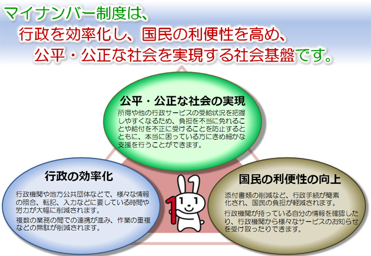
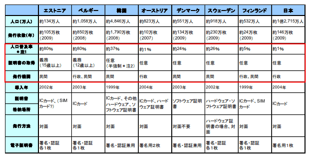
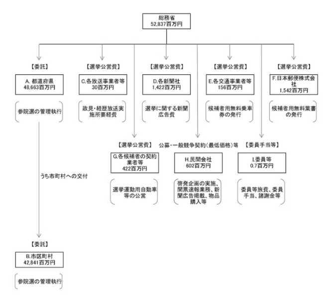
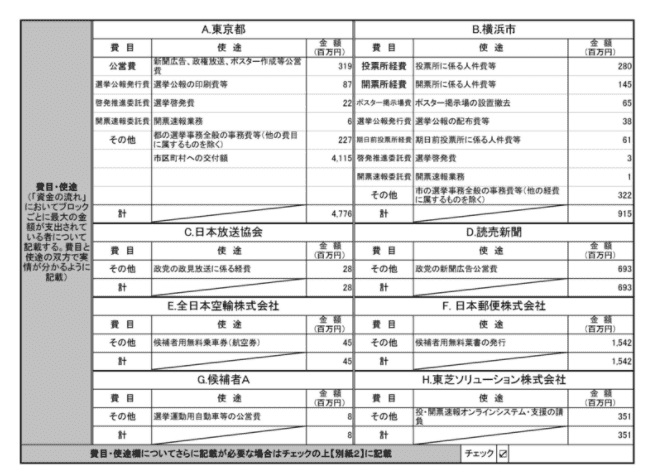

## 当日の流れ

- ETHTerakoya について
- マイナンバーの目的と活用
- マイナンバーの課題と応用事例
- 投票について
- 選挙について
- インターネット投票のポテンシャル
- 今後の進め方

## 参加者一覧

- 富士通研究所

  - 堀井 基史

- 日立製作所

  - 江丸 裕教
  - 長沼 健
  - 齊藤 紳一郎

- アクト

  - 小林 智彦
  - 浅井 延幸
  - 丸山 速人

- ケンタウロスワークス / 早稲田リーガルコモンズ法律事務所

  - 河﨑 健一郎

- GVA 法律事務所

  - 牧野 史晃

- サイボウズ・ラボ

  - 光成 滋生

- コラボゲート

  - 栗原 宏平

- コンプス / オルツ

  - 西村 祥一

- クーガー
  - 石井 敦
  - 石黒 一明
  - 佐々木 俊平
  - 辰巳 ゆかり
  - 石田 謙太郎
  - 田中 滋之

## 1. Executive Summary

- 日本の電子政府化の遅れはあるものの日本のマイナンバーの歴史はまだ浅く、これから改善が進んでいく余地は大いにある。
- インターネット投票によって投票率が上がるとは限らない。
- 技術的には可能であっても、社会の理解を得るための変化や説明力が必要。
- 電子投票はセキュリティの課題も残っており、導入までの壁は大きい。
- 投票の形態も様々であるため、ターゲットを絞った中で実装を行う。

## 2. Introduction

個人を識別する番号として、国民に対して大きな影響力を持つマイナンバー。行政手続きの効率化や公正・公平な社会の実現を目指し、マイナンバーの普及活動が進められている。新型コロナウイルスの拡大から、行政手続きの効率化のためにマイナンバーカードの申請数は増加している。一方、マイナンバーカードの製造コストの増加、複数の管理者が絡むことによるシステムの複雑化やガラパゴス化など様々な課題が指摘されている。これらの課題を背景に、有識者が技術・ビジネス・法律など様々な角度から課題を深堀し、社会実装に向けオープンな仕様書を提案してくために立ち上げられたのが、「ID× 投票 × ブロックチェーンワーキンググループ」である。第 1 回のワーキンググループではマイナンバーや投票にまつわる前提知識をベースに 2 回目以降に掘り下げていくべきイシューの議論を行った。

## 3. Details

### 3.1 マイナンバーの目的と活用

総務省のホームページ(\*1)によると、マイナンバー導入の目的として、① 国民の利便性の向上、② 行政の効率化、③ 公正・公平な社会の実現を掲げている。現状、多くの行政手続きでデジタル化が進んでおらず、 国民の利便性の向上や公務員の業務の効率化など、生産性を高めるための仕組み作りは実現できていない。その中、私たちが普段利用している多くの IT サービスでログインが求められるように、個人に紐づいたサービスを享受する上で、ID の活用は必須である場合が多く、行政サービスにおいて ID の役割を果たすのはマイナンバーである。実際、政府はマイナンバーカードの浸透に向け、給付金のオンライン申請や健康保険証としての利用、決済アプリと連携したポイント付与など、国民の利用インセンティブを高める動きを見せている。新型コロナウイルスによってマイナンバーカード普及への追い風に吹く一方、2020 年 5 月末時点での普及率は 16.7%と低い数字となっている。マイナンバーを取り巻く環境にはどういった課題があるのか見ていく。

[総務省 HP より](https://www.soumu.go.jp/kojinbango_card/01.html)

### 3.2 マイナンバーの課題と ID 活用事例

2013 年に刊行された「マイナンバー法のすべて」では、マイナンバーに関して 3 つの課題が指摘されている。

#### ① コスト肥大化の問題

- 国・自治体・その他の機関など、別々の法律や制度や管理者の中で単一のシステムを作る難しさ。
- システムへのアクセス手段が国の配布する IC カードに限定されているかつ、それに伴う IC カードの製造コストの増大。
- 横の連携を可能とする設計の乏しさによるシステムのガラパゴス化と、それに伴う開発コストの増大。

#### ② プライバシー保護の問題

- 国が発行する IC カードにログインが限定されており、国が管理するから安全であるとする危なさ。
- 情報保有機関の個人に振る番号をマイナンバーに共通化する想定から発生するプライバシー侵害リスク。

#### ③ アクセス手段限定の問題

- 民間企業が発行する ID でのアクセスができない。
- 業務システムの要求レベルに応じたログイン ID の使い分け(常に実印が必要というような状態)。

2020 年時点で、民間企業が提供する決済アプリとの連携やスマホ利用の検討など、上記の課題に対する解決策は徐々に進められている。

[マイナンバーカードの機能をスマホに搭載することを検討](https://k-tai.watch.impress.co.jp/docs/news/1262480.html)

一方、世界的に見ると日本の行政のデジタル化はまだまだ道半ばである。シンガポール政府は 2016 年ごろから官民共通のデジタル ID 化を積極的に進めている。特徴的なのは、政府のインフラ基盤をベースとして民間へのシステム開放を積極的に行っている事である。企業は、政府提供の共通 API や各種ツールを使って認証基盤を自社のサービスに導入することができる。その結果、開発や業務コストの削減に繋げている。一方、中央集権型システムであるためトラブルが発生すると機能不全となるリスクや、民間企業での導入が想定通り進むのかといった点で課題も残る。

[2010 年 電子政府推進対応ワーキンググループ報告書より](https://www.soumu.go.jp/main_content/000087340.pdf)

ブロックチェーンを活用した ID サービスもある。Ethereum を利用した分散型デジタル ID サービス「uPort」はユーザーがモバイルデバイスを紛失してキーにアクセスできなくなったとしても、uPort 上で永続的な識別子を保持することができるようになっている。

また、マイクロソフトは 2016 年に uPort（Ethereum ベース）と Onename(Bitcoin ベース)と連携して、国連が提唱するすべての人に法的な ID を提供するためのオープンソースのクロスチェーン ID システムの開発を発表した。

日本の ID× ブロックチェーンの事例として、富士通が開発を進めている取引相手の信用力を判断するアイデンティティー流通技術「IDYX（IDentitY eXchange）」がある。IDYX はユーザーが取引を行った際に相手に対してお互いに行う評価と、過去の取引などから個々に構造化されていくユーザー間の関係性を使って、取引相手の本人情報の信用度と詐称リスクを分析している。

##### **議論**

**栗原**
韓国が世界で最も電子政府化が進んでおり、韓国では国民ナンバーを用いたサービスの享受が当たり前になっている。韓国では 1968 年ごろから導入が始まって、紆余曲折あっていまがある。それと比較すると、日本のマイナンバーの歴史はまだ浅いため、日本はまだまだこれからという部分はある。また、日本はマイナンバーに関する訴訟もあり、国がどういう風にマイナンバーを扱っていくのかや仕組みを積極的に開示していく必要がある。

**堀井**
IDYX を開発する上で難しかったのが、google の検索エンジンとなったページランクのアルゴリズムなどを使って取引データなどをグラフ関係などにして個人の信用スコアを作る部分。

**長沼**
IDYX はなんのブロックチェーンを採用しているのか？

**堀井**
インディーを使っているが、スピードが遅いので他のものも検討している。

**長沼**
日立でもインディーを検討しているが、ドキュメントも少なく動かす大変さを感じている。

技術・法律・ビジネスなど複数の専門領域からなるワーキンググループでは、マイナンバーの前提から見つめ直していく。例えば、本当にマイナンバーカードに生年月日や性別の記載は必要なのかという問いである。Apple 社が提供している物理クレジットカードには名前の記載しかない。クレジットカードで当たり前であるセキュリティコードやクレジット番号の情報は印字されていない。Apple 社は他のどの物理的クレジットカードよりも安全であるとアピールしている。マイナンバーカードを扱う際の本人証明が重要な局面において、その人がいつ生まれたのかという情報自体は重要ではなく、その人が本当に本人であることの証明がより重要になる。これらの前提をベースに解くべき課題の設定が重要となる。

[Apple Card HP より](https://www.apple.com/apple-card/)

### 3.3 投票について

投票領域においてもブロックチェーンの活用は進められている。2020 年 6 月に Bitflyer 社はブロックチェーン投票によるマイナンバー認証を用いたバーチャル株主総会を行った。Bitflyer 社は経済産業省が 2 月に「ハイブリッド型バーチャル株主総会の実施ガイド」に課題として挙げていた”なりすまし不正”をブロックチェーンとマイナンバーを活用して防止する仕組みを提供している。

またエンタメ領域においても投票 × ブロックチェーンの活用が進められている。その一つがゲームである。CryptoGames の場合、ユーザーにとってキャラクターは資産であり、パラメーターは資産価値を持つ物と定義している。そのため運営側がユーザーの資産に干渉することなく、ユーザーがキャラクターのパラメーターをユーザー投票で決めている。

### 3.4 選挙について

インターネット選挙について各国で活発な動きは進められているものの、大きな成果は得られていない。その原因の一つがセキュリティ面の懸念が拭えないことである。選挙の場合、国や市町の政策に関わり、巻き戻しが困難であるため、リスクを取ることが難しい。以下では国や市区町村でのインターネット投票の事例をあげていく。

#### アメリカ

アメリカでは主に海外からの投票について、アリゾナ、コロラド、ミネソタ、ノースダコタの 4 つの州では専用のウェブサイトから投票可能である。また、ウェストバージニア州では、ブロックチェーン技術を使ったモバイルアプリが提供されている。他にも 19 の州では e-メールないしは fax を使って投票することができる。一方、スマホ投票を行ったワシントン州では投票率が改善したという結果を得ることはできていない。

#### スイス

2003 年以来、各州が主導して 300 を超える選挙や国民投票でインターネット投票を行ってきたスイスでは、連邦政府が主導して 2019 年 10 月の連邦議会選挙において全 26 州のうち少なくとも 2/3 以上の州でインターネット投票を予定していた。しかし、システム開発費の高騰やセキュリティ面の問題から、2019 年の連邦議会選挙ではこれまでにインターネット投票を行っていた州も含めてすべての州でインターネット投票の実施が見送られることになった。

#### 日本

##### 2018 年 8 月：つくば市がマイナンバー × オフライン投票の実証実験

- 個人認証: マイナンバーカードを用いて、複数の認証サーバーを経由して、本人確認を行う。
- ネット投票: 暗号化技術を用いて、投票数を正しくカウントしながらも、誰に投票したのか第三者にわからないような秘密性を担保。

##### 2020 年 5 月：総務省が全国５市区町でマイナンバー × インターネット投票の実証実験

海外で暮らす有権者を対象に、国政選挙での導入が検討されているインターネット投票の実証実験。スマートフォンの専用アプリで、マイナンバーカードを読み取ってパスワードを入力すると、投票画面が表示される仕組み。投票先を選んだ後、データを暗号化するために、再びマイナンバーカードの読み取りと、パスワードの入力をして送信すると、集計用のパソコンに得票数が表示される。

#### 電子政府先進国 エストニア

エストニアは国政選挙ですべての国民を対象にしたネット投票を実施している。エストニアの国民は、パソコンとエストニアの ID カードさえあれば、世界中のどこにいても選挙に参加することができる。有権者はダウンロードした投票用ソフトウェアから、ID カードに記載されている数字とパスワードを入力し、候補者を選択するだけ。買収や脅迫に対する対策として、一度投票を行っても期間内であれば投票内容を変更できるシステムになっている。エストニア政府は、人口 130 万人のうちおよそ 30％が電子投票システムを利用していて、1 回につき 1 万 1000 時間もの選挙関連の労働時間が削減できると述べている。しかし、エストニアの電子投票システムの脆弱性が問題視されている。2014 年、ミシガン大学でコンピューターサイエンス分野の准教授であるアレックス・ヘルダーマン氏は、エストニア国内で利用されている電子投票システムの安全性を調査するため、実際のシステムと同じ構成を持つダミーシステムを研究室内に構築し、一連の投票の手順でどのような問題があるかという検証した。その結果、投票者のコンピューターへのハッキングと、投票システムにマルウェアを仕込むことの両方の方法で、選挙結果を操作できることが判明している。

##### **議論**

**石黒** 投票というものがでてきてから長い年月が立っているが、実際にオンライン化が進んでいない背景として、セキュリティを求められるレベルまで引き上げる際のコストや改ざんされた際に致命傷を負うのでリスクが大きいという部分がある。アメリカでは Open vote foundation がインターネット投票までのマイルストーンを作っていたが、セキュリティレベルが満たされるまでは実装を始めないことを発表しており、実装までの道のりはかなり険しいと考えている。

**石井** インターネットができた当初からみんなインターネットでやればという考えをするが、インターネットはコピーマシーンのような側面があったり、改ざんしやすさなどの問題もあり、紙と比べた際のデメリットが残る。

---

投票者および管理者の両側面から現在の選挙の課題を検討した。投票者における課題として、① 政治への関心の低下、② 高齢者など移動が困難な人にとって投票所に足を運ぶ困難さ、③ 一票の格差、④ 手続きの複雑性が挙げられる。特に車移動が必須であるような地域や在外の住人にとって、インターネット投票の利便性は非常に大きい。

---

**小林** 現状の選挙システムは自治体ごとに環境を構築する必要がある。また、資本の少ない一部市区町村ではシステムの導入は進みにくい。以前、山田太郎さんと山本太郎さんの集計ミスがあったが、このような背景から人の手に頼らざるを得ない状況もある。

**河崎** 秘密投票とセキュリティの面でなかなか実装が進んでいないと考えていたが、つくば市の事例などから徐々に機を熟してきていると感じた。一方、社会実装の最大の壁はそれを社会が受け入れられるか。実際にハンコ文化も、問題は沢山あるにも関わらず、当たり前に続いている。現行の投票制度も多くの問題を抱えており、技術的には解決できるものも多いが、解決できていない。つまり、これらの問題を解決するためには、社会そのものの変化が求められる。その中で、今回のコロナは非常に大きなチャンスになるのかもしれない。

**石井** 投票のような秘密性やセキュリティが求められる事例においてブロックチェーンを活用した ID システムを構築することができれば、多くのブロックチェーンサービスの ID にも適応できると思う。

**河崎** 選挙をデジタル化するために実装する際、公職選挙法などにひっかからないのかという文脈でリサーチをしていく必要があると感じた。

**斎藤** 自治体が導入する際にコスト感や導入した時の嬉しさなど、技術的実現性の上に乗ってくる部分の価値の掘り下げが重要になってくると思う。

**石井** 世界中の企業が Linux を使っている。標準的なものが入っているからこそ、多くの人がそれを選択していく。

**小林** インターネット投票で若者の投票率が上がるとしても、今の自民党政権がそれを喜ぶのかといった政治的な交渉も導入の際に必要になると思う。

**光成** 暗号化によって改ざん耐性を強くする部分は重要である一方、実際に導入する際に顧客は安全と言われても、数式の説明では安全性を理解できない。そのため、顧客は納品されたものを信用するしかない。そういった課題も解決していく必要がある。

**石黒** 投票者の秘匿性が実現できたとしても、公平性や透明性の担保にはあらゆる側面を検討する必要がある。実際にブロックチェーンの投票や募金の際、オフライン空間や SNS で共謀などが起きている。そこまで含めて「投票」ということを考えていく必要がある。

**石井** 投票の仕組みの裏にある課題を深堀していくことで「なぜ今インターネット投票が進んでいないのか」の解像度があがっていく。

**栗原** つくばの実証実験の話を聞いた際、当時から在外の人向けにインターネット投票をしたいというニーズは大きかった。例えば、アメリカでは、例えば軍隊のために在外投票が発展している。投票も様々な種類があるため、ターゲットを絞ることが得策であるだろう。

**牧野** 投票層のボリュームゾーンが高齢化が進んでいく中、どのターゲットに絞るのかは重要な課題であると思う。また、なぜインターネット投票が進んでいないのかという点で、個人的見解として、紙の投票が誰かを選ぶ際のオラクル的な側面を持ち合わせているのではないかと考えていた。

### 3.5 インターネット投票のポテンシャル

多額の税金が選挙のために支払われている。政府が作成している行政事業レビューシートをもとに金額の内訳について考察した記事(\*3)によると、平成 28 年の参院選では 528 億円もの税金が投入された。新聞社 8 社に対しては、新聞広告費として 14 億円を費やしている。実際の投票率は 54.7%であったことから、14 億円もの広告宣伝費の ROI が高かったのかを議論する余地はあるだろう。また横浜市では、5 億円近い人件費がかかっている。インターネット投票によって、人への依存を減らし、投票の UX を向上することで投票率をあげることができた場合、コストの削減が実現できる可能性がある。

[参議院選挙「1 票＝ 500 円」を肝に銘じる。より引用](https://news.yahoo.co.jp/byline/itoshin/20190718-00134746/)

[参議院選挙「1 票＝ 500 円」を肝に銘じる。より引用](https://news.yahoo.co.jp/byline/itoshin/20190718-00134746/)

## 4. Conclusions

ID という存在は私たちに一般的な存在であるものの、その適応範囲や権利のあり方は常にアップデートされている。その中で、行政機関が関わりを持つ国民 ID であるマイナンバーは日々存在感を増しており、民間企業の ID との切り分けおよび横の連携のイシューを深掘りしていくことが求められる。一方で、行政機関そのものが巨大組織であり、機関毎の役割も異なることから、何に対して課題解決を行うかのテーマ設定を行う必要がある。ブロックチェーン技術の ID や投票への応用は、データ所有権の個人化や P2P の強みの適用、トランザクションの証明性など様々な文脈から用いられている。前半のワーキンググループでは全体課題の深掘りを行い、後半から絞ったイシューをもとに、仕様書の作成やプロトタイプの実装を進めていく。

---

## 参考

1. [総務省ホームページ「マイナンバー制度」](https://www.soumu.go.jp/kojinbango_card/01.html)
2. 八木 晃二 (2013). マイナンバー法のすべて マイナンバー制度の問題点
3. [参議院選挙「1 票＝ 500 円」を肝に銘じる](https://news.yahoo.co.jp/byline/itoshin/20190718-00134746/)
