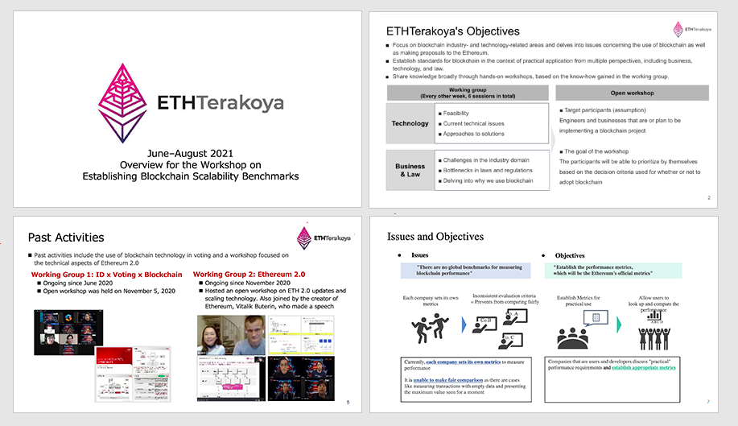
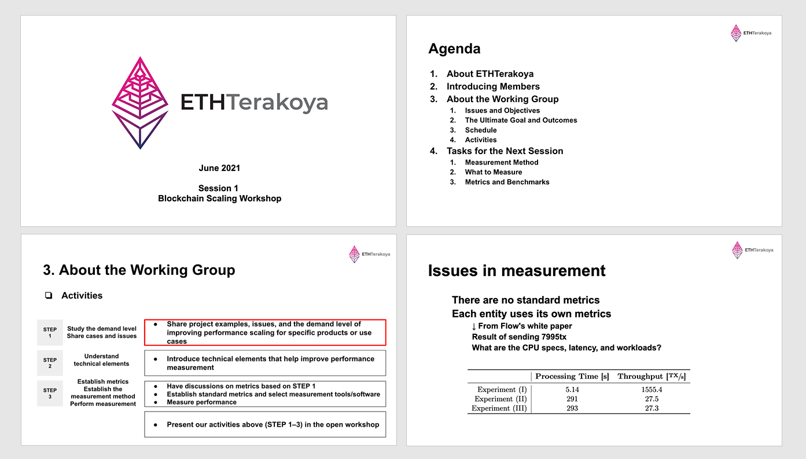

## Table of Contents

- 1.Introduction
- 2.Details

## List of participants

- Hitachi Ltd.

  - Hironori Emaru
  - Nao Nishijima Nao
  - Shiori Harazono
  - Masaki Hirayama

- Hitachi Solutions, Ltd.

  - Kenei Tanabe

- NTT DATA Corporation

  - Shinichi Yamashita
  - Jin Watanabe

- NTT TechnoCross Corporation

  - Kazuhiro Kanematsu

- Accenture Japan Ltd

  - Tomokazu Hatate

- Nomura Asset Management

  - Teruyoshi Imamura

- SingulaNet Ltd.

  - Koji Machi

- Comps Co., Ltd.

  - Yoshikazu Nishimura

* Couger Inc. (Organizer)

  - Atsushi Ishii
  - Kazuaki Ishiguro
  - Shumpei Sasaki
  - Shigeyuki Tanaka
  - Yukari Tatsumi
  - Keita Shimizu

## 1. Introduction

  <a
    href="/pdf/scaling/E-ETHTerakoya_Overview-scaling_v006_en.pdf"
    target="_blank"
  >
    Download
  </a>

ETHTerakoya specializes in blockchain industry- and technology-related areas and delves into issues concerning the use of blockchain. We also make proposals to the Ethereum Foundation and establish standards for blockchain.

Our working group focuses on and has discussions about solutions to the overall issue surrounding blockchain, which has no global benchmarks to measure the performance.

## 2. Details

  <a href="/pdf/scaling/E-2021_06_ethterakoya_kickoff_en.pdf" target="_blank">
    Download
  </a>

In this kick-off meeting, we will discuss the following topics: 1) Identify performance evaluation criteria, 2) Set required values for each item, and 3) Select measurement tools and perform the measurement.

Our discussions start with sharing each company's cases. We will look at each topic closely, considering software, networks, and applications separately.
