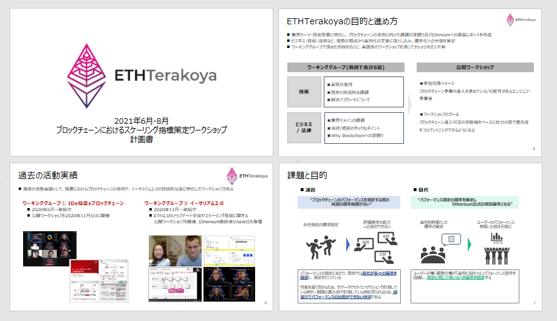
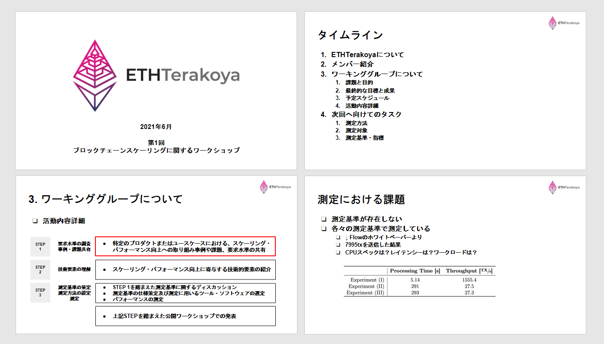

## 目次

- 1.Introduction
- 2.Details

## 参加者一覧

- 株式会社日立製作所

  - 江丸 裕教
  - 西島 直
  - 原園 栞
  - 平山 雅樹

- 株式会社日立ソリューションズ

  - 田辺 謙英

- 株式会社 NTT データ

  - 山下 真一
  - 渡邊 仁

- NTT テクノクロス株式会社

  - 兼松 和広

- アクセンチュア株式会社

  - 旗手 友和

- 野村アセットマネジメント株式会社

  - 今村 光良

- SingulaNet 株式会社

  - 町 浩二

- 株式会社コンプス情報技術研究社

  - 西村 祥一

* クーガー株式会社（主催）

  - 石井 敦
  - 石黒 一明
  - 佐々木 俊平
  - 田中 滋之
  - 辰巳 ゆかり
  - 清水 啓太

## 1. Introduction

  ファイルダウンロードは
  <a href="/pdf/scaling/ETHTerakoya_Overview-scaling.pdf" target="_blank">
    こちら
  </a>

ETHTerakoya では、業界テーマ・技術要素に特化し、ブロックチェーンの活用に向けた課題の深掘り、及び Ethreum への提案レポートの作成・標準化への仕様策定を行っている。

当ワーキンググループでは、ブロックチェーンのパフォーマンスを測定する際の共通の標準指標がない、というブロックチェーンの全体課題に着目し、解決に向けたディスカッションを行っていく。

## 2. Details

  ファイルダウンロードは
  <a href="/pdf/scaling/2021_06_ethterakoya_kickoff.pdf" target="_blank">
    こちら
  </a>

今回は１，パフォーマンス評価観点の洗い出し　２，各項目への要求値の設定　３，測定ツール選定・実測　というステップを踏み、検討を進めたい。

各社の事例を持ち寄り、共有するところからディスカッションを進める。ソフトウェア・ネットワーク・アプリケーションの別なども意識しながら精査を進めたい。
