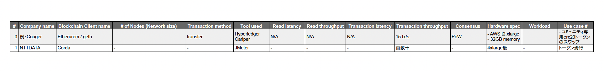
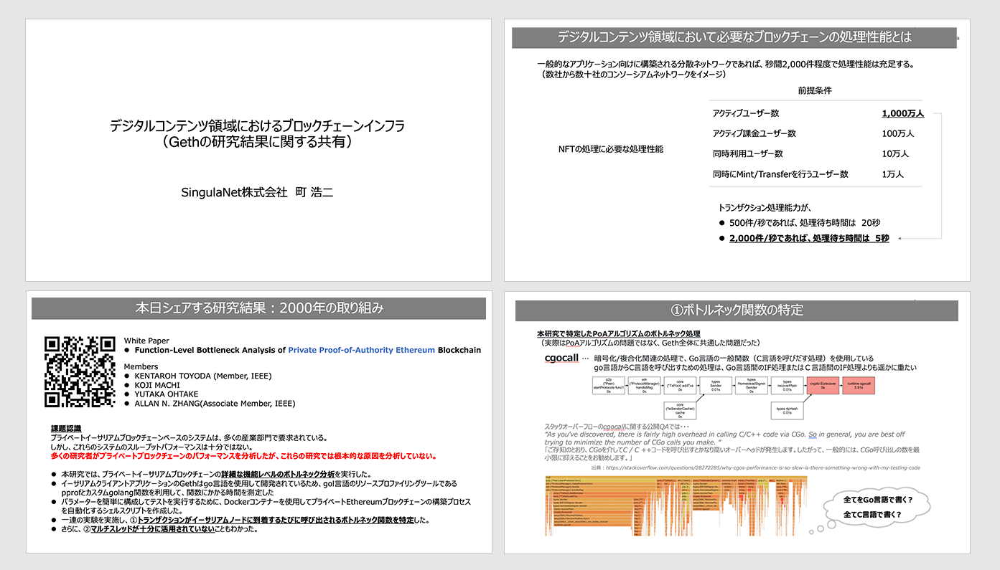

## Contents

- 1.Agenda

- 2.Case Studies

  - 2.1 About Corda use cases

  - 2.2 Sharing case studies in Sapporo and Okinawa

  - 2.3 Performance measurement of PoA / PoW

  - 2.4 Hyperledger Besu community case study

  - 2.5 The results of verifying the performance of the workings of the system Hyperledger Fabric in the future

  - 2.6 Case study of PoA Clique basic value data measurement

  - 2.7 Performance measurement of Layer 2

- 3.Summary - items likely to be changed or added as a comparison

## List of Participants 

- NTT DATA Corporation

  - Hitoshi Watanabe

- NTT TechnoCross Corporation

  - Kazuhiro Kanematsu

- Hitachi, Ltd. 

  - Shiori Harazono

  - Masaki Hirayama

- Accenture Japan Ltd.

  - Masatsugu Yamada

- Hitachi Solutions Ltd.

  - Kenei Tanabe

- SingulaNet Ltd.

  - Koji Machi

- Comps Information Technology Research Co., Ltd.

  - Shoichi Nishimura

- Couger Inc. (Organizer)

  - Atsushi Ishii 

  - Kazuaki Ishiguro

  - Shunpei Sasaki 

  - Shigeyuki Tanaka 

  - Yukari Tatsumi

  - Keita Shimizu  

## 1. Agenda

In the second session, case studies were presented as a way for each participating business to share in what way they are conducting performance measurement.

The following items were initially deemed essential for performance measurement, and that was kept in mind when sharing information.

- Blockchain Client Name
- Number of Nodes (Network size)
- Transaction Method
- Read Latency
- Read Throughput
- Transaction Latency
- Transaction Throughput
- Consensus
- Use Case

## 2. Case Studies

### 2.1 About Corda Use Cases

**NTT DATA Corporation｜Hitoshi Watanbe **

  Download the file
  <a style="margin-left: 5px" href="/pdf/scaling2/scalling-workshop_2_NTTDATA.pdf" target="_blank">
   here
  </a>

We will present a case that used the blockchain infrastructure “Corda”.

For performance measurement, many of the matters focused on the response at a business layer viewed as an entire application, rather than purely at the blockchain layer. In many cases, the performance was assessed from JMeter, EFK logs, etc.

### 2.2 Sharing Case Studies in Sapporo and Okinawa

**NTT TechnoCross Corporation｜Kazuhiro Kanematsu**

Download the file
  <a style="margin-left: 5px" href="/pdf/scaling2/scalling-workshop_2_NTTTX.pdf" target="_blank">
    here
  </a>

There are two cases that can be presented. One is the “Sapporo ICT Utilisation Platform”, operated by Sapporo City and the Sapporo Industrial Promotion Foundation. The other is the MaaS case, which utilises Okinawa’s public transportation IC card “OKICA”.

In past demonstrations, everything was carried out in private or in a consortium.

For performance measurement, we implemented a standard application at a level that can be used with any project. Then while changing the level of the network and consensus building model, it was considered fair to carry out an assessment of how performance changed depending on any changes in “dispersiveness” and “decentralisation” of the blockchain. 

### 2.3 Performance Measurement of PoA / PoW

**Hitachi Ltd. ｜Shiori Harazono, Masaki Hirayama**

We would like to present the results of our performance evaluation using Ethereum before commercialisation. We carried out tests of three scenarios, with separate conditions for numbers of threads and loops. Each was implemented with PoW and PoA respectively.

The results of the PoW test were compared under three scenarios. The PoA test was carried out in one scenario under the same conditions.

**Questions**

**Q1.**Isn’t the throughput too low for PoA?

**A.**This data seems to be the result of an application-oriented measurement, meaning that rather than evaluation of the blockchain itself, it can be thought of as an evaluation of the application as a whole.

**Q2.**Can you estimate the upper limit of block gas, and the block raw interval for PoA?

**A.**I think it is using Geth’s default settings.

### 2.4 The Results of Verifying the Performance of the Workings of the System Hyperledger Fabric in the Future

**Accenture Japan Ltd.｜Masatsugu Yamada**

  Download the file
  <a style="margin-left: 5px" href="/pdf/scaling2/scalling-workshop_2_Accenture.pdf" target="_blank">
     here
  </a>

I would like to introduce an example that measures the influence of continuing to operate a financial institution’s point management system for several years.

In the results of this example, the case study concludes that redefinition of non-functional requirements and performance measures are a necessity.

Performance issues can be separated into individual points that each require individual consideration: The distribution of acute deterioration due to concentration of load, and the chronic deterioration due to the passing of years.

For the chronic deterioration due to the passing of time, it is important to establish multiple points of reference when measuring. As for the acute deterioration due to load concentration, it is important to consider in advance what can be assumed as the maximum load of the entries to the TAT reference system.

### 2.5 Hyperledger Besu Community Case Study

**Hitachi Solutions Ltd.｜Kenei Tanabe**

We will present an article from the Hyperledger Besu Community that claims to be TPS.

GraalVM is used as the JavaVM measurement conditions.

Due to the article “not including the hardware spec”, which was brought up last time, it cannot be compared with another case study, so we would like to keep that as a reference.

**Questions**

**Q1.**Is the measurement based on a specific use case?

**A.**In the document, I read that smart contracts are used in a fairly simple way. It is thought to be an example of a lack of awareness about operational use cases.

**Q2.**Is the object of the test based on Besu?

**A.**That seems to be the case

### 2.6 Case Study of PoA Clique Basic Value Data Measurement

**SingulaNet｜Koji Machi**

  Download the file
  <a style="margin-left: 5px" href="/pdf/scaling2/scalling-workshop_2_SingulaNet.pdf" target="_blank">
     here
  </a>

I would like to introduce a study intended to measure the Clique basic value data for Ethereum PoA. In this study, we are measuring production per second as a standard research to see just how far we can aim at.

If we look at a segmented process as a unit, we can see where it bottlenecks in a sequence, and it becomes possible to also use it as a material to study enhancement aimed at performance improvement.

### 2.7 Performance Measurement of Layer 2

**Comps Information Technology Research Co., Ltd. ｜Shoichi Nishimura**

We are measuring the throughput and other aspects of “Burn”, our independently developed Layer 2 Solutions. We also plan to do measurements using Crliper in the future.

As a result of the measurement, we reached up to 1226 TPS on the m5.xlarge. As for the t2 series of Burst instances, they were fast in the beginning, but slowed down suddenly upon running out of credit, so there were waves.

**Questions**

**Q1.**Does the performance rely on the condition of the mainnet?

**A.**You can set it to write data to the mainnet, but bundling them together every few blocks to write the hash is carried out as a separate process, so there will be no direct influence on the performance evaluation.

**Q2.**Will there be occurrences of bottlenecks?

**A.**If you set it to write frequent checkpoints to Ethereum, there could be bottlenecks, but if only for one hour, or once per day, the impact would be negligible. 

## 3. Summary - items likely to be changed or added as a comparison

From the presentations of each company, an agreement was reached that the following items are also necessary, in addition to the required items used when comparing performance assumed from the initial hypothesis. 

- Hardware specs - CPU, memory, storage, etc. that affect performance need to be clearly specified.

- Workload - information on the workload is a necessity. It will be even better if there are breakdown items, such as resource consumption trends taken during workload tests. If you know about the specific process that causes a bottleneck for processing delays, it will be helpful when refining plans for performance improvement.

- Amount of workload being expended.

- Representative processes - due to the varying measurement results of the target processes, specifying the target process, such as the sending of tokens, would be preferable.

- Tools Used

- Presence or absence of network - results will differ greatly depending on whether the internet is or is not used as an intermediary. 
