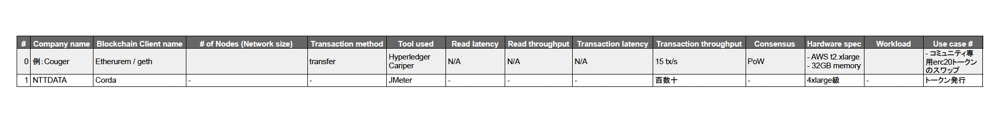
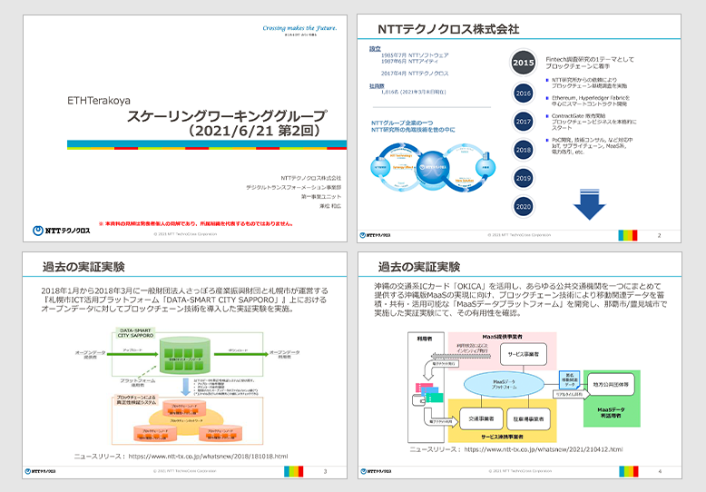
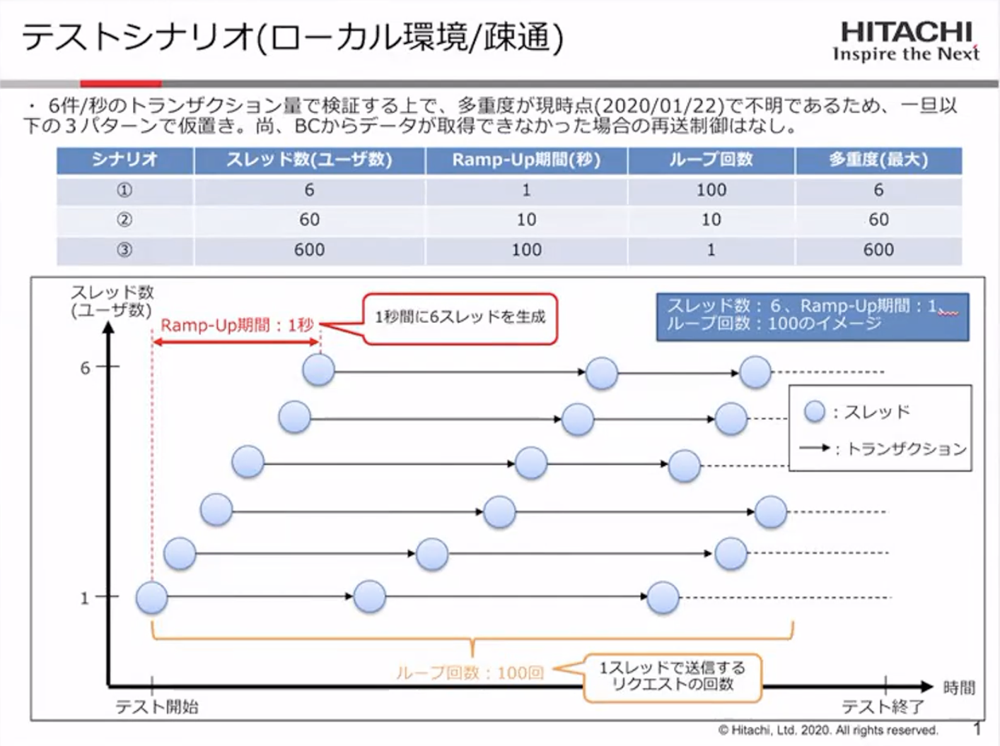
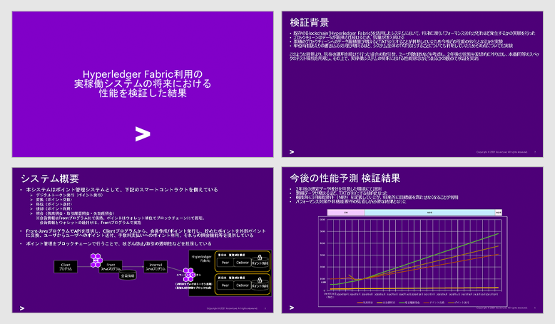

## 目次

1. Introduction

2. 事例紹介

   2.1 Corda 利用事例について

   2.2 札幌・沖縄での事例共有

   2.3 PoA / PoW での性能測定

   2.4 Hyperledger Besu コミュニティの事例

   2.5 Hyperledger Fabric 利用の実稼働システムの将来における性能を検証した結果

   2.6 PoA の Clique 基礎値データ計測事例

   2.7 Layer2 における性能測定

- 3.まとめ - 比較項目として追加・変更すべき項目

## 参加者一覧

- 株式会社 NTT データ

  - 兼松 和広

- NTT テクノクロス株式会社

  - 兼松 和広

- 日立製作所株式会社

  - 原園 栞
  - 平山 雅樹

- アクセンチュア株式会社

  - 山田 昌嗣

- 株式会社日立ソリューションズ

  - 田辺 謙英

- SingulaNet 株式会社

  - 町 浩二

- 株式会社コンプス情報技術研究社

  - 西村 祥一

- クーガー株式会社（主催）

  - 石井 敦

  - 石黒 一明

  - 佐々木 俊平

  - 田中 滋之

  - 辰巳 ゆかり

  - 清水 啓太

## 1. 議題

第２回は各参加企業がどのように性能測定を行っているかを共有する場として、事例発表を行った。

下記の項目を性能測定の必須項目と初期的に想定し、意識を置きながら情報を共有した。

## 2. 事例紹介

### 2.1 Corda 利用事例について

**株式会社 NTT データ ｜ 渡邊 仁 **

  ファイルダウンロードは
  <a href="/pdf/scaling2/scalling-workshop_2_NTTDATA.pdf" target="_blank">
    こちら
  </a>

ブロックチェーン基盤「Corda」を使った案件を発表する。  
性能測定においては、純粋なブロックチェーンレイヤーでの測定ではなく、アプリ全体として見た業務レイヤーでのレスポンスに注目する案件が多かった。JMeter や EFK のログなどからパフォーマンスを見ているケースが多い。

### 2.2 札幌・沖縄での事例共有

**NTT テクノクロス｜兼松 和広**

  ファイルダウンロードは
  <a href="/pdf/scaling2/scalling-workshop_2_NTTTX.pdf" target="_blank">
    こちら
  </a>

発表できる案件は２件。札幌市と一般財団法人さっぽろ産業振興財団が運営する「札幌市 ICT 活用プラットホーム」と、沖縄の交通 IC カード「OKICA」を活用した沖縄での MaaS 案件である。

過去の実証実験は、全てプライベートかコンソーシアム型で実施した。

性能測定においては、どのプロダクトを利用しても実装できるようなレベルの標準的なアプリケーションを実装した上で、合意形成モデルやネットワークレベルを変更しつつ、ブロックチェーンの「非中央集権」「分散性」の変化に応じて、どのように性能が変化するかの測定を合わせて評価を行う事が公平であると考えられる。

### 2.3PoA / PoW での性能測定

**日立製作所｜原園 栞・平山 雅樹**

  ファイルダウンロードは
  <a href="/pdf/scaling2/scalling-workshop_2_Hitachi.pdf" target="_blank">
    こちら
  </a>

商用化する前に Ethereum を使って性能評価をした結果を発表したい。シナリオは３つ、スレッド数やループ回数の条件を分けてテスト実施。それぞれ PoW と PoA で実施した。

PoW のテスト結果は、3 パターンのシナリオで比較。PoA のテストは、同条件で 1 シナリオを実施した

**質問**

**Q1、**PoA にしてはスループットが低いのでは。

**A、**このデータはアプリ寄りの計測結果のようで、ブロックチェーン自体の評価ではなく、アプリ全体での評価かと思われる。

**Q2、**ブロックのガス上限と PoA のブロック生間隔はどのくらいか。

**A、**Geth の初期設定値を使っていると思われる。

### 2.4 Hyperledger Fabric 利用の実稼働システムの将来における性能を検証した結果

**日立製作所｜原園 栞・平山 雅樹**

  ファイルダウンロードは
  <a href="/pdf/scaling2/scalling-workshop_2_Accenture.pdf" target="_blank">
    こちら
  </a>

金融機関のポイント管理システムを、今後数年間稼働させ続けたらどういう影響が出るかを測定した例を紹介したい。

この事例では、測定の結果、非機能要件の再定義やパフォーマンス対策が必要と結論づけている。

性能課題は、経年による慢性劣化と負荷集中による急性劣化に分けられ、それぞれに考慮すべきポイントが異なる。

経年による慢性的劣化には、測定をする際に基準点を複数設定することが重要となり、負荷集中による急性的劣化には、想定しうる最大負荷時の参照系 TAT 項目を事前に検討しておくことが大事である。

### 2.5 hyperledger Besu コミュニティの事例

**日立ソリューションズ｜田辺 謙英**

hyperledger Besu コミュニティの記事から、TPS を謳っている記事について発表する。

測定条件の JavaVM では、GraalVM を使用している。

以前議題に上がっていた「ハードウェアスペックが記載されていない」記事であるため、別事例との比較ができないことから、参考程度としたい。

**質問**

**Q1、**具体的なユースケースを元に測定したものか。

**A、**文献上、スマートコントラクトはかなり簡素なものを使っていると読み取れた。業務ユースケースについては深く意識していない例と思われる。

**Q2、**テスト対象は Besu をベースにしたものか。

**A、**そのように推測している。

### 2.6 PoA の Clique 基礎値データ計測事例

**SingulaNet ｜町 浩二**

  ファイルダウンロードは
  <a href="/pdf/scaling2/scalling-workshop_2_SingulaNet.pdf" target="_blank">
    こちら
  </a>

Ethereum の PoA の Clique 基礎値データを計測することを目的とした調査を紹介したい。この中では Production per second はどこまで目指せるのかなど、基礎研究として測定している。

細分化したプロセス単位で見れば、一連の処理の中でどこがボトルネックになっているのかが見えるため、パフォーマンス向上に向けたエンハンスの検討材料とすることも可能となる。

### 2.7 Layer2 における性能測定

**コンプス情報技術研究社｜西村 祥一**

独自開発の Layer2 ソリューションズ「Burn」でのスループットなどを測定している。将来的には Crliper での測定も予定している。

測定結果としては、m5.xlarge で 1226TPS までは到達した。Burst するインスタンスの t2 系では始めは速いが、クレジットを使い果たすと急に遅くなるため、波が出た

**質問**

**Q1、**パフォーマンスは、メインネットの状態に依存するか。

**A、**メインネットに書き込む設定はできるが、何ブロックごとに束ねてハッシュを書きに行くかは別プロセスで行うので、この性能評価に直接は影響はしない。

**Q2、**ボトルネックは発生するか。

**A、**頻繁にチェックポイントを Ethereum に書き込む設定をすればボトルネックになり得るが、１時間・１日に１回であれば影響はごく僅かである。

## 3. まとめ - 比較項目として追加・変更すべき項目

各社の発表から、初期仮説として想定した性能比較の際の必須項目に追加して、以下も必要との合意が得られた。

- ハードウェアスペック　ー　 CPU やメモリ、ストレージなど、パフォーマンスに影響する内容を明記する必要がある。

- ワークロード　ー　負荷に関する情報も必要と言える。負荷試験実施中のリソースの消費傾向など、Breakdown した項目があればなおよい。処理遅延のボトルネックとなっている処理が具体的に分かれば、パフォーマンス向上の施策を練る際にも役立つ。

- かけている負荷量

- 典型的な処理　ー　対象とする処理により測定結果も異なるため、トークン送付など、対象を明示することが望ましい

- 利用ツール

- Network 有無　ー　インターネットを介しているもの、いないものでは結果が大きく異なることもあるため。
