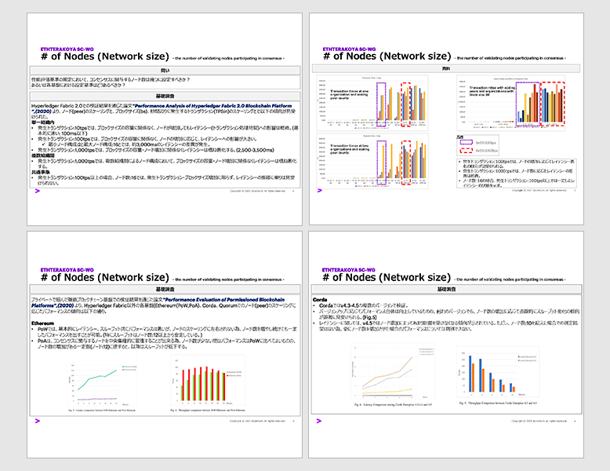
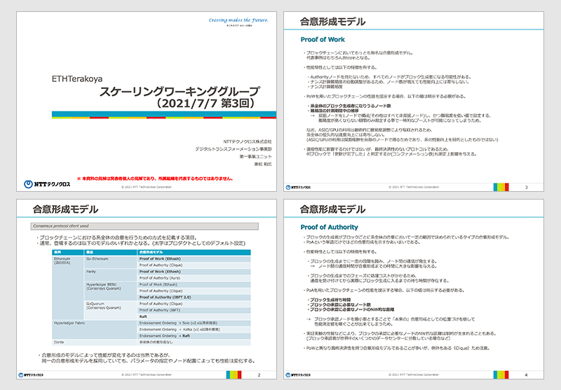
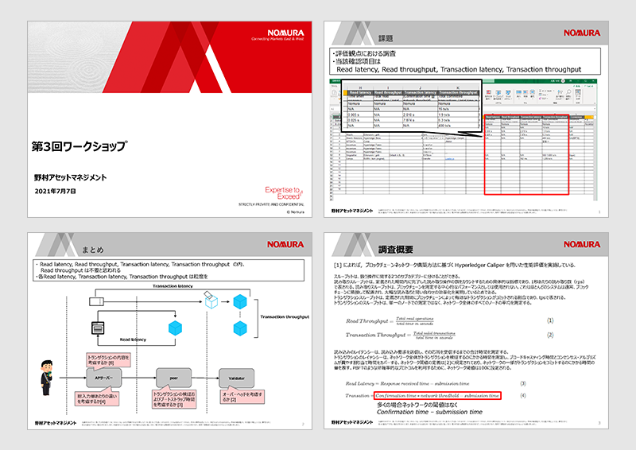
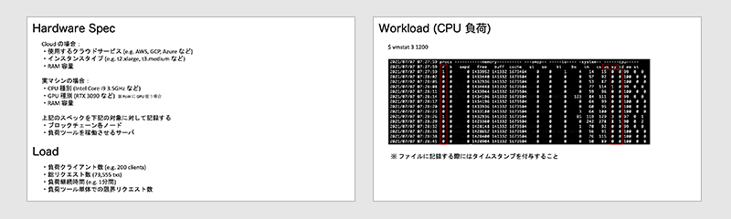
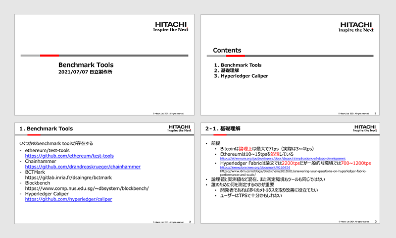

## Table of Contents

- 1. Agenda

- 2. Review of Survey Results

  - 2.1 Number of Nodes and Typical Processes

  - 2.2 Consensus Algorithms and Transaction Methods

  - 2.3 Latency and Throughput

  - 2.4 Hardware and Information on Loading

  - 2.5 Measurement Tools

- 3. Summary

## List of Participants

- Accenture Japan Ltd

  - Tomokazu Hatate 

- NTT TechnoCross Corporation

  - Kazuhiro Kanematsu

- Nomura Asset Management Co., Ltd.

  - Mitsuyoshi Imamura

- Comps Information Technology Research Co., Ltd.

  - Shoichi Nishimura

- Hitachi, Ltd.

  - Nao Nishijima 

- Hitachi Solutions, Ltd.

  - Kenei Watanabe 

- Couger Inc. (Organizer)

  - Atsushi Ishii 

  - Kazuaki Ishiguro

  - Shunpei Sasaki 

  - Shigeyuki Tanaka 

  - Yukari Tatsumi 

  - Keita Shimizu 

## 1. Agenda

For the third workshop, participating companies gave a presentation on the previously listed criteria for measuring performance.

This time, presentations were given by the following five companies: Accenture Ltd, NTT TechnoCross Corporation, Nomura Asset Management Co., Ltd., and Comps Information Technology Research Co., Ltd.

## 2. Review of Survey Results

### 2.1 Number of Nodes and Typical Processes

**Accenture Japan Ltd｜Tomokazu Hatate**

  Download the file
  <a style="margin-left: 5px" href="/pdf/scaling3/scalling-workshop_3_Accenture.pdf" target="_blank">
   here
  </a>

Using information from the Performance analysis of hyperledger fabric 2.0 blockchain platform, we are able to take the number of nodes (network size) into consideration. When we divide these results into PoW and PoA, a trend can be seen in both groups.

Again, we are also considering suitable methods of measuring performance.

### 2.2 Consensus Algorithms and Transaction Methods

**NTT TechnoCross Corporation｜Kazuhiro Kanematsu 兼松 和広**

  Download the file
  <a style="margin-left: 5px" href="/pdf/scaling3/scalling-workshop_3_NTTTX.pdf" target="_blank">
  here
  </a>

Consensus algorithms and transaction processes are a rough topic.

The most well-known example of a consensus algorithm is “Proof of Work” - used by BitCoin. Other examples of consensus algorithms include: “Proof of Authority”, “State Machine Replication”, and “Endorsement Ordering”. Regarding the process of transactions and how they are executed, the key steps within the process and how often updates occur are both important factors.

**Question**

**Q.**Does the approach differ on a case-by-case basis?

**A.**When using a public blockchain, the block number is thought to act as proof.

### 2.3 Latency and Throughput

**Nomura Asset Management Co., Ltd.｜Mitsuyoshi Imamura 今村 光良**

Download the file
  <a style="margin-left: 5px" href="/pdf/scaling3/scalling-workshop_3_Nomura.pdf" target="_blank">
    here
  </a>

Presentation of performance evaluation cases using the Hyperledger Caliper.

In this case, by using a blank transaction and a written transaction, measurements can be carried out with any overhead connections in the system taken into account.

Additionally, according to the contents of the contract, a key feature was the ability to carry out these measurements using cross-sectional data from various environments.

### 2.4 Hardware and Information on Loading

**Comps Information Technology Research Co., Ltd.｜Shoichi Nishimura 西村 祥一**

  Download the file
  <a style="margin-left: 5px" href="/pdf/scaling3/scalling-workshop_3_Comps.pdf" target="_blank">
    here
  </a>

We considered the information that should be presented when carrying out performance measurements by taking past cases into account.

The items and expected contents are as follows:

- Hardware Specifications

  - If using Cloud：

    - Usable Cloud service

    - Instance type

    - RAM capacity

  - If using a physical machine：

    - CPU type

    - GPU type ※ If using GPU for PoW

    - RAM capacity

  The specifications above are to be recorded for the following targets:

  - Each node of the blockchain

  - The server that will run the load tool

- Load

  - Number of load clients

  - Total number of requests

  - Duration of loads

  - Number of limited requests on the load tool alone

- Workload (CPU load)

  - $ vmstat 3 1200

* Workload (Disk load)

  - $ iostat –x 3

**Question・Discussion**

**Q.** For example, would I need an automated mechanism that can carry out a distributed execution on an area with 16 nodes?

**A.** Using metrics collection servers such as “Prometheus” and “Node Exporter” is an option.

### 2.5 Benchmark Tools

**Hitachi, Ltd.｜Nao Nishijima 西島 直**

  Download the file
  <a style="margin-left: 5px" href="/pdf/scaling3/scalling-workshop_3_Hitachi.pdf" target="_blank">
    here
  </a>

- There are several existing Benchmark Tools.

  - Hyperledger Caliper（The furthest developed）

  - ethereum/test-tools

  - Chainhammer

  - BCTMark

  - Blockbench

- In order to accurately evaluate the performance measurement between different blockchains, it is necessary to understand the definition of terms, indicators, and have the ability to describe details of the environment.

  - Definitions of key metrics

    - Read Latency = Time when response was received  – Time of response

    - Read Throughput = Total number of read operations/Total time

    - Transaction Latency = (Confirmation time@Threshold) - Time of response

    - Transaction Throughput = Total number of committed transactions/Total time of committed nodes＠Total number of committed nodes

  - Things to consider in a test environment

    - Consensus protocol

    - Geographical distribution of the nodes

    - Hardware environment

    - Network model

    - Number of nodes involved in the test transaction

    - Existing software components

    - Test tool

    - Type of data storage to use

    - Workload

**Question**

**Q.** I can only use Caliper to measure those that issue transactions to smart contracts, but how can I measure the transmission of native tokens?

**A.** This feature is currently not supported.

## 3. Summary

With the company presentations given this time, the definition of each item and important specifics have become clearer to understand.

In future, I would like to proceed with discussions on the preparation of white papers, and how to implement the procedures and conditions for testing.

