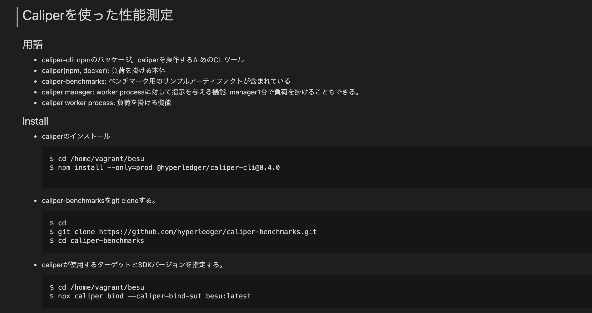
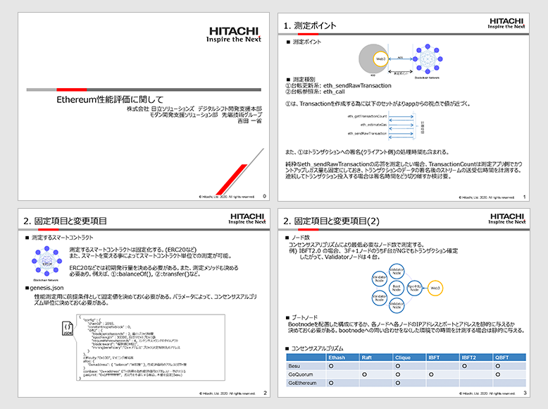

## Table of Contents

1. Agenda

2. Presentation of Research Findings

   2.1 Performance Measurement using Caliper

   2.2 Performance Evaluation of Ethereum

   2.3 Points to Consider Based on Previous Experiences

3. Summary

## List of Participants

- NTT TechnoCross Corporation

  - Kazuhiro Kanematsu

- Hitachi Solutions, Ltd.

  - Kazuyoshi Yoshida

- Comps Information Technology Research Co., Ltd.

  - Shoichi Nishimura

- SingulaNet Ltd.

  - Koji Machi

- Couger Inc. (Organizer)

  - Atsushi Ishii

  - Kazuaki Ishiguro

  - Shunpei Sasaki

  - Shigeyuki Tanaka

  - Yukari Tatsumi

  - Keita Shimizu

## 1. Agenda

The fourth workshop focuses on the methods for measuring blockchain performance and the necessary prerequisites. Research findings shared by each company allowed for a discussion and further examination to take place.

## 2. Presentation of Research Findings

### 2.1 Performance Measurement using Caliper

**NTT TechnoCross Corporation ｜ Kazuhiro Kanematsu**

  Download the file
  <a
    style="margin-left: 5px"
    href="/pdf/scaling4/scalling-workshop_4_ntttx.pdf"
    target="_blank"
  >
    here
  </a>

An introduction on how to use Hyper Caliper.

The function of Caliper is to distribute the load and send transactions to multiple nodes using the following methods below.

- A CLI tool used to operate Caliper

- A device the load can be applied to

- Benchmarking artifacts

- An output that gives instructions to the worker process

The general process flow is as follows.

- 1. Start-up the Caliper manager

  a. Construct the environment with docker-compose

  b. Start the load measurement

  c. Completion of load measurement

  d. Dismantle the environment with docker-compose

- 2. Results are returned to the command line

- 3. Report is created in html format

### 2.2 Performance Evaluation of Ethereum

**Hitachi Solutions, Ltd.｜ Kazuyoshi Yoshida**

  Download the file
  <a
    style="margin-left: 5px"
    href="/pdf/scaling4/scalling-workshop_4_Hitachi-性能評価.pdf"
    target="_blank"
  >
    here
  </a>

Results of the performance evaluation on Ethereum are reported as follows.

- Measuring points

  - The time taken for a transaction request to return from the blockchain.

  - Types of measurement include the ledger update system and ledger reference system.

- Fixed items / Changeable items

  - Smart Contracts that are to be measured must adhere to ERC-20, or similar alternatives.

  - It is also necessary to determine the initial issued amount and the method of measurement.

  - Genesis.json - It is necessary to decide on a fixed value as the prerequisite of performance measurement.

  - Number of nodes - Measure using the minimum number of nodes required by the Consensus Algorithm.

  - Bootnode - You must decide whether you want a static configuration or placed configuration for your bootnode.

- Measurement items

  - API issue and return times

  - Number of transactions that can be issued within a given time

### 2.3 Points to Consider Based on Previous Experiences

**Comps Information Technology Research Co., Ltd.｜ Shoichi Nishimura**

We will share any comments or concerns that were raised in the past when conducting Layer2 load and performance measurements.

Nishimura : Caliper can only be used via WebSockets, are there limitations to its use?

Yoshida：Can’t be used. HL and Geth can interact with WebSockets, but it is hard to measure other chains that are unable to interact with WebSockets.

Nishimura : When conducting testing of Layer2, the total load that can be applied on a single machine may be insufficient. In this case, would it be necessary to run a multiple Caliper worker process?

⇒ All parties involved are in agreement with the statement above.

Nishimura : How can we measure performance using a low-load process?

Machi : CodeLog has been set up. The aim is to give a more detailed output than the Application Log.

### 3. Summary

Sharing of research findings and past case studies helped clarify how Caliper can be used in performance measurement. In the next session, we will create a white paper as the final product of this working group. This will allow for the testing and results to be shared further.

Additionally, we would like to test the transactions with Smart Contracts instead of Native Tokens at the very least, but we aim to specifically use ERC20 as the test assumption for the Use Case.
