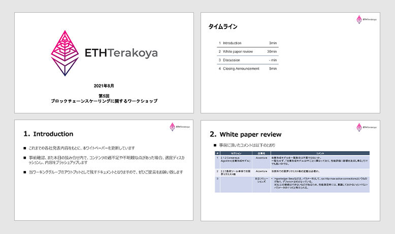
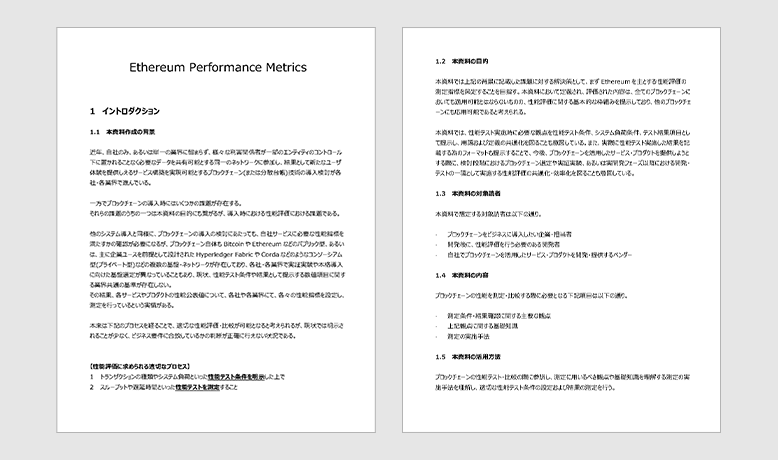

## Table of Contents

1. Agenda

2. White Paper Review

3. Test Conditions Review

4. Summary

## List of Participants

- NTT TechnoCross Corporation

  - Kazuhiro Kanematsu

- NTT DATA Corporation

  - Shunpei Shimizu

- Hitachi Solutions, Ltd.

  - Kazumi Yoshida

- Hitachi, Ltd.

  - Nao Nishijima

  - Shiori Harazono

- Nomura Asset Management

  - Teruyoshi Imamura

- Couger Inc. (Organizer)

  - Atsushi Ishi

  - Keita Shimizu

## 1. Introduction

  Download the file
  <a
    style="margin-left: 5px"
    href="/pdf/scaling5/2021_08_ethterakoya_5th_v002.pdf"
    target="_blank"
  >
    here
  </a>

The documents resulting from the outcome of our working group were compiled into a white paper based on the information presented by each company thus far. For our fifth workshop meeting, we read through and revised the white paper by discussing any unclear and extraneous details from its contents.

## 2. White Paper Review

  Download the file
  <a
    style="margin-left: 5px"
    href="/pdf/scaling5/20210825_Ethereum_Performance_Metrics.pdf"
    target="_blank"
  >
    here
  </a>

The points we covered during review are listed below.

- **2.1.2 Consensus Algorithm (Consensus-Building Model)**

  Discussed whether the Consensus-Building Model table is necessary or not.

  Without creating a table, it may be better to just “go over each and every difference and affected benchmark of the Consensus-Building Model in the PF”. (Hatate from Accenture)

  - May be better to leave the glossary in. (Shimizu from NTT DATA)

  - May be better not to erase too much. (Ishii from Couger)

  **Conclusion:** Sharing the fundamental knowledge of the PF is our main priority, so the contents will remain unchanged and the format will continue to be under review.

- **2.1.4 Network Size (Node Number)**

  We may need an indicator for the minimum number of nodes required to establish a consensus. (Yoshida from Hitachi Solutions)

  **Conclusion:** Add the required number of nodes needed to complete each condition.

- **2.2.5 The Request Number Limit for Load Tools**

  We may need to mention the request number limit in this document. (Accenture Rep)

  - Clients such as Hyperledger Besu have rpc-http-max-active-connections as a parameter, and the default value is set to 80. This is one of the parameters where it is not possible to set the value to more than 80, so we should keep this in mind when measuring performance. (Yoshida from Hitachi Solutions)

  **Conclusion:** Mention there may be parameters with limits built into a client’s infrastructure.

- It may be easier to understand by adding a diagram that shows the latency, throughput, and responses from the application. (Shimizu from NTT DATA)

**Conclusion:** We will use figures and data accordingly.

 

## 3. Test Conditions Review

Taking previous discussions into account, the following has been established.

 

Item: Blockchain Name

Conditions: In principle, Ethereum-Based Blockchains are preferred, but other Blockchains can be selected for comparison

 

Item: Transaction Method

Conditions: ERC20 Smart Contract Token Transfer

## 4. Summary

The white paper will be updated accordingly based on the suggestions and comments from each company. By going through the review process, we aim to make this document more practical for readers.
