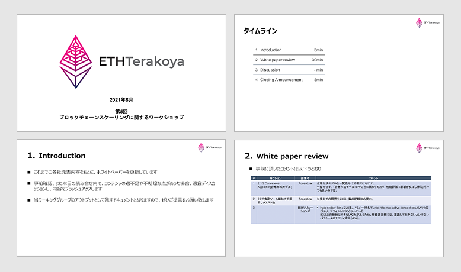
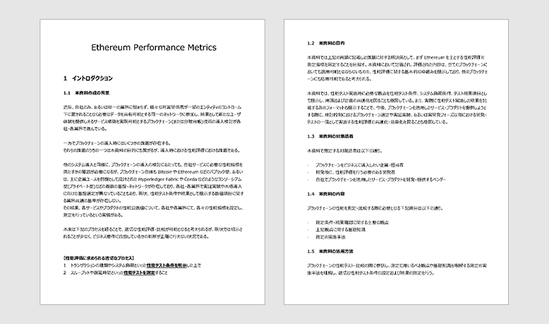

## 目次

1. Introduction

2. White Paper Review

3. Test conditions review

4. まとめ

## 参加者一覧

- NTT テクノクロス株式会社

  - 兼松 和広

- 株式会社 NTT データ

  - 清水 俊平

- 株式会社日立ソリューションズ

  - 吉田一省

- 株式会社日立製作所

  - 西島 直

  - 原園 栞

- 野村アセットマネジメント株式会社

  - 今村 光良

- クーガー株式会社（主催）

  - 石井 敦

  - 清水 啓太

## 1. Introduction

  ファイルダウンロードは
  <a href="/pdf/scaling5/2021_08_ethterakoya_5th_v002.pdf" target="_blank">
    こちら
  </a>

当ワーキンググループのアウトプットとして残すドキュメントとして、これまでの各社発表内容をもとにホワイトペーパーを作成した。今回の第５回目では、そのホワイトペーパーの読み合わせを行い、内容の過不足や不明瞭な点を話し合い、ブラッシュアップを行った。

## 2. White Paper Review

  ファイルダウンロードは
  <a
    href="/pdf/scaling5/20210825_Ethereum_Performance_Metrics.pdf"
    target="_blank"
  >
    こちら
  </a>

以下はレビュー内で指摘のあった項目について記載する。    

- **2.1.2 Consensus Algorithm(合意形成モデル)**

  合意形成モデルを一覧表示は不要ではないか。

  一覧化せず、「合意形成モデルは PF ごとに異なっており、性能評価に影響を及ぼし得る」だけでも良いのではないか。（Accenture 旗手）

  - 用語集として残した方がいいのではないか。（NTT データ清水）

  - 無理に消さなくてもよいのではないか。（Couger 石井）

  **結論：**PF の基礎知識を提供する事も目的の１つなので、コンテンツは残し、構成は引き続き検討していく。

 

- **2.1.4 Network Size (Node 数)**

  コンセンサスが成立する為に必要な最低ノード数の指標が必要ではないか。（日立ソリューションズ吉田）

  **結論：**各条件ごとに必要となるノード数を満たすべきである旨を追記する。

   

- **2.2.5 負荷ツール単体での限界リクエスト数**

  当資料での限界リクエスト数の記載は必要か。（Accenture 旗手）

  - Hyperledger Besu などはパラメータとして、rpc-http-max-active-connections というものがあり、デフォルトは 80 となっている。80 以上の接続はできないなどがあるため、性能測定時には、意識しておかないといけないパラメータの１つだと考えられる。（日立ソリューションズ吉田）

  **結論：**基盤側にパラメータがある可能性もあり、その制約がある旨を記載する。

- レイテンシーやスループット、またアプリ側からのレスポンスなどを説明する絵図があれば分かり易いのでは。（NTT データ清水）

  **結論：**適宜、画像や資料なども使用する。

 

## 3. Test conditions review

過去のディスカッションも鑑み、以下とする。

 

項目：Blockchain Name

条件：原則 Ethereum ベースのチェーンを対象とすることが望ましいが、比較対象としての別チェーンも選択は可能

 

項目：Transaction Method

条件：ERC20 スマートコントラクトのトークントランスファー

## 4. まとめ

各社からの指摘・コメントに基づき、ホワイトペーパーの更新を適宜行う。

再鑑のプロセスを経ることで、より読者にとって実用的なドキュメントとなることを目指したい。
