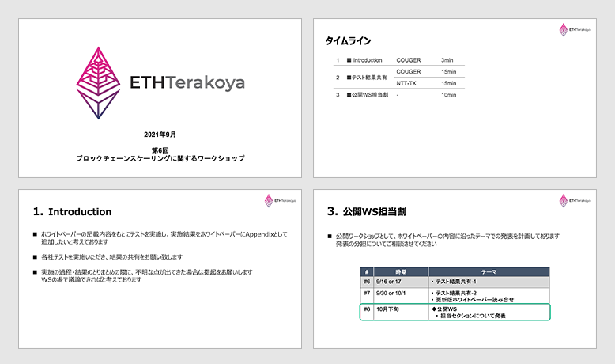
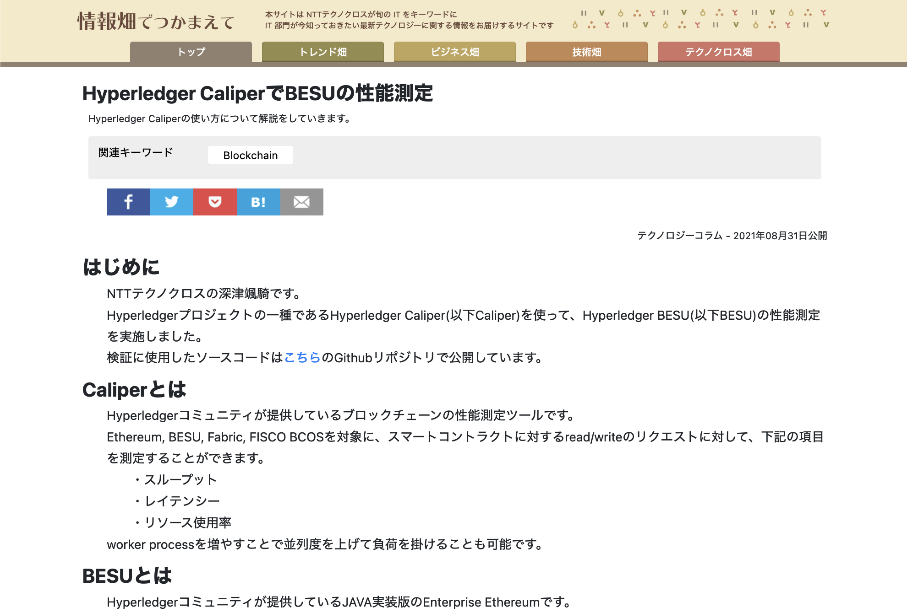

## Table of Contents

1. Agenda

2. Sharing Test Results

  2.1 Performance Measurements using Geth and PoA

  2.2 Performance Measurement of BESU

## List of Participants

- NTT TechnoCross Corporation

  - Kazuhiro Kanematsu

- Hitachi Solutions, Ltd.

  - Issei Yoshida

- Hitachi, Ltd.

  - Nao Nishijima

- Couger Inc. (Organiser)

  - Atsushi Ishii

  - Kazuaki Ishiguro

  - Shunpei Sasaki

  - Yukari Tatsumi

  - Shigeyuki Tanaka

  - Keita Shimizu

  - Kazuhiro Nakagawa

## 1. Agenda

   Download file
  <a style="margin-left: 5px" href="/pdf/scaling6/scalling-workshop_6_introduction.pdf" target="_blank">
    here
  </a>

This time we used the information from the white paper to share the results of tests carried out by the companies.

We expect to publish the presentation of these results as the appendix. 

## 2. Sharing Test Results

### 2.1 Performance Measurements using Geth and PoA

  Couger Inc.｜Kazuhiro Nakagawa

  Download file
  <a style="margin-left: 5px" href="/pdf/scaling6/scalling-workshop_6_Couger.pdf" target="_blank">
   here
  </a>

We tested by creating three nodes on AWS EC2, and carried the load from a Mac device using Caliper. 

 

Nakagawa: I’d like to review the methods of measuring Read Latency and Read Throughout of Caliper.

Member: It is assumed that we must add BalanceOf and throw a Read only transaction  to take measurements.

Nakagawa: Another measurement is performed against BalanceOf.

### 2.2 Performance Measurement of BESU

  NTT TechnoCross Corporation｜Kazuhiro Kanematsu

  To see the link
  <a
   style="margin-left: 5px"
    href="https://www.ntt-tx.co.jp/column/hyperledger_caliperbesu/210910/"
    target="_blank"
  >
    click here
  </a>

We took measurements using one node configurations of BESU and Ethereum, as well as increasing the number of nodes and using four node configurations of BESU and Tessera nodes

The more pending transactions that accumulate on BESU, the more memory it uses. We found that this results in the process becoming hung up. It is thought that the environmental configurations mentioned below are a way to deal with this issue.

- Have a replacement ready in case the process becomes hung up.

- Depending on the load, increase the number of instances and distribute the amount of load on each node. 

Yoshida: Were measurements carried out using a normal transaction rather than a private transaction for this test?

Kanematsu: You are correct, since we wanted to compare with Ethereum, we did not measure any features that were unavailable to Ethereum.

 

Nishijima: What are the criteria for the number of requests?

Kanematsu: Generally the configuration and contract are fixed, so the policy is to increase the load.

Nishijima: Can we expect to see any impact by increasing or decreasing the number of requests?

Kanematsu: You are correct. Since the Send rate and Throughput are both outputs of the measurement results, the maximum limit should be determined by considering those two values.

I think it would be helpful if we measured different amounts of load and studied trends in the graph.

## 3. Summary

The testing and sharing of findings by the two companies highlighted in the white paper has helped with clarifying information as well as identifying areas of uncertainty.

At the next workshop, we will invite other companies to present their findings and continue our critical review. 
