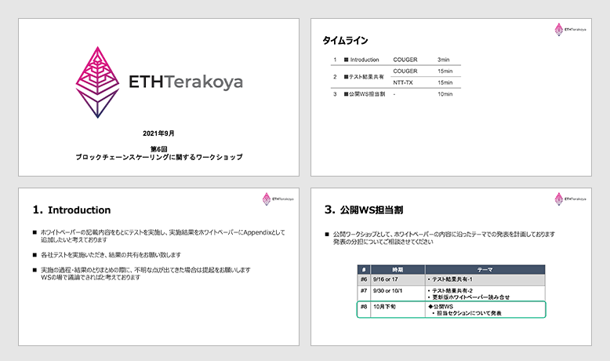
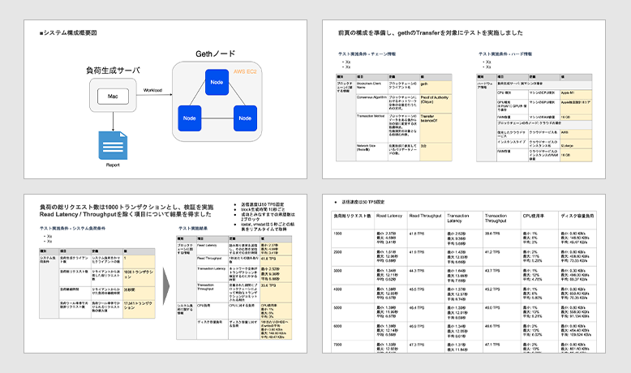
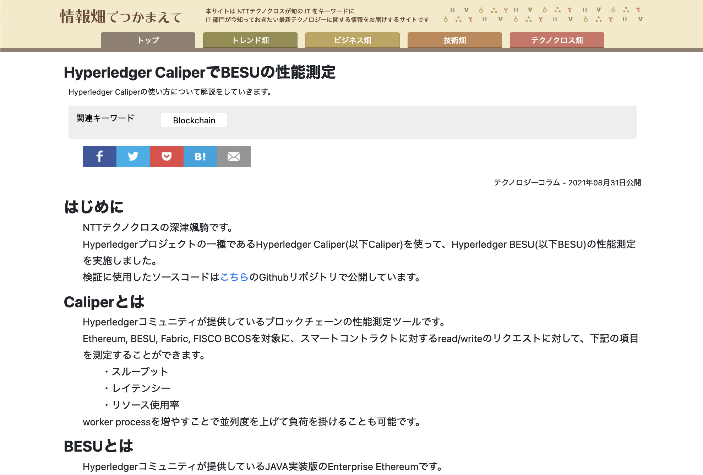

## 目次

1. Introduction

2. テスト結果共有

3. まとめ

## 参加者一覧

- NTT テクノクロス株式会社

  - 兼松 和広

- 株式会社日立ソリューションズ

  - 吉田一省

- 株式会社日立製作所

  - 西島 直

- クーガー株式会社（主催）

  - 石井 敦

  - 石黒 一明

  - 佐々木 俊平

  - 辰巳 ゆかり

  - 田中 滋之

  - 清水 啓太

  - 中川 和弘

## 1. Introduction

  ファイルダウンロードは
  <a href="/pdf/scaling6/scalling-workshop_6_introduction.pdf" target="_blank">
    こちら
  </a>

今回はホワイトペーパーの記載内容をもとに、各社でテストを実施した結果を共有した。

当調査結果はホワイトペーパーの Appendix として公開する予定である。

## 2. テスト結果共有

### 2.1 Geth・PoA での性能測定

  クーガー株式会社｜中川 和弘

  ファイルダウンロードは
  <a href="/pdf/scaling6/scalling-workshop_6_Couger.pdf" target="_blank">
    こちら
  </a>

AWS EC2 上に 3 台のノードを立て、Mac 端末から Caliper で負荷をかけテストを実施した。

 

中川：Caliper による Read Latency/Read Throughput の計測方法について認識合わせを行いたい。

メンバー：計測には、BalanceOf を追加し Read のみのトランザクションを投げる必要があると思われる。

中川：追加で BalanceOf に対する測定を行う。

### 2.2 BESU の性能測定

  NTTテクノクロス株式会社｜兼松 和広

  <a href="https://www.ntt-tx.co.jp/column/hyperledger_caliperbesu/210910/" target="_blank">
    リンク
  </a>

BESU1 ノード構成や Ethereum1 ノード構成、またノード数を増やした BESU4 台、Tessera ノード 4 台構成で測定を行った。

BESU の pending transaction は溜まれば溜まるほど Memory を消費し、最終的にはプロセスがハングアップする事が分かった。下記の環境構成で対策するのが正しいと推測している。

- ハングアップする時の為に代わりを用意しておく。

- 負荷量に応じてインスタンスの台数を増やし 1 台あたりの負荷ノードを分散する。

吉田：今回のテストはプライベートトランザクションではなく、普通のトランザクションで測定しているか。

兼松：認識のとおり、今回は Ethereum と比較する目的で検証しているため、Ethereum にはない機能は測定していない。

 

西島：リクエスト数の基準はあるか。

兼松：基本的には構成とコントラクトは固定とし、負荷をあげる方針とした。

西島：リクエスト数を増減することで影響を影響を見るイメージでよいか。

兼松：認識のとおり。測定結果として Send rate および Throughput が出力されるため、その２値を見ながら Throughput の上限を探ることになるのではないか。

負荷を変えながら測定し、グラフで傾向を見ることで示唆が出るかと思う。

## 3. まとめ

2 社によるホワイトペーパーに定義された観点でのテスト実施・共有により、不明瞭な点、確認事項の洗出しが進んだ。

次回のワークショップでは他の企業も発表を実施することで更なる精査を進めたい。
