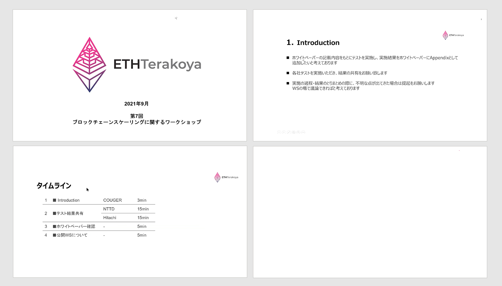
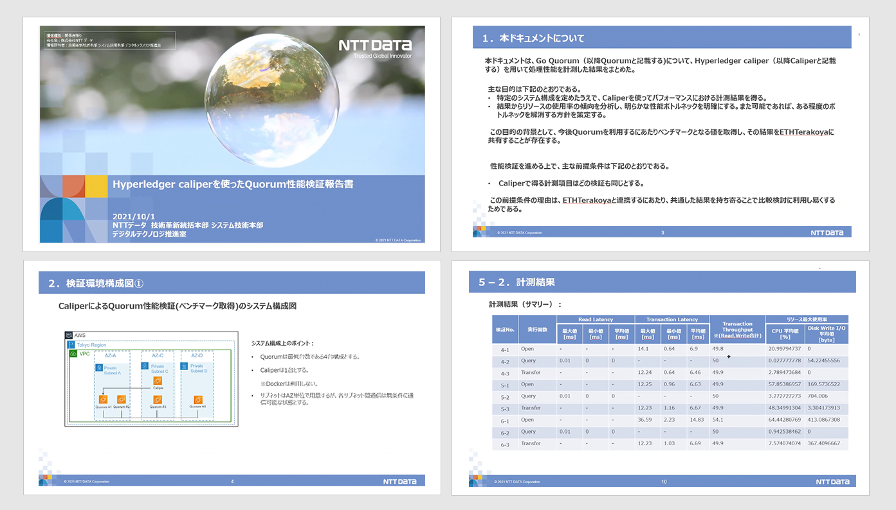

## Table of Contents

1. Agenda

2. Sharing Test Results

  2.1 Performance Verification of Quorum

  2.2 Performance Measurement of Besu

## List of Participants

- NTT DATA Corporation

  - Shunpei Shimizu

- Hitachi, Ltd.

  - Nao Nishijima

  - Shiori Harazono 

- Couger Inc. (Organizer)

  - Atsushi Ishii 

  - Kazuaki Ishiguro

  - Shunpei Sasaki

  - Yukari Tatsumi

  - Shigeyuki Tanaka

  - Keita Shizumi

  - Kazuhiro Nakagawa

## 1. Agenda

This time, each company shared the results of the tests they each conducted, based on the contents of the white paper, as a continuation from last time. In addition, we plan the results of this study to be made available as an appendix to the white paper that displays said results. 

## 2. Sharing Test Results

### 2.1 Performance Verification of Quorum

  NTT DATA Corporation｜Shunpei Shimizu

The processing performance of GO Quorum was measured using Hyperledger Caliper, and we summarised the results. The items obtained conformed to the white paper. 

Regardless of the number of transactions sent, the results showed that latency tended to be low on average. 

In addition, despite the constant high speeds of read latency of the query process, the transaction’s latency in the transfer and open processes had a tendency to be high.

**The relevance of number of transactions sent (test time) x target TPS**

We carried out a test of the increase of the number of transactions sent from 1000 to 18,000, but the target TPS and CPU usage had a tendency to stabilise at 4000 or more transactions sent.

NTT DATA, Shimizu: If the target TPS is fixed, then the target TPS = the amount of load, so we can consider a method of measuring the performance by changing the load. It might be good to record how to use Capiper in the white paper. 

### 2.2 Performance Measurement of Besu

  Hitachi, Ltd. ｜Nao Nishijima

Using Caliper (0.4.3-dev), we measured the performance of Hyperledger Besu with three different instance sizes, and obtained the test results. For test conditions, Smart Contract used caliper-benchmark simple, and we changed the number of Tx transmissions from 500 to 2500. Due to the changes in TPS depending upon the load, in order to reach the highest possible value, we carried out the test after increasing the number of requests.

## 3. About Sharing the Test Results

Couger’s Shimizu: Would it be better to mention the block recognition, block generation time, transmission speed, etc. as test condition entries? 

NTT DATA’s Shimizu:  I think it would be better to write them out as test conditions, due to the huge effect it could have on the test results.

Conclusion: it will be mentioned.

## 4. Review of the Improvements of the White Paper

The following items were altered or added as items pointed out in <a href="https://ethereum-terakoya.org/en/scaling/scaling5" target="_blank"> workshop No.5. </a>

**2.1.4 Network Size (Number of Nodes)**

Point Made: Is it not necessary to have an indicator of the minimum number of nodes necessary for the sake of reaching a consensus? (Hitachi Solutions, Ltd. Yoshida）

Additional Information: in the case of there being a minimum number of validator nodes needed by the consensus algorithm to be tested, it is necessary to obtain that number. 

**2.2.5 Limit of the number of requests done by a single load tool**

Point Made:

・Is it necessary to mention the limit of the number of requests in this document? (Accenture Hatate)

・Hyperledger Besu, etc. has a parameter called rpc-http-max-active-connections, and a default value of 80. Due to connections of 80+ not being possible, it can be considered as one of the parameters that we need to be aware of when measuring performance. (Hitachi Solutions, Ltd., Yoshida)

Content Altered:

The limit value of the number of requests that can be generated by the load tool used for tests. Due to the limit of the number of requests done by a single load tool differing according to the tool used, it is preferable to indicate this as a reference for tests. In addition, due to there being cases with the relevant parameters being on the infrastructure side, it becomes necessary to check the infrastructure.

## 5. Summary

Two companies, again, carried out the sharing of their test results based on the content mentioned on the white paper. We aim to make the white paper available after adding in the agreed items from this workshop.
