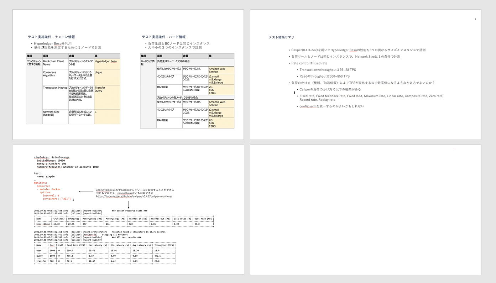

## 目次

1. Introduction

2. テスト結果共有

## 参加者一覧

- 株式会社 NTT データ

  - 清水 俊平

- 株式会社日立製作所

  - 西島 直

  - 原園 栞

- クーガー株式会社（主催）

  - 石井 敦

  - 石黒 一明

  - 佐々木 俊平

  - 辰巳 ゆかり

  - 田中 滋之

  - 清水 啓太

  - 中川 和弘

## 1. Introduction

今回は、前回に引き続きホワイトペーパーの記載内容をもとに、各社でテストを実施をした結果を各社が共有した。また当調査結果は実施結果をホワイトペーパーのに Appendix として公開する追加予定である。

## 2. テスト結果共有

### 2.1 Quorum の性能検証

  株式会社NTTデータ｜清水 俊平

GO Quorum について、Hyperledger caliper を用いて処理性能を計測し、結果をまとめた。取得する項目はホワイトペーパーに準じた。  
結果としてはトランザクション送信数の大小に関わらず、平均して Latency は低い傾向にあった。  
また、query 処理における Read Latency は常に高速であるのに対し、open および transfer 処理における Transaction の Latency は高くなる傾向にあった。

**目標 TPS x トランザクション送信数（試験時間）の関連性**

トランザクション送信数を 1,000 から 18,000 まで増やす検証を実施したが、目標 TPS および CPU 使用率はトランザクション送信数 4000 以上で安定する傾向であった。

NTT データ清水：目標 TPS を固定すると、目標 TPS=負荷量となるので、負荷を変えた性能測定という方法も考えられる。ホワイトペーパー、Capiper の使い方などに記載してもいいのではないか。

### 2.2 Besu の性能測定

  株式会社日立製作所｜西島 直

Caliper(0.4.3-dev)を用いて Hyperledger Besu の性能を３つの異なるインスタンスサイズで計測し、テスト実施結果を得た。テスト実施条件として、Smart contract は caliper-benchmark の simple を利用し、Tx 送信数は 500 から 2500 に変更した。負荷のかけ方により TPS が変化するので、最高値になるようにリクエスト数を増やしテストを行なった。

## 3. テスト結果の共有に関して

クーガー清水：テスト条件の記載項目として、送信速度、block 生成時間、ブロック承認数なども記載しておいた方が良いか。  
NTT データ清水：試験結果に大きく影響を与えるので試験条件として書いた方がいいのではないか。  
結論：記載しておく。

## 4. ホワイトペーパーの更新の確認

以下は <a href="https://ethereum-terakoya.org/scaling/scaling5" target="_blank"> 第 5 回ワークショップ </a> にて指摘のあった項目について、追記・変更を行った。

- ### 4.0.1 Network Size (Node 数)

指摘内容：コンセンサスが成立する為に必要な最低ノード数の指標が必要ではないか。（日立ソリューションズ吉田）

追記内容：テスト対象とするコンセンサスアルゴリズムにより、最低限必要なバリデータノード数がある場合には、その数を確保する必要がある。

- ### 4.0.2 負荷ツール単体での限界リクエスト数

指摘内容：

・当資料での限界リクエスト数の記載は必要か。（Accenture 旗手）

・Hyperledger Besu などはパラメータとして、rpc-http-max-active-connections というものがあり、デフォルトは 80 となっている。80 以上の接続はできないなどがあるため、性能測定時には、意識しておかないといけないパラメータの１つだと考えられる。（日立ソリューションズ吉田）

変更内容：

テストに用いる負荷ツールで生成できるリクエスト数の限界値。利用するツールにより、負荷ツール単体での限界リクエスト数が異なるため、テストの参考情報として提示することが望ましい。また、関連するパラメータが基盤側にあるケースもあるため、基盤側の確認も必要となる。

## 5. まとめ

今回も 2 社による、ホワイトペーパーの記載内容を元にしたテスト結果の共有を行った。ホワイトペーパーに対し、今回のワークショップでの合意事項を追記し、公開を目指す。
