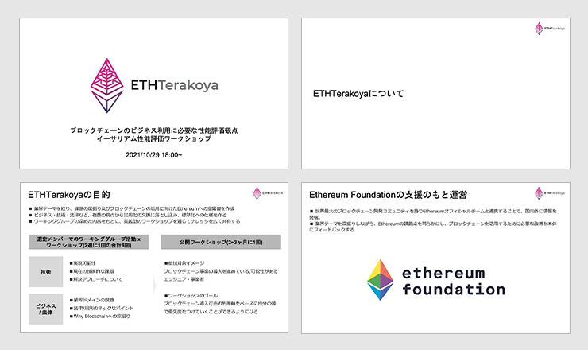
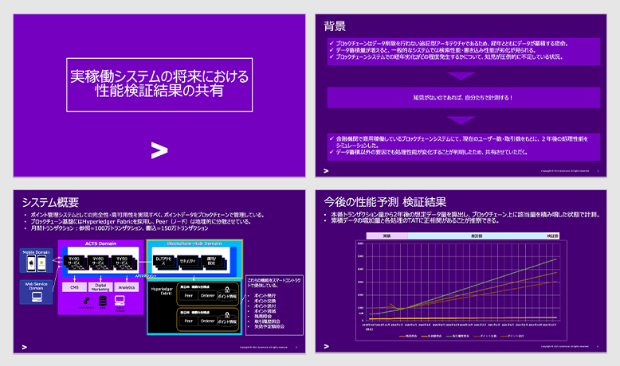
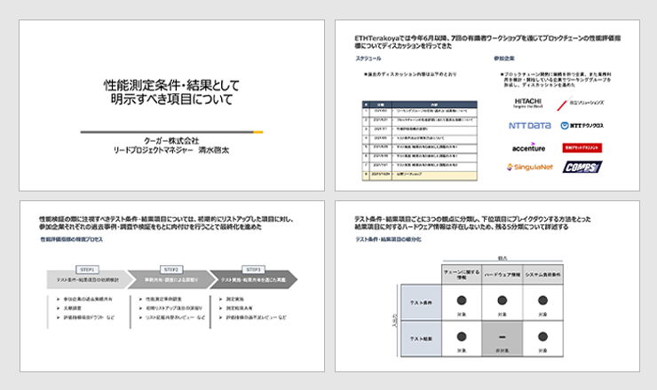
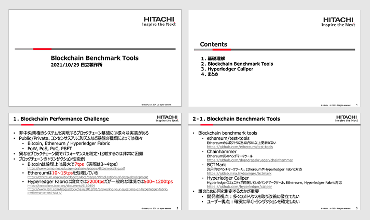
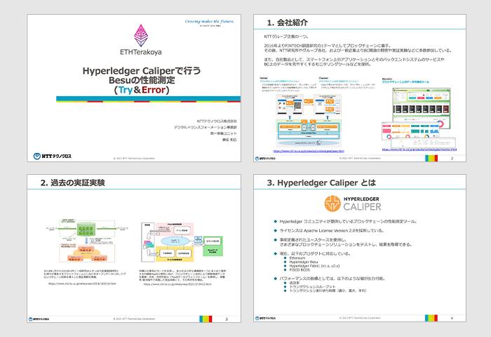
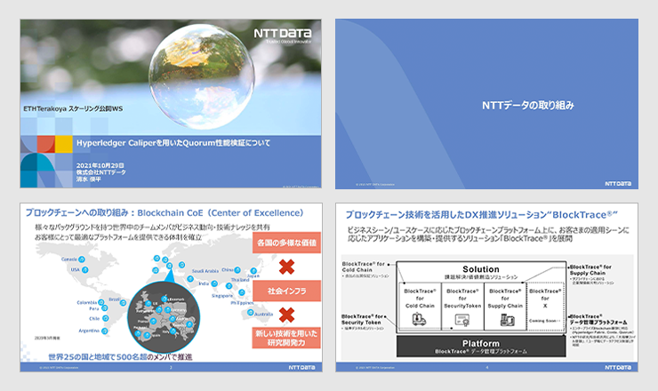
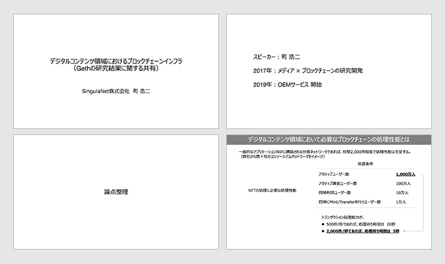

## Table of Contents

1. Opening

2. Presentation of Results

  2.1 How to become involved as a business company 

  2.2 Sharing performance verification results in the future of productions system 

  2.3 Items to be described as performance measurement conditions and results 

  2.4 Blockchain Benchmark Tools

  2.5 Performance Assessment of Besu with Hyperledger Caliper (Try＆Error) 

  2.6 Quorum performance verification with Hyperledger Caliper 

  2.7 Blockchain infrastructure in the digital content field 

3. Summary 

## List of Speakers

- Nomura Asset Management Co., Ltd.

  - Teruyoshi Imamura

- Accenture Japan Ltd.

  - Masatsugu Yamada

- Couger Inc. (Organizer)

  - Atsushi Ishii (Moderator)

  - Keita Shimizu (Presenter)

- Hitachi, Ltd.

  - Nao Nishijima

- NTT TechnoCross Corporation

  - Kazuhiro Kanematsu

- NTT DATA Corporation

  - Shunpei Shimizu

- SingulaNet Ltd.

  - Koji Machi

## 1. Opening

  Download the file
  <a href="/pdf/scaling8/PowerPoint 8-0【Opening】20211029Workshop.pdf" target="_blank" style="margin-left: 5px">
    here
  </a>

The workshop set its objective to "develop standards for performance measurement and create metrics" with the awareness of the issue that "there is no common standard metric for measuring blockchain performance."

In preparation for this public workshop, we have conducted discussions and deliberations seven times. In STEP1, we surveyed the requirements and shared examples and issues, in STEP2, we understood the technical elements related to performance evaluation, and in STEP3, we formulated measurement standards and set measurement methods and the results of the discussions will be presented at the public workshop.

We have also prepared a <a href="https://github.com/ethereum-terakoya/perfomance-test-white-paper">white paper</a> as a deliverable, which we sincerely encourage you to utilize.

## 2. Presentation of Results

### 2.1 How to become involved as a business company

  Nomura Asset Management Co., Ltd.｜Teruyoshi Imamura

The purpose of this participation was to share knowledge about evaluation indicators from the perspective of the business side through the demonstration experiment.

For Japanese operating companies, the number one obstacle to the introduction of blockchain services is regulation, and I believe it is important to consider business schemes to clear this obstacle.

Nomura Asset Management, together with enPiT and Tsukuba University, conducted a demonstration experiment in token trading as part of its research into the digitization of investment trusts.

We shared that it is necessary to consider various functions provided by the network architecture built to realize the business scheme, from the application layer to the consensus layer, and what kind of performance is required based on the sense of distance from the user.

In addition, we mainly shared what performance factors would be at stake and what problems would be encountered by comparing the provided functions to the infrastructure close to the end-user side.

**Q.** In the case of large companies, I think there are many barriers to transitioning to actual services after a demonstration experiment, but is it realistic for business companies, including those overseas, to provide services using blockchain?

**A.** I believe it is realistic. We are trying to use ibet's services as a foundation for STO relationships and to release services as examples. The challenge is how to clear the regulations because there are so many obstacles to overcome. 

### 2.2 Sharing performance verification results in the future of productions system

  Accenture Japan Ltd.｜Masatsugu Yamada

   Download the file
  <a href="/pdf/scaling8/PowerPoint 8-2【ACN】実稼働システムの将来における性能検証結果の共有.pdf" target="_blank" style="margin-left: 5px">
   here
  </a>

Performance evaluation requires a long-term perspective, including the question of whether the system under evaluation will operate stably for several years to come. We will share how the system performance of the blockchain will change in the future and what measures we can take to stabilize the system based on the results.

Findings and observations:

- Blockchain systems, like general RDB systems, will deteriorate over time due to data accumulation.

  - The State DB of Hyperledger Fabric has an aspect of unstable processing performance even when index is posted.

  - It may be necessary to devise a way to keep the amount of data constant.

- When the load of the write process is concentrated, the TAT of other processes, including the reference system, will deteriorate during the corresponding time.

  - The processing of Hyperledger Fabric's chaincode (≒ smart contract) is largely dependent on StateDB, but StateDB becomes a bottleneck when the load is concentrated.

  - It is necessary to distribute the processing volume and time so that the load does not become concentrated.

**Q.** What is the usual level of stability of blockchains in business? Also, if there are any examples of using public chains for business, please provide examples.

**A.** When it comes to stabilization, it is important that the user's experience speed is not reduced. Specifically, I think it would be good if it could be returned in about one second. Since blockchain takes time to reach a consensus, it is necessary to adopt an architecture that can reach a consensus as quickly as possible, and to prevent consensus from becoming a bottleneck. In the case of Japan, due to regulations, there are almost no examples of public chains, and private or consortium types are used.

**Q.** I think that performance degradation as the amount of data increases over time could be detrimental to the user experience, so how should we incentivize users to use the blockchain?

**A.** We know from verification that degradation will occur, and there are several measures that can be taken to prevent it. Instead of talking to users on the assumption that there will be degradation, it makes sense to make efforts on the system side to prevent degradation.

### 2.3 Items to be described as performance measurement conditions and results

  Couger Inc.｜Keita Shimizu

    Download the file
  <a href="/pdf/scaling8/PowerPoint 8-3【COU】scaling_presentation_v002.pdf" target="_blank" style="margin-left: 5px">
    here
  </a>

Since June 2021, the blockchain performance evaluation index has been discussed seven times in the working group,<a href="https://github.com/ethereum-terakoya/perfomance-test-white-paper" target="_blank">White paper</a>and the index has been developed. The method was to classify each item of the test conditions and test results into three perspectives and break them down into sub-items. Since there is no hardware information for the result items, the remaining five categories will be described in detail.

- Test conditions

  - Information about chains

    - Blockchain client name

    - Consensus Algorithm

    - Transaction Method

    - Network size (number of nodes)

  - Hardware information

    - In the case of the Cloud

      - Cloud services used

      - Instance type

      - RAM capacity
  
  - In the case of real machines

    - CPU types

    - GPU type * When using a GPU for PoW

    - RAM capacity    
      
  - System load conditions

    - Number of load-generating clients

    - Total number of load requests

    - Load duration time

    - Limit number of requests for a single load tool

- Test Results

  - Information about blockchains

    - Read Latency

    - Read Throughput

    - Transaction Latency

    - Transaction Throughput

  - System load information

    - CPU load

    - Disk capacity load

**Q.** Are there any plans to add or expand on the content of this survey or in-depth study in the future? (Cross-chain, Layer2, etc.)

**A.** Yes. This time, we have created standards for performance, functionality, and items, and summarized them in a white paper, but we would like to use this as a base for building up other cross-chains and layers as well.

**Q.** Is there a need to add geographic dispersion to the conditions? Also, is it difficult to make a direct comparison with chains such as public that use different hardware depending on the Pier?

**A.** Geographical dispersion, as well as by public and hardware, are worthy of comparison. For example, I think it is possible to describe regional trends, but since it is difficult to standardize, I think it is possible to evaluate trends separately, not at a level parallel to the aforementioned items.

### 2.4 Blockchain Benchmark Tools 

  Hitachi, Ltd.｜Nao Nishijima

  Download the file
  <a href="/pdf/scaling8/PowerPoint 8-4【日立】Blockchain Performance Toolsv2 ENG.pdf" target="_blank" style="margin-left: 5px">
    here
  </a>

- There are several Benchmark Tools. Typical examples are as follows.

  - Hyperledger Caliper

  - ethereum/test-tools

  - Chainhammer

  - BCTMark

  - Blockbench

- In order to accurately evaluate and compare the performance of different blockchains, it is necessary to include definitions of terms and indicators, and environmental details.

- Publish detailed information about the test results.

**Q.** What is the intention of Caliper, a Hyperledger affiliate, to support other blockchains such as Ethereum?

**A.** The Hyperledger community itself supports a variety of infrastructures such as Hyperledger Fabric and Ethereum-based BESU, which are being developed as necessary to promote the blockchain.

### 2.5 Performance Assessment of Besu with Hyperledger Caliper (Try＆Error)

  NTT TechnoCross Corporation｜Kazuhiro Kanematsu

  Download the file
  <a href="/pdf/scaling8/PowerPoint 8-5【NTT-TX】ETHterakoya_TX_20211022.pdf" target="_blank" style="margin-left: 5px">
    here
  </a>

**Hyperledger Caliper, a blockchain performance measurement tool**

- Since it is easier to measure the load repeatedly, it is easier to perform try-and-error measurements while changing the settings.

- If the functions are expanded in the future to support multiple executions and various transaction processing, more complex load conditions will become possible, and it is hoped that the functions will be expanded in the future.

**About Hyperledger Besu**

- If you think of it as a "private network Ethereum client", it is not inferior to Go-Ethereum in terms of performance.

- Many of them are "clever" from a developer's point of view, such as detailed setting values.

- Other features that were not realized in Go-Ethereum, such as Permissioned Networks and Privacy Groups, have been expanded, making it easier to use as an enterprise product.

- It is regrettable that we were not able to conduct performance measurements based on the division of public/private Tx, as this was originally the main feature of the performance.

**Measuring Besu performance with Hyperledger Caliper**

1. Differential measurement by product (Besu and Go-Ethereum)
  
  When the measurement conditions were combined, there was not much of a difference

    - Since there are fluctuations in the measurement results due to block generation timing and other factors, it is desirable to aggregate the results after multiple trials.

2. Differential measurement of consensus building (PoA and IBFT)
    
  It was assumed that IBFT would be "heavier" due to the overhead of consensus building, but this was not the case due to the different settings of the gas upper limit.

    - Since the gas upper limit (block size) affects the overall processing performance, it is necessary to properly match the values when measuring.

3. Differential measurement of block generation interval (block generation interval: 2 and 5 seconds)

  We assumed that 2 seconds would be "much faster" than 5 seconds, but the results were different.

    - Since the overall network-like distribution affects the processing performance, it is necessary to consider the assumed environment when measuring and test the configuration as close to the production (assumed) configuration as possible.

4. Differential measurement of node placement (local and AWS)

  We assumed that AWS would be "slower for the overhead of consensus building," but the results were different.

    - Because of the comparison between local and cloud environments, the difference in the infrastructure part had a significant impact.

    - It is important to understand it only as an "As Is" value, and to measure it in an environment that matches the actual environment (cloud or on-premise).

**Q.** Please explain if there are any differences in behavior or performance specific to Besu compared to Geth or Open Ethereum.

**A.** There was no significant difference in behavior because they were built to the same specifications, but I think the key point is that Besu-specific settings are possible. We believe that the ability to set a maximum quoting size for the contracts that can be deployed and a fixed difficulty level when using PoW is a feature unique to Besu.

**Q.** Is there a difference between Besu and Quorum?

**A.** Now that they are grouped as part of the same ConsenSys Quorum product, I'm sure they are being implemented with the intention of maintaining compatibility. The biggest difference was that the private transaction managers were Tessera and Orion respectively, but the new version of Besu has been modified to use the same managers as the Quorum side, so I think the idea is to bring them closer to the same behavior.

### 2.6 Sharing the results of performance verification in the future of production systems

  NTT DATA Corporation｜Shunpei Shimizu

  ファイルダウンロードは
  <a href="/pdf/scaling8/【NTTD】Quorum性能検証について.pdf" target="_blank">
    こちら
  </a>

HWe verified the performance of Quorum using Hyperledger caliper. The performance verification policy is that the target TPS is fixed at 50 and the number of walkers is fixed at 1. Repeat the verification while increasing the number of transactions sent by +1000. In Caliper, we used the three processes of Open, Query, and Transfer (smart contracts).

As a result, the latency tended to be low on average, regardless of the number of transactions sent.

In addition, while the read latency in query processing was always fast, the transaction latency in open and transfer processing tended to be high.

**Relevance of target TPS x number of transactions sent (test time)**

Although the number of transactions sent was increased from 1,000 to 18,000, the target TPS and CPU utilization tended to stabilize when the number of transactions sent was 4,000 or more.

**Q.** Where do most of the cases focus on the performance required by the end user side?

**A.** General speed of response and comfort of use are most important. In this sense, the disadvantages of using blockchain infrastructure should not be visible from the user side.

**Q.** What are the reasons why Quorum is often used in cases using Ethereum in Japan?

**A.** One of the concerns that companies have when adopting blockchain is that all transactions will be visible, and the ability to keep private transactions secret is the reason why it was chosen.

**Q.** Regarding the suggestion that the number of transactions should be more than 4000 to achieve 50 TPS, why does the number of transactions affect the TPS?

**A.** Increasing the number of transactions will increase the test time. In this test, when the load was around 1000 or 2000, the measurement was completed in a disturbed state (boot-up state) where the load was not applied as expected, but we think this is because the value will approach the expected value with time.

### 2.7 Blockchain infrastructure in the digital content field

   SingulaNet Ltd.｜Koji Machi

  Download the file
  <a href="/pdf/scaling8/PowerPoint 8-7【Sing】デジタルコンテンツ領域におけるブロックチェーンインフラ.pdf" target="_blank" style="margin-left: 5px">
    here
  </a>

The blockchain processing performance required in the digital content field is a target of 2,000 transactions per second for a purpose-specific consortium network and 10,000 transactions per second for a public network.

In this article, we conducted a detailed functional-level bottleneck analysis of the private Ethereum blockchain. We conducted a series of experiments to (1) identify the bottleneck function that is called every time a transaction arrives at an Ethereum node. Furthermore, we found that (2) multithreading was not fully utilized.

Conclusion:

- The performance of Ethereum Geth is bottlenecked by the thread control mechanism and the interface processing between Go and C languages.

- In order to improve the performance of processing more than 2,000 cases per second, modifications in the general-purpose processing part are necessary.

**Q.** Do users who are using NFT on the consortium chain use Metamask or Wallet Connect, which are commonly used as a Web3 wallet?

**A.** The consortium has not yet reached that point. Each has its own way of doing things, and they are often used within companies.

**Q.** If the overhead of GO and C is the bottleneck, how much change is there in Ethereum clients other than Geth?

**A.** This was done only for GO and C, but it will probably be somewhat better if it is done in a single language, since there will be no overhead.

## 3. Summary

In this workshop, we gave presentations on the topic of Ethereum performance measurement standards. There are many perspectives, such as aligning measurement standards and tools, hardware, languages, etc., and this is why standardization is difficult, but we were able to create a base and take the first step this time. We will continue to work on this as a working group.
