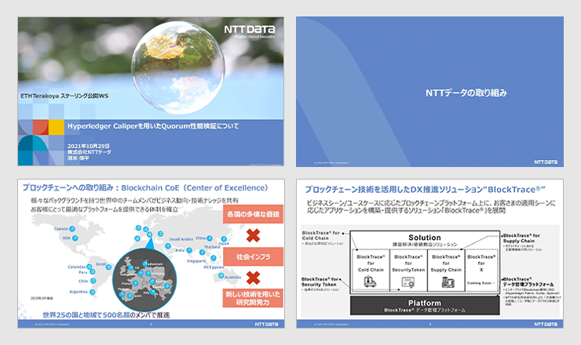
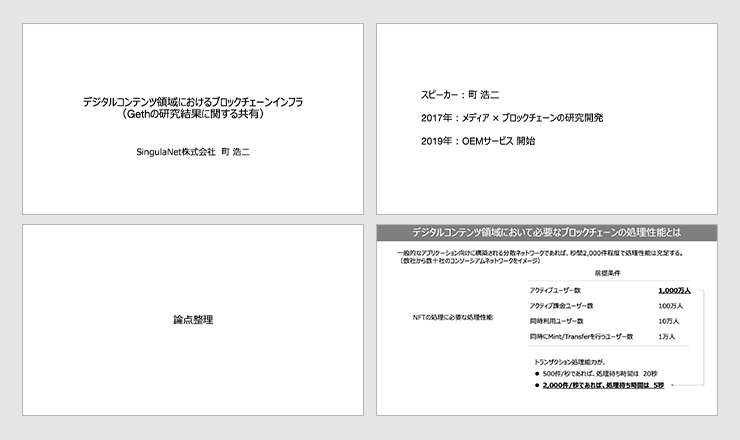

## 公開動画

公開イベントの動画は以下で公開しています。

  <ul>
    <li>
      <a href="https://youtu.be/En0PL7pOhlA" target="_blank">
        ブロックチェーンのビジネス利用に必要な性能評価観点 -
        イーサリアム性能評価ワークショップ【ETHTerakoya × Blockchain EXE 】
        2021年10月29日 開催
      </a>
    </li>
  </ul>
  

    ⇒
    <a
      href="https://www.youtube.com/channel/UCnfgzeNn_90Iq6MHXO3wp5A"
      target="_blank"
    >
      ETHTerakoya Youtubeアカウント
    </a>
  

## 目次

1. Opening

2. 成果発表

   2.1. 事業会社としての関わり方

   2.2. 実稼働システムの将来における性能検証結果の共有

   2.3. 性能測定条件・結果として記載すべき項目について

   2.4. ブロックチェーンにおける Benchmark Tools

   2.5. Hyperledger Caliper で行う Besu の性能測定(Try＆Error)

   2.6. Hyperledger caliper による Quorum 性能検証

   2.7. デジタルコンテンツ領域におけるブロックチェーンインフラ

3. まとめ

## 登壇者一覧

- 野村アセットマネジメント株式会社

  - 今村 光良

- アクセンチュア株式会社

  - 山田 ​ 昌嗣

- クーガー株式会社（主催）

  - 石井 敦 (司会)

  - 清水 啓太(発表者)

- 株式会社日立製作所

  - 西島 直

- NTT テクノクロス株式会社

  - 兼松 和広

- 株式会社 NTT データ

  - 清水 俊平

- SingulaNet 株式会社

  - 町浩二

## 1. Opening

  ファイルダウンロードは
  <a href="/pdf/scaling8/【Opening】20211029ワークショップ.pdf" target="_blank">
    こちら
  </a>

当ワーキングショップでは「ブロックチェーンのパフォーマンスを測定する際の共通の標準指標がない」ことを課題意識として、「パフォーマンス測定の標準を策定し、測定基準を作る」ことに目的を設定した。

今回の公開ワークショップ開催に向け、7 回の議論・検討を行ってきた。STEP1 では要求水準の調査や事例・課題を共有し、STEP2 で性能評価に関係する技術要素の理解、STEP3 で測定基準の策定や測定方法の設定測定を行うといった手順を踏み、デスカッションを行ってきた成果について、公開ワークショップにて発表する。

また、成果物として <a href="https://github.com/ethereum-terakoya/perfomance-test-white-paper" target="_blank">ホワイトペーパー</a>も作成しているため、ぜひ活用頂きたい。

## 2. 成果発表

### 2.1 事業会社としての関わり方

  野村アセットマネジメント株式会社｜今村光良

  ファイルダウンロードは
  <a href="/pdf/scaling8/8-1.Nomura.pdf" target="_blank">
    こちら
  </a>

実証実験を通じて事業者側から見た、評価指標に関する知見について共有する目的で今回参加した。

日本の事業会社としては、ブロックチェーンのサービスを導入する際に１番の障害になるのが規制であり、クリアするためのビジネススキームの検討が重要と考えている。
野村アセットマネジメントでは、enPiT、筑波大学と共に、投資信託のデジタライゼーションを研究する一環として、トークン売買における実証実験を行った。

ビジネススキームを実現する為に構築したネットワークアーキテクチャーが提供する機能をアプリケーションレイヤーからコンセンサスレイヤーまで、ユーザーとの距離感を踏まえてどのような性能が求められるか様々な検討が必要であることを共有した。
また、エンドユーザー側に近い基盤に提供機能を照らし合わせ、どういった性能要因が掛かってくるか、どんな問題が出てくるかを主に共有した。

**Q.** 大企業の場合、実証実験のあと実際にサービスに移行するには障壁が大きいかと思うが、海外も含め事業会社がブロックチェーンを使ったサービスの提供は現実的か。

**A.** 現実的だと信じている。ibet のサービスを STO 関係の基盤に用いることや、事例としてサービスをリリースするようにしている。消壁が多い分、Regulation をどうクリアするかが課題。

### 2.2 実稼働システムの将来における性能検証結果の共有

  アクセンチュア株式会社｜山田昌嗣

  ファイルダウンロードは
  <a
    href="/pdf/scaling8/【ACN】実稼働システムの将来における性能検証結果の共有.pdf"
    target="_blank"
  >
    こちら
  </a>

性能評価には「評価対象のシステムが数年先まで安定稼働するか」まで、長期目線で見ることが求められる。将来的にブロックチェーンのシステム性能がどう変化するのか、また結果を踏まえて安定化するための対策を共有する。

得られた結果と見解：

- ブロックチェーンシステムも一般的な RDB システムと同様に、データ蓄積による経年劣化が発生する

  - Hyperledger Fabric の State DB は index を貼っていても、処理性能が安定しない側面がある。

  - データ量を一定に保つ工夫が必要ではないか。

- 書き込み処理の負荷が集中すると、該当時間は参照系を含め、他処理の TAT が劣化する

  - Hyperledger Fabric の chaincode（≒ スマートコントラクト）は StateDB に処理が依存する部分が大きいが、StateDB は負荷集中時にボトルネックになる。

  - 負荷が集中しないように、処理量・時間を分散することが求められる。

**Q.** ビジネスにおけるブロックチェーンの安定化度は通常どのくらいか。またパブリックチェーンをビジネスに使う事例などあれば例示頂きたい。

**A.** 安定化に関しては、ユーザー側の体感速度を下げない事が重要。具体的には 1 秒程度で返せれば良いかと思う。ブロックチェーンはコンセンサスに所要時間が掛かるのでなるべくコンセンサスを早く済ませるアーキテクチャを採用し、コンセンサスがボトルネックにならない考慮が必要かと。日本の場合は規制があるため、パブリックチェーンの事例はほぼなく、プライベートやコンソーシアム型を採用する

**Q.** 経年でデータ量が増加するとパフォーマンスが劣化するということは、ユーザー体験を損なう可能性があると思うが、どのようにユーザーにブロックチェーンを使うインセンティブを与えるべきか。

**A.** 劣化が発生することは検証から分かっており、劣化をさせない為の対応策もいくつかある。ユーザーに劣化することを前提に話をするのではなく、劣化しないようにシステムサイドで尽力するのが筋ではないか。

### 2.3 性能測定条件・結果として記載すべき項目について

  クーガー株式会社｜清水啓太

  ファイルダウンロードは
  <a href="/pdf/scaling8/【COU】scaling_presentation_v002.pdf" target="_blank">
    こちら
  </a>

2021 年 6 月以降、7 回に渡りブロックチェーン性能評価指標についてワーキンググループ内で議論し、<a href="https://github.com/ethereum-terakoya/perfomance-test-white-paper" target="_blank">ホワイトペーパー</a>を作成した。テスト条件・テスト結果の項目ごとに 3 つの観点に分類し、下位項目にブレイクダウンする方法をとった。結果項目に対するハードウェア情報は存在しないため、残る 5 分類について詳述する。

- テスト条件

  - チェーンに関する情報

    - Blockchain Client Name

    - Consensus Algorithm

    - Transaction Method

    - Network Size(Node 数)

  - ハードウェア情報

    - クラウドの場合

      - 使用したクラウドサービス

      - インスタンスタイプ

      - RAM 容量

  - システム負荷条件

    - 負荷生成クライアント数

    - 負荷総リクエスト数

    - 負荷継続時間

    - 負荷ツール単体での限界リクエスト数

- テスト結果

  - ブロックチェーンに関する情報

    - Read Latency

    - Read Throughput

    - Transaction Latency

    - Transaction Throughput

  - システム負荷情報

    - CPU 負荷

    - ディスク容量負荷

**Q.** 今回の調査や深掘りされた内容は今後追加や拡張をする予定はあるか。（クロスチェーンや Layer2 など）

**A.** ある。今回パフォーマンスや性能、項目の基準を作りホワイトペーパーにまとめたが、これをベースとして他のクロスチェーンや Layer なども対象として積み上げていきたい。

**Q.** 地理的な分散性については条件に加える必要性はないか。またパブリックのような Pier により利用するハードが異なるチェーンとの直接的な比較は難しいか。

**A.** 地理的な分散性、またパブリックやハードによってなどは、比較する価値はあると考える。例えば地域的な傾向について述べることはできると思うが、基準化はしにくいため、前述の項目と並列のレベルとはせず、傾向を別途評価することはできると考える。

### 2.4 ブロックチェーンにおける Benchmark Tools

  株式会社日立製作所｜西島直

  ファイルダウンロードは
  <a
    href="/pdf/scaling8/【日立】BLockchain  Performance Toolsv2.pdf"
    target="_blank"
  >
    こちら
  </a>

- Benchmark Tools は複数存在する。代表的なものは以下のとおり。

  - Hyperledger Caliper

  - ethereum/test-tools

  - Chainhammer

  - BCTMark

  - Blockbench

- 異なるブロックチェーンのパフォーマンスを正確に評価し、比較するために用語や指標の定義、環境詳細を記載する必要がある。

- テスト結果の詳細な情報を公開する。

**Q.** Hyperledger 系列の Caliper が Ethereum などの別のブロックチェーンをサポートする事にはどういう意図があるのか。

**A.** Hyperledger コミュニティ自体が、Hyperledger Fabric や Ethereum 系の BESU などの様々な基盤をサポートしており、ブロックチェーンを盛り上げるために必要な開発を行っている。

### 2.5 Hyperledger Caliper で行う Besu の性能測定(Try＆Error)

  NTTテクノクロス株式会社｜兼松 和広

  ファイルダウンロードは
  <a href="/pdf/scaling8/【NTT-TX】ETHterakoya_TX_20211022.pdf" target="_blank">
    こちら
  </a>

**ブロックチェーンの性能測定ツール「Hyperledger Caliper」**

- 繰り返し行う負荷の測定が楽になるため、設定を変えつつ測定していく Try & Error が実行しやすい。

- 今後、多重実行や多様なトランザクション処理への対応など、機能が拡張されれば、より複雑な負荷条件が可能になるため、今後の機能拡充が望まれる。

**Hyperledger Besu について**

- 「プライベートネットワークの Ethereum クライアント」として考えれば、Go-Ethereum より性能面で劣っているわけではない。

- 細かい設定値など、開発者視点で「気が利いている」ものが多い。

- その他、パーミッションドネットワークやプライバシーグループなど、Go-Ethereum では実現されていなかった機能が拡充されており、エンタープライズ向け製品として利用しやすい。

- 本来、性能面での目玉機能はパブリック/プライベート Tx の分割になるため、そこを踏まえた性能測定が実施できなかったのは心残りである。

**Hyperledger Caliper による Besu の性能測定**

1. プロダクト別の差分測定（Besu と Go-Ethereum）

   測定条件を合わせると、それほどの差はなかった。

   - ブロック生成タイミングなどにより、測定結果に揺らぎがあるため、複数回試行した上で集計することが望ましい。

2. 合意形成の差分測定（PoA と IBFT）

   IBFT の方が合意形成のオーバーヘッド分「重くなる」ことを想定していたが、ガス上限の設定が異なっている事が原因で想定しない結果となった。

   - ガス上限(ブロックサイズ)が全体の処理性能に影響を与えるため、測定の際はきちんと値を合わせていく必要がある。

3. ブロック生成間隔の差分測定（ブロック生成間隔：2 秒と 5 秒 ）

   2 秒の方が 5 秒よりも「かなり高速となる」ことを想定していたが、結果は異なった。

   - 全体のネットワーク的分散状況が処理性能に影響を与えるため、測定の際は想定環境の検討を行い、可能な限り本番(想定)に近い構成でのテストを行う必要がある。

4. ノード配置の差分測定（ローカルと AWS）

   AWS の方が「合意形成にかかるオーバーヘッド分が遅くなる」ことを想定していたが、結果が異なった。

   - ローカルとクラウド環境の比較のため、インフラ部分での差分が大きく影響した。

   - あくまで「As Is」の値として理解し、実際の環境に合わせた環境(クラウド、オンプレ)で測定することが重要。

**Q.** Geth やオープンイーサリアムと比較して Besu 特有の振る舞いや性能の違いなどあれば教えてください。

**A.** 同じ仕様に合わせて作っているため、大きな挙動差はなかったが、Besu 特有の設定が可能な事がポイントではないか。デプロイできるコントラクトの最大クォートサイズや、PoW 使用時の難易度の固定設定をできることが、Besu 特有の機能と考えている。

**Q.** Besu と Quorum では違いがあるのか。

**A.** 今は同じ ConsenSys Quorum のプロダクトのとしてグループになっているので、互換性を保つつもりで実装されているとは思う。プライベートトランザクションマネージャーがそれぞれ Tessera と Orion である点が最大の違いであったが、新しいバージョンの Besu では、Quorum 側と同じマネージャーが使えるように改造されたため、同じ挙動に寄せていく考え方なのだと思う。

### 2.6 実稼働システムの将来における性能検証結果の共有

  株式会社NTTデータ｜清水俊平

  ファイルダウンロードは
  <a href="/pdf/scaling8/【NTTD】Quorum性能検証について.pdf" target="_blank">
    こちら
  </a>

Hyperledger caliper を用いて Quorum の性能検証を行った。性能検証方針としては、目標 TPS は 50 固定、ウォーカー数は 1 固定とする。トランザクション送信数を＋ 1000 増やしながら検証を繰り返す。Caliper で、Open と Query、Transfer の３つの処理 (スマートコントラクト )を用いた。

結果としてはトランザクション送信数の大小に関わらず、平均して Latency は低い傾向にあった。

また、query 処理における Read Latency は常に高速であるのに対し、open および transfer 処理における Transaction の Latency は高くなる傾向にあった。

**目標 TPS x トランザクション送信数（試験時間）の関連性**

トランザクション送信数を 1,000 から 18,000 まで増やす検証を実施したが、目標 TPS および CPU 使用率はトランザクション送信数 4000 以上で安定する傾向があった。

**Q.** エンドユーザー側が求める性能はどこに焦点を当てる事例が多いのか。

**A.** 一般的なレスポンスの速さや使い心地などが一番重要。その意味では、ユーザー側からブロックチェーン基盤を使っていることによるデメリットが見えないようにしないといけない。

**Q.** 国内での Ethereum を使った事例で Quorum を使うことが多い理由は何か。

**A.** 企業側のブロックチェーン導入時の懸念として、全てのトランザクションが見えてしまう事があり、プライベートトランザクションを秘匿化する機能があることから選ばれていると考える。

**Q.** 50TPS を達成する為にはトランザクション数は 4000 以上という示唆について、トランザクション数が TPS に影響する理由は何か。

**A.** トランザクション数を上げると試験時間が長くなる。。今回の試験では、1000 や 2000 程度の負荷では、想定どおりに負荷がかかっていない擾乱した状態（ブートアップの状態）のうちに測定終わってしまっていたが、時間がたてば想定値に漸近するためと考えている。

### 2.7 デジタルコンテンツ領域におけるブロックチェーンインフラ

  SingulaNet｜町浩二

  ファイルダウンロードは
  <a
    href="/pdf/scaling8/【Sing】デジタルコンテンツ領域におけるブロックチェーンインフラ.pdf"
    target="_blank"
  >
    こちら
  </a>

デジタルコンテンツ領域において必要なブロックチェーンの処理性能は、目的特化型コンソーシアムネットワークの目標値は 2,000 件/秒で、パブリックネットワークの目標値は 10,000 件/秒となる。

今回はプライベートイーサリアムブロックチェーンの詳細な機能レベルのボトルネック分析を行った。一連の実験を実施し、① トランザクションがイーサリアムノードに到着するたびに呼び出されるボトルネック関数を特定した。 さらに、② マルチスレッドが十分に活用されていないことも分かった。

結論：

- Ethereum Geth のパフォーマンスは、 スレッド制御機構と Go/C 言語間のインターフェース処理がボトルネックとなっている。

- 秒間 2,000 件を超える処理性能の向上には、汎用的な処理部分における改修が必要である。

**Q.** コンソーシアムチェーン上で NFT を利用しているユーザーは、Web3 wallet として一般的なメタマスクやウォレットコネクトなどを利用しているのか。

**A.** コンソーシアム上ではまだそこまで至っていない。それぞれ独自のやり方で、企業内で使っている事が多い。

**Q.** GO と C のオーバーヘッドがボトルネックであれば、Geth 以外の Ethereum クライアントではどの程度の変化があるか。

**A.** GO と C のみの実施だが、おそらく単一言語で行えばオーバーヘッドは発生しないので、幾分かは改善はするはず。

## 3. まとめ

今回のワークショップでは、Ethereum のパフォーマンス測定標準に関するトピックついて発表を行った。測定基準やツールを揃えたり、色々な視点があり、ハードウェア、言語などが複雑に絡み合い、だからこそ標準化が難しいのだが、今回でベースを作成し第一歩を踏み出すことができた。今後もワーキンググループとして進めていく。
