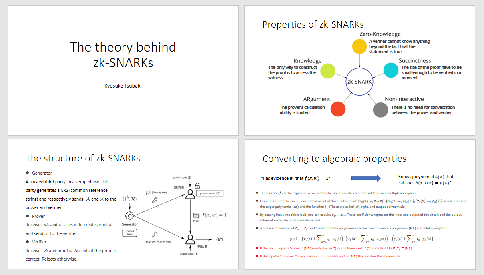
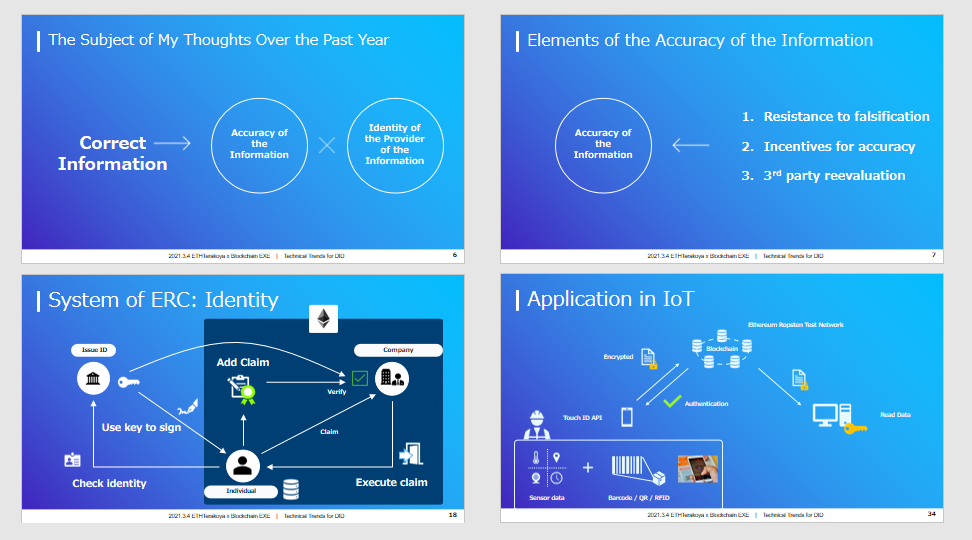

## Public Workshop Clip

The public workshop clip are disclosed as follows.

  <ul>
    <li>
      <a href="https://www.youtube.com/watch?v=g8tCks7hjWs&t=1s" target="_blank">
        Next-generation researchers' workshop clip
      </a>
    </li>
  </ul>
  

    ⇒
    <a
      href="https://www.youtube.com/channel/UCnfgzeNn_90Iq6MHXO3wp5A"
      target="_blank"
    >
      ETHTerakoya Youtube Account
    </a>
  

## Agenda

- 1.Introduction
- 2.Details
  - 2.1 The theory behind zk-SNARK
  - 2.2 Current trends of DID technology

## List of participants

- **Tokyo University of Science**

  - Kyosuke Tsubaki

- **The University of Tokyo**

  - Ryutaro Suda

* **Couger Inc.** (sponsor)

  - Atsushi Ishii, CEO of Couger Inc.

## 1. Introduction

At this event, Mr. Tsubaki from Tokyo University of Science gave a presentation with a focus on security issues in the context of Gaudiy, a fan community that works on blockchain applications.

Mr. Suda from the University of Tokyo also presented on ERC725, a standard for decentralized identifiers (DID), and participated in an exchange of ideas about security challenges and the applications of Ethereum moving forward.

DID is a system that is completely different from our current central identity management systems. There are still many issues that need to be resolved before it can be implemented in practice.

However, once it can be implemented, it will certainly usher in a whole new world. It is also easily integrated with external systems such as Gaudiy, and it will not be long into the future before all our services become borderless.

## 2. Details

### 2.1 The theory behind zk-SNARK

  Kyosuke Tsubaki｜Tokyo University of Science

  <a href="/pdf/students/zk-SNARK-theory_en.pdf" target="_blank">
    View PDF
  </a>

#### 2.1.1 Outline of Gaudiy

・Overview
Gaudiy houses a fan community that works on the applications of blockchain technology with the aim of developing a token economy. This community not only allows users to chat and make posts but has also introduced blockchain-based experiences such as NFT trading cards.

In addition, the company uses magic links and other mechanisms to provide private keys and wallets in a manner that is easy for ordinary users to understand so that they can participate in these blockchain-based experiences.

・Examples of services provided
The integration of various services (community, games, fan clubs, etc.) based on IP addresses by utilizing a blockchain technology known as decentralized identifiers (DID).

・Privacy issues
An issue that often arises when collaborating with external platforms is privacy. For instance, when a game management company collaborates with a fan club management company, the sharing of information comes with the risk of disclosing confidential information that should not be shared with others. The enhanced privacy protection features of zk-SNARK is useful for addressing this issue.

#### 2.1.2 What is zk-SNARK?

zk-SNARK (“Zero-Knowledge Succinct Non-Interactive Argument of Knowledge”) is a technology that allows for the construction of non-interactive zero-knowledge proofs, and it is being applied in the encryption of blockchain transactions and as a solution to the Ethereum scaling problem.

It is also constructed based on the Pinocchio Protocol as a built system for efficiently verifying general computations while relying only on cryptographic assumptions. Therefore, it is capable of safeguarding security in a succinct but powerful manner.

#### 2.1.3 Properties of zk-SNARK

zk-SNARK has the following properties.

・Zero-Knowledge

No additional information can be obtained apart from the validity of the prover’s claim.

・Succinctness

The size of the proof is extremely small as compared to the size of the input.

・Non-interactive

No interaction is required between the prover and the verifier.

・Argument

The computational power of the prover is limited.

・Knowledge

It is difficult for the prover to prove a claim without having the necessary knowledge.

#### 2.1.4 What are zero-knowledge proofs?

Zero-knowledge proofs allow the prover to prove to a verifier that a certain piece of information is true without having to reveal any information beyond the validity of this information.

For instance, if a verifier asks a prover to prove that they are above the age of 20, the prover is not required to show any part of their ID other than the part that shows their age.

#### 2.1.5 Properties of zero-knowledge proofs

Zero-knowledge proofs have the following properties.

・Security

If the prover’s proposition is true, the verifier of the proposition will know for certain that it is true.

・Soundness

In the event that the prover’s proposition is false, there is a high probability that the verifier will know that it is false.

・Zero-knowledge

If the prover’s proposition is true, the verifier is unable to obtain any information other than the proof of the validity of the proposition, even if they attempt to steal other information from the prover illegally.

#### 2.1.6 Overall flow of zk-SNARK

The overall flow of proving a proposition is as follows.

①The function f(x,w) outputs 1 only if the input is correct, and 0 if it is not.

②The prover wishes to prove to the verifier that they have the evidence w such that f(x,w)=1 without revealing what w is.

③The prover creates π, which proves that the prover has the correct evidence w, and sends π to the verifier.

④The verifier verifies π and accepts it if it is correct, or rejects it if it is not.

By placing a trusted third party (TTP) between the prover and the verifier, it is possible to construct a non-interactive zero-knowledge proof, which is efficient and highly secure.

#### 2.1.7 Elements of zk-SNARK

zk-SNARK is composed of the following elements.

・Generator
The generator is a reliable trusted third party that generates a CRS in advance as the trusted setup and which sends the proving key (pk) and verification key (vk) to the prover and the verifier, respectively.

・Prover
The prover receives the pk and x (the public input), creates a proof π from the evidence w, and sends π to the verifier.

・Verifier
The verifier receives the proof π, vk, and x, and accepts the proof if it is correct, or rejects it if it is not.

#### 2.1.8 Polynomial verification

The fact that the prover has the correct evidence w can be converted into the notion that the prover knows a particular polynomial in the following manner.

The prover has the evidence w such that f(x,w)=1

⇒ The prover knows the polynomial h(x) that satisfies h(x)t(x)=p(x)

・The function f can be expressed as an arithmetic circuit consisting of addition and multiplication gates.

・From this arithmetic circuit, we can obtain the target polynomial t(x) and three tuples of polynomials that express the function f: [v0(x)….vm(x)], [w0(x)….wm(x)], [y0(x)….ym(x)]. (These are known as the left input polynomial, right input polynomial, and output polynomial, respectively.)

・By entering inputs into this circuit, we can obtain c1.....cm. These values represent the inputs/outputs of the circuit and the output volume (median value) of each gate.

The equation used to verify that the polynomial h(x)t(x)=p(x) sent to the verifier is correct is as follows.

P(x)=(v0(x)+v(x))・(w0(x)+w(x))-(y0(x)+y(x))

#### 2.1.9 Converting polynomials into a zero-knowledge system
① Concealing the polynomials

h(x), v(x), w(x), and y(x) are concealed in the one-way function E(x) and sent to the verifier. As it is difficult to know the details of the polynomials at this point, the verifier cannot steal the values of c1.....cm.

②Verification by pairing

The prover can prove that they know (a1a2a3) which satisfy the equation x1x2x32=0 without revealing the values to the verifier. A map e that is bilinear is known as a pairing. Pairings make technologies such as ID-based encryption, searchable encryption, and functional encryption possible.

---

#### Q&A

**Q.** What is a trusted third party, specifically?

**A.** A trusted third party can be thought of as a reliable organization, such as a government.

**Q.**  How do the magic links that are used on Gaudiy work?

**A.** They work in a way that allows users to manage their own wallets and decrypt their private keys on the browser. As far as security is concerned, we have a system that prevents the operator from viewing the private key information.

**Q.** Which of the services already in use at Gaudiy will be concealed, and which will be open, when the system described in this announcement is implemented?

**A.** zk-SNARK is something that Gaudiy is interested in for the future and has not been implemented yet. We favor the idea of concealment to allow users to freely select information.

**Q.** If you were to use the technology of zk-SNARK in your everyday life, in what kind of situations would you want to use it?

**A.** When I am sharing my annual income with others, I would use it to provide this information only in a fragmentary manner while hiding the details.

### 2.2 Current trends of DID technology

  Ryutaro Suda｜The University of Tokyo

  <a href="/pdf/students/DID-tech-trend_en.pdf" target="_blank">
    View PDF
  </a>

#### 2.2.1 What is “correct information”?

Correct information refers to information whose accuracy and source are well assured. Accurate information must be tamper-proof, has an incentive to be accurate, and which has been reevaluated by a third party. The source of the information must also be tamper-proof.

In addition, their identity must be verifiable and their personal information always secure. Information can only truly be regarded as correct when all these elements have been satisfied.

#### 2.2.2 What are identifiers?

・Centralized identity management
Identification documents such as passports and driver’s licenses depend on a central organization such as a government as the basis of trust. This system operates based on the collective trust in the government that issues the passports and not the passports themselves. Although this system is highly reliable, it is difficult to quickly increase the number of IDs to meet the needs of users.

・Decentralized identifiers (DID)
There is a standard known as ERC725 which was proposed for the purpose of implementing DID on Ethereum, in which more than 30 projects are officially participating. However, this technology has yet to penetrate the service level of ordinary users.

#### 2.2.3 Mechanism of ERC Identity

The overall flow of ERC Identity is as follows.

①Issuance of ID

The individual presents their identity to the organization issuing the ID, which will verify their identity and sign it with a key.

②Addition of a claim

The individual uses this signature to issue a smart contract known as a claim.

③Use of the claim

When the individual requests something using the claim, the organization that issued the ID will automatically verify the ID.

ERC Identity allows particular desired functions to be executed and consists of a key, a signature, and a request. The issue is that the top-level ID check is conducted off-chain, so it cannot be said to be fully decentralized.

#### 2.2.4 The future of ERC Identity

The developers of ERC Identity themselves are still not entirely satisfied with ERC725 as it is. However, its general framework has been finalized and the beta version was released in November 2020.
Another issue with ERC Identity is the difficulty of meta-transactions. Although the verified sender address is handled in the form of a 20-byte variable known as msg.data instead of msg.sender for GSN (Gas Station Network), ERC725 is set up such that only msg.sender can run “execute” and “setData.”

#### 2.2.5 5 Applications in the area of IoT

It is believed that blockchain technology can find application in quality inspection certification and tracking, which would reduce inspection costs and lower the risk of fraud. For instance, the inspection of parts by unqualified personnel, something that often occurs in the aircraft parts sector, can be stamped out through the application of the ERC725 standard.

The following elements would be necessary for the ERC725 standard to be applied to inspections in the manufacturing industry.

・It should be able to handle the need for repeated inspections

・It should have a system and standard to guarantee that inspections have been performed

・It should be able to handle any irregularities that occur during manual inspections

・It should accurately transmit information about any missing inspections

These elements can be addressed with the use of blockchain technology, which can serve as a highly practical solution in this regard.

---

#### Q&A

**Q.** Are there any exploits or vulnerabilities for systems using ERC725?

**A.** I have not heard of any exploits involving ERC725 itself, but if a service uses an ID system based on the ERC725 standard, it is possible to issue a large number of IDs and send many authentication requests to Ethereum at the same time, which could result in a heavy processing load.

**Q.** Are there any legal issues that need to be addressed for DID to be implemented in practice?

**A.** I believe it would be easy to implement DID just for the buying and selling of goods, but if it were to be implemented on a scale similar to that of My Number, there would be new issues to address.

**Q.** A DID-based system would be useful for people who often use the Internet, but what do you think should be done to make it easier for the general public to use as well?

**A.** Some changes have been made to the interface of ERC when it was upgraded from version 1 to 2, and it is now easier to use than it was initially. However, it is still far from being easy for everyone to use, so that would be a challenge at this stage.

**Q.** How compatible is this system with other blockchains besides Ethereum?

**A.** We are still at a stage where its compatibility with other blockchains has not been fully considered yet. However, in my estimation, it should be possible to implement on any blockchain with a design that allows the use of smart contracts.

**Q.** Has there been any other ideas proposed for DID other than ERC725?

**A.** ERC725 seems to be the most promising standard for Ethereum. I have not looked into the standards for blockchains other than Ethereum, so I am afraid I cannot give you an accurate answer.

**Q.** It seems that having a proper linkage between on-chain and off-chain is important. Could you please tell us if you have any ideas or examples other than barcode reading?

**A.** Since human errors cannot be prevented by checks conducted by humans, biometric authentication is probably the most practical. There is also a method in IoT where ID microchips are implanted in individuals.
