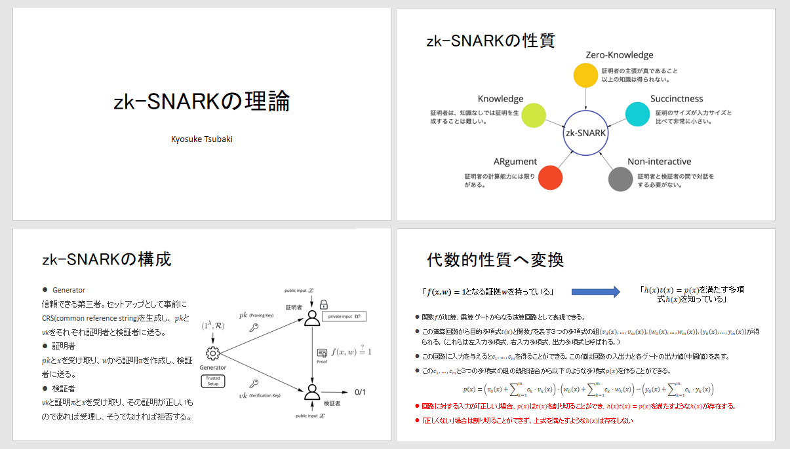
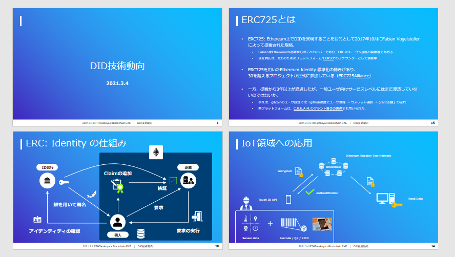

## 目次

- 1.Introduction
- 2.Details
  - 2.1 zk-SNARKの理論
  - 2.2 DID技術動向

## 参加者一覧

- 東京理科大学

  - 椿 京介

- 東京大学

  - 須田 隆太朗

* クーガー株式会社（主催）

  - 石井 敦

## 1. Introduction

今回は東京理科大学の椿氏にブロックチェーンを活用したファンコミュニティであるGaudiyを実例として、セキュリティ問題に重点を置いた発表をして頂いた。また、それに付随して分散型アイデンティティの規格であるERC725について東京大学の須田氏に解説して頂き、今後のEthereumのセキュリティ面の課題や活用方法について意見交換を行った。

これまでの中央集権的なアイデンティティとは全く違うシステムとなるDID。実際に運用していくにはまだ課題は多く残されているが、実現できれば今までとは全く違う世界が広がる事は間違いないだろう。Gaudiyの様な外部システムとの連携も容易となり、全てのサービスがボーダーレスとなる未来はそう遠くないと思われる。

## 2. Details

### 2.1 zk-SNARKの理論

  椿 京介｜東京理科大学

  ファイルダウンロードは
  <a href="/pdf/students/zk-SNARK-theory.pdf" target="_blank">
    こちら
  </a>

#### 2.1.1 Gaudiyサービス紹介

・概要
Gaudiyではトークンエコノミーを実現するためにブロックチェーンを活用したファンコミュニティを提供している。コミュニティではチャットや投稿機能だけではなく、NFTトレカなどのブロックチェーン体験を取り入れている。また、こうしたブロックチェーン体験をしてもらうためにマジックリンクなどの仕組みを利用して秘密鍵やウォレットなどを一般ユーザーに分かりやすい形で提供している。

・提供サービス例
DID(分散型ID)というブロックチェーン技術を活用し、IPを軸に異なるサービス(コミュニティ、ゲーム、ファンクラブなど)を連携している。

・プライバシーの問題
外部プラットフォームとの連携で課題となるのがプライバシーの問題である。例えばゲームの運営会社とファンクラブの運営会社が連携した際、情報を共有してしまうと知られてはいけない秘密情報まで共有してしまう危険性がある。こうした問題に対してzk-SNARKのプライバシーを強化する技術が応用できる。

#### 2.1.2 zk-SNARKとは

zk-SNARKとは非対話型ゼロ知識証明を構築している技術であり、ブロックチェーンにおけるトランザクションの秘匿化やEthereumのスケーリング問題のソリューションなどで応用されている。また、Pinocchio Protocolと呼ばれる『暗号学的仮定のみに依存し、一般的な計算を効果的に検証するために構築されたシステム』のもとで構築されており、簡潔でありながら強力なセキュリティを実現している。

#### 2.1.3  zk-SNARKの性質

zk-SNARKの性質は以下のとおりである。

・Zero-Knowledge
証明者の主張が真であること以上の知恵は得られない。

・Succinctness
証明のサイズが入力サイズと比べて非常に小さい。

・Non-interactive
証明者と検証者の間で対話をする必要がない。

・Argument
証明者の計算能力に制限がある。

・Knowledge
証明者は知識なしでは証明することは難しい。

#### 2.1.4 ゼロ知識証明とは

ゼロ知識証明とは証明者が検証者に対して、ある情報が正しいことを、それが正しいこと以外の情報を明らかにせずに証明できる手法である。例えば、検証者側が20歳以上であることを証明するように証明者側へ命じた場合、証明者側は身分証を提示するが年齢が分かる部分以外は提示する必要がないという事である。

#### 2.1.5 ゼロ知識証明の性質

ゼロ知識証明の性質は以下のとおりである。

・安全性
真であることを検証する側は、証明する側の持っている命題が真であるならば、真であることが必ず分かること。

・健全性
証明者の持つ命題が偽であるなら、検証者は高い確率でそれが偽であると見抜けること。

・ゼロ知識
証明者が持つ命題が真であるなら、検証者が不正して証明者から知識を盗もうとしても『命題が真である』以外の何の知識も得られないこと。

#### 2.1.6 zk-SNARKの流れ

証明の全体的な流れは以下の様になっている。

①関数f(x,w)は入力が正しい場合のみ1を出力し、正しくない場合は0を出力する。
②証明者は検証者に対して f(x,w)=1となるような証拠wを持っていることを、それ自体を明らかにせず証明したい。
③証明者は『正しい証拠wを持っている』ことを証明するπを作り検証者に送る。
④検証者はπを検証し、それが正しい場合は受け入れ、正しくない場合は拒否する。

証明者と検証者の間に『信頼できる第三者』を置く事で非対話のゼロ知識証明を構築し、効率的で安全性の高い証明ができる。

#### 2.1.7 zk-SNARKの構成

zk-SNARKは以下の要素によって構成される。

・Generator
信頼できる第三者。セットアップとして事前にCRSを生成し、pk(proving key)とvk(verification key)をそれぞれ証明者と検証者に送る。

・証明者
pkとx(public input)を受け取り、証拠wから証明πを作成し検証者に送る。

・検証者
証明πとvkとxを受け取り、その証明が正しければ受理、そうでなければ拒否する。

#### 2.1.8 多項式の検証

『正しい証拠wを持っている』ことを『ある多項式を知っている』に変換する方法は以下のとおりである。
『f(x,w)=1となる証拠wを持っている』
⇒『h(x)t(x)=p(x)を満たす多項式h(x)を知っている』
・関数fが加算、乗算ゲートからなる演算回路として表現できる
・この演算回路から目的多項式t(x)と関数fを表す3つの多項式の組[v0(x)….vm(x)], [w0(x)….wm(x)] ,[y0(x)….ym(x)]が得られる。(これらは左入力多項式、右入力多項式、出力多項式と呼ぶ)
・この回路に入力を与えるとc1.....cmを得る事ができる。この値は回路の入出力と各ゲートの出力量(中間値)を表す。

送られてきた多項式 h(x)t(x)=p(x)が正しいか検証を行う式は以下のとおりである。
P(x)=(v0(x)+v(x))・(w0(x)+w(x))-(y0(x)+y(x))

#### 2.1.9 多項式のゼロ知識化
①多項式を隠蔽する
一方向性関数E(x)でh(x)、v(x)、w(x)、y(x)を隠蔽して検証者に送る。このとき、これらの多項式の詳細を知ることは難しいため、検証者はc1.....cmの値を盗むことはできない。

②ペアリングによる検証
証明者はx1x2x32=0を満たす(a1a2a3)を知っていることを検証者にその値を明らかにせずに証明することができる。写像eが双線形成を持つとき、その写像をペアリングと呼ぶ。ペアリングにより『IDベース暗号』や『検索可能暗号、『関数型暗号』などの技術を実現する事が可能。

---

#### 質疑応答

**Q.**信頼できる第三者とは具体的に何を指しているのか。

**A.**政府などの信頼できる機関を想定している。

**Q.**Gaudiyでのマジックリンクの運用について知りたい。

**A.**ユーザー自身でウォレットを管理する形になっており、ブラウザ上でユーザーが秘密鍵をディクリプトできる状態にしている。セキュリティに関して、運営側は秘密鍵の情報について閲覧できない仕組みになっている。

**Q.**Gaudiyですでに使われているサービスの中で、今回発表した内容を適用する際に秘匿化・証明しているものは何か。

**A.**zk-SNARK自体は今後のGaudiyの展望であり、まだ使われてはいない。実装する際はユーザーが自由に情報の選択をできるような秘匿化を考えている。

**Q.**自身が実生活でzk-SNARKの技術を使う場合、どのようなシーンで使いたいと考えているか。

**A.**年収を他人に教える時に断片的な情報のみを提示し、詳細を隠すといったケースが考えられる。

### 2.2 DID技術動向

  須田 隆太朗｜東京大学

  ファイルダウンロードは
  <a href="/pdf/students/DID-tech-trend.pdf" target="_blank">
    こちら
  </a>

#### 2.2.1 正しい情報とは

正しい情報は『情報の正確さ』と『情報提供の身元』によって保証されるものである。『情報の正確さ』とは改竄耐性に優れ、正確さへのインセンティブがあり、第三者による再評価を受けたものである。『情報提供者の身元』に関しても改竄耐性は必要であり、それに加えて身元の検証可能性や個人情報面のセキュリティが保たれていなければならない。これらの要素が全て満たされた時、本当にその情報は正しいと言えるようになる。

#### 2.2.2 アイデンティティとは

・中央集権的なアイデンティティ
パスポートや免許証など、信頼の根拠が政府などの中央組織に依存しているもの。パスポート自体ではなく、それを発行している政府に対しての信頼によって成り立っている。信頼性は高いが、ニーズに合わせて迅速にIDを増やしたりするなどの対応が難しい。

・分散型アイデンティティ(DID)
ERC725というEthereum上でDIDを実現することを目的として提案された規格があり、現在30以上のプロジェクトが正式に参加している。しかし、一般ユーザー向けサービスレベルにはまだ浸透しているとは言えない。

#### 2.2.3 ERC Identityの仕組み

ERC Identityの流れは以下のようになっている。

①ID発行
個人が IDを発行する機関にアイデンティティを提示し、IDを発行する機関は確認後に鍵を用いて署名を行う。

②Claimの追加
個人は署名を使ってClaimと呼ばれるスマートコントラクトを発行する。

③Claimを使う
Claimを使って何かを要求した場合、 IDを発行した機関が自動的にIDの検証を行う。

アイデンティティの実態は『ある所望の関数が実行できる』ということであり、『鍵』と『署名』と『要求』によって成り立つ。課題点としては、大元のIDチェックがオフチェーンで行われており、完全なる分散型とは言えない点である。

#### 2.2.4 ERC725のこれから

ERC725に関しては開発者自身がまだ満足していない。しかし、大枠に関しては固まってきており、2020年11月にβ番がリリースされた。
また、課題点としてメタトランザクションが難しいという点がある。GSN(Gas Station Network)ではmsg.senderではなく20バイトのmsg.dataという変数が証明されたsenderアドレスとして扱われているが、ERC725でexecuteやset Dataを実行できるのはmsg.senderだけのつくりになっている。

#### 2.2.5 5 IOT領域への応用

ブロックチェーンの使用方法として、品質検査の認証とトラッキングへの応用が可能であると考えており、実現できれば検査コストの低減と不正リスクを抑える事ができる。たとえば、航空機部品業界で頻発している無資格者による部品検査などは、ERC725規格を応用することで取り締まれるはずだ。

仮に製造業の検査への応用を考えた場合、以下の要素が必要となる
・繰り返しの検査が必要
・検査済みを保証する仕組みや規格
・人の手による検査で起きる不正への対応
・検査漏れの情報を正確に送る
これらの要素はブロックチェーンによって対応する事は可能であり、非常に現実的な話であると言える。

---

#### 質疑応答

**Q.**ERC725を使った攻撃や脆弱性はあるか。

**A.**ERC725そのものを使った攻撃は聞いた事がない。ERC725の規格に基づいたIDシステムを使用したサービスがあった場合、多数のIDを発行し、大量の認証要求を一斉に送ることで処理を滞留させることは考えられる。

**Q.**DIDを実現するために乗り越えるべき法的な課題などはあるか。

**A.**単純な物の売買であれば実現する事は簡単であると考えているが、マイナンバーの様な規模でDIDを実現する場合には新しい課題が出てくる可能性が高い。

**Q.**DIDの仕組みはインターネットユーザーであれば誰に対しても有用であると思われるが、一般人でも簡単に使用できる仕組みは考えられるか。

**A.**ERCのバージョンが1から2になった際にインターフェイスの変更などを行っており、初期に比べ使いやすくはなってきている。ただし、誰もが簡単に扱えるようになるにはまだ遠く、現段階では難しいと感じている。

**Q.**Ethereum以外のブロックチェーンとの互換性はあるか。

**A.**他のブロックチェーンとの互換性に関してはまだ検討前の段階である。予想ではあるが、スマートコントラクトに対応した設計のブロックチェーンであれば実現は可能だと思われる。

**Q.**ERC725以外のDIDの提案は出ているか。

**A.**Ethereum内であればERC725が1番有力な規格であると思われる。

**Q.**オンチェーン・オフチェーンの紐づけの正しさが重要になるかと考えているが、バーコード読み取り以外のアイデアや実例はあるか。

**A.**人によるチェックではヒューマンエラーを防ぐ事はできないため、生体認証が最も実用的であると考えている。IOTでは各個体に識別チップを搭載するという方法がある。