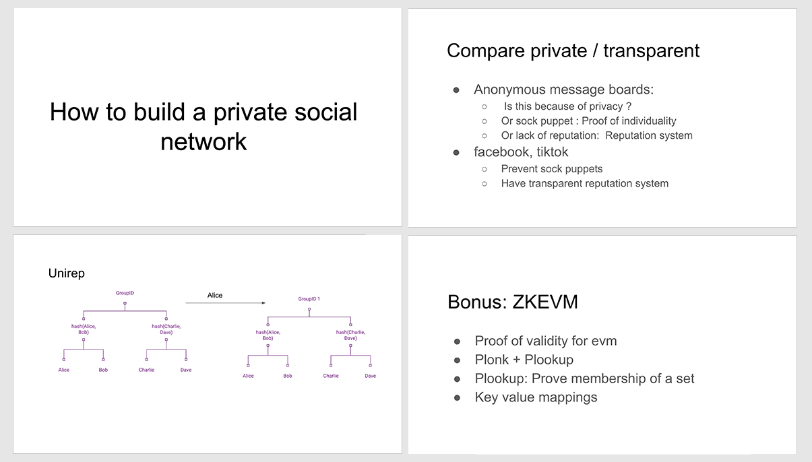

## Public clip

The event clip is disclosed as follows.

  <ul>
    <li>
      <a
        href="https://www.youtube.com/watch?v=ilG-FdmMZpc&ab_channel=ETHTerakoya"
        target="_blank"
      >
        The Latest Trend of Zero-Knowledge Proofs and Q&A Joined by the Ethereum
        Foundation's Top Researchers
      </a>
    </li>
  </ul>
  

    ⇒
    <a
      href="https://www.youtube.com/channel/UCnfgzeNn_90Iq6MHXO3wp5A"
      target="_blank"
    >
      ETHTerakoya Youtube account
    </a>
  

## Speakers

- **Barry Whitehat:** Ethereum Foundation- Applied ZKP researcher

  Barry leads many scaling and privacy projects, implement mixers using
  zksnarks, build zkrollups and optimistic rollups, and more. Barry has
  passionate about privacy and freedom and advises multiple teams in the
  Ethereum ecosystem.

- **Aya Miyaguchi:** Executive Director, Ethereum Foundation

  After receiving MBA from San Francisco State University, joined the launch of
  Kraken in 2013.Took office as Executive Director of Ethereum Foundation in
  2018 and as director of World Economic Forum Global blockchain and Ethereum
  Enterprise Alliance in 2019.

  Participants

- **Ken Naganuma**：
  Hitachi, Ltd.

- **Kazuaki Ishiguro**：
  Couger Inc.

- **Atsushi Ishii**：
  Couger Inc.

## Schedule

1. Introduction   1. The Latest Trend of Zero-Knowledge Proofs and Q&A
   Joined by the Ethereum Foundation's Top Researchers

2. Session  
   2.1. The latest trend of zero-knowledge proofs in Ethereum ｜ Presenter: Barry Whitehat  
   2.1.1. How to build a private social network  
   2.1.2. Zero-knowledge proof  
3. Q&A on zero-knowledge proof  
4. Conclusion

## Introduction

In this event, we invited the Ethereum Foundation's Mr. Barry Whitehat, who talked about the growing trend of zero-knowledge proofs. He provided us with a lot of new information, making this event very meaningful. In the Q&A session, we received a wide range of questions, from specialized ones to simple ones. Berry's answers helped us in becoming more familiar with Ethereum.

## Main topics

### The latest trend of zero-knowledge proofs in Ethereum

  Presenter: Barry Whitehat

  <a
    href="/pdf/zero-knowledge-proof/private_social_network.pdf"
    target="_blank"
  >
    Download
  </a>

#### 1. How to build a private social network

**1.1 Definition of privacy**

Privacy is the ability of an individual or group to seclude themselves or information about themselves, and thereby express themselves selectively. If information is disclosed without restrictions, information can be shared widely without limit, making it potential target for DoS attacks. This is where the idea of relative privacy becomes essential, where an individual is not completely secluded. Instead, an individual is considered to be a member of a group, and an action can be taken by any member of the group. With this concept, even if it is impossible to tell who takes the action, we can control the level of the information disclosed relatively by using canonical values.

**1.2 Privacy applications**

For example, take privacy on anonymous message boards. Anyone can use it anonymously, and the user's identity is not shared at all. However, disclosing any information on the internet message board means that the information is handled in a larger scope. This is very different from posting a flyer on a physical bulletin board in the local level. In addition, since a user can create infinite accounts and post infinite posts online, the user cannot link with past posts, preventing from building reputations. For this reason, privacy has not been experimented in the social media space in the true sense, but I think it will be interesting to experiment.

**1.3 Transparent social media**

Facebook and TikTok provide more transparency in terms of privacy compared to anonymous message boards. The media with greater transparency have reputation systems to verify identity and allow users to check individual's reputations and ratings, which is a big difference from anonymous media. Facebook and TikTok have re-implemented similar mechanisms. It would be better to share the same system instead of re-implementing, though it may be difficult to do that due to the competitiveness and power relations between those companies.

**1.4 Neutral social media**

To solve the issue among companies, we need neutral social media with a neutral reputation system. If social media themselves are neutral, there will be no need for them to worry about power relations among companies, making any company would easily enter the market. However, we need to achieve information transparency to materialize this system. There are many issues with disclosing user information in a broader scope, so it seems difficult to do so at this point. If we build a perfect system, we can apply it to any area, such as government-controlled individual IDs and private information.

**1.5 Decentralized social media**

Decentralized social media allows users to act freely, such as to post, upvote, and downvote. The reputation system is essential to achieve this. The system should enable users to grasp the reputation of their own posts. The system will be more useful if individuals' reputations are made based on social connections. The issues to focus on are content suggestions, community moderation, and anti-collusion infrastructure.

#### 2. Zero-knowledge proof

**2.1 What is zero-knowledge proof?**

Suppose that there are two groups: Charlie and Dave; Alice and Bob. These two groups can prove themselves without revealing to which group they belong. This mechanism allows four of them to post privately and form forums. However, they are not able to gain or lose reputations on their posts.

**2.2 Unirep theory**

A useful theory to solve this issue is Unirep, which allows users to gain and lose reputation through a temporal address while keeping the user's identity confidential. If Alice posts on social media, Unirep will enable her to gain a reputation without disclosing which group she belongs to.

**2.3 Expectations for Unirep**

One idea is that we could have the system to provide people with incentives by gaining good reputations, leading to the development of various products. For example, users could receive a devcon ticket once they gained a certain volume of good reputations.

**2.4 Direct messages**

When sending direct messages, we would need to hide who is messaging who. However, encrypting and decrypting all messages would be difficult. Without doing so will lead to being very vulnerable to spam or DoS attacks. Since we cannot identify the attacker, there is no way to punish the attacker. Even if we use Unirep, where we can downvote, there is no real incentive to downvote the attacker.

**2.5 RLN (rate-limiting nullifier)**

RLN is an effective method used for direct messages besides Unirep. In RLN, you first prove your group membership. Then, through computation, you use a secret share of your private key. If you reveal two secret shares, it is enough to calculate your private key. But if you reveal a single share, you reveal nothing. To punish people who break the rule, we create a smart contract that allows slashing the private key. One idea to use RLN is to make a simple group chat app. Another is to use this with eth2 for the peer-to-peer network. We can also build a proof of connection in the social network to search for a target pier in a group without revealing who you are searching for. Note that this does not work well for scaling and can only work well for small networks.

**2.6 Community moderation**

As a way to do community moderation, people can express good or bad using multisig. To avoid having to do a lot of work, we need to make a prediction market to predict whether it is valid or invalid. To prevent bribery, we need some anti-collusion infrastructure, which will allow us to do more advanced mechanisms like quadratic upvoting and quadratic downvoting. The quadratic voting should be much more expressive than simple good or bad used in linear voting.

**2.7 Maci (minimum anti-collusion infrastructure)**

The quadratic page merges the million-dollar home page with quadratic voting. We are trying to do several local rounds of quadratic funding in different communities. But we need to improve the user interface (UI) and user experience (UX). In addition, we need to consider how Maci will be handled. It would be interesting to add Maci to popular governance portals as popular voting systems.

**2.8 What's next**

We can build a much richer reputation system with privacy in mind. We could have exciting results by implementing and experimenting a system that has high potentials.

#### 3. Q&A on zero-knowledge proof

  Moderators: Kazuaki Ishiguro, Ken Naganuma

#### Q1. How can I learn about zero-knowledge proofs from scratch?

**Barry :** It is good to learn the concepts, apply ZKP and try to build some simple projects. For implementing ZKP, I would recommend Vitalik's seminars, which I have attended, and it was an excellent learning experience. It gives you a high-level introduction, which you can go deeper to implement FFT.

#### Q2. What is your view on ERC 725 (an Ethereum identity standard), self-sovereign identity, and decentralized identity?

**Barry :** I think I am not familiar with ERC 725, so let me talk a little about decentralized identity and self-sovereign identity. What do you mean by decentralization here? Is it that the issuer of the identity is decentralized, or are the users in control of ID? I guess that would be self-sovereign identity if the users are in control. I think the proof of individuality is a crucial issue that we will face in the future. Also, it is important to give users control of their identity. However, other groups can build on top of that identity knowing that some central authority can remove them from that system.

#### Q3. Will we be able to bundle several transactions into one on-chain transaction by using a rollup? Is there any limit on the amount of the transactions and any technical limitations on this?

**Barry :** It is possible to have a ZK-rollup to bundle multiple transactions for a single use case. In addition, there is a fundamental limit on the size of a zero-knowledge proof that you can create. The limitation comes when one polynomial cannot be divided by another polynomial, and there is a limit on the size of the polynomial that you can divide. Another method that we can use to increase the amount of information is recursion. We can sidestep this limit defined by the FFT. We are hoping to be able to build a ZK-rollup that can verify smart contract transactions.

#### Q4. What is the current implementation phase of projects such as Unirep?

**Barry :** We have implemented a basic version of Unirep. It would be interesting to see other applications in the wish lists.

#### Q5. We have seen a lot of momentum in terms of the ZKP concept. What processes do you undertake when selecting new technologies?

**Barry :** I do not know how to answer that from the Etherium Foundation perspective, but from my perspective, I feel pretty excited about recursion, etc. Our goal would be that we can just let the community decide what they want to use. In terms of Ethereum 2.0, I am not sure exactly how they determine what they will use or what will not, but I think it is probably the pragmatic process fast.

#### Q6. If you can think of any interesting case using recursion, I would like to know more about it.

**Barry :** One idea is to apply a FUD solver that uses zero-knowledge proofs. Recursion is useful for so many different things that were previously prohibitively expensive. Zero-knowledge proofs allow us to do succinct verification for things that previously used mathematical methods. I've been trying to build something like blind find where you aggregate people's connections together.

#### Q7. Regarding application case studies that have been implemented, are there any performance issues?

**Barry :** In general, it would be better if the long proving time was less. It depends on the use case, but it would be a problem for cases that use a lot of computing power. I think computation shouldn't be as big of a problem in the use case using the proof of validity for the Ethereum Virtual Machine. However, it would be a problem when creating proof on limited devices like a mobile phone. We could have separate two different proof systems, one of which is a quick zero-knowledge proof system for mobile phones.

#### Q8. To what degree do you think zero-knowledge proofs will be adopted? Because the zero-knowledge proof is not an accessible technology to be implemented, some people may think that this will not be widely adopted. How would you make zero-knowledge proof more accessible to people?

**Barry :** Since zero-knowledge proofs can be used in many applications, they have a huge potential to change the world. Since wherever you use a signature will use a zero-knowledge proof in the future, I think ZKPs could become ubiquitous. As for the difficulty of widely adopting zero-knowledge proofs due to complexity, as we have more and more things that use a ZKP, and once people use it, I think it will help people better understand what they are. When we find it technically difficult to explain people about it, a good way is to find some real-world analogy to this. But one of the concepts that are difficult to educate people is Uniswap, which is very difficult to make private as it can have a global state that is public to everybody. It took people a while to figure out what the internet was, but we might have eventually figured it out. Likewise, I think we will have a similar kind of process with ZKPs.

#### Q9. I think Barry Whitehat is a nice name as a security engineer. Is this your real name?

**Barry :** That is a pseudonym. I don't know what a real name is--I mean, that is more of a philosophical question.

#### 4. Conclusions

We have seen a lot of momentum in new technologies in the realm of Ethereum. As more and more information is out in public, some people may feel that it is hard to keep up with it. If you find the new information interesting, you should get involved in research and take the opportunity to learn more about Ethereum. That is because this is promising a technology that will certainly build you up.
